# Materi Pertemuan 01

Materi bacaan pertemuan ini dalam bahasa Indonesia. Ringkasan singkat & alur praktik ada di [README.md](./README.md).

## Daftar Isi

- [Pengenalan Generative AI dan Large Language Models](#01-intro-genai)
- [Menjelajahi dan Membandingkan Berbagai LLM](#02-exploring-llms)

---

# Pengenalan Generative AI dan Large Language Models

Generative AI adalah kecerdasan buatan yang mampu **membuat** teks, gambar, dan jenis konten lainnya. Yang membuatnya luar biasa: teknologi ini "mendemokratisasi" AI — siapa pun bisa memakainya cukup dengan *prompt* teks, kalimat biasa dalam bahasa sehari-hari. Kamu tidak perlu belajar bahasa seperti Java atau SQL untuk menghasilkan sesuatu yang berguna; cukup tulis apa yang kamu mau, dan model AI memberikan jawabannya. Dampaknya sangat besar: menulis atau memahami laporan, membuat aplikasi, dan banyak lagi — semuanya dalam hitungan detik.

Dalam kurikulum ini, kita mengikuti sebuah *startup* fiktif di bidang pendidikan yang memanfaatkan generative AI, sambil membahas tantangan sosial dan keterbatasan teknologinya.

## Pendahuluan

Pelajaran ini membahas:

- Skenario bisnis: ide dan misi startup kita.
- Generative AI dan bagaimana kita sampai pada teknologi hari ini.
- Cara kerja bagian dalam sebuah large language model.
- Kemampuan utama dan contoh penggunaan praktis LLM.

## Tujuan Belajar

Setelah menyelesaikan pelajaran ini, kamu akan memahami:

- Apa itu generative AI dan bagaimana Large Language Model bekerja.
- Bagaimana memanfaatkan LLM untuk berbagai kasus, khususnya skenario pendidikan.

## Skenario: Startup Pendidikan Kita

Generative AI merupakan puncak teknologi AI saat ini, mendorong batas yang dulu dianggap mustahil. Dalam kurikulum ini kita memakai startup fiktif — sebut saja *startup kita* — yang bergerak di dunia pendidikan dengan misi ambisius:

> _meningkatkan aksesibilitas belajar dalam skala global, memastikan akses pendidikan yang adil, dan memberikan pengalaman belajar yang dipersonalisasi untuk tiap pelajar sesuai kebutuhannya_.

Tim startup kita sadar tujuan itu tidak akan tercapai tanpa memanfaatkan salah satu alat paling kuat di zaman modern — **Large Language Models (LLM)**.

Generative AI diperkirakan merevolusi cara kita belajar dan mengajar: siswa punya "guru virtual" 24 jam yang menyediakan informasi dan contoh tanpa batas, sementara guru terbantu alat inovatif untuk menilai siswa dan memberi umpan balik.

Untuk memulai, mari definisikan konsep dan istilah dasar yang akan dipakai sepanjang kurikulum.

## Bagaimana Kita Sampai pada Generative AI?

Meski *hype*-nya baru meledak belakangan, teknologi ini adalah hasil riset puluhan tahun — upaya pertamanya sudah ada sejak era 1960-an. Kini AI memiliki kemampuan kognitif menyerupai manusia, misalnya percakapan seperti pada [OpenAI ChatGPT](https://openai.com/chatgpt) atau [Microsoft Copilot](https://copilot.microsoft.com/).

Mundur sedikit: prototipe AI paling awal berupa chatbot ketik yang mengandalkan basis pengetahuan dari para pakar. Jawaban dipicu oleh **kata kunci** yang muncul di teks masukan. Cepat terlihat bahwa pendekatan ini tidak bisa berkembang (*scale*).

### Pendekatan Statistik: Machine Learning

Titik balik terjadi di era 1990-an dengan pendekatan statistik pada analisis teks. Lahirlah algoritma baru — **machine learning** — yang mampu mempelajari pola dari data *tanpa diprogram secara eksplisit*. Mesin bisa "memahami" bahasa manusia lewat model statistik yang dilatih pada pasangan teks-label, sehingga bisa mengklasifikasikan teks baru dengan label yang mewakili maksud pesan.

### Neural Network dan Asisten Virtual Modern

Perkembangan perangkat keras yang mampu mengolah data lebih besar mendorong riset AI hingga muncul algoritma machine learning tingkat lanjut — **neural network** atau deep learning.

Neural network (khususnya Recurrent Neural Network — RNN) sangat meningkatkan pemrosesan bahasa alami: makna teks bisa direpresentasikan dengan lebih baik karena **konteks kata dalam kalimat** ikut dihargai. Teknologi inilah yang menggerakkan asisten virtual dekade 2000-an: pandai menafsirkan bahasa manusia, mengenali kebutuhan, dan menjalankan aksi untuk memenuhinya.

### Hari Ini: Generative AI

Begitulah kita sampai pada Generative AI hari ini, yang bisa dilihat sebagai bagian dari deep learning.

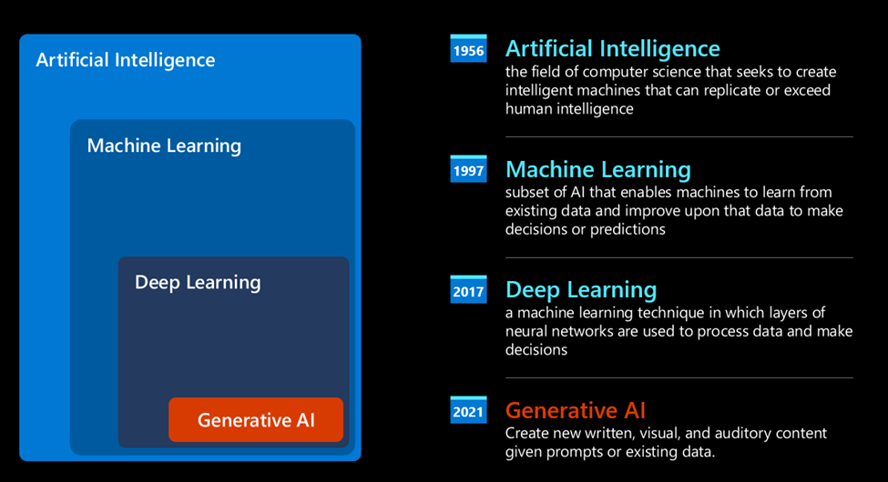

Setelah riset puluhan tahun, arsitektur model baru bernama **Transformer** mengatasi keterbatasan RNN: mampu menerima urutan teks yang jauh lebih panjang sebagai masukan. Transformer berbasis **mekanisme attention** — model memberi "bobot perhatian" berbeda pada tiap masukan, lebih fokus ke bagian yang informasinya paling relevan, di mana pun posisinya dalam kalimat.

Sebagian besar model generative AI terkini — disebut **Large Language Models (LLM)** karena bekerja dengan masukan dan keluaran teks — dibangun di atas arsitektur ini. Menariknya, model yang dilatih dari data tak berlabel dalam jumlah raksasa (buku, artikel, situs web) ini bisa diadaptasi ke berbagai macam tugas dan menghasilkan teks yang benar secara tata bahasa dengan sentuhan kreativitas. LLM tidak hanya meningkatkan kemampuan mesin "memahami" teks, tapi juga **menghasilkan** jawaban orisinal dalam bahasa manusia.

## Bagaimana Large Language Model Bekerja?

Ada tiga konsep kunci (contoh di sini memakai keluarga model GPT dari OpenAI):

- **Tokenizer, teks → angka**: LLM menerima teks dan menghasilkan teks. Namun sebagai model statistik, mereka jauh lebih jago mengolah **angka**. Karena itu setiap masukan diproses *tokenizer* dulu sebelum masuk ke inti model. **Token = potongan teks** dengan jumlah karakter bervariasi — tugas tokenizer adalah memecah masukan menjadi deretan token, lalu tiap token dipetakan ke sebuah indeks angka.

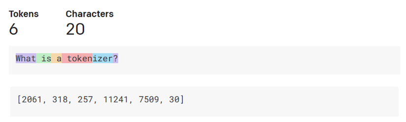

- **Memprediksi token keluaran**: Dari *n* token masukan (maksimumnya beda-beda tiap model), model memprediksi **satu token** sebagai keluaran. Token itu lalu dimasukkan kembali ke masukan untuk iterasi berikutnya — pola "jendela yang memanjang" — sampai terbentuk satu atau beberapa kalimat jawaban. Inilah kenapa ChatGPT kadang terlihat berhenti di tengah kalimat.

- **Proses pemilihan: distribusi probabilitas**: Token keluaran dipilih berdasarkan **peluang kemunculannya** setelah urutan teks saat itu — model menghitung distribusi probabilitas semua kemungkinan "token berikutnya" dari hasil latihannya. Tapi token berpeluang tertinggi tidak selalu yang dipilih: ada unsur **keacakan** yang sengaja ditambahkan supaya model tidak deterministik (masukan sama ≠ keluaran persis sama), meniru proses berpikir kreatif. Kadar keacakan ini diatur lewat parameter bernama **temperature**.

## Apa yang Bisa Dilakukan Startup Kita dengan LLM?

Kemampuan utama LLM: *menghasilkan teks dari nol, berangkat dari masukan teks dalam bahasa alami*.

Masukan model disebut **prompt**, keluarannya disebut **completion** (merujuk mekanisme model "melengkapi" masukan dengan token berikutnya). Sebuah prompt bisa berisi:

- **Instruksi** yang menentukan jenis keluaran yang kita harapkan, kadang disertai contoh atau data tambahan. Misalnya:

  1. Merangkum artikel, buku, ulasan produk, plus menarik insight dari data tak terstruktur.

     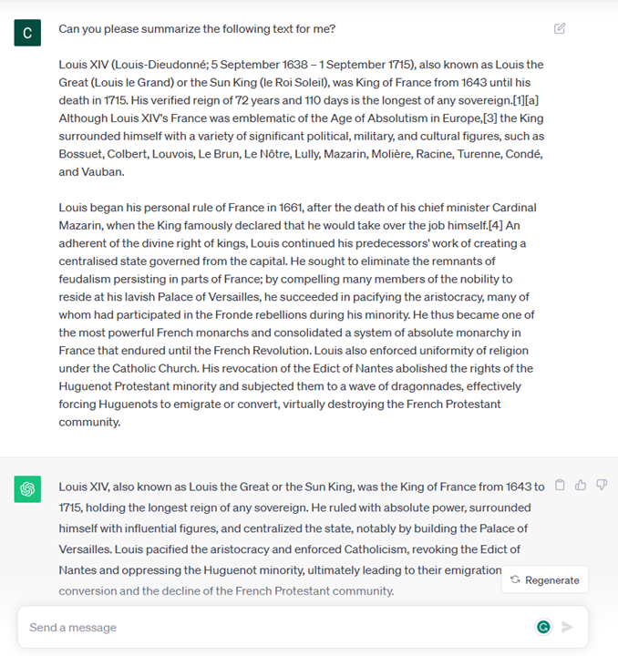

  2. Ideasi kreatif dan penyusunan artikel, esai, atau tugas.

     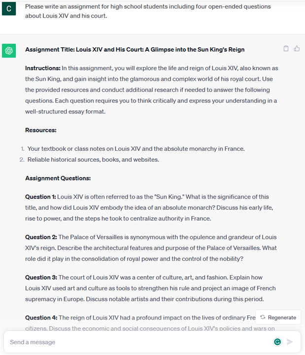

- **Pertanyaan**, diajukan dalam bentuk percakapan dengan agen.

  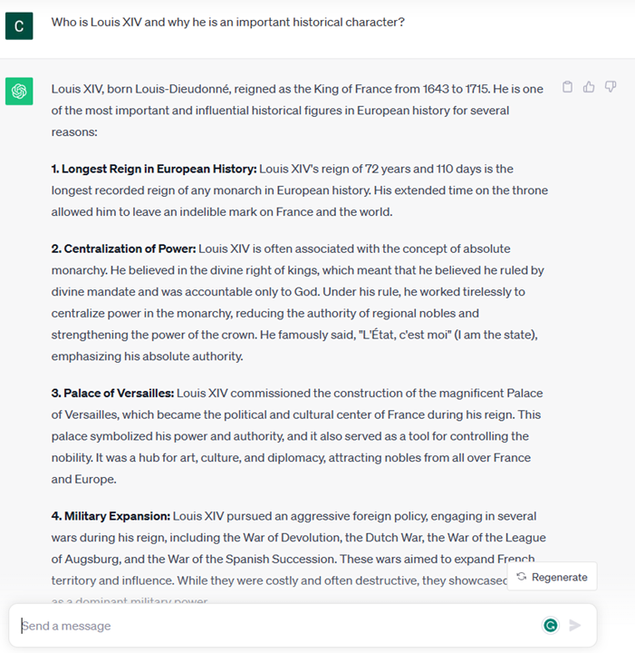

- **Teks untuk dilengkapi** — secara tersirat meminta bantuan menulis.

  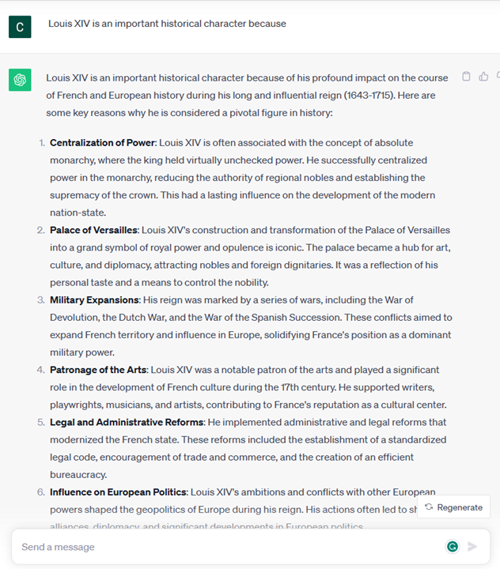

- **Potongan kode** disertai permintaan menjelaskan/mendokumentasikannya, atau komentar yang meminta dibuatkan kode untuk tugas tertentu.

  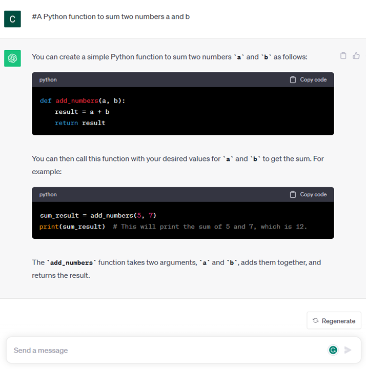

Contoh-contoh di atas sederhana dan bukan daftar lengkap — sekadar menunjukkan potensi generative AI, khususnya (tapi tidak terbatas) di konteks pendidikan.

⚠️ **Penting:** keluaran generative AI **tidak sempurna** — kadang kreativitas model justru merugikan: hasilnya bisa berupa rangkaian kata yang terdengar meyakinkan padahal keliru, atau bahkan ofensif. Generative AI **tidak "cerdas"** dalam arti utuh (tanpa penalaran kritis-kreatif atau kecerdasan emosional), **tidak deterministik**, dan **tidak selalu bisa dipercaya** — fabrikasi (rujukan, konten, pernyataan keliru) bisa bercampur dengan informasi benar dan disajikan dengan percaya diri. Di pertemuan-pertemuan berikutnya kita belajar menangani keterbatasan ini.

## Tugas Eksplorasi

Baca lebih lanjut tentang [generative AI](https://en.wikipedia.org/wiki/Generative_artificial_intelligence) lalu temukan satu bidang yang belum memakai generative AI. Apa bedanya dibanding cara lama — apakah kamu bisa melakukan hal yang dulu mustahil, atau jadi lebih cepat? Tulis ringkasan ±300 kata tentang "startup AI impianmu" dengan bagian: "Masalah", "Bagaimana Saya Memakai AI", "Dampak", dan (opsional) rencana bisnis.

## Cek Pemahaman

Mana yang benar tentang large language model?

1. Jawaban yang kamu terima selalu persis sama.
2. Ia melakukan segalanya dengan sempurna — jago berhitung, menghasilkan kode yang pasti jalan, dst.
3. Jawaban bisa berbeda meski prompt-nya sama. Ia bagus memberi draf awal teks/kode, tapi hasilnya perlu kamu perbaiki.

**Jawaban: 3** — LLM bersifat non-deterministik; variasinya bisa diatur lewat temperature. Jangan berharap hasilnya sempurna: LLM mengerjakan "angkat beratnya", kamu yang menyempurnakan.

## Lanjut!

Lanjut ke bagian 2: [menjelajahi dan membandingkan berbagai jenis LLM](#02-exploring-llms).

---

# Menjelajahi dan Membandingkan Berbagai LLM

Di bagian sebelumnya kita melihat bagaimana LLM bekerja. Sekarang kita membandingkan berbagai **jenis** LLM untuk memahami kelebihan dan kekurangannya masing-masing — supaya bisa memilih model yang tepat untuk kasus kita.

## Pendahuluan

Bagian ini membahas:

- Jenis-jenis LLM di lanskap saat ini.
- Menguji, mengiterasi, dan membandingkan model.
- Cara men-deploy sebuah LLM.

## Tujuan Belajar

Setelah bagian ini kamu bisa:

- Memilih model yang tepat untuk kasusmu.
- Memahami cara menguji, mengiterasi, dan meningkatkan performa model.
- Mengetahui bagaimana bisnis men-deploy model.

## Memahami Jenis-Jenis LLM

LLM bisa dikategorikan berdasarkan arsitektur, data latih, dan kegunaannya. Pilihan model bergantung pada tujuan pemakaian, datamu, biaya yang siap dikeluarkan, dan lainnya.

Berdasarkan **jenis konten** yang diolah:

- **Audio dan pengenalan suara**: model sejenis Whisper — serbaguna untuk speech-to-text; kini ada juga model lebih baru seperti `gpt-4o-transcribe`. Pertimbangkan cakupan bahasa, dukungan real-time, latensi, dan biaya. ([Dokumentasi speech-to-text OpenAI](https://platform.openai.com/docs/guides/speech-to-text))

- **Pembuatan gambar**: DALL-E dan Midjourney adalah nama terkenal; API gambar OpenAI kini berpusat pada model GPT Image seperti `gpt-image-2`; Stable Diffusion, Imagen, dan Flux juga pilihan umum. Bandingkan kepatuhan pada prompt, dukungan editing, kontrol gaya, keamanan, dan lisensi. (Dibahas lagi di pertemuan-04.)

- **Pembuatan teks**: mencakup model frontier, model reasoning, model kecil latensi-rendah, dan model open-weight. Contoh terkini: OpenAI GPT-5.x, Anthropic Claude 4.x, Google Gemini 3.x, Meta Llama 4, dan model Mistral. Jangan memilih hanya dari tanggal rilis/harga — bandingkan kualitas, latensi, context window, kemampuan tool, keamanan, ketersediaan regional, dan total biaya.

- **Multi-modalitas**: banyak model kini menerima lebih dari teks — gambar, audio, bahkan video — dan sebagian bisa memanggil tool. Selalu cek *model card* untuk modalitas masukan/keluaran yang didukung sebelum membangun aplikasi di atasnya.

### Foundation Model versus LLM

Istilah **Foundation Model** [dicetuskan peneliti Stanford](https://arxiv.org/abs/2108.07258): model AI yang (1) dilatih dengan unsupervised/self-supervised learning pada data tak berlabel, (2) berukuran sangat besar (miliaran parameter), dan (3) dimaksudkan sebagai "fondasi" bagi model lain — bisa dikembangkan lebih lanjut lewat fine-tuning.

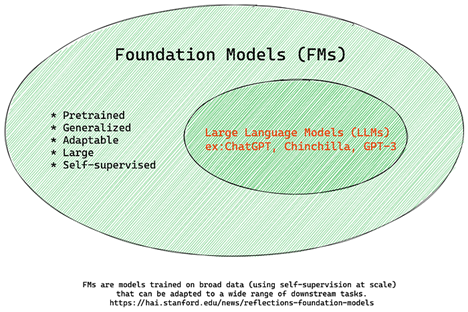

Contoh historis: versi awal ChatGPT dibangun di atas GPT-3.5 sebagai foundation model, lalu OpenAI menyetel (tune) versi khusus percakapan. Layanan AI modern sering merutekan ke beberapa varian model — nama layanan dan nama model di baliknya tidak selalu sama.

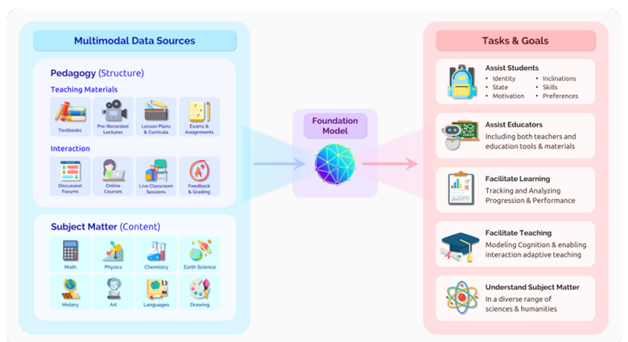

### Model Terbuka (Open-Weight/Open-Source) versus Proprietary

- **Model terbuka**: artefak modelnya bisa diperiksa, diunduh, atau dikustomisasi (lisensinya beragam — sebagian benar-benar open source, sebagian open-weight dengan batasan). Berguna saat butuh kontrol atas deployment, lokasi data, biaya, atau kustomisasi. Tetap perlu meninjau lisensi, biaya serving, pemeliharaan, dan keamanan. Contoh: [Meta Llama 4](https://ai.meta.com/blog/llama-4-multimodal-intelligence/), sebagian [model Mistral](https://docs.mistral.ai/models/overview), dan banyak model di [Hugging Face](https://huggingface.co/models). **Model Llama yang kita pakai lewat server Ollama kampus termasuk kategori ini!**

- **Model proprietary**: dimiliki dan di-hosting oleh penyedia (mis. [OpenAI](https://platform.openai.com/docs/models), [Google Gemini](https://deepmind.google/models/gemini/pro/), [Anthropic Claude](https://platform.claude.com/docs/en/about-claude/models/overview)). Umumnya teroptimasi untuk produksi dengan dukungan, sistem keamanan, dan skala yang kuat — tapi bobot modelnya tak bisa diperiksa/diubah, dan ada ketentuan privasi/kepatuhan yang harus ditinjau.

### Embedding versus Pembuatan Gambar versus Pembuatan Teks & Kode

LLM juga dikategorikan dari **keluarannya**:

- **Embedding**: model yang mengubah teks menjadi bentuk angka (*embedding* — representasi numerik teks). Memudahkan mesin memahami hubungan antar kata/kalimat; keluarannya bisa dipakai model lain (klasifikasi, clustering) atau untuk pencarian semantik. Contoh: [OpenAI embeddings](https://platform.openai.com/docs/models/embeddings). (Kita praktikkan di pertemuan-04 dengan model `bge-m3`.)

  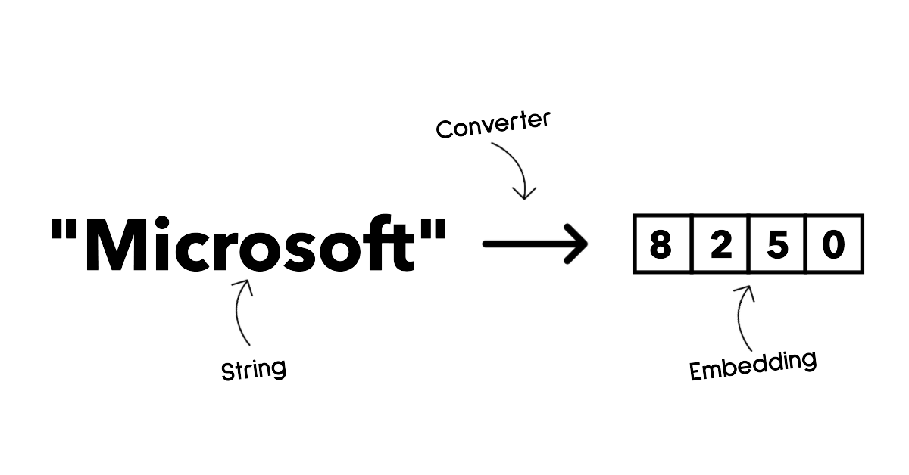

- **Pembuatan gambar**: menghasilkan/mengedit gambar (inpainting, super-resolution, colorization). Dilatih pada dataset gambar raksasa seperti [LAION-5B](https://laion.ai/blog/laion-5b/). Contoh: [GPT Image](https://platform.openai.com/docs/guides/images), [Stable Diffusion](https://github.com/Stability-AI/StableDiffusion), Imagen.

  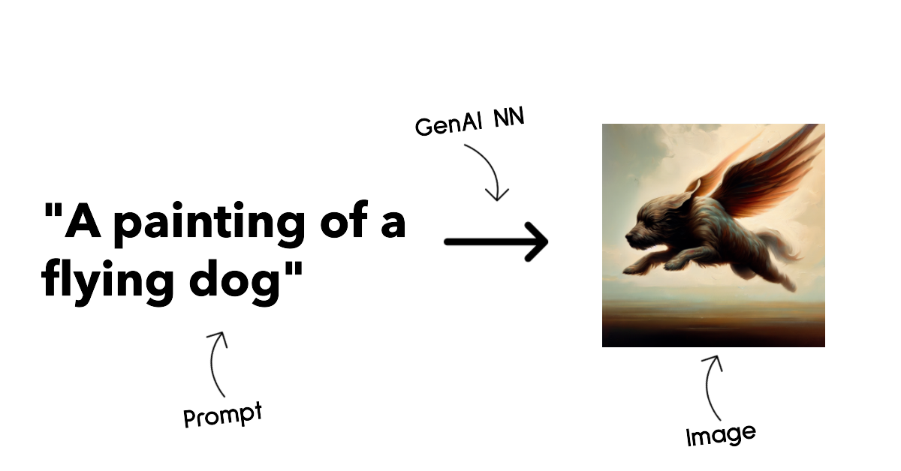

- **Pembuatan teks & kode**: merangkum, menerjemahkan, menjawab pertanyaan, menghasilkan/memperbaiki kode. Dilatih pada dataset teks besar (mis. [BookCorpus](https://www.cv-foundation.org/openaccess/content_iccv_2015/html/Zhu_Aligning_Books_and_ICCV_2015_paper.html)) atau kode dari GitHub.

  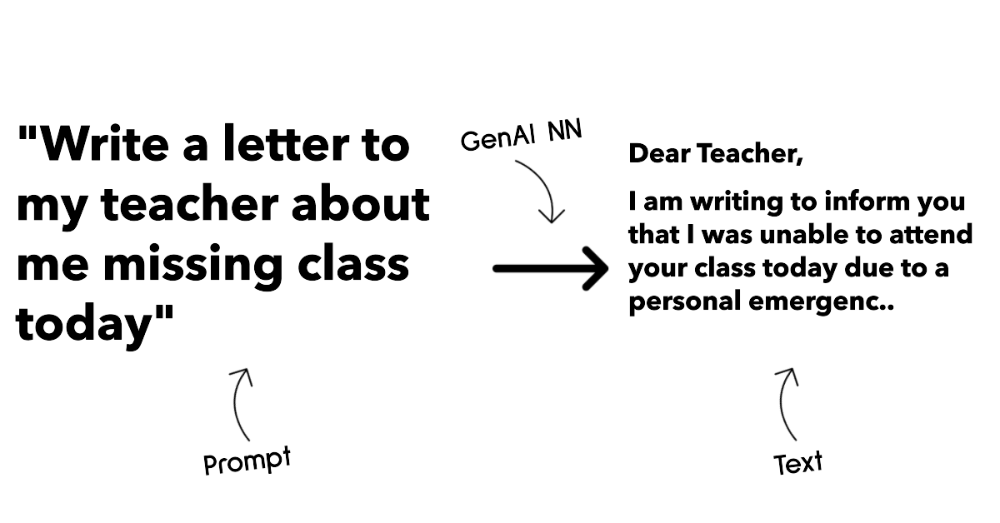

### Encoder-Decoder versus Decoder-Only

Analogi: dosenmu meminta membuat kuis untuk mahasiswa. Ada dua kolega — satu membuat konten, satu me-review.

- **Pembuat konten = model decoder-only**: melihat topik dan apa yang sudah tertulis, lalu **melanjutkan menulis**. Jago membuat konten menarik, tapi kurang cocok untuk tugas klasifikasi/pemahaman murni. Contoh: keluarga GPT dan **Llama** (yang kita pakai!).
- **Reviewer = model encoder-only**: memahami hubungan dan konteks teks yang ada, tapi tidak pandai mengarang. Contoh: BERT.
- **Bisa keduanya = model encoder-decoder**: contoh BART dan T5.

### Layanan (Service) versus Model

- **Layanan** = produk dari penyedia cloud: gabungan model + data + komponen lain, siap pakai lewat antarmuka yang mudah, biasanya berbayar sesuai pemakaian. Contoh: [Azure OpenAI Service](https://learn.microsoft.com/azure/ai-foundry/openai/overview) dengan keamanan kelas enterprise.
- **Model** = artefak neural network-nya sendiri: parameter, bobot, arsitektur, tokenizer. Menjalankan model sendiri (seperti server **Ollama kampus** kita menjalankan Llama) butuh perangkat keras dan keahlian operasional, tapi memberi kontrol penuh dan bisa gratis.

## Menguji dan Membandingkan Model

Setelah tahu jenis-jenisnya, langkah berikutnya adalah **menguji model pada data dan beban kerja kita** — proses iteratif lewat eksperimen dan pengukuran. Katalog model seperti [Microsoft Foundry](https://learn.microsoft.com/azure/foundry/what-is-foundry) menyediakan: pencarian model (filter tugas/penyedia/lisensi), *model card* (deskripsi kegunaan, data latih, contoh kode), perbandingan benchmark antar model, fine-tuning, dan deployment ke endpoint.

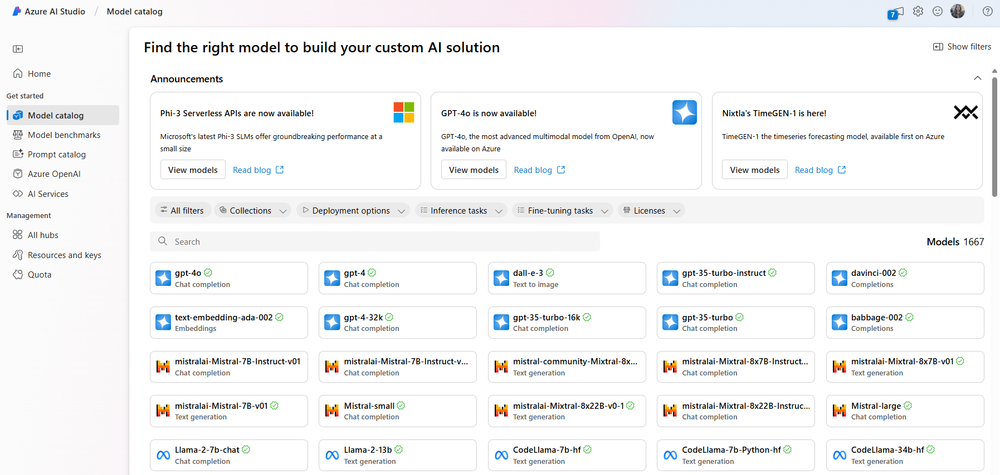

> Versi "praktikum kita": server Ollama kampus adalah katalog mini — di pertemuan-07 kalian akan mem-benchmark sendiri model kecil vs besar dan merasakan trade-off kualitas vs kecepatan.

## Meningkatkan Hasil LLM

Ada beberapa pendekatan untuk mendapatkan hasil yang dibutuhkan dari LLM, dengan tingkat kerumitan dan biaya yang berbeda:

- **Prompt engineering dengan konteks** — beri konteks yang cukup dalam prompt agar jawabannya sesuai kebutuhan. **Termurah, mulai dari sini** (pertemuan-02).
- **Retrieval Augmented Generation (RAG)** — ambil data relevan dari sumber eksternal (database/dokumen) dan sisipkan ke prompt (pertemuan-06).
- **Fine-tuned model** — latih ulang model dengan datamu sendiri; hasil lebih presisi, tapi mahal (wawasan di pertemuan-07).

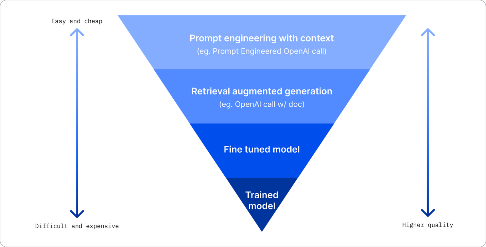

Sumber gambar: [Four Ways that Enterprises Deploy LLMs | Fiddler AI Blog](https://www.fiddler.ai/blog/four-ways-that-enterprises-deploy-llms)

### Prompt Engineering dengan Konteks

LLM pra-latih sudah bagus untuk tugas bahasa umum bahkan dengan prompt pendek — disebut **zero-shot**. Namun makin lengkap kita membingkai permintaan dengan detail dan contoh (**konteks**), makin akurat jawabannya: **one-shot** bila menyertakan satu contoh, **few-shot** bila beberapa. Ini pendekatan paling hemat biaya untuk memulai.

### Retrieval Augmented Generation (RAG)

Keterbatasan LLM: ia hanya "tahu" data yang dipakai saat pelatihan — tidak tahu kejadian setelahnya dan tidak bisa mengakses data non-publik (misalnya data kampus kita). Solusinya **RAG**: menambahkan potongan dokumen eksternal ke prompt (dengan memperhatikan batas panjang prompt), dibantu *vector database* yang mengambil potongan paling relevan. Sangat berguna saat tidak punya cukup data/waktu/sumber daya untuk fine-tuning tapi ingin jawaban yang akurat dan tidak kedaluwarsa.

### Fine-Tuned Model

Fine-tuning memanfaatkan *transfer learning* untuk mengadaptasi model ke tugas spesifik. Berbeda dari few-shot dan RAG, hasilnya adalah **model baru** dengan bobot yang diperbarui — butuh kumpulan contoh latihan berupa pasangan prompt → completion. Cocok bila: ingin model kecil yang spesifik-tugas (lebih murah & cepat daripada terus memakai model raksasa), latensi kritis (prompt panjang tidak memungkinkan), atau punya banyak contoh berkualitas dan ingin perilaku/format yang konsisten. Kalau masalah utamamu adalah fakta terbaru atau data privat yang sering berubah — pakai RAG, bukan fine-tuning.

### Melatih Model dari Nol

Cara paling sulit dan mahal: butuh data masif, SDM ahli, dan daya komputasi besar. Hanya masuk akal bila kasusnya sangat spesifik-domain dengan data domain yang melimpah.

## Cek Pemahaman

Pendekatan mana yang baik untuk memperbaiki hasil LLM?

1. Prompt engineering dengan konteks
2. RAG
3. Fine-tuned model

**Jawaban: ketiganya bisa.** Mulai dari prompt engineering (cepat & murah), pakai RAG saat butuh fakta terkini/data privat, dan pilih fine-tuning saat punya banyak contoh berkualitas dan butuh konsistensi format/gaya.

## 🚀 Tantangan

Baca lebih lanjut tentang [penerapan RAG](https://learn.microsoft.com/azure/search/retrieval-augmented-generation-overview) — konsep ini akan kalian bangun sendiri di pertemuan-06!

## Lanjut!

Lanjut ke [pertemuan-02](../pertemuan-02/README.md), di mana kita belajar memakai generative AI secara bertanggung jawab dan mendalami prompt engineering — lihat materinya di [Menggunakan Generative AI secara Bertanggung Jawab](../pertemuan-02/MATERI.md#03-responsible-ai).
