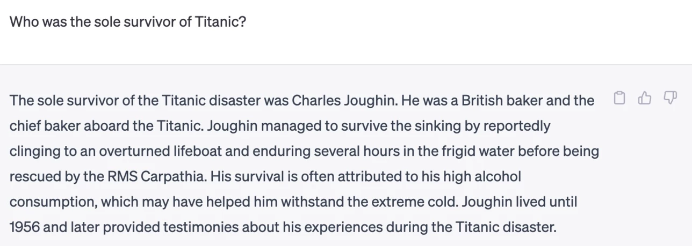
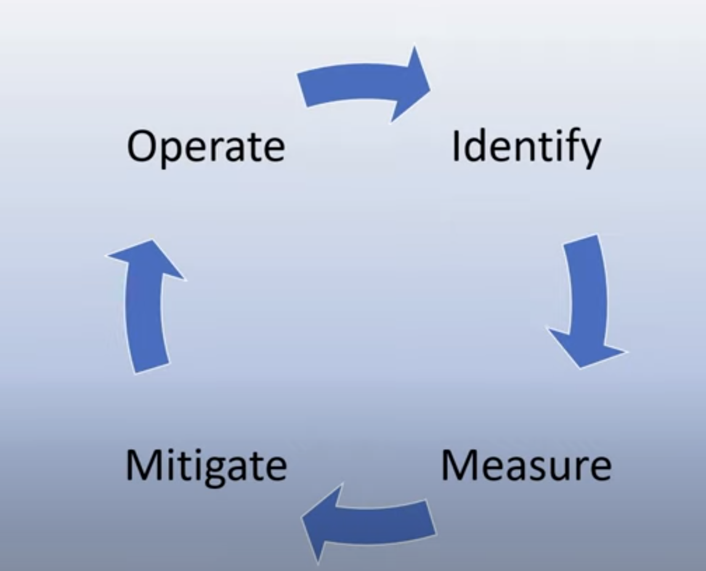
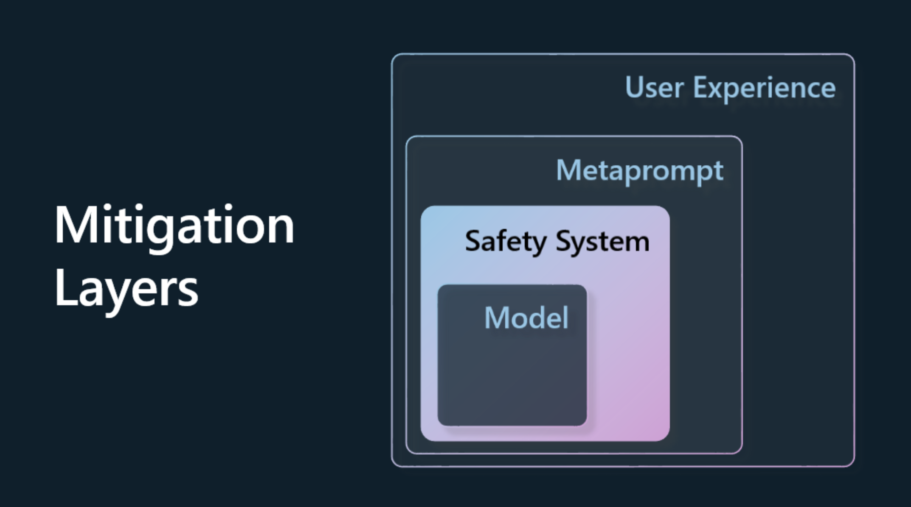
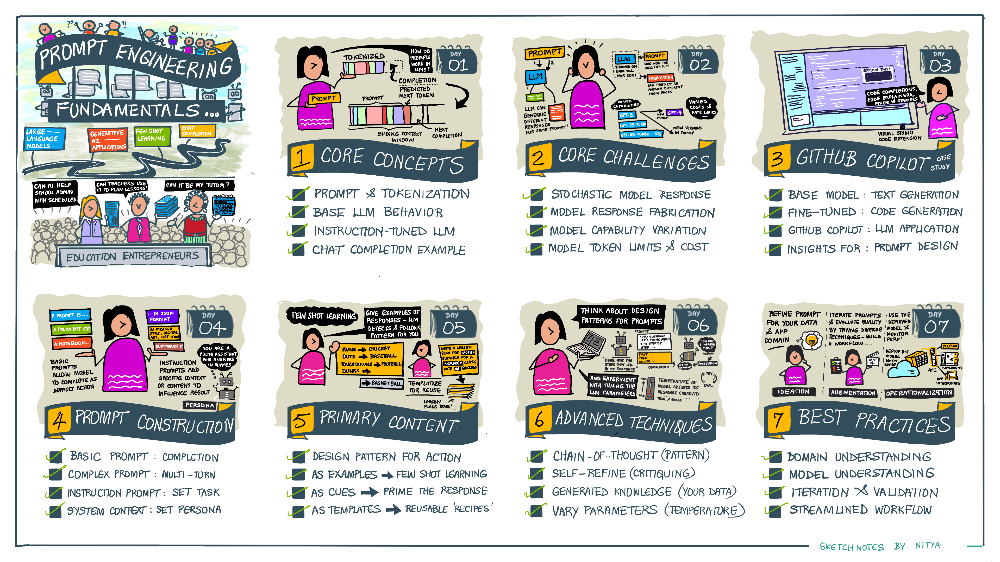
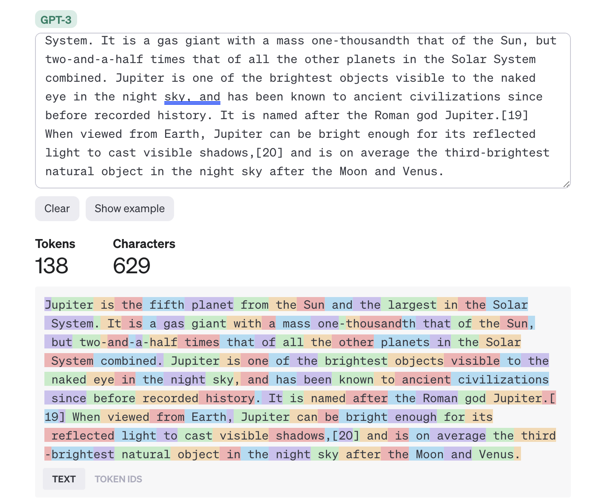
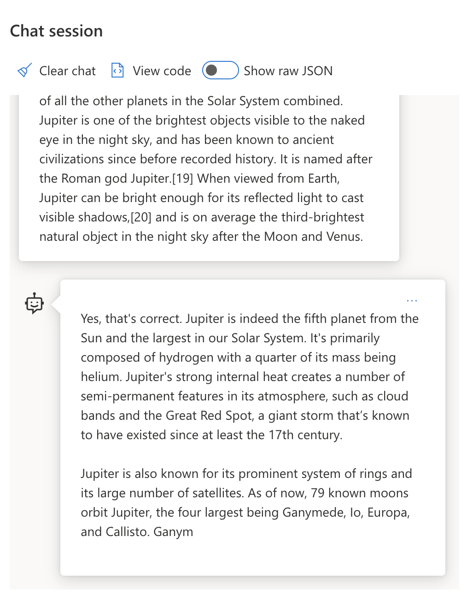
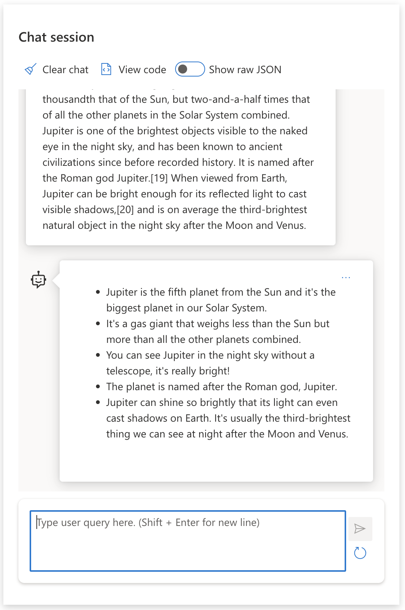
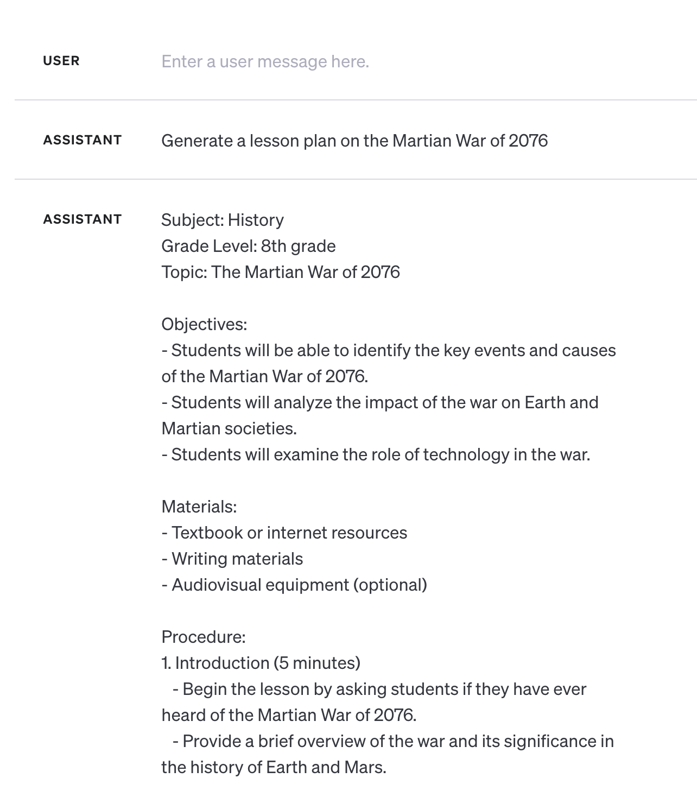
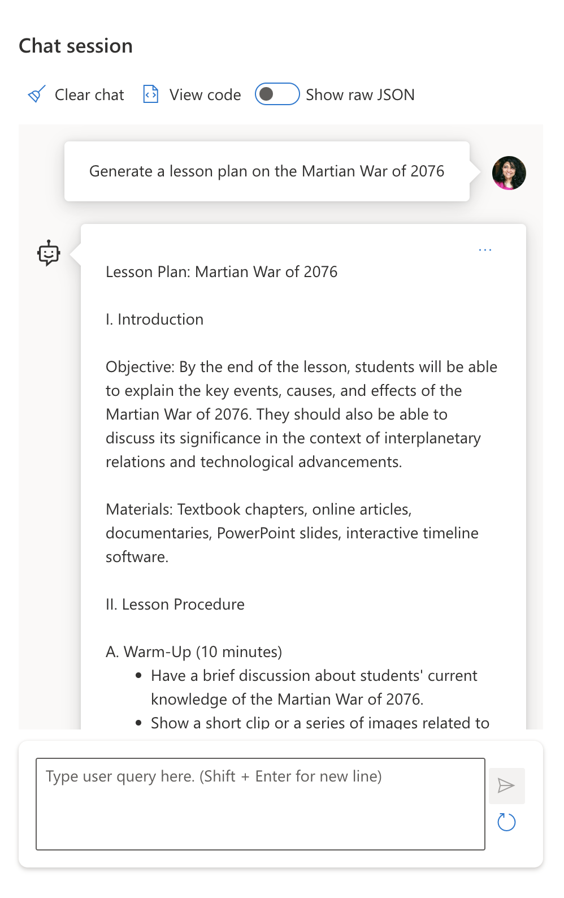
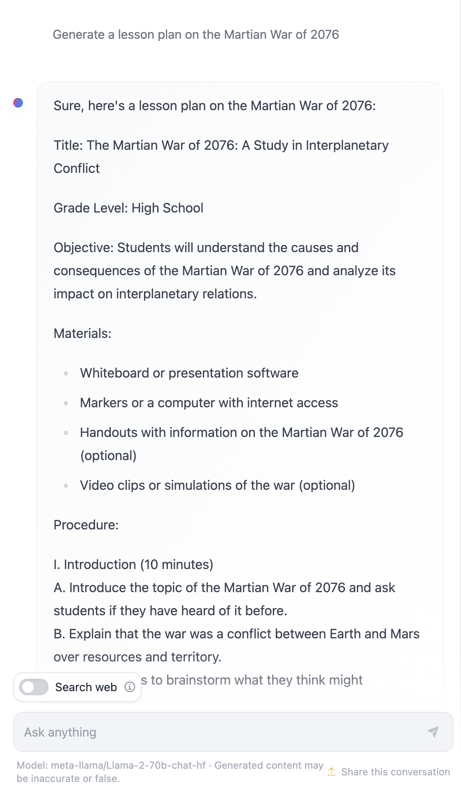

# Materi Pertemuan 02

Materi bacaan pertemuan ini dalam bahasa Indonesia. Ringkasan singkat & alur praktik ada di [README.md](./README.md).

## Daftar Isi

- [Menggunakan Generative AI secara Bertanggung Jawab](#03-responsible-ai)
- [Dasar-Dasar Prompt Engineering](#04-prompt-engineering)
- [Membuat Prompt Tingkat Lanjut](#05-advanced-prompts)


---

<a id="03-responsible-ai"></a>

# Menggunakan Generative AI secara Bertanggung Jawab


Mudah sekali terpukau oleh AI, apalagi generative AI. Tapi kamu juga perlu memikirkan cara memakainya secara **bertanggung jawab**: bagaimana memastikan keluarannya adil, tidak berbahaya, dan seterusnya. Bab ini memberikan konteks tersebut — apa saja yang perlu dipertimbangkan dan langkah aktif apa yang bisa diambil untuk memperbaiki cara kita memakai AI.

## Pendahuluan

Pelajaran ini membahas:

- Mengapa Responsible AI harus diprioritaskan saat membangun aplikasi generative AI.
- Prinsip inti Responsible AI dan kaitannya dengan generative AI.
- Cara mempraktikkan prinsip-prinsip tersebut lewat strategi dan tooling.

## Tujuan Belajar

Setelah menyelesaikan pelajaran ini kamu akan tahu:

- Pentingnya Responsible AI saat membangun aplikasi generative AI.
- Kapan harus memikirkan dan menerapkan prinsip inti Responsible AI saat membangun aplikasi generative AI.
- Alat dan strategi apa saja yang tersedia untuk mempraktikkan konsep Responsible AI.

## Prinsip-Prinsip Responsible AI

Antusiasme terhadap generative AI belum pernah setinggi ini — banyak developer, perhatian, dan pendanaan baru masuk ke bidang ini. Ini positif bagi siapa pun yang ingin membangun produk dan perusahaan dengan generative AI, tapi kita juga harus melangkah secara bertanggung jawab.

Sepanjang kursus ini kita fokus membangun startup kita dan produk pendidikan berbasis AI-nya. Kita memakai prinsip-prinsip Responsible AI: **Fairness** (keadilan), **Inclusiveness** (inklusivitas), **Reliability/Safety** (keandalan/keselamatan), **Security & Privacy** (keamanan & privasi), **Transparency** (transparansi), dan **Accountability** (akuntabilitas). Dengan prinsip-prinsip ini, kita akan menelusuri kaitannya dengan pemakaian generative AI di produk kita.

## Mengapa Responsible AI Harus Jadi Prioritas

Saat membangun produk, pendekatan yang berpusat pada manusia (*human-centric*) — selalu mengutamakan kepentingan terbaik pengguna — memberi hasil terbaik.

Keunikan generative AI adalah kemampuannya menciptakan jawaban, informasi, panduan, dan konten yang bermanfaat bagi pengguna tanpa banyak langkah manual — hasilnya bisa sangat mengesankan. Namun tanpa perencanaan dan strategi yang matang, ia sayangnya juga bisa merugikan pengguna, produk, bahkan masyarakat luas.

Mari lihat sebagian (bukan semua) potensi hasil yang merugikan itu:

### Halusinasi

Halusinasi adalah istilah untuk kondisi ketika LLM menghasilkan konten yang sama sekali tidak masuk akal, atau yang kita tahu salah secara faktual berdasarkan sumber informasi lain.

Misalnya kita membangun fitur yang memungkinkan siswa bertanya soal sejarah ke sebuah model. Seorang siswa bertanya `Who was the sole survivor of Titanic?` (siapa satu-satunya penyintas Titanic?)

Model menjawab seperti ini:



> _(Sumber: [Flying bisons](https://flyingbisons.com?WT.mc_id=academic-105485-koreyst))_

Jawabannya sangat percaya diri dan lengkap. Sayangnya, keliru. Dengan riset sedikit saja, kita akan menemukan bahwa penyintas tragedi Titanic lebih dari satu orang. Bagi siswa yang baru mulai meneliti topik ini, jawaban tadi bisa cukup meyakinkan untuk ditelan mentah-mentah sebagai fakta. Akibatnya, sistem AI menjadi tidak bisa diandalkan dan reputasi startup kita ikut tercoreng.

Di setiap iterasi LLM, performa dalam meminimalkan halusinasi terus membaik. Meski begitu, sebagai pembangun aplikasi sekaligus pengguna, kita tetap harus sadar akan keterbatasan ini.

### Konten Berbahaya

Di bagian sebelumnya kita membahas respons yang keliru atau tidak masuk akal. Risiko lain yang perlu diwaspadai adalah ketika model merespons dengan **konten berbahaya**.

Konten berbahaya dapat didefinisikan sebagai:

- Memberi instruksi atau dorongan untuk menyakiti diri sendiri atau kelompok tertentu.
- Konten kebencian atau merendahkan.
- Memandu perencanaan serangan atau tindak kekerasan apa pun.
- Memberi instruksi cara menemukan konten ilegal atau melakukan tindakan ilegal.
- Menampilkan konten seksual eksplisit.

Untuk startup kita, kita harus memastikan ada alat dan strategi yang tepat agar konten semacam ini tidak sampai terlihat oleh siswa.

### Kurangnya Keadilan (Fairness)

Fairness didefinisikan sebagai "memastikan sistem AI bebas dari bias dan diskriminasi serta memperlakukan semua orang secara adil dan setara." Di dunia generative AI, kita ingin memastikan pandangan dunia yang mengeksklusi kelompok marginal tidak diperkuat oleh keluaran model.

Keluaran semacam itu bukan hanya merusak pengalaman produk yang positif bagi pengguna, tapi juga memperparah kerugian sosial. Sebagai pembangun aplikasi, selalu ingat basis pengguna yang luas dan beragam saat membangun solusi dengan generative AI.

## Cara Menggunakan Generative AI secara Bertanggung Jawab

Setelah paham pentingnya Responsible AI, mari lihat 4 langkah untuk membangun solusi AI kita secara bertanggung jawab:



### Mengukur Potensi Bahaya

Dalam pengujian perangkat lunak, kita menguji aksi-aksi yang diharapkan dilakukan pengguna pada aplikasi. Serupa dengan itu, menguji beragam prompt yang paling mungkin dipakai pengguna adalah cara yang baik untuk mengukur potensi bahaya.

Karena startup kita membangun produk pendidikan, ada baiknya menyiapkan daftar prompt bertema pendidikan: mata pelajaran tertentu, fakta sejarah, hingga kehidupan siswa.

### Memitigasi Potensi Bahaya

Sekarang saatnya mencari cara untuk mencegah atau membatasi bahaya dari model dan respons-responsnya. Kita bisa melihatnya dalam 4 lapisan:



- **Model**. Memilih model yang tepat untuk kasus yang tepat. Model yang lebih besar dan kompleks seperti GPT-4 lebih berisiko menghasilkan konten berbahaya bila dipakai untuk kasus yang kecil dan spesifik. Melakukan fine-tuning dengan data latihmu sendiri juga mengurangi risiko konten berbahaya.

- **Safety System** (sistem keselamatan). Sekumpulan alat dan konfigurasi pada platform penyaji model yang membantu memitigasi bahaya. Contohnya sistem content filtering pada layanan Azure OpenAI. Sistem juga harus mendeteksi serangan jailbreak dan aktivitas tak diinginkan seperti request dari bot.

- **Metaprompt**. Metaprompt dan grounding adalah cara mengarahkan atau membatasi model berdasarkan perilaku dan informasi tertentu — misalnya memakai system input untuk mendefinisikan batasan model, serta menyediakan keluaran yang lebih relevan dengan cakupan atau domain sistem.

Bisa juga memakai teknik seperti Retrieval Augmented Generation (RAG) agar model hanya menarik informasi dari kumpulan sumber tepercaya. Ada pelajaran khusus di kursus ini tentang [membangun aplikasi pencarian](../pertemuan-04/MATERI.md#08-search-embeddings)

- **User Experience**. Lapisan terakhir adalah tempat pengguna berinteraksi langsung dengan model melalui antarmuka aplikasi kita. Kita bisa mendesain UI/UX yang membatasi jenis masukan yang bisa dikirim pengguna ke model, juga teks atau gambar yang ditampilkan ke pengguna. Saat men-deploy aplikasi AI, kita juga harus transparan tentang apa yang bisa dan tidak bisa dilakukan aplikasi generative AI kita.

Ada pelajaran khusus tentang [mendesain UX untuk aplikasi AI](../pertemuan-05/MATERI.md#12-ux-ai)

- **Evaluasi model**. Bekerja dengan LLM itu menantang karena kita tidak selalu punya kendali atas data yang dipakai melatih model. Apa pun kondisinya, kita harus selalu mengevaluasi performa dan keluaran model: mengukur akurasi, kemiripan (similarity), groundedness, dan relevansi keluarannya. Ini membangun transparansi dan kepercayaan bagi pemangku kepentingan dan pengguna.

### Mengoperasikan Solusi Generative AI yang Bertanggung Jawab

Tahap terakhir adalah membangun praktik operasional di sekitar aplikasi AI-mu. Ini termasuk bermitra dengan bagian lain di startup seperti Legal dan Security untuk memastikan kepatuhan terhadap semua kebijakan regulasi. Sebelum meluncur, siapkan juga rencana delivery, penanganan insiden, dan rollback agar potensi kerugian bagi pengguna tidak membesar.

## Alat Bantu

Pekerjaan membangun solusi Responsible AI mungkin terasa banyak, tapi sangat sepadan dengan usahanya. Seiring bidang generative AI tumbuh, tooling yang membantu developer mengintegrasikan tanggung jawab ke alur kerja mereka akan semakin matang. Contohnya, [Azure AI Content Safety](https://learn.microsoft.com/azure/ai-services/content-safety/overview?WT.mc_id=academic-105485-koreyst) dapat mendeteksi konten dan gambar berbahaya lewat sebuah API request.

## Cek Pemahaman

Hal apa saja yang perlu kamu perhatikan untuk memastikan pemakaian AI yang bertanggung jawab?

1. Jawabannya benar.
2. Pemakaian yang merugikan — memastikan AI tidak dipakai untuk tujuan kriminal.
3. Memastikan AI bebas dari bias dan diskriminasi.

**Jawaban: 2 dan 3.** Responsible AI membantumu memikirkan cara memitigasi efek berbahaya, bias, dan lainnya.

## 🚀 Tantangan

Baca lebih lanjut tentang [Azure AI Content Safety](https://learn.microsoft.com/azure/ai-services/content-safety/overview?WT.mc_id=academic-105485-koreyst) dan lihat apa yang bisa kamu adopsi untuk kebutuhanmu.

## Kerja Bagus, Lanjutkan Belajarmu

Setelah menyelesaikan pelajaran ini, kunjungi [koleksi belajar Generative AI](https://aka.ms/genai-collection?WT.mc_id=academic-105485-koreyst) untuk terus menaikkan level pengetahuan Generative AI-mu!

Lanjut ke bagian berikutnya, di mana kita membahas [Dasar-Dasar Prompt Engineering](#04-prompt-engineering)!


---

<a id="04-prompt-engineering"></a>

# Dasar-Dasar Prompt Engineering


## Pendahuluan
Modul ini membahas konsep dan teknik penting untuk membuat prompt yang efektif pada model generative AI. Cara kamu menulis prompt ke LLM juga berpengaruh: prompt yang dirancang cermat menghasilkan respons berkualitas lebih baik. Tapi apa sebenarnya arti istilah _prompt_ dan _prompt engineering_? Dan bagaimana memperbaiki _masukan_ prompt yang kukirim ke LLM? Pertanyaan-pertanyaan inilah yang akan kita jawab di bab ini dan bab berikutnya.

_Generative AI_ mampu menciptakan konten baru (mis. teks, gambar, audio, kode, dll.) sebagai respons atas permintaan pengguna. Ia melakukannya memakai _Large Language Model_ seperti seri GPT ("Generative Pre-trained Transformer") dari OpenAI yang dilatih untuk bahasa alami dan kode.

Pengguna kini bisa berinteraksi dengan model-model ini lewat paradigma yang akrab seperti chat, tanpa butuh keahlian teknis atau pelatihan khusus. Model bersifat _prompt-based_: pengguna mengirim masukan teks (prompt) dan menerima respons AI (completion), lalu bisa "mengobrol dengan AI" secara iteratif dalam percakapan multi-giliran, memperhalus prompt sampai responsnya sesuai harapan.

"Prompt" kini menjadi _antarmuka pemrograman_ utama aplikasi generative AI: memberi tahu model apa yang harus dilakukan dan memengaruhi kualitas respons yang dikembalikan. "Prompt Engineering" adalah bidang studi yang berkembang pesat, berfokus pada _perancangan dan optimasi_ prompt agar menghasilkan respons yang konsisten dan berkualitas dalam skala besar.

## Tujuan Belajar

Di pelajaran ini kita belajar apa itu prompt engineering, mengapa penting, dan bagaimana membuat prompt yang lebih efektif untuk model dan tujuan aplikasi tertentu. Kita akan memahami konsep inti dan praktik terbaik prompt engineering — serta mengenal lingkungan "sandbox" Jupyter Notebook interaktif tempat konsep-konsep ini diterapkan pada contoh nyata.

Di akhir pelajaran ini kamu akan mampu:

1. Menjelaskan apa itu prompt engineering dan mengapa penting.
2. Menguraikan komponen-komponen sebuah prompt dan kegunaannya.
3. Mempelajari praktik terbaik dan teknik prompt engineering.
4. Menerapkan teknik yang dipelajari ke contoh nyata memakai endpoint OpenAI.

## Istilah Kunci

- **Prompt Engineering**: praktik merancang dan memperhalus masukan untuk mengarahkan model AI menghasilkan keluaran yang diinginkan.
- **Tokenisasi**: proses mengubah teks menjadi unit-unit kecil bernama token yang bisa dipahami dan diproses model.
- **Instruction-Tuned LLM**: Large Language Model yang di-fine-tune dengan instruksi spesifik untuk meningkatkan akurasi dan relevansi responsnya.

<a id="sandbox-belajar"></a>

## Sandbox Belajar

Prompt engineering saat ini lebih mirip seni daripada sains. Cara terbaik memperkuat intuisi kita adalah _lebih banyak berlatih_ dengan pendekatan trial-and-error yang menggabungkan keahlian domain aplikasi dengan teknik yang direkomendasikan serta optimasi khusus model.

Jupyter Notebook pendamping pelajaran ini menyediakan lingkungan _sandbox_ tempat kamu mencoba apa yang dipelajari — sambil jalan atau sebagai bagian dari tantangan kode di akhir. Untuk mengerjakan latihannya kamu butuh:

1. **API key Azure OpenAI** — endpoint layanan untuk LLM yang sudah di-deploy. _(Catatan: di praktikum kita cukup memakai server Ollama kampus — https://ollama.if.unismuh.ac.id — tanpa API key.)_
2. **Runtime Python** — tempat Notebook dijalankan.
3. **Environment variable lokal** — _selesaikan langkah [SETUP](../pertemuan-01/README.md) sekarang._

Notebook-nya sudah berisi latihan _starter_ — tapi kamu didorong menambahkan bagian _Markdown_ (deskripsi) dan _Code_ (permintaan prompt) milikmu sendiri untuk mencoba lebih banyak contoh atau ide, dan membangun intuisi desain prompt.

## Panduan Bergambar

Ingin melihat gambaran besar materi ini sebelum menyelam lebih dalam? Lihat panduan bergambar berikut, yang memberi gambaran topik-topik utama beserta poin penting untuk direnungkan di tiap topik. Peta pelajarannya membawamu dari memahami konsep inti dan tantangannya, hingga mengatasinya dengan teknik prompt engineering dan praktik terbaik yang relevan. Perhatikan bahwa bagian "Advanced Techniques" dalam panduan ini merujuk ke materi yang dibahas di bab _berikutnya_.



## Startup Kita

Sekarang, mari kaitkan _topik ini_ dengan misi startup kita untuk [membawa inovasi AI ke pendidikan](https://educationblog.microsoft.com/2023/06/collaborating-to-bring-ai-innovation-to-education?WT.mc_id=academic-105485-koreyst). Kita ingin membangun aplikasi AI untuk _pembelajaran yang dipersonalisasi_ — jadi mari pikirkan bagaimana pengguna aplikasi kita bisa "mendesain" prompt:

- **Administrator** mungkin meminta AI _menganalisis data kurikulum untuk menemukan celah cakupan materi_. AI bisa merangkum hasilnya atau memvisualkannya dengan kode.
- **Pendidik** mungkin meminta AI _membuat rencana ajar untuk audiens dan topik tertentu_. AI bisa menyusun rencana yang dipersonalisasi dalam format yang ditentukan.
- **Siswa** mungkin meminta AI _menjadi tutor untuk mata pelajaran yang sulit_. AI kini bisa membimbing siswa dengan pelajaran, petunjuk, dan contoh yang disesuaikan dengan level mereka.

Itu baru puncak gunung es. Lihat [Prompts For Education](https://github.com/microsoft/prompts-for-edu/tree/main?WT.mc_id=academic-105485-koreyst) — pustaka prompt open-source yang dikurasi pakar pendidikan — untuk melihat kemungkinan yang lebih luas! _Coba jalankan beberapa prompt itu di sandbox atau di OpenAI Playground dan lihat apa yang terjadi!_

## Apa Itu Prompt Engineering?

Kita membuka pelajaran ini dengan mendefinisikan **Prompt Engineering** sebagai proses _merancang dan mengoptimasi_ masukan teks (prompt) untuk menghasilkan respons (completion) yang konsisten dan berkualitas, sesuai tujuan aplikasi dan model tertentu. Anggap saja ini proses 2 langkah:

- _merancang_ prompt awal untuk model dan tujuan tertentu
- _memperhalus_ prompt secara iteratif untuk meningkatkan kualitas respons

Ini pastilah proses trial-and-error yang menuntut intuisi dan usaha pengguna demi hasil optimal. Jadi kenapa ini penting? Untuk menjawabnya, kita perlu memahami tiga konsep dulu:

- _Tokenisasi_ = bagaimana model "melihat" prompt
- _Base LLM_ = bagaimana foundation model "memproses" prompt
- _Instruction-Tuned LLM_ = bagaimana model kini bisa melihat "tugas"

### Tokenisasi

LLM melihat prompt sebagai _deretan token_, dan model (atau versi model) yang berbeda bisa men-tokenisasi prompt yang sama secara berbeda. Karena LLM dilatih pada token (bukan teks mentah), cara prompt di-tokenisasi berdampak langsung pada kualitas respons yang dihasilkan.

Untuk membangun intuisi tentang cara kerja tokenisasi, coba alat seperti [OpenAI Tokenizer](https://platform.openai.com/tokenizer?WT.mc_id=academic-105485-koreyst) yang ditampilkan di bawah. Tempel prompt-mu dan lihat bagaimana ia diubah menjadi token — perhatikan bagaimana karakter spasi dan tanda baca diperlakukan. Contoh ini memakai LLM lama (GPT-3), jadi mencobanya dengan model yang lebih baru bisa memberi hasil berbeda.



### Konsep: Foundation Model

Setelah prompt di-tokenisasi, fungsi utama ["Base LLM"](https://blog.gopenai.com/an-introduction-to-base-and-instruction-tuned-large-language-models-8de102c785a6?WT.mc_id=academic-105485-koreyst) (atau foundation model) adalah memprediksi token berikutnya dalam deretan itu. Karena dilatih pada dataset teks yang masif, LLM punya "rasa" yang baik tentang hubungan statistik antar token dan bisa memprediksinya dengan cukup yakin. Mereka tidak memahami _makna_ kata dalam prompt atau token; mereka hanya melihat pola yang bisa "dilengkapi" dengan prediksi berikutnya — dan bisa terus memprediksi sampai dihentikan oleh pengguna atau kondisi yang sudah ditetapkan.

Mau melihat cara kerja completion berbasis prompt? Masukkan prompt di atas ke [playground Microsoft Foundry](https://ai.azure.com?WT.mc_id=academic-105485-koreyst) dengan pengaturan default. Sistem dikonfigurasi memperlakukan prompt sebagai permintaan informasi — jadi kamu akan melihat completion yang memenuhi konteks tersebut.

Tapi bagaimana kalau pengguna ingin sesuatu yang spesifik, dengan kriteria atau tujuan tugas tertentu? Di sinilah _instruction-tuned_ LLM masuk ke dalam gambar.



### Konsep: Instruction-Tuned LLM

[Instruction-Tuned LLM](https://blog.gopenai.com/an-introduction-to-base-and-instruction-tuned-large-language-models-8de102c785a6?WT.mc_id=academic-105485-koreyst) berangkat dari foundation model lalu di-fine-tune dengan contoh atau pasangan input/output (mis. "pesan" multi-giliran) yang berisi instruksi jelas — dan respons AI berusaha mengikuti instruksi tersebut.

Teknik seperti Reinforcement Learning with Human Feedback (RLHF) melatih model untuk _mengikuti instruksi_ dan _belajar dari umpan balik_, sehingga responsnya lebih cocok untuk aplikasi praktis dan lebih relevan dengan tujuan pengguna.

Mari coba — kunjungi lagi prompt di atas, tapi kali ini ubah _system message_-nya dengan instruksi berikut sebagai konteks:

> _Summarize content you are provided with for a second-grade student. Keep the result to one paragraph with 3-5 bullet points._

Lihat bagaimana hasilnya kini disetel sesuai tujuan dan format yang diinginkan? Seorang pendidik bisa langsung memakai respons ini di slide kelasnya.



## Mengapa Kita Butuh Prompt Engineering?

Setelah tahu bagaimana prompt diproses LLM, mari bahas _mengapa_ kita butuh prompt engineering. Jawabannya: LLM saat ini punya sejumlah tantangan yang membuat _completion yang andal dan konsisten_ lebih sulit dicapai tanpa usaha dalam konstruksi dan optimasi prompt. Misalnya:

1. **Respons model bersifat stokastik.** _Prompt yang sama_ kemungkinan besar menghasilkan respons berbeda pada model atau versi model yang berbeda — bahkan bisa berbeda pada _model yang sama_ di waktu berbeda. _Teknik prompt engineering membantu meminimalkan variasi ini dengan menyediakan guardrail yang lebih baik._

2. **Model bisa memfabrikasi respons.** Model dilatih dengan dataset yang _besar tapi terbatas_, artinya mereka tak punya pengetahuan tentang konsep di luar cakupan latihnya. Akibatnya, completion bisa tidak akurat, khayali, atau langsung bertentangan dengan fakta yang diketahui. _Teknik prompt engineering membantu pengguna mengidentifikasi dan memitigasi fabrikasi, mis. dengan meminta AI menyertakan sitasi atau penalarannya._

3. **Kemampuan tiap model bervariasi.** Model atau generasi model yang lebih baru punya kemampuan lebih kaya, tapi juga membawa keunikan serta trade-off biaya & kompleksitas tersendiri. _Prompt engineering membantu kita mengembangkan praktik terbaik dan alur kerja yang mengabstraksi perbedaan tersebut dan beradaptasi dengan kebutuhan spesifik tiap model secara terukur dan mulus._

Mari lihat langsung di playground OpenAI atau Azure OpenAI _(di praktikum, kamu bisa mencobanya lewat server Ollama kampus)_:

- Pakai prompt yang sama pada deployment LLM yang berbeda (mis. OpenAI, Azure OpenAI, Hugging Face) — terlihat variasinya?
- Pakai prompt yang sama berulang kali pada deployment LLM yang _sama_ (mis. playground Azure OpenAI) — bagaimana variasi-variasi itu berbeda?

### Contoh Fabrikasi

Dalam kursus ini, kita memakai istilah **"fabrikasi"** untuk merujuk fenomena ketika LLM kadang menghasilkan informasi yang salah secara faktual akibat keterbatasan data latih atau kendala lain. Kamu mungkin mengenalnya sebagai _"halusinasi"_ di artikel populer atau paper riset. Namun, kami sangat menyarankan memakai istilah _"fabrikasi"_ agar kita tidak tanpa sadar meng-antropomorfisasi perilaku tersebut — mengaitkan sifat manusiawi pada hasil kerja mesin. Ini juga memperkuat [pedoman Responsible AI](https://www.microsoft.com/ai/responsible-ai?WT.mc_id=academic-105485-koreyst) dari sisi terminologi, menghindari istilah yang di sebagian konteks bisa dianggap ofensif atau tidak inklusif.

Mau merasakan cara kerja fabrikasi? Pikirkan sebuah prompt yang menyuruh AI membuat konten tentang topik yang tidak ada (untuk memastikan topik itu tak ada di dataset latih). Contohnya — saya mencoba prompt ini:

> **Prompt:** generate a lesson plan on the Martian War of 2076.

Pencarian web menunjukkan memang ada kisah fiksi (mis. serial TV atau buku) tentang perang Mars — tapi tak satu pun terjadi di 2076. Akal sehat juga bilang 2076 itu _di masa depan_, jadi tak mungkin terkait peristiwa nyata.

Lalu apa yang terjadi bila prompt ini dijalankan pada penyedia LLM yang berbeda?

> **Respons 1**: OpenAI Playground (GPT-35)



> **Respons 2**: Azure OpenAI Playground (GPT-35)



> **Respons 3**: Hugging Face Chat Playground (LLama-2)



Sesuai dugaan, tiap model (atau versi model) menghasilkan respons yang agak berbeda berkat perilaku stokastik dan variasi kemampuan model — misalnya satu model menyasar audiens kelas 8, sementara yang lain mengasumsikan siswa SMA. Tapi ketiganya menghasilkan respons yang bisa meyakinkan pengguna awam bahwa peristiwa itu nyata.

Teknik prompt engineering seperti _metaprompting_ dan _konfigurasi temperature_ bisa mengurangi fabrikasi sampai batas tertentu. _Arsitektur_ prompt engineering yang baru juga memadukan alat dan teknik baru secara mulus ke dalam alur prompt, untuk memitigasi atau mengurangi sebagian efek ini.

## Studi Kasus: GitHub Copilot

Mari tutup bagian ini dengan melihat bagaimana prompt engineering dipakai di solusi dunia nyata lewat satu studi kasus: [GitHub Copilot](https://github.com/features/copilot?WT.mc_id=academic-105485-koreyst).

GitHub Copilot adalah "AI Pair Programmer"-mu — ia mengubah prompt teks menjadi completion kode dan terintegrasi di lingkungan pengembanganmu (mis. Visual Studio Code) untuk pengalaman yang mulus. Sebagaimana didokumentasikan di seri blog berikut, versi paling awalnya berbasis model OpenAI Codex — dan para insinyurnya cepat menyadari perlunya fine-tuning model serta teknik prompt engineering yang lebih baik demi kualitas kode. Pada bulan Juli, mereka [memperkenalkan model AI baru yang melampaui Codex](https://github.blog/2023-07-28-smarter-more-efficient-coding-github-copilot-goes-beyond-codex-with-improved-ai-model/?WT.mc_id=academic-105485-koreyst) untuk saran yang lebih cepat lagi.

Baca artikel-artikelnya secara berurutan untuk mengikuti perjalanan belajar mereka:

- **May 2023** | [GitHub Copilot is Getting Better at Understanding Your Code](https://github.blog/2023-05-17-how-github-copilot-is-getting-better-at-understanding-your-code/?WT.mc_id=academic-105485-koreyst)
- **May 2023** | [Inside GitHub: Working with the LLMs behind GitHub Copilot](https://github.blog/2023-05-17-inside-github-working-with-the-llms-behind-github-copilot/?WT.mc_id=academic-105485-koreyst).
- **Jun 2023** | [How to write better prompts for GitHub Copilot](https://github.blog/2023-06-20-how-to-write-better-prompts-for-github-copilot/?WT.mc_id=academic-105485-koreyst).
- **Jul 2023** | [.. GitHub Copilot goes beyond Codex with improved AI model](https://github.blog/2023-07-28-smarter-more-efficient-coding-github-copilot-goes-beyond-codex-with-improved-ai-model/?WT.mc_id=academic-105485-koreyst)
- **Jul 2023** | [A Developer's Guide to Prompt Engineering and LLMs](https://github.blog/2023-07-17-prompt-engineering-guide-generative-ai-llms/?WT.mc_id=academic-105485-koreyst)
- **Sep 2023** | [How to build an enterprise LLM app: Lessons from GitHub Copilot](https://github.blog/2023-09-06-how-to-build-an-enterprise-llm-application-lessons-from-github-copilot/?WT.mc_id=academic-105485-koreyst)

Kamu juga bisa menjelajah [blog Engineering](https://github.blog/category/engineering/?WT.mc_id=academic-105485-koreyst) mereka untuk artikel lain seperti [yang ini](https://github.blog/2023-09-27-how-i-used-github-copilot-chat-to-build-a-reactjs-gallery-prototype/?WT.mc_id=academic-105485-koreyst), yang menunjukkan bagaimana model dan teknik ini _diterapkan_ untuk menggerakkan aplikasi dunia nyata.

---

## Konstruksi Prompt

Kita sudah melihat mengapa prompt engineering penting — sekarang mari pahami bagaimana prompt _dikonstruksi_, agar kita bisa mengevaluasi berbagai teknik untuk desain prompt yang lebih efektif.

### Prompt Dasar

Mulai dari prompt dasar: masukan teks yang dikirim ke model tanpa konteks lain. Contohnya, saat kita mengirim beberapa kata awal lagu kebangsaan AS ke [Completion API](https://platform.openai.com/docs/api-reference/completions?WT.mc_id=academic-105485-koreyst) OpenAI, ia langsung _melengkapi_ respons dengan baris-baris berikutnya — memperlihatkan perilaku prediksi dasarnya.

| Prompt (Masukan)   | Completion (Keluaran)                                                                                                                        |
| :----------------- | :----------------------------------------------------------------------------------------------------------------------------------------- |
| Oh say can you see | It sounds like you're starting the lyrics to "The Star-Spangled Banner," the national anthem of the United States. The full lyrics are ... |

### Prompt Kompleks

Sekarang tambahkan konteks dan instruksi ke prompt dasar tadi. [Chat Completion API](https://learn.microsoft.com/azure/ai-foundry/openai/how-to/chatgpt?WT.mc_id=academic-105485-koreyst) memungkinkan kita mengonstruksi prompt kompleks sebagai kumpulan _pesan_ dengan:

- Pasangan input/output yang mencerminkan masukan _user_ dan respons _assistant_.
- System message yang mengatur konteks perilaku atau kepribadian assistant.

Bentuk request-nya seperti di bawah, di mana _tokenisasi_ secara efektif menangkap informasi relevan dari konteks dan percakapan. Mengubah system context bisa berdampak sama besar terhadap kualitas completion seperti halnya masukan user.

```python
response = client.responses.create(
    model="gpt-5-mini",
    input=[
        {"role": "system", "content": "You are a helpful assistant."},
        {"role": "user", "content": "Who won the world series in 2020?"},
        {"role": "assistant", "content": "The Los Angeles Dodgers won the World Series in 2020."},
        {"role": "user", "content": "Where was it played?"}
    ]
)
```

### Prompt Instruksi

Pada contoh-contoh di atas, prompt user masih berupa kueri teks sederhana yang bisa ditafsirkan sebagai permintaan informasi. Dengan prompt _instruksi_, kita bisa memakai teks itu untuk merinci tugas secara lebih detail, memberi panduan yang lebih baik ke AI. Contohnya:

| Prompt (Masukan)                                                                                                                                                                                                                       | Completion (Keluaran)                                                                                                        | Jenis Instruksi     |
| :------------------------------------------------------------------------------------------------------------------------------------------------------------------------------------------------------------------------------------- | :------------------------------------------------------------------------------------------------------------------------- | :------------------ |
| Write a description of the Civil War                                                                                                                                                                                                   | _mengembalikan satu paragraf sederhana_                                                                                      | Sederhana           |
| Write a description of the Civil War. Provide key dates and events and describe their significance                                                                                                                                     | _mengembalikan satu paragraf diikuti daftar tanggal peristiwa penting beserta deskripsinya_                                  | Kompleks            |
| Write a description of the Civil War in 1 paragraph. Provide 3 bullet points with key dates and their significance. Provide 3 more bullet points with key historical figures and their contributions. Return the output as a JSON file | _mengembalikan detail yang lebih lengkap dalam kotak teks, terformat JSON yang bisa disalin ke file dan divalidasi bila perlu_ | Kompleks. Terformat. |

## Konten Utama (Primary Content)

Pada contoh di atas, prompt-nya masih cukup terbuka: LLM bebas menentukan bagian mana dari dataset pra-latihnya yang relevan. Dengan pola desain _primary content_, teks masukan dibagi menjadi dua bagian:

- instruksi (aksi)
- konten yang relevan (yang memengaruhi aksi)

Berikut contoh dengan instruksi "summarize this in 2 sentences" (rangkum ini dalam 2 kalimat).

| Prompt (Masukan)                                                                                                                                                                                                                                                                                                                                                                                                                                                                                                                                                                                                                                                                                      | Completion (Keluaran)                                                                                                                                                                                                                                                                             |
| :-------------------------------------------------------------------------------------------------------------------------------------------------------------------------------------------------------------------------------------------------------------------------------------------------------------------------------------------------------------------------------------------------------------------------------------------------------------------------------------------------------------------------------------------------------------------------------------------------------------------------------------------------------------------------------------------------- | :---------------------------------------------------------------------------------------------------------------------------------------------------------------------------------------------------------------------------------------------------------------------------------------------- |
| Jupiter is the fifth planet from the Sun and the largest in the Solar System. It is a gas giant with a mass one-thousandth that of the Sun, but two-and-a-half times that of all the other planets in the Solar System combined. Jupiter is one of the brightest objects visible to the naked eye in the night sky, and has been known to ancient civilizations since before recorded history. It is named after the Roman god Jupiter.[19] When viewed from Earth, Jupiter can be bright enough for its reflected light to cast visible shadows,[20] and is on average the third-brightest natural object in the night sky after the Moon and Venus. <br/> **Summarize this in 2 short sentences** | Jupiter, the fifth planet from the Sun, is the largest in the Solar System and is known for being one of the brightest objects in the night sky. Named after the Roman god Jupiter, it's a gas giant whose mass is two-and-a-half times that of all other planets in the Solar System combined. |

Segmen primary content bisa dipakai dengan berbagai cara untuk instruksi yang lebih efektif:

- **Contoh (examples)** — alih-alih memberi instruksi eksplisit, beri model contoh-contoh keluaran yang diinginkan dan biarkan ia menyimpulkan polanya.
- **Cue (pancingan)** — ikuti instruksi dengan sebuah "cue" yang memancing completion, mengarahkan model menuju respons yang lebih relevan.
- **Template** — 'resep' prompt yang bisa dipakai berulang, dengan placeholder (variabel) yang bisa diisi data untuk kasus pemakaian tertentu.

Mari jelajahi ketiganya.

### Menggunakan Contoh

Ini pendekatan yang memakai primary content untuk "menyuapi model" beberapa contoh keluaran yang diinginkan untuk instruksi tertentu, lalu membiarkannya menyimpulkan pola keluarannya. Berdasarkan jumlah contoh yang diberikan, kita mengenal zero-shot prompting, one-shot prompting, few-shot prompting, dst.

Prompt-nya kini terdiri dari tiga komponen:

- Deskripsi tugas
- Beberapa contoh keluaran yang diinginkan
- Awal dari contoh baru (yang menjadi deskripsi tugas implisit)

| Jenis Pembelajaran | Prompt (Masukan)                                                                                                                                        | Completion (Keluaran)        |
| :----------------- | :------------------------------------------------------------------------------------------------------------------------------------------------------ | :--------------------------- |
| Zero-shot          | "The Sun is Shining". Translate to Spanish                                                                                                              | "El Sol está brillando".     |
| One-shot           | "The Sun is Shining" => ""El Sol está brillando". <br> "It's a Cold and Windy Day" =>                                                                   | "Es un día frío y ventoso".  |
| Few-shot           | The player ran the bases => Baseball <br/> The player hit an ace => Tennis <br/> The player hit a six => Cricket <br/> The player made a slam-dunk =>   | Basketball                   |
|                    |                                                                                                                                                         |                              |

Perhatikan: pada zero-shot kita harus memberi instruksi eksplisit ("Translate to Spanish"), tapi pada one-shot instruksi itu tersimpulkan sendiri. Contoh few-shot menunjukkan bahwa menambah contoh membuat model menarik kesimpulan lebih akurat tanpa instruksi tambahan.

### Prompt Cues (Pancingan)

Teknik lain memakai primary content adalah memberi _cue_ alih-alih contoh. Di sini kita memberi model dorongan ke arah yang benar dengan _mengawalinya_ memakai cuplikan yang mencerminkan format respons yang diinginkan. Model lalu "mengambil pancingan itu" dan melanjutkan dengan nada yang sama.

| Jumlah Cue | Prompt (Masukan)                                                                                                                                                                                                                                                                                                                                                                                                                                               | Completion (Keluaran)                                                                                                                                                                                                                                                                                       |
| :--------- | :----------------------------------------------------------------------------------------------------------------------------------------------------------------------------------------------------------------------------------------------------------------------------------------------------------------------------------------------------------------------------------------------------------------------------------------------------------- | :--------------------------------------------------------------------------------------------------------------------------------------------------------------------------------------------------------------------------------------------------------------------------------------------------------- |
| 0          | Jupiter is the fifth planet from the Sun and the largest in the Solar System. It is a gas giant with a mass one-thousandth that of the Sun, but two-and-a-half times that of all the other planets in the Solar System combined. Jupiter is one of the brightest objects visible to the naked eye in the night sky, and has been known to ancient civilizations since before recorded history. <br/>**Summarize This**                                       | Jupiter is the largest planet in our Solar System and the fifth one from the Sun. It is a gas giant with a mass 1/1000th of the Sun's, but it is heavier than all the other planets combined. Ancient civilizations have known about Jupiter for a long time, and it is easily visible in the night sky.. |
| 1          | Jupiter is the fifth planet from the Sun and the largest in the Solar System. It is a gas giant with a mass one-thousandth that of the Sun, but two-and-a-half times that of all the other planets in the Solar System combined. Jupiter is one of the brightest objects visible to the naked eye in the night sky, and has been known to ancient civilizations since before recorded history. <br/>**Summarize This** <br/> What we learned is that Jupiter | is the fifth planet from the Sun and the largest in the Solar System. It is a gas giant with a mass one-thousandth that of the Sun, but two-and-a-half times that of all the other planets combined. It is easily visible to the naked eye and has been known since ancient times.                        |
| 2          | Jupiter is the fifth planet from the Sun and the largest in the Solar System. It is a gas giant with a mass one-thousandth that of the Sun, but two-and-a-half times that of all the other planets in the Solar System combined. Jupiter is one of the brightest objects visible to the naked eye in the night sky, and has been known to ancient civilizations since before recorded history. <br/>**Summarize This** <br/> Top 3 Facts We Learned:         | 1. Jupiter is the fifth planet from the Sun and the largest in the Solar System. <br/> 2. It is a gas giant with a mass one-thousandth that of the Sun...<br/> 3. Jupiter has been visible to the naked eye since ancient times ...                                                                       |
|            |                                                                                                                                                                                                                                                                                                                                                                                                                                                                |                                                                                                                                                                                                                                                                                                            |

### Template Prompt

Template prompt adalah _resep prompt yang terdefinisi sebelumnya_ yang bisa disimpan dan dipakai ulang sesuai kebutuhan, untuk menghadirkan pengalaman pengguna yang lebih konsisten dalam skala besar. Dalam bentuk paling sederhananya, ia hanyalah kumpulan contoh prompt seperti [contoh dari OpenAI ini](https://cookbook.openai.com/examples/gpt4-1_prompting_guide?WT.mc_id=academic-105485-koreyst) yang menyediakan komponen prompt interaktif (pesan user dan system) sekaligus format request berbasis API — untuk mendukung pemakaian ulang.

Dalam bentuk yang lebih kompleks seperti [contoh dari LangChain ini](https://python.langchain.com/docs/concepts/prompt_templates/?WT.mc_id=academic-105485-koreyst), template berisi _placeholder_ yang bisa diganti dengan data dari berbagai sumber (masukan user, konteks sistem, sumber data eksternal, dll.) untuk menghasilkan prompt secara dinamis. Ini memungkinkan kita membangun pustaka prompt reusable yang dipakai untuk menghadirkan pengalaman pengguna yang konsisten **secara programatik** dalam skala besar.

Terakhir, nilai sejati template ada pada kemampuan membuat dan menerbitkan _pustaka prompt_ untuk domain aplikasi vertikal — di mana template prompt di-_optimasi_ agar mencerminkan konteks atau contoh spesifik aplikasi, sehingga respons lebih relevan dan akurat bagi audiens targetnya. Repositori [Prompts For Edu](https://github.com/microsoft/prompts-for-edu?WT.mc_id=academic-105485-koreyst) adalah contoh bagus pendekatan ini: mengkurasi pustaka prompt untuk domain pendidikan dengan fokus pada tujuan-tujuan utama seperti perencanaan pelajaran, desain kurikulum, tutoring siswa, dll.

## Konten Pendukung (Supporting Content)

Kalau konstruksi prompt dipandang sebagai instruksi (tugas) plus target (primary content), maka _secondary content_ adalah konteks tambahan yang kita berikan untuk **memengaruhi keluaran dengan cara tertentu** — bisa berupa parameter tuning, instruksi format, taksonomi topik, dsb. yang membantu model _menyesuaikan_ responsnya dengan tujuan atau harapan pengguna.

Contoh: diberikan sebuah katalog mata kuliah dengan metadata lengkap (nama, deskripsi, level, tag metadata, pengajar, dll.) untuk semua mata kuliah dalam kurikulum:

- kita bisa mendefinisikan instruksi "rangkum katalog mata kuliah untuk Fall 2023"
- kita bisa memakai primary content untuk memberi beberapa contoh keluaran yang diinginkan
- kita bisa memakai secondary content untuk mengidentifikasi 5 "tag" teratas yang paling diminati.

Kini model bisa memberikan rangkuman dalam format sesuai contoh — dan bila sebuah hasil punya banyak tag, ia bisa memprioritaskan 5 tag yang ditentukan di secondary content.

---

## Praktik Terbaik dalam Prompting

Setelah tahu bagaimana prompt _dikonstruksi_, kita bisa mulai memikirkan cara _mendesainnya_ agar mencerminkan praktik terbaik. Ada dua sisinya: memiliki _pola pikir_ yang tepat dan menerapkan _teknik_ yang tepat.

### Pola Pikir Prompt Engineering

Prompt engineering adalah proses trial-and-error, jadi peganglah tiga faktor panduan besar ini:

1. **Pemahaman domain itu penting.** Akurasi dan relevansi respons adalah fungsi dari _domain_ tempat aplikasi atau pengguna beroperasi. Gunakan intuisi dan keahlian domainmu untuk **mengkustomisasi teknik** lebih lanjut. Misalnya: definisikan _kepribadian spesifik-domain_ di system prompt, atau pakai _template spesifik-domain_ di user prompt. Sediakan secondary content yang mencerminkan konteks domain, atau pakai _cue dan contoh spesifik-domain_ untuk mengarahkan model ke pola pemakaian yang akrab baginya.

2. **Pemahaman model itu penting.** Kita tahu model bersifat stokastik, tapi implementasi model juga bisa berbeda dalam hal dataset latih (pengetahuan pra-latih), kemampuan yang disediakan (mis. via API atau SDK), dan jenis konten yang dioptimasi (mis. kode vs gambar vs teks). Pahami kekuatan dan keterbatasan model yang kamu pakai, lalu gunakan pengetahuan itu untuk _memprioritaskan tugas_ atau membangun _template khusus_ yang dioptimalkan untuk kemampuan model tersebut.

3. **Iterasi & validasi itu penting.** Model berevolusi cepat, begitu pula teknik prompt engineering. Sebagai pakar domain, kamu mungkin punya konteks atau kriteria lain untuk aplikasi _spesifikmu_ yang tidak berlaku bagi komunitas luas. Pakai alat & teknik prompt engineering untuk "memulai cepat", lalu iterasi dan validasi hasilnya dengan intuisi dan keahlian domainmu sendiri. Catat insight-mu dan bangun **basis pengetahuan** (mis. pustaka prompt) yang bisa menjadi baseline baru bagi orang lain, untuk iterasi yang lebih cepat ke depannya.

## Praktik Terbaik

Sekarang mari lihat praktik-praktik umum yang direkomendasikan para praktisi [OpenAI](https://help.openai.com/en/articles/6654000-best-practices-for-prompt-engineering-with-openai-api?WT.mc_id=academic-105485-koreyst) dan [Azure OpenAI](https://learn.microsoft.com/azure/ai-foundry/openai/concepts/prompt-engineering#best-practices?WT.mc_id=academic-105485-koreyst).

| Apa                                  | Mengapa                                                                                                                                                                                                                                            |
| :----------------------------------- | :-------------------------------------------------------------------------------------------------------------------------------------------------------------------------------------------------------------------------------------------------- |
| Evaluasi model-model terbaru.        | Generasi model baru cenderung punya fitur dan kualitas yang lebih baik — tapi bisa lebih mahal. Evaluasi dampaknya, baru putuskan migrasi.                                                                                                          |
| Pisahkan instruksi & konteks         | Cek apakah model/penyedia mendefinisikan _delimiter_ untuk membedakan instruksi, primary content, dan secondary content dengan lebih jelas. Ini membantu model memberi bobot yang lebih akurat pada token.                                          |
| Spesifik dan jelas                   | Beri detail lebih tentang konteks, hasil, panjang, format, gaya yang diinginkan, dll. Ini meningkatkan kualitas sekaligus konsistensi respons. Simpan resepnya dalam template yang bisa dipakai ulang.                                              |
| Deskriptif, gunakan contoh           | Model sering merespons lebih baik dengan pendekatan "show and tell". Mulai dengan `zero-shot` (instruksi tanpa contoh), lalu perbaiki dengan `few-shot` — beri beberapa contoh keluaran yang diinginkan. Gunakan analogi.                            |
| Pakai cue untuk memancing completion | Dorong model menuju hasil yang diinginkan dengan memberinya kata atau frasa pembuka yang bisa dipakainya sebagai titik awal respons.                                                                                                                |
| Ulangi bila perlu (double down)      | Kadang kamu perlu mengulang instruksi ke model: beri instruksi sebelum dan sesudah primary content, pakai instruksi plus cue, dsb. Iterasi & validasi untuk menemukan yang berhasil.                                                                |
| Urutan itu penting                   | Urutan penyajian informasi ke model bisa memengaruhi keluaran — bahkan pada contoh pembelajaran — karena recency bias. Coba beberapa opsi untuk menemukan yang terbaik.                                                                             |
| Beri model "jalan keluar"            | Beri model respons completion _fallback_ yang bisa ia berikan bila tugas tak bisa diselesaikan karena alasan apa pun. Ini mengurangi peluang model menghasilkan respons palsu atau fabrikasi.                                                       |
|                                      |                                                                                                                                                                                                                                                    |

Seperti praktik terbaik mana pun, ingat bahwa _hasilmu bisa berbeda_ tergantung model, tugas, dan domain. Jadikan ini titik awal, lalu iterasi untuk menemukan yang paling cocok bagimu. Terus evaluasi ulang proses prompt engineering-mu seiring model dan alat baru bermunculan, dengan fokus pada skalabilitas proses dan kualitas respons.

## Tugas

Selamat, kamu sampai di akhir pelajaran! Saatnya menguji sebagian konsep dan teknik tadi dengan contoh nyata!

Untuk tugas ini, kita memakai Jupyter Notebook berisi latihan yang bisa dikerjakan secara interaktif. Kamu juga bisa memperluas Notebook dengan sel Markdown dan Code milikmu sendiri untuk mengeksplorasi ide dan teknik lain.

### Untuk memulai, fork repo ini, lalu

- (Disarankan) Jalankan GitHub Codespaces
- (Alternatif) Clone repo ke perangkat lokal dan pakai bersama Docker Desktop
- (Alternatif) Buka Notebook dengan runtime Notebook favoritmu.

### Berikutnya, atur environment variable

- Salin file `.env.copy` di akar repo menjadi `.env`, lalu isi nilai `AZURE_OPENAI_API_KEY`, `AZURE_OPENAI_ENDPOINT`, dan `AZURE_OPENAI_DEPLOYMENT`. _(Catatan: di praktikum kita cukup memakai server Ollama kampus https://ollama.if.unismuh.ac.id — tanpa API key.)_ Kembali ke [bagian Sandbox Belajar](#sandbox-belajar) untuk caranya.

### Berikutnya, buka Jupyter Notebook

- Pilih kernel runtime. Jika memakai opsi 1 atau 2, cukup pilih kernel default Python 3.10.x yang disediakan dev container.

Kamu siap menjalankan latihannya. Ingat, di sini tidak ada jawaban _benar atau salah_ — kita mengeksplorasi opsi lewat trial-and-error dan membangun intuisi tentang apa yang berhasil untuk model dan domain aplikasi tertentu.

_Karena itu tidak ada segmen Solusi Kode di pelajaran ini. Sebagai gantinya, Notebook memiliki sel Markdown berjudul "My Solution:" yang menunjukkan satu contoh keluaran sebagai referensi._

## Cek Pemahaman

Mana prompt berikut yang baik dan mengikuti praktik terbaik yang wajar?

1. Show me an image of red car
2. Show me an image of red car of make Volvo and model XC90 parked by a cliff with the sun setting
3. Show me an image of red car of make Volvo and model XC90

**Jawaban: 2** — prompt terbaik karena merinci "apa"-nya secara spesifik (bukan sembarang mobil, tapi merek dan model tertentu) sekaligus menggambarkan latar keseluruhannya. Pilihan 3 menyusul karena juga cukup deskriptif.

## 🚀 Tantangan

Coba manfaatkan teknik "cue" dengan prompt: Complete the sentence "Show me an image of red car of make Volvo and ". Apa responsnya, dan bagaimana kamu memperbaikinya?

## Kerja Bagus! Lanjutkan Belajarmu

Ingin belajar lebih banyak konsep prompt engineering? Kunjungi [halaman pembelajaran lanjutan](https://aka.ms/genai-collection?WT.mc_id=academic-105485-koreyst) untuk menemukan sumber-sumber bagus lain tentang topik ini.

Lanjut ke bagian berikutnya, di mana kita membahas [teknik prompting tingkat lanjut](#05-advanced-prompts)!


---

<a id="05-advanced-prompts"></a>

# Membuat Prompt Tingkat Lanjut


Rekap singkat dari bab sebelumnya:

> Prompt _engineering_ adalah proses **mengarahkan model menuju respons yang lebih relevan** dengan memberikan instruksi atau konteks yang lebih berguna.

Menulis prompt juga terdiri dari dua langkah: mengonstruksi prompt dengan menyediakan konteks yang relevan, dan _optimasi_ — memperbaiki prompt secara bertahap.

Sampai di sini kita sudah punya pemahaman dasar tentang menulis prompt, tapi kita perlu masuk lebih dalam. Di bab ini kamu akan beranjak dari sekadar mencoba-coba berbagai prompt menjadi memahami mengapa satu prompt lebih baik dari yang lain. Kamu akan belajar mengonstruksi prompt dengan teknik-teknik dasar yang bisa diterapkan pada LLM mana pun.

## Pendahuluan

Bab ini membahas:

- Memperluas pengetahuan prompt engineering-mu dengan menerapkan berbagai teknik pada prompt.
- Mengonfigurasi prompt untuk memvariasikan keluaran.

## Tujuan Belajar

Setelah menyelesaikan pelajaran ini, kamu mampu:

- Menerapkan teknik prompt engineering yang meningkatkan hasil prompt-mu.
- Melakukan prompting yang keluarannya bervariasi atau deterministik.

## Prompt Engineering

Prompt engineering adalah proses membuat prompt yang menghasilkan keluaran yang diinginkan. Ia lebih dari sekadar menulis prompt teks. Prompt engineering bukan disiplin rekayasa — ia lebih merupakan sekumpulan teknik yang bisa kamu terapkan untuk mendapatkan hasil yang diinginkan.

### Contoh Sebuah Prompt

Ambil sebuah prompt dasar seperti ini:

> Generate 10 questions on geography.

Dalam prompt ini, kamu sebenarnya sudah menerapkan beberapa teknik prompt sekaligus.

Mari kita bedah:

- **Konteks**: kamu menentukan topiknya harus tentang "geography".
- **Membatasi keluaran**: kamu meminta tidak lebih dari 10 pertanyaan.

### Keterbatasan Prompting Sederhana

Hasilnya bisa sesuai harapan, bisa juga tidak. Pertanyaanmu memang akan dibuat, tapi geografi itu topik besar dan hasilnya bisa meleset karena beberapa alasan:

- **Topik besar**: kamu tidak tahu apakah soalnya akan tentang negara, ibu kota, sungai, dan seterusnya.
- **Format**: bagaimana kalau kamu ingin pertanyaannya diformat dengan cara tertentu?

Terlihat bahwa ada banyak hal yang perlu dipertimbangkan saat membuat prompt.

Sejauh ini kita baru melihat contoh prompt sederhana, padahal generative AI mampu jauh lebih banyak untuk membantu orang di berbagai peran dan industri. Mari jelajahi beberapa teknik dasarnya.

### Teknik-Teknik Prompting

Pertama, pahami bahwa prompting adalah properti _emergent_ dari LLM: ia bukan fitur yang dibangun ke dalam model, melainkan sesuatu yang kita temukan seiring memakai model.

Ada beberapa teknik dasar yang bisa kita pakai untuk mem-prompt LLM. Mari jelajahi.

- **Zero-shot prompting**: bentuk prompting paling dasar — satu prompt yang meminta respons dari LLM hanya berdasarkan data latihnya.
- **Few-shot prompting**: memandu LLM dengan memberikan 1 contoh atau lebih sebagai pegangan dalam menghasilkan respons.
- **Chain-of-thought**: memberi tahu LLM cara memecah sebuah masalah menjadi langkah-langkah.
- **Generated knowledge**: menambahkan fakta atau pengetahuan yang dihasilkan ke dalam prompt untuk memperbaiki respons.
- **Least to most**: seperti chain-of-thought, memecah masalah menjadi serangkaian langkah, lalu meminta langkah-langkah itu dikerjakan berurutan.
- **Self-refine**: mengkritik keluaran LLM lalu memintanya memperbaiki diri.
- **Maieutic prompting**: memastikan jawaban LLM benar dengan memintanya menjelaskan berbagai bagian jawabannya. Ini salah satu bentuk self-refine.

### Zero-Shot Prompting

Gaya prompting ini sangat sederhana: hanya satu prompt. Teknik ini mungkin yang sedang kamu pakai saat mulai belajar LLM. Contohnya:

- Prompt: "What is Algebra?"
- Jawaban: "Algebra is a branch of mathematics that studies mathematical symbols and the rules for manipulating these symbols."

### Few-Shot Prompting

Gaya prompting ini membantu model dengan menyertakan beberapa contoh bersama permintaannya. Ia terdiri dari satu prompt plus data spesifik-tugas tambahan. Contohnya:

- Prompt: "Write a poem in the style of Shakespeare. Here are a few examples of Shakespearean sonnets.:
  Sonnet 18: 'Shall I compare thee to a summer's day? Thou art more lovely and more temperate...'
  Sonnet 116: 'Let me not to the marriage of true minds Admit impediments. Love is not love Which alters when it alteration finds...'
  Sonnet 132: 'Thine eyes I love, and they, as pitying me, Knowing thy heart torment me with disdain,...'
  Now, write a sonnet about the beauty of the moon."
- Jawaban: "Upon the sky, the moon doth softly gleam, In silv'ry light that casts its gentle grace,..."

Contoh-contoh itu memberi LLM konteks, format, atau gaya keluaran yang diinginkan — membantu model memahami tugas spesifiknya dan menghasilkan respons yang lebih akurat dan relevan.

### Chain-of-Thought

Chain-of-thought adalah teknik yang sangat menarik karena kita menuntun LLM melalui serangkaian langkah. Idenya adalah menginstruksikan LLM sedemikian rupa sehingga ia paham cara mengerjakan sesuatu. Perhatikan contoh berikut, dengan dan tanpa chain-of-thought:

    - Prompt: "Alice has 5 apples, throws 3 apples, gives 2 to Bob and Bob gives one back, how many apples does Alice have?"
    - Answer: 5

LLM menjawab 5 — salah. Jawaban yang benar adalah 1 apel, dari perhitungan (5 - 3 - 2 + 1 = 1).

Lalu bagaimana mengajari LLM mengerjakannya dengan benar?

Mari coba chain-of-thought. Menerapkannya berarti:

1. Beri LLM sebuah contoh serupa.
2. Tunjukkan perhitungannya, dan cara menghitungnya dengan benar.
3. Berikan prompt aslinya.

Begini caranya:

- Prompt: "Lisa has 7 apples, throws 1 apple, gives 4 apples to Bart and Bart gives one back:
  7 -1 = 6
  6 -4 = 2
  2 +1 = 3  
  Alice has 5 apples, throws 3 apples, gives 2 to Bob and Bob gives one back, how many apples does Alice have?"
  Answer: 1

Perhatikan: dengan menulis prompt yang jauh lebih panjang — berisi contoh lain, perhitungan, lalu prompt asli — kita tiba di jawaban yang benar, yaitu 1.

Terlihat bahwa chain-of-thought adalah teknik yang sangat kuat.

### Generated Knowledge

Sering kali kamu ingin mengonstruksi prompt memakai data milik perusahaanmu sendiri: sebagian prompt berasal dari perusahaan, sebagian lagi adalah prompt yang benar-benar ingin kamu tanyakan.

Sebagai contoh, beginilah bentuk prompt-nya kalau kamu bergerak di bisnis asuransi:

```text
{{company}}: {{company_name}}
{{products}}:
{{products_list}}
Please suggest an insurance given the following budget and requirements:
Budget: {{budget}}
Requirements: {{requirements}}
```

Di atas terlihat prompt dikonstruksi memakai sebuah template. Dalam template ada sejumlah variabel `{{variable}}` yang akan diganti dengan nilai sebenarnya dari API perusahaan.

Berikut contohnya setelah variabel-variabel terisi konten dari perusahaanmu:

```text
Insurance company: ACME Insurance
Insurance products (cost per month):
- Car, cheap, 500 USD
- Car, expensive, 1100 USD
- Home, cheap, 600 USD
- Home, expensive, 1200 USD
- Life, cheap, 100 USD

Please suggest an insurance given the following budget and requirements:
Budget: $1000
Requirements: Car, Home, and Life insurance
```

Menjalankan prompt ini pada LLM menghasilkan respons seperti:

```output
Given the budget and requirements, we suggest the following insurance package from ACME Insurance:
- Car, cheap, 500 USD
- Home, cheap, 600 USD
- Life, cheap, 100 USD
Total cost: $1,200 USD
```

Terlihat ia juga menyarankan asuransi Life — padahal seharusnya tidak. Hasil ini pertanda kita perlu mengoptimasi prompt agar lebih jelas soal apa yang diperbolehkan. Setelah _trial and error_, kita tiba di prompt berikut:

```text
Insurance company: ACME Insurance
Insurance products (cost per month):
- type: Car, cheap, cost: 500 USD
- type: Car, expensive, cost: 1100 USD
- type: Home, cheap, cost: 600 USD
- type: Home, expensive, cost: 1200 USD
- type: Life, cheap, cost: 100 USD

Please suggest an insurance given the following budget and requirements:
Budget: $1000 restrict choice to types: Car, Home
```

Perhatikan bagaimana penambahan _type_ dan _cost_ serta pemakaian kata kunci _restrict_ membantu LLM memahami keinginan kita.

Sekarang kita mendapat respons berikut:

```output
Given the budget and requirements, we suggest the Car, Cheap insurance product which costs 500 USD per month.
```

Inti contoh ini: meski memakai teknik dasar seperti _generated knowledge_, di sebagian besar kasus kita tetap perlu mengoptimasi prompt demi hasil yang diinginkan.

### Least-to-Most

Ide least-to-most prompting adalah memecah masalah besar menjadi submasalah-submasalah. Dengan begitu, kamu membantu memandu LLM "menaklukkan" masalah besarnya. Contoh yang bagus ada di data science — kamu bisa meminta LLM membagi masalahnya seperti ini:

> Prompt: How to perform data science in 5 steps?

Dengan asisten AI-mu menjawab:

1. Collect data
1. Clean data
1. Analyze data
1. Plot data
1. Present data

### Self-Refine: Kritik Hasilnya

Dengan generative AI dan LLM, keluarannya tidak bisa langsung dipercaya — kamu harus memverifikasinya. Bagaimanapun, LLM hanya menyajikan hal yang paling mungkin diucapkan berikutnya, bukan yang benar. Karena itu, ide yang bagus adalah meminta LLM mengkritik dirinya sendiri — inilah teknik self-refine.

Cara kerjanya mengikuti langkah-langkah berikut:

1. Prompt awal meminta LLM menyelesaikan sebuah masalah.
2. LLM menjawab.
3. Kamu mengkritik jawabannya dan meminta AI memperbaikinya.
4. LLM menjawab lagi, kali ini dengan mempertimbangkan kritik tersebut dan mengusulkan solusi-solusinya.

Proses ini bisa kamu ulang sebanyak yang kamu mau.

Berikut contoh memakai teknik ini:

> Prompt: "Create a Python Web API with routes products and customers"

Jawaban AI:

```python
import flask
app = Flask(__name__)

@app.route('/products')
def products():
    return 'Products'

@app.route('/customers')
def customers():
    return 'Customers'
```

> Prompt: suggest 3 improvements of the above code

Jawaban AI:

```text
Sure, here are three suggestions to improve the code:

Import the correct module: The first line should import Flask instead of flask. The correct import statement should be from flask import Flask.

Add a main function: Add a if __name__ == '__main__': block to the end of the file to run the application when the file is executed.

Use f-strings: Use f-strings to format the return statements in the route functions. For example, return 'Products' can be changed to return f'This is the {request.path} page'.
```

```python
from flask import Flask, request

app = Flask(__name__)

@app.route('/products')
def products():
    return f'This is the {request.path} page'

@app.route('/customers')
def customers():
    return f'This is the {request.path} page'

if __name__ == '__main__':
    app.run()
```

Terlihat respons AI di atas memperbaiki kode usulan pertama berkat kritik terhadap jawaban pertamanya.

### Maieutic Prompting

Maieutic prompting mirip self-refine, tapi lebih menekankan pada meminta LLM menjelaskan dirinya sendiri. Tujuannya mengurangi inkonsistensi dalam keluaran LLM agar ia sampai pada jawaban yang benar. Alurnya:

1. Minta LLM menjawab sebuah pertanyaan.
2. Untuk tiap bagian jawaban, minta LLM menjelaskannya lebih dalam.
3. Bila ada inkonsistensi, buang bagian yang tidak konsisten.

Ulangi langkah 2 dan 3 sampai semua bagian terperiksa dan kamu puas dengan jawabannya.

Berikut contoh prompt-nya:

> prompt: How can I create a crisis plan to mitigate a pandemic in 5 steps?
> Jawaban LLM:

```text
1. Identify the risks
1. Identify the stakeholders
1. Identify the resources
1. Identify the actions
1. Identify the communication channels
```

Teridentifikasi 5 langkah — tapi bisakah kita memastikan ini benar? Mari minta LLM menjelaskan langkah pertama:

> prompt: Explain the first step in more detail, what are the risks in detail with a pandemic?

```text
The risks are the following:

- Loss of life
- Loss of business
- Loss of reputation
- Loss of customers
- Loss of employees
```

Di titik ini, kita ingin memastikan jawaban LLM konsisten, jadi kita minta ia menjelaskan risiko pertama lebih detail dan berharap jawabannya konsisten dengan yang di atas:

> prompt: In a Pandemic, which is the biggest risk and why?

```text
The biggest risk is loss of life because it's the most important thing to protect.
```

> What are the two biggest risks in a pandemic?

```text
The two biggest risks are loss of life and loss of business.
```

Di titik ini, LLM konsisten dan menyebut "life" serta "business" sebagai dua risiko teratas. Kita bisa lanjut ke langkah berikutnya dengan cukup percaya diri. Meski begitu, jangan pernah memercayai LLM secara buta — selalu verifikasi keluarannya.

## Memvariasikan Keluaran

LLM secara alami bersifat nondeterministik: hasilnya akan berbeda tiap kali kamu menjalankan prompt yang sama. Coba prompt berikut misalnya:

> "Generate code for a Python Web API"

```python
# Import necessary modules
import flask
from flask import request, jsonify

# Create a Flask app
app = flask.Flask(__name__)

# Create a route for the API
@app.route('/api', methods=['GET'])
def api():
    # Get the data from the request
    data = request.args

    # Process the data
    result = process_data(data)

    # Return the result as JSON
    return jsonify(result)

# Function to process the data
def process_data(data):
    # Do something with the data
    result = data + 1

    # Return the result
    return result

# Run the app
if __name__ == '__main__':
    app.run()

```

Menjalankan prompt yang sama sekali lagi menghasilkan respons yang sedikit berbeda:

```python
#import necessary packages
import flask
from flask import request, jsonify

#create the Flask application
app = flask.Flask(__name__)
app.config["DEBUG"] = True

#create a list of books
books = [
    {'id': 0,
     'title': 'A Fire Upon the Deep',
     'author': 'Vernor Vinge',
     'first_sentence': 'The coldsleep itself was dreamless.',
     'year_published': '1992'},
    {'id': 1,
     'title': 'The Ones Who Walk Away From Omelas',
     'author': 'Ursula K. Le Guin',
     'first_sentence': 'With a clamor of bells that set the swallows soaring, the Festival of Summer came to the city Omelas, bright-towered by the sea.',
     'published': '1973'},
    {'id': 2,
     'title': 'Dhalgren',
     'author': 'Samuel R. Delany',
     'first_sentence': 'to wound the autumnal city.',
     'published': '1975'}
]

#create an endpoint for the API
@app.route('/', methods=['GET'])
def home():
    return '''<h1>Books API</h1>
<p>A prototype API for retrieving books.</p>'''

#create an endpoint to return all books
@app.route('/api/v1/resources/books/all', methods=['GET'])
def api_all():
    return jsonify(books)

#create an endpoint to return a single book
@app.route('/api/v1/resources/books', methods=['GET'])
def api_id():
    #check if an ID was provided as part of the URL
    #if ID is provided, assign it to a variable
    #if no ID is provided, display an error
    if 'id' in request.args:
        id = int(request.args['id'])
    else:
        return "Error: No id field provided. Please specify an id."

    #create an empty list for our results
    results = []

    #loop through the data and match results that fit the requested ID
    #IDs are unique, but other fields might return many results
    for book in books:
        if book['id'] == id:
            results.append(book)

    #use the jsonify function from Flask to convert our list of
    #Python dictionaries to the JSON format
    return jsonify(results)

app.run()
```

> Jadi, apakah keluaran yang bervariasi itu masalah?

Tergantung apa yang ingin kamu capai. Kalau kamu butuh respons yang spesifik, ini masalah. Kalau kamu santai dengan keluaran bervariasi — seperti "Generate any 3 questions on geography" — maka bukan masalah.

### Menggunakan Temperature untuk Memvariasikan Keluaran

Oke, kita sudah memutuskan ingin membatasi keluaran agar lebih bisa diprediksi — alias lebih deterministik. Bagaimana caranya?

Temperature adalah nilai antara 0 dan 1: 0 paling deterministik, 1 paling bervariasi. Nilai default-nya 0.7. Mari lihat apa yang terjadi pada dua kali eksekusi prompt yang sama dengan temperature 0.1:

> "Generate code for a Python Web API"

```python
#import necessary libraries
import flask
from flask import request, jsonify

#create an instance of the Flask class
app = flask.Flask(__name__)

#create an endpoint for the API
@app.route('/api/v1/endpoint', methods=['GET'])
def api_endpoint():
    #get the request data
    data = request.get_json()

    #process the data
    result = process_data(data)

    #return the result
    return jsonify(result)

#function to process the data
def process_data(data):
    #process the data
    result = {'result': 'success'}

    #return the result
    return result

#run the Flask app
if __name__ == '__main__':
    app.run()

```

Menjalankan prompt yang sama lagi memberi hasil ini:

```python
#import necessary libraries
import flask
from flask import request, jsonify

#create a Flask app
app = flask.Flask(__name__)

#create a route for the API
@app.route('/api', methods=['GET'])
def api_call():
    #get the data from the request
    data = request.get_json()

    #process the data
    result = process_data(data)

    #return the result
    return jsonify(result)

#define the process_data function
def process_data(data):
    #do something with the data
    result = data + 1

    #return the result
    return result

#run the app
if __name__ == '__main__':
    app.run()

```

Perbedaan kedua keluaran ini sangat tipis. Sekarang lakukan kebalikannya — set temperature ke 0.9:

```python
# Import necessary libraries
import flask
from flask import request, jsonify

# Create a Flask app
app = flask.Flask(__name__)

# Create a route for the API
@app.route('/api', methods=['GET'])
def api_call():
    # Get the data from the request
    data = request.args

    # Process the data
    result = process_data(data)

    # Return the result
    return jsonify(result)

# Function to process the data
def process_data(data):
    # Do something with the data
    result = data + 1

    # Return the result
    return result

# Run the app
if __name__ == '__main__':
    app.run()

```

dan percobaan kedua dengan temperature 0.9:

```python
import flask
from flask import request, jsonify

# create the Flask app
app = flask.Flask(__name__)
app.config['DEBUG'] = True

# create some test data
books = [
    {'id': 0, 'title': 'A Fire Upon The Deep', 'author': 'Vernor Vinge', 'first_sentence': 'The coldsleep itself was dreamless.', 'year_published': '1992'},
    {'id': 1, 'title': 'The Ones Who Walk Away From Omelas', 'author': 'Ursula K. Le Guin', 'first_sentence': 'With a clamor of bells that set the swallows soaring, the Festival of Summer came to the city Omelas, bright-towered by the sea.', 'published': '1973'},
    {'id': 2, 'title': 'Dhalgren', 'author': 'Samuel R. Delany', 'first_sentence': 'to wound the autumnal city.', 'published': '1975'}
]

# create an endpoint
@app.route('/', methods=['GET'])
def home():
    return '''<h1>Welcome to our book API!</h1>'''

@app.route('/api/v1/resources/books

```

Terlihat hasilnya benar-benar jauh berbeda.

> Catatan: masih ada parameter lain yang bisa diubah untuk memvariasikan keluaran, seperti top-k, top-p, repetition penalty, length penalty, dan diversity penalty — tapi semuanya di luar cakupan kurikulum ini.

## Praktik yang Baik

Ada banyak praktik yang bisa kamu terapkan untuk mendapatkan hasil yang diinginkan. Gayamu sendiri akan terbentuk seiring makin sering memakai prompting.

Selain teknik-teknik yang sudah dibahas, ada beberapa praktik baik yang perlu dipertimbangkan saat mem-prompt LLM:

- **Tentukan konteks.** Konteks itu penting — makin spesifik kamu menyebut domain, topik, dsb., makin baik.
- **Batasi keluaran.** Kalau butuh jumlah item atau panjang tertentu, sebutkan.
- **Tentukan "apa" dan "bagaimana".** Ingat sebutkan keduanya — apa yang kamu mau dan bagaimana bentuknya, misalnya "Create a Python Web API with routes products and customers, divide it into 3 files".
- **Gunakan template.** Kamu sering perlu memperkaya prompt dengan data perusahaanmu — gunakan template yang punya variabel untuk diisi data sungguhan.
- **Tulis dengan ejaan yang benar.** LLM mungkin tetap memberi respons yang benar, tapi ejaan yang benar menghasilkan respons yang lebih baik.

## Tugas

Berikut kode Python yang menunjukkan cara membangun API sederhana memakai Flask:

```python
from flask import Flask, request

app = Flask(__name__)

@app.route('/')
def hello():
    name = request.args.get('name', 'World')
    return f'Hello, {name}!'

if __name__ == '__main__':
    app.run()
```

Gunakan asisten AI seperti GitHub Copilot atau ChatGPT dan terapkan teknik "self-refine" untuk memperbaiki kode tersebut.

## Solusi

Silakan coba selesaikan tugas di atas dengan menyusun prompt yang sesuai untuk kode tersebut.

> [!TIP]
> Susun prompt yang meminta perbaikan, dan sebaiknya batasi jumlah perbaikannya. Kamu juga bisa meminta perbaikan pada aspek tertentu, misalnya arsitektur, performa, keamanan, dll.

[Solusi](./src/05-advanced-prompts/python/aoai-solution.py)

## Cek Pemahaman

Mengapa kita memakai chain-of-thought prompting? Ada 1 jawaban benar dan 2 jawaban salah.

1. Untuk mengajari LLM cara menyelesaikan sebuah masalah.
2. Untuk mengajari LLM menemukan error dalam kode.
3. Untuk menyuruh LLM memikirkan solusi-solusi yang berbeda.

**Jawaban: 1** — chain-of-thought adalah tentang menunjukkan pada LLM cara menyelesaikan masalah dengan memberinya serangkaian langkah, beserta masalah serupa dan cara penyelesaiannya.

## 🚀 Tantangan

Kamu baru saja memakai teknik self-refine di tugas tadi. Ambil program apa pun yang pernah kamu buat dan pikirkan perbaikan yang ingin kamu terapkan padanya. Sekarang pakai teknik self-refine untuk menerapkan perubahan yang diusulkan. Menurutmu hasilnya lebih baik atau lebih buruk?

## Kerja Bagus! Lanjutkan Belajarmu

Setelah menyelesaikan pelajaran ini, kunjungi [koleksi belajar Generative AI](https://aka.ms/genai-collection?WT.mc_id=academic-105485-koreyst) untuk terus menaikkan level pengetahuan Generative AI-mu!

Lanjut ke pertemuan berikutnya, di mana kita menerapkan pengetahuan prompt engineering dengan [membangun aplikasi text generation](../pertemuan-03/MATERI.md#06-text-generation-apps)
