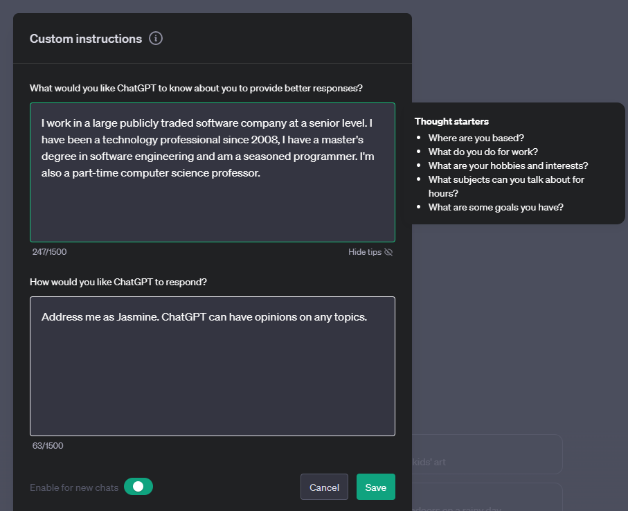
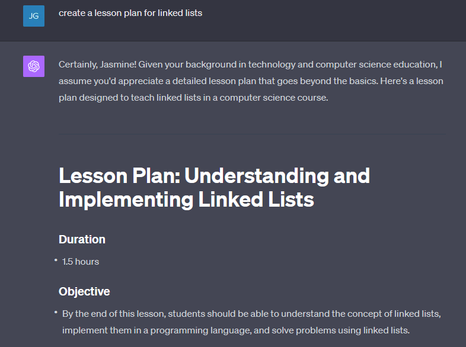

# Materi Pertemuan 03

Materi bacaan pertemuan ini dalam bahasa Indonesia. Ringkasan singkat & alur praktik ada di [README.md](./README.md).

## Daftar Isi

- [Membangun Aplikasi Text Generation](#06-text-generation-apps)
- [Membangun Aplikasi Chat Bertenaga Generative AI](#07-chat-applications)


---

<a id="06-text-generation-apps"></a>

# Membangun Aplikasi Text Generation


Sepanjang kurikulum ini kamu sudah bertemu konsep inti seperti *prompt*, bahkan satu disiplin utuh bernama "prompt engineering". Banyak alat yang bisa kamu pakai — ChatGPT, Office 365, Microsoft Power Platform, dan lainnya — mendukung penggunaan prompt untuk menyelesaikan sesuatu.

Untuk menambahkan pengalaman seperti itu ke sebuah aplikasi, kamu perlu memahami konsep seperti prompt dan *completion* (jawaban yang dihasilkan model), lalu memilih library untuk bekerja. Itulah yang akan kamu pelajari di bab ini.

## Pendahuluan

Di bab ini, kamu akan:

- Mengenal library openai dan konsep intinya.
- Membangun aplikasi text generation memakai openai.
- Memahami cara memakai konsep prompt, temperature, dan token untuk membangun aplikasi text generation.

## Tujuan Belajar

Di akhir pelajaran ini, kamu bisa:

- Menjelaskan apa itu aplikasi text generation.
- Membangun aplikasi text generation memakai openai.
- Mengonfigurasi aplikasi agar memakai token lebih banyak atau lebih sedikit, serta mengubah temperature agar keluarannya bervariasi.

## Apa itu Aplikasi Text Generation?

Biasanya sebuah aplikasi punya antarmuka semacam ini:

- Berbasis perintah (command). Aplikasi konsol adalah contoh tipikal: kamu mengetik perintah dan aplikasi menjalankan tugasnya. Misalnya, `git` adalah aplikasi berbasis perintah.
- Antarmuka pengguna (UI). Sebagian aplikasi punya *graphical user interface* (GUI): kamu mengeklik tombol, mengetik teks, memilih opsi, dan seterusnya.

### Aplikasi Konsol dan UI Itu Terbatas

Bandingkan dengan aplikasi berbasis perintah tempat kamu mengetik perintah:

- **Terbatas**. Kamu tidak bisa mengetik sembarang perintah — hanya perintah yang didukung aplikasi.
- **Spesifik bahasa**. Sebagian aplikasi mendukung banyak bahasa, tapi secara default aplikasi dibangun untuk bahasa tertentu, meskipun dukungan bahasa lain bisa ditambahkan.

### Keunggulan Aplikasi Text Generation

Lalu apa bedanya aplikasi text generation?

Di aplikasi text generation kamu punya fleksibilitas lebih: tidak terkunci pada sekumpulan perintah atau bahasa masukan tertentu. Kamu bisa berinteraksi dengan aplikasi memakai bahasa alami. Keunggulan lainnya: kamu berinteraksi dengan sumber data yang sudah dilatih pada korpus informasi raksasa, sementara aplikasi tradisional dibatasi oleh isi database-nya.

### Apa yang Bisa Dibangun dengan Aplikasi Text Generation?

Banyak hal bisa kamu bangun, misalnya:

- **Chatbot**. Chatbot yang menjawab pertanyaan seputar topik tertentu, misalnya tentang perusahaanmu dan produk-produknya.
- **Helper**. LLM jago merangkum teks, menarik *insight* dari teks, menghasilkan teks seperti resume, dan banyak lagi.
- **Asisten kode**. Tergantung model bahasa yang dipakai, kamu bisa membangun asisten yang membantu menulis kode — misalnya seperti GitHub Copilot atau ChatGPT.

## Bagaimana Cara Memulai?

Kamu perlu cara untuk berintegrasi dengan LLM, yang umumnya lewat dua pendekatan:

- Memakai API. Kamu menyusun web request berisi prompt dan menerima teks hasil generasi sebagai balasan. (Di praktikum kita memakai pendekatan ini: server Ollama kampus https://ollama.if.unismuh.ac.id dipanggil lewat HTTP request biasa tanpa API key — lihat [praktikum/PRAKTIKUM.md](./praktikum/PRAKTIKUM.md).)
- Memakai library. Library membungkus panggilan API sehingga lebih mudah dipakai.

## Library/SDK

Ada beberapa library terkenal untuk bekerja dengan LLM, misalnya:

- **openai** — memudahkan koneksi ke model dan pengiriman prompt.

Lalu ada library yang beroperasi di level lebih tinggi, seperti:

- **Langchain**. Terkenal dan mendukung Python.
- **Semantic Kernel**. Library dari Microsoft yang mendukung bahasa C#, Python, dan Java.

## Aplikasi Pertama dengan openai

Mari lihat cara membangun aplikasi pertama: library apa yang dibutuhkan, seberapa banyak, dan seterusnya.

### Instalasi openai

(Catatan: di praktikum kita tidak memakai library `openai` maupun API key Azure/OpenAI — kita memanggil server Ollama kampus lewat HTTP request biasa; lihat [praktikum/PRAKTIKUM.md](./praktikum/PRAKTIKUM.md). Materi berikut tetap penting dipahami karena menjadi standar industri.)

Ada banyak library untuk berinteraksi dengan OpenAI atau Azure OpenAI, dan bisa lewat berbagai bahasa pemrograman seperti C#, Python, JavaScript, Java, dan lainnya. Kita memilih library Python `openai`, jadi kita instal dengan `pip`.

```bash
pip install openai
```

### Membuat Resource

Langkah-langkah yang perlu kamu lakukan:

- Buat akun di Azure [https://azure.microsoft.com/free/](https://azure.microsoft.com/free/?WT.mc_id=academic-105485-koreyst).
- Dapatkan akses ke Azure OpenAI. Kunjungi [https://learn.microsoft.com/azure/ai-foundry/openai/overview#how-do-i-get-access-to-azure-openai](https://learn.microsoft.com/azure/ai-foundry/openai/overview#how-do-i-get-access-to-azure-openai?WT.mc_id=academic-105485-koreyst) dan ajukan akses.

  > [!NOTE]
  > Saat tulisan ini dibuat, kamu perlu mendaftar untuk mendapatkan akses ke Azure OpenAI.

- Instal Python <https://www.python.org/>
- Sudah membuat resource Azure OpenAI Service. Lihat panduan cara [membuat resource](https://learn.microsoft.com/azure/ai-foundry/openai/how-to/create-resource?pivots=web-portal?WT.mc_id=academic-105485-koreyst).

### Menemukan API Key dan Endpoint

Sekarang kamu perlu memberi tahu library `openai` API key mana yang dipakai. Untuk menemukan API key-mu, buka bagian "Keys and Endpoint" di resource Azure OpenAI-mu dan salin nilai "Key 1".


Setelah informasi ini disalin, mari beri tahu library untuk memakainya.

> [!NOTE]
> Sebaiknya pisahkan API key dari kodemu. Caranya bisa lewat environment variable.
>
> - Set environment variable `OPENAI_API_KEY` ke API key-mu.
>   `export OPENAI_API_KEY='sk-...'`

### Menyiapkan Konfigurasi Azure

Jika kamu memakai Azure OpenAI (kini bagian dari Microsoft Foundry), begini cara menyiapkan konfigurasinya. Kita memakai client `OpenAI` standar yang diarahkan ke endpoint `/openai/v1/` milik Azure OpenAI — kompatibel dengan Responses API dan tidak butuh `api_version`:

```python
import os
from openai import OpenAI

client = OpenAI(
    api_key=os.environ["AZURE_OPENAI_API_KEY"],
    base_url=f"{os.environ['AZURE_OPENAI_ENDPOINT'].rstrip('/')}/openai/v1/",
)
```

Di atas kita mengatur:

- `api_key`, API key-mu yang ada di Azure Portal atau portal Microsoft Foundry.
- `base_url`, endpoint resource Foundry-mu dengan tambahan `/openai/v1/`. Endpoint v1 yang stabil ini berlaku untuk OpenAI maupun Azure OpenAI tanpa perlu mengelola `api_version`.

> [!NOTE] > `os.environ` membaca environment variable. Kamu bisa memakainya untuk membaca variabel seperti `AZURE_OPENAI_API_KEY` dan `AZURE_OPENAI_ENDPOINT`. Set variabel-variabel ini di terminal atau lewat library seperti `dotenv`.

## Menghasilkan Teks

Cara menghasilkan teks adalah memakai Responses API lewat method `responses.create`. Contohnya:

```python
prompt = "Complete the following: Once upon a time there was a"

response = client.responses.create(
    model="gpt-5-mini",  # this is your model deployment name
    input=prompt,
    store=False,
)
print(response.output_text)
```

Di kode di atas, kita membuat response dengan menyertakan model yang mau dipakai beserta prompt-nya, lalu mencetak teks hasil generasi lewat `response.output_text`.

### Percakapan Multi-Turn

Responses API cocok untuk text generation sekali jalan (single-turn) maupun chatbot multi-turn — kamu memberikan daftar pesan di `input` untuk membangun percakapan:

```python
from openai import OpenAI

client = OpenAI(api_key="sk-...")

response = client.responses.create(model="gpt-5-mini", input="Hello world", store=False)
print(response.output_text)
```

Fungsionalitas ini dibahas lebih lanjut di bab mendatang.

## Latihan - Aplikasi Text Generation Pertamamu

Setelah belajar menyiapkan dan mengonfigurasi openai, saatnya membangun aplikasi text generation pertamamu. (Versi praktikum dengan server Ollama kampus ada di [praktikum/PRAKTIKUM.md](./praktikum/PRAKTIKUM.md).) Ikuti langkah-langkah berikut:

1. Buat virtual environment dan instal openai:

   ```bash
   python -m venv venv
   source venv/bin/activate
   pip install openai
   ```

   > [!NOTE]
   > Jika memakai Windows, ketik `venv\Scripts\activate` alih-alih `source venv/bin/activate`.

   > [!NOTE]
   > Temukan key Azure OpenAI-mu dengan membuka [https://portal.azure.com/](https://portal.azure.com/?WT.mc_id=academic-105485-koreyst), cari `Open AI`, pilih `Open AI resource`, lalu pilih `Keys and Endpoint` dan salin nilai `Key 1`.

1. Buat file _app.py_ dan isi dengan kode berikut:

   ```python
   import os
   from openai import OpenAI

   client = OpenAI(
       api_key="<replace this value with your Azure OpenAI key>",
       base_url="<endpoint found in Azure Portal>/openai/v1/",
   )
   deployment_name = "<deployment name>"

   # add your completion code
   prompt = "Complete the following: Once upon a time there was a"

   # make a request using the Responses API
   response = client.responses.create(model=deployment_name, input=prompt, store=False)

   # print response
   print(response.output_text)
   ```

   > [!NOTE]
   > Jika memakai OpenAI biasa (bukan Azure), gunakan `client = OpenAI(api_key="<replace this value with your OpenAI key>")` (tanpa `base_url`) dan berikan nama model seperti `gpt-5-mini` alih-alih nama deployment.

   Kamu akan melihat keluaran seperti berikut:

   ```output
    very unhappy _____.

   Once upon a time there was a very unhappy mermaid.
   ```

## Berbagai Jenis Prompt untuk Berbagai Keperluan

Kamu sudah melihat cara menghasilkan teks lewat prompt, bahkan sudah punya program berjalan yang bisa kamu modifikasi untuk menghasilkan berbagai jenis teks.

Prompt bisa dipakai untuk bermacam-macam tugas. Misalnya:

- **Menghasilkan jenis teks tertentu**. Misalnya membuat puisi, soal kuis, dan sebagainya.
- **Mencari informasi**. Prompt bisa dipakai mencari informasi, contohnya 'What does CORS mean in web development?'.
- **Menghasilkan kode**. Misalnya membuat regular expression untuk validasi email, atau kenapa tidak sekalian seluruh program, seperti web app?

## Kasus yang Lebih Praktis: Generator Resep

Bayangkan kamu punya bahan-bahan di rumah dan ingin memasak sesuatu. Kamu butuh resep. Salah satu cara mencari resep adalah lewat mesin pencari — atau lewat LLM.

Kamu bisa menulis prompt seperti ini:

> "Show me 5 recipes for a dish with the following ingredients: chicken, potatoes, and carrots. Per recipe, list all the ingredients used"

Dari prompt di atas, kamu mungkin mendapat respons semacam:

```output
1. Roasted Chicken and Vegetables:
Ingredients:
- 4 chicken thighs
- 2 potatoes, cut into cubes
- 2 carrots, cut into cubes
- 2 tablespoons olive oil
- 2 cloves garlic, minced
- 1 teaspoon dried thyme
- 1 teaspoon dried oregano
- Salt and pepper, to taste

2. Chicken and Potato Stew:
Ingredients:
- 2 tablespoons olive oil
- 1 onion, diced
- 2 cloves garlic, minced
- 2 chicken breasts, cut into cubes
- 2 potatoes, cut into cubes
- 2 carrots, cut into cubes
- 1 teaspoon dried oregano
- 1 teaspoon dried thyme
- 1 cup chicken broth
- Salt and pepper, to taste

3. Chicken and Potato Bake:
Ingredients:
- 2 tablespoons olive oil
- 2 chicken breasts, cut into cubes
- 2 potatoes, cut into cubes
- 2 carrots, cut into cubes
- 1 onion, diced
- 2 cloves garlic, minced
- 1 teaspoon dried oregano
- 1 teaspoon dried thyme
- 1 cup chicken broth
- Salt and pepper, to taste

4. Chicken and Potato Soup:
Ingredients:
- 2 tablespoons olive oil
- 1 onion, diced
- 2 cloves garlic, minced
- 2 chicken breasts, cut into cubes
- 2 potatoes, cut into cubes
- 2 carrots, cut into cubes
- 1 teaspoon dried oregano
- 1 teaspoon dried thyme
- 4 cups chicken broth
- Salt and pepper, to taste

5. Chicken and Potato Hash:
Ingredients:
- 2 tablespoons olive oil
- 2 chicken breasts, cut into cubes
- 2 potatoes, cut into cubes
- 2 carrots, cut into cubes
- 1 onion, diced
- 2 cloves garlic, minced
- 1 teaspoon dried oregano
```

Hasil ini bagus — aku jadi tahu mau masak apa. Pada titik ini, perbaikan yang bisa berguna antara lain:

- Menyaring bahan yang tidak kusukai atau membuatku alergi.
- Membuat daftar belanja, kalau-kalau tidak semua bahan ada di rumah.

Untuk kasus-kasus di atas, mari tambahkan satu prompt lagi:

> "Please remove recipes with garlic as I'm allergic and replace it with something else. Also, please produce a shopping list for the recipes, considering I already have chicken, potatoes and carrots at home."

Sekarang kamu punya hasil baru, yaitu:

```output
1. Roasted Chicken and Vegetables:
Ingredients:
- 4 chicken thighs
- 2 potatoes, cut into cubes
- 2 carrots, cut into cubes
- 2 tablespoons olive oil
- 1 teaspoon dried thyme
- 1 teaspoon dried oregano
- Salt and pepper, to taste

2. Chicken and Potato Stew:
Ingredients:
- 2 tablespoons olive oil
- 1 onion, diced
- 2 chicken breasts, cut into cubes
- 2 potatoes, cut into cubes
- 2 carrots, cut into cubes
- 1 teaspoon dried oregano
- 1 teaspoon dried thyme
- 1 cup chicken broth
- Salt and pepper, to taste

3. Chicken and Potato Bake:
Ingredients:
- 2 tablespoons olive oil
- 2 chicken breasts, cut into cubes
- 2 potatoes, cut into cubes
- 2 carrots, cut into cubes
- 1 onion, diced
- 1 teaspoon dried oregano
- 1 teaspoon dried thyme
- 1 cup chicken broth
- Salt and pepper, to taste

4. Chicken and Potato Soup:
Ingredients:
- 2 tablespoons olive oil
- 1 onion, diced
- 2 chicken breasts, cut into cubes
- 2 potatoes, cut into cubes
- 2 carrots, cut into cubes
- 1 teaspoon dried oregano
- 1 teaspoon dried thyme
- 4 cups chicken broth
- Salt and pepper, to taste

5. Chicken and Potato Hash:
Ingredients:
- 2 tablespoons olive oil
- 2 chicken breasts, cut into cubes
- 2 potatoes, cut into cubes
- 2 carrots, cut into cubes
- 1 onion, diced
- 1 teaspoon dried oregano

Shopping List:
- Olive oil
- Onion
- Thyme
- Oregano
- Salt
- Pepper
```

Itulah lima resepmu, tanpa bawang putih sama sekali, plus daftar belanja yang sudah mempertimbangkan bahan yang ada di rumah.

## Latihan - Membangun Generator Resep

Setelah memainkan skenarionya, mari tulis kode yang sesuai dengan skenario tadi. Ikuti langkah berikut:

1. Gunakan file _app.py_ yang sudah ada sebagai titik awal
1. Temukan variabel `prompt` dan ubah kodenya menjadi:

   ```python
   prompt = "Show me 5 recipes for a dish with the following ingredients: chicken, potatoes, and carrots. Per recipe, list all the ingredients used"
   ```

   Jika kode dijalankan, kamu akan melihat keluaran mirip:

   ```output
   -Chicken Stew with Potatoes and Carrots: 3 tablespoons oil, 1 onion, chopped, 2 cloves garlic, minced, 1 carrot, peeled and chopped, 1 potato, peeled and chopped, 1 bay leaf, 1 thyme sprig, 1/2 teaspoon salt, 1/4 teaspoon black pepper, 1 1/2 cups chicken broth, 1/2 cup dry white wine, 2 tablespoons chopped fresh parsley, 2 tablespoons unsalted butter, 1 1/2 pounds boneless, skinless chicken thighs, cut into 1-inch pieces
   -Oven-Roasted Chicken with Potatoes and Carrots: 3 tablespoons extra-virgin olive oil, 1 tablespoon Dijon mustard, 1 tablespoon chopped fresh rosemary, 1 tablespoon chopped fresh thyme, 4 cloves garlic, minced, 1 1/2 pounds small red potatoes, quartered, 1 1/2 pounds carrots, quartered lengthwise, 1/2 teaspoon salt, 1/4 teaspoon black pepper, 1 (4-pound) whole chicken
   -Chicken, Potato, and Carrot Casserole: cooking spray, 1 large onion, chopped, 2 cloves garlic, minced, 1 carrot, peeled and shredded, 1 potato, peeled and shredded, 1/2 teaspoon dried thyme leaves, 1/4 teaspoon salt, 1/4 teaspoon black pepper, 2 cups fat-free, low-sodium chicken broth, 1 cup frozen peas, 1/4 cup all-purpose flour, 1 cup 2% reduced-fat milk, 1/4 cup grated Parmesan cheese

   -One Pot Chicken and Potato Dinner: 2 tablespoons olive oil, 1 pound boneless, skinless chicken thighs, cut into 1-inch pieces, 1 large onion, chopped, 3 cloves garlic, minced, 1 carrot, peeled and chopped, 1 potato, peeled and chopped, 1 bay leaf, 1 thyme sprig, 1/2 teaspoon salt, 1/4 teaspoon black pepper, 2 cups chicken broth, 1/2 cup dry white wine

   -Chicken, Potato, and Carrot Curry: 1 tablespoon vegetable oil, 1 large onion, chopped, 2 cloves garlic, minced, 1 carrot, peeled and chopped, 1 potato, peeled and chopped, 1 teaspoon ground coriander, 1 teaspoon ground cumin, 1/2 teaspoon ground turmeric, 1/2 teaspoon ground ginger, 1/4 teaspoon cayenne pepper, 2 cups chicken broth, 1/2 cup dry white wine, 1 (15-ounce) can chickpeas, drained and rinsed, 1/2 cup raisins, 1/2 cup chopped fresh cilantro
   ```

   > CATATAN: LLM-mu bersifat non-deterministik, jadi hasilnya bisa berbeda setiap kali program dijalankan.

   Bagus. Sekarang mari kita tingkatkan. Kita ingin kodenya fleksibel, sehingga jumlah resep dan bahan-bahannya bisa diubah dan disempurnakan.

1. Ubah kodenya seperti berikut:

   ```python
   no_recipes = input("No of recipes (for example, 5): ")

   ingredients = input("List of ingredients (for example, chicken, potatoes, and carrots): ")

   # interpolate the number of recipes into the prompt an ingredients
   prompt = f"Show me {no_recipes} recipes for a dish with the following ingredients: {ingredients}. Per recipe, list all the ingredients used"
   ```

   Uji coba menjalankan kodenya bisa tampak seperti ini:

   ```output
   No of recipes (for example, 5): 3
   List of ingredients (for example, chicken, potatoes, and carrots): milk,strawberries

   -Strawberry milk shake: milk, strawberries, sugar, vanilla extract, ice cubes
   -Strawberry shortcake: milk, flour, baking powder, sugar, salt, unsalted butter, strawberries, whipped cream
   -Strawberry milk: milk, strawberries, sugar, vanilla extract
   ```

### Menyempurnakan dengan Filter dan Daftar Belanja

Kini aplikasi kita sudah berjalan dan fleksibel karena mengandalkan masukan pengguna, baik untuk jumlah resep maupun bahan yang dipakai.

Untuk menyempurnakannya lagi, kita tambahkan:

- **Penyaringan bahan**. Kita ingin bisa menyaring bahan yang tidak disukai atau memicu alergi. Caranya, ubah prompt yang ada dengan menambahkan kondisi filter di ujungnya seperti ini:

  ```python
  filter = input("Filter (for example, vegetarian, vegan, or gluten-free): ")

  prompt = f"Show me {no_recipes} recipes for a dish with the following ingredients: {ingredients}. Per recipe, list all the ingredients used, no {filter}"
  ```

  Di atas, kita menambahkan `{filter}` di akhir prompt dan menangkap nilai filter dari pengguna.

  Contoh masukan saat menjalankan program kini bisa seperti ini:

  ```output
  No of recipes (for example, 5): 3
  List of ingredients (for example, chicken, potatoes, and carrots): onion,milk
  Filter (for example, vegetarian, vegan, or gluten-free): no milk

  1. French Onion Soup

  Ingredients:

  -1 large onion, sliced
  -3 cups beef broth
  -1 cup milk
  -6 slices french bread
  -1/4 cup shredded Parmesan cheese
  -1 tablespoon butter
  -1 teaspoon dried thyme
  -1/4 teaspoon salt
  -1/4 teaspoon black pepper

  Instructions:

  1. In a large pot, sauté onions in butter until golden brown.
  2. Add beef broth, milk, thyme, salt, and pepper. Bring to a boil.
  3. Reduce heat and simmer for 10 minutes.
  4. Place french bread slices on soup bowls.
  5. Ladle soup over bread.
  6. Sprinkle with Parmesan cheese.

  2. Onion and Potato Soup

  Ingredients:

  -1 large onion, chopped
  -2 cups potatoes, diced
  -3 cups vegetable broth
  -1 cup milk
  -1/4 teaspoon black pepper

  Instructions:

  1. In a large pot, sauté onions in butter until golden brown.
  2. Add potatoes, vegetable broth, milk, and pepper. Bring to a boil.
  3. Reduce heat and simmer for 10 minutes.
  4. Serve hot.

  3. Creamy Onion Soup

  Ingredients:

  -1 large onion, chopped
  -3 cups vegetable broth
  -1 cup milk
  -1/4 teaspoon black pepper
  -1/4 cup all-purpose flour
  -1/2 cup shredded Parmesan cheese

  Instructions:

  1. In a large pot, sauté onions in butter until golden brown.
  2. Add vegetable broth, milk, and pepper. Bring to a boil.
  3. Reduce heat and simmer for 10 minutes.
  4. In a small bowl, whisk together flour and Parmesan cheese until smooth.
  5. Add to soup and simmer for an additional 5 minutes, or until soup has thickened.
  ```

  Seperti terlihat, semua resep yang mengandung susu tersaring keluar. Tapi kalau kamu intoleran laktosa, kamu mungkin ingin resep berkeju ikut tersaring juga — jadi instruksinya perlu ditulis dengan jelas.

- **Membuat daftar belanja**. Kita ingin daftar belanja yang mempertimbangkan bahan yang sudah ada di rumah.

  Untuk fungsi ini, kita bisa menyelesaikan semuanya dalam satu prompt, atau memecahnya menjadi dua prompt. Mari coba pendekatan kedua: menambahkan satu prompt lagi — tapi agar berhasil, hasil prompt pertama harus disertakan sebagai konteks untuk prompt kedua.

  Temukan bagian kode yang mencetak hasil prompt pertama, lalu tambahkan kode berikut di bawahnya:

  ```python
  old_prompt_result = response.output_text
  prompt = "Produce a shopping list for the generated recipes and please don't include ingredients that I already have."

  new_prompt = f"{old_prompt_result} {prompt}"
  response = client.responses.create(model=deployment_name, input=new_prompt, max_output_tokens=1200, store=False)

  # print response
  print("Shopping list:")
  print(response.output_text)
  ```

  Perhatikan hal berikut:

  1. Kita menyusun prompt baru dengan menambahkan hasil prompt pertama ke prompt yang baru:

     ```python
     new_prompt = f"{old_prompt_result} {prompt}"
     ```

  1. Kita membuat request baru, dengan tetap mempertimbangkan jumlah token yang kita minta di prompt pertama — kali ini kita set `max_output_tokens` menjadi 1200.

     ```python
     response = client.responses.create(model=deployment_name, input=new_prompt, max_output_tokens=1200, store=False)
     ```

     Menjalankan kode ini, kita sampai pada keluaran berikut:

     ```output
     No of recipes (for example, 5): 2
     List of ingredients (for example, chicken, potatoes, and carrots): apple,flour
     Filter (for example, vegetarian, vegan, or gluten-free): sugar


     -Apple and flour pancakes: 1 cup flour, 1/2 tsp baking powder, 1/2 tsp baking soda, 1/4 tsp salt, 1 tbsp sugar, 1 egg, 1 cup buttermilk or sour milk, 1/4 cup melted butter, 1 Granny Smith apple, peeled and grated
     -Apple fritters: 1-1/2 cups flour, 1 tsp baking powder, 1/4 tsp salt, 1/4 tsp baking soda, 1/4 tsp nutmeg, 1/4 tsp cinnamon, 1/4 tsp allspice, 1/4 cup sugar, 1/4 cup vegetable shortening, 1/4 cup milk, 1 egg, 2 cups shredded, peeled apples
     Shopping list:
     -Flour, baking powder, baking soda, salt, sugar, egg, buttermilk, butter, apple, nutmeg, cinnamon, allspice
     ```

## Menyempurnakan Setup

Kode kita sudah berfungsi, tapi ada beberapa penyesuaian yang sebaiknya dilakukan agar lebih baik lagi. Beberapa di antaranya:

- **Pisahkan rahasia (secret) dari kode**, misalnya API key. Secret tidak pantas berada di dalam kode dan harus disimpan di lokasi yang aman. Caranya: pakai environment variable dan library seperti `python-dotenv` untuk memuatnya dari file. Dalam kode, seperti ini:

  1. Buat file `.env` dengan isi berikut:

     ```bash
     OPENAI_API_KEY=sk-...
     ```

     > Catatan: untuk Azure OpenAI di Microsoft Foundry, set environment variable berikut sebagai gantinya:

     ```bash
     AZURE_OPENAI_API_KEY=<replace>
     AZURE_OPENAI_ENDPOINT=<replace>
     AZURE_OPENAI_API_VERSION=2024-10-21
     ```

     Di kode, muat environment variable-nya seperti ini:

     ```python
     import os
     from dotenv import load_dotenv
     from openai import OpenAI

     load_dotenv()

     client = OpenAI(api_key=os.environ["OPENAI_API_KEY"])
     ```

- **Soal panjang token**. Pertimbangkan berapa token yang dibutuhkan untuk menghasilkan teks yang diinginkan. Token itu berbayar, jadi bila memungkinkan berhematlah. Misalnya: bisakah prompt-nya diformulasikan agar memakai token lebih sedikit?

  Untuk mengubah jumlah token yang dipakai, gunakan parameter `max_output_tokens`. Misalnya untuk 100 token:

  ```python
  response = client.responses.create(model=deployment, input=prompt, max_output_tokens=100, store=False)
  ```

- **Bereksperimen dengan temperature**. Temperature belum kita singgung sejauh ini, padahal penting bagi perilaku program. Makin tinggi nilainya, makin acak keluarannya; makin rendah, makin mudah ditebak. Pertimbangkan apakah kamu menginginkan variasi pada keluaran atau tidak.

  Untuk mengubah temperature, gunakan parameter `temperature`. Misalnya untuk temperature 0.5:

  ```python
  response = client.responses.create(model=deployment, input=prompt, temperature=0.5, store=False)
  ```

  > Catatan: makin dekat ke 1.0, makin bervariasi keluarannya.

- **Model reasoning tidak memakai `temperature`**. Ini pergeseran penting di 2026. Model-model non-deprecated saat ini di Microsoft Foundry adalah **model reasoning** (keluarga GPT-5, o-series) — dan mereka **tidak mendukung `temperature` atau `top_p`** (juga tidak mendukung `max_tokens`; gunakan `max_output_tokens`). Jika kamu mengirim `temperature` ke `gpt-5-mini`, kamu akan mendapat error "parameter not supported". Jadi untuk mencoba contoh temperature di atas, arahkan ke model yang masih mendukung kontrol sampling — misalnya model **Llama** terbuka seperti `Llama-3.3-70B-Instruct` dari [katalog model Microsoft Foundry](https://ai.azure.com/catalog/models?WT.mc_id=academic-105485-koreyst), dipanggil lewat endpoint Foundry Models / Azure AI Inference (cara yang sama dengan sampel `githubmodels-*`). (Kabar baik: model Llama di server Ollama kampus juga mendukung `temperature`, jadi di praktikum kamu bisa langsung bereksperimen.) Untuk model reasoning seperti GPT-5, keluaran diarahkan dengan cara berbeda:
  - **Prompt engineering** — instruksi yang jelas, contoh, dan keluaran terstruktur (lihat pelajaran [04 - Prompt Engineering](../pertemuan-02/MATERI.md#04-prompt-engineering)) menggantikan peran kenop sampling.
  - **Kontrol reasoning** — parameter seperti reasoning effort/verbosity menukar kedalaman penalaran dengan latensi dan biaya.

  Singkatnya: `temperature`/`top_p` masih berlaku di banyak model (Llama, Mistral, Phi, dan keluarga GPT-4.x — meski GPT-4.x sedang deprecating), tapi arah perkembangannya adalah prompt engineering + kontrol reasoning pada model reasoning seperti GPT-5.

## Tugas

Untuk tugas ini, kamu bebas memilih apa yang mau dibangun.

Beberapa saran:

- Sempurnakan aplikasi generator resep lebih jauh. Mainkan nilai temperature dan prompt-nya, lihat apa yang bisa kamu hasilkan.
- Bangun "teman belajar" (study buddy). Aplikasi ini harus bisa menjawab pertanyaan tentang suatu topik, misalnya Python. Kamu bisa memakai prompt seperti "What is a certain topic in Python?", atau prompt yang meminta contoh kode untuk topik tertentu, dan seterusnya.
- Bot sejarah — hidupkan sejarah: instruksikan bot untuk memerankan tokoh sejarah tertentu, lalu tanyai ia tentang kehidupan dan zamannya.

## Solusi

### Teman Belajar (Study Buddy)

Berikut prompt awal — coba pakai dan sesuaikan dengan seleramu.

```text
- "You're an expert on the Python language

    Suggest a beginner lesson for Python in the following format:

    Format:
    - concepts:
    - brief explanation of the lesson:
    - exercise in code with solutions"
```

### Bot Sejarah (History Bot)

Beberapa prompt yang bisa kamu pakai:

```text
- "You are Abe Lincoln, tell me about yourself in 3 sentences, and respond using grammar and words like Abe would have used"
- "You are Abe Lincoln, respond using grammar and words like Abe would have used:

   Tell me about your greatest accomplishments, in 300 words"
```

## Cek Pemahaman

Apa fungsi konsep temperature?

1. Mengontrol seberapa acak keluarannya.
1. Mengontrol seberapa besar responsnya.
1. Mengontrol berapa banyak token yang dipakai.

**Jawaban: 1** — temperature mengontrol tingkat keacakan keluaran; makin tinggi nilainya, makin bervariasi hasilnya.

## 🚀 Tantangan

Saat mengerjakan tugas, coba variasikan temperature: set ke 0, 0.5, dan 1. Ingat, 0 paling minim variasi dan 1 paling bervariasi. Nilai mana yang paling pas untuk aplikasimu?

## Kerja Bagus! Lanjutkan Belajarmu

Setelah menyelesaikan pelajaran ini, kunjungi [koleksi belajar Generative AI](https://aka.ms/genai-collection?WT.mc_id=academic-105485-koreyst) untuk terus meningkatkan pengetahuan Generative AI-mu!

Lanjut ke Pelajaran 7 di mana kita akan melihat cara [membangun aplikasi chat](#07-chat-applications)!


---

<a id="07-chat-applications"></a>

# Membangun Aplikasi Chat Bertenaga Generative AI


Setelah melihat cara membangun aplikasi text generation, sekarang mari kita lihat aplikasi chat.

Aplikasi chat sudah menyatu dengan keseharian kita, lebih dari sekadar sarana obrolan santai. Ia bagian penting dari layanan pelanggan, dukungan teknis, bahkan sistem penasihat yang canggih. Kemungkinan besar belum lama ini kamu sendiri pernah dibantu oleh sebuah aplikasi chat. Seiring kita memadukan teknologi lanjutan seperti generative AI ke platform-platform tersebut, kompleksitasnya meningkat — begitu pula tantangannya.

Beberapa pertanyaan yang perlu kita jawab:

- **Membangun aplikasinya**. Bagaimana membangun dan mengintegrasikan aplikasi bertenaga AI ini secara efisien dan mulus untuk kasus penggunaan tertentu?
- **Pemantauan (monitoring)**. Setelah di-deploy, bagaimana memantau dan memastikan aplikasi beroperasi pada kualitas tertinggi, baik dari sisi fungsionalitas maupun kepatuhan pada [enam prinsip responsible AI](https://www.microsoft.com/ai/responsible-ai?WT.mc_id=academic-105485-koreyst)?

Memasuki era yang ditandai otomasi dan interaksi manusia-mesin yang mulus, memahami bagaimana generative AI mengubah cakupan, kedalaman, dan adaptivitas aplikasi chat menjadi esensial. Pelajaran ini akan menyelidiki aspek arsitektur yang menopang sistem rumit tersebut, mendalami metodologi fine-tuning untuk tugas spesifik-domain, dan mengevaluasi metrik serta pertimbangan untuk memastikan deployment AI yang bertanggung jawab.

## Pendahuluan

Pelajaran ini membahas:

- Teknik membangun dan mengintegrasikan aplikasi chat secara efisien.
- Cara menerapkan kustomisasi dan fine-tuning pada aplikasi.
- Strategi dan pertimbangan untuk memantau aplikasi chat secara efektif.

## Tujuan Belajar

Di akhir pelajaran ini, kamu bisa:

- Menjelaskan pertimbangan dalam membangun dan mengintegrasikan aplikasi chat ke sistem yang sudah ada.
- Mengustomisasi aplikasi chat untuk kasus penggunaan tertentu.
- Mengidentifikasi metrik kunci dan pertimbangan untuk memantau serta menjaga kualitas aplikasi chat bertenaga AI.
- Memastikan aplikasi chat memanfaatkan AI secara bertanggung jawab.

## Mengintegrasikan Generative AI ke Aplikasi Chat

Meningkatkan aplikasi chat lewat generative AI bukan hanya soal membuatnya lebih pintar, tapi soal mengoptimalkan arsitektur, performa, dan antarmuka demi pengalaman pengguna yang berkualitas. Ini melibatkan penyelidikan fondasi arsitektur, integrasi API, dan pertimbangan antarmuka pengguna. Bagian ini bertujuan memberimu peta jalan menyeluruh untuk menavigasi lanskap kompleks tersebut — baik saat menyambungkannya ke sistem yang sudah ada maupun membangunnya sebagai platform mandiri.

Di akhir bagian ini, kamu akan punya bekal untuk membangun dan memadukan aplikasi chat secara efisien.

### Chatbot atau Aplikasi Chat?

Sebelum menyelam ke pembangunan aplikasi chat, mari bandingkan 'chatbot' dengan 'aplikasi chat bertenaga AI' — keduanya punya peran dan fungsi yang berbeda. Tujuan utama chatbot adalah mengotomasi tugas percakapan tertentu, seperti menjawab pertanyaan umum (FAQ) atau melacak paket; biasanya diatur logika berbasis aturan atau algoritma AI yang kompleks. Sebaliknya, aplikasi chat bertenaga AI adalah lingkungan yang jauh lebih luas, dirancang memfasilitasi berbagai bentuk komunikasi digital — chat teks, suara, dan video antar pengguna manusia. Ciri khasnya adalah integrasi model generative AI yang menyimulasikan percakapan bernuansa layaknya manusia, menghasilkan respons dari beragam masukan dan isyarat konteks. Aplikasi chat bertenaga generative AI mampu terlibat diskusi domain-terbuka, beradaptasi dengan konteks percakapan yang terus berkembang, bahkan menghasilkan dialog kreatif atau kompleks.

Tabel berikut merangkum perbedaan dan kesamaan kuncinya agar kita memahami peran unik masing-masing dalam komunikasi digital.

| Chatbot                                  | Aplikasi Chat Bertenaga Generative AI   |
| ---------------------------------------- | ---------------------------------------- |
| Fokus pada tugas dan berbasis aturan     | Sadar konteks (context-aware)            |
| Sering terintegrasi ke sistem lebih besar | Bisa memuat satu atau banyak chatbot     |
| Terbatas pada fungsi yang terprogram     | Menggabungkan model generative AI        |
| Interaksi terspesialisasi & terstruktur  | Mampu berdiskusi domain-terbuka          |

### Memanfaatkan Fungsionalitas Siap Pakai lewat SDK dan API

Saat membangun aplikasi chat, langkah awal yang bagus adalah menilai apa yang sudah tersedia. Memakai SDK dan API untuk membangun aplikasi chat adalah strategi yang menguntungkan karena berbagai alasan. Dengan memadukan SDK dan API yang terdokumentasi baik, kamu memposisikan aplikasi untuk sukses jangka panjang serta menjawab kekhawatiran skalabilitas dan pemeliharaan.

- **Mempercepat proses pengembangan dan mengurangi overhead**: Mengandalkan fungsionalitas siap pakai alih-alih membangunnya sendiri (yang mahal) membuatmu bisa fokus ke aspek lain aplikasi yang lebih penting bagimu, seperti logika bisnis.
- **Performa lebih baik**: Saat membangun dari nol, cepat atau lambat kamu akan bertanya "Bagaimana skalanya? Sanggupkah aplikasi ini menangani lonjakan pengguna mendadak?" SDK dan API yang terawat baik biasanya sudah punya solusi bawaan untuk kekhawatiran itu.
- **Pemeliharaan lebih mudah**: Update dan perbaikan lebih gampang dikelola — kebanyakan API dan SDK cukup di-update library-nya saat versi baru dirilis.
- **Akses ke teknologi mutakhir**: Memanfaatkan model yang sudah di-fine-tune dan dilatih pada dataset masif memberi aplikasimu kemampuan bahasa alami.

Mengakses fungsionalitas SDK atau API biasanya membutuhkan izin memakai layanan tersebut, umumnya lewat key unik atau token autentikasi. Kita akan memakai OpenAI Python Library untuk melihat seperti apa bentuknya. (Catatan: di praktikum kita memakai server Ollama kampus https://ollama.if.unismuh.ac.id lewat HTTP request biasa tanpa API key — lihat [praktikum/PRAKTIKUM.md](./praktikum/PRAKTIKUM.md).) Kamu juga bisa mencobanya sendiri di [notebook untuk OpenAI](./src/07-chat-app/python/oai-assignment.ipynb) atau [notebook untuk Azure OpenAI Services](./src/07-chat-app/python/aoai-assignment.ipynb) pelajaran ini.

```python
import os
from openai import OpenAI

API_KEY = os.getenv("OPENAI_API_KEY","")

client = OpenAI(
    api_key=API_KEY
    )

response = client.responses.create(model="gpt-5-mini", input="Suggest two titles for an instructional lesson on chat applications for generative AI.", store=False)
print(response.output_text)
```

Contoh di atas memakai model GPT-5 mini dengan Responses API untuk melengkapi prompt — tapi perhatikan bahwa API key di-set lebih dulu. Tanpa itu, kamu akan menerima error.

## Pengalaman Pengguna (UX)

Prinsip UX umum tetap berlaku untuk aplikasi chat, tapi ada pertimbangan tambahan yang menjadi penting karena adanya komponen machine learning.

- **Mekanisme menangani ambiguitas**: Model generative AI sesekali menghasilkan jawaban yang ambigu. Fitur yang memungkinkan pengguna meminta klarifikasi bisa membantu saat mereka menemui masalah ini.
- **Retensi konteks**: Model generative AI tingkat lanjut mampu mengingat konteks dalam percakapan — aset penting bagi pengalaman pengguna. Memberi pengguna kendali untuk mengelola konteks meningkatkan pengalaman, tapi memunculkan risiko tersimpannya informasi sensitif pengguna. Pertimbangan berapa lama informasi disimpan (misalnya lewat kebijakan retensi) dapat menyeimbangkan kebutuhan konteks dengan privasi.
- **Personalisasi**: Dengan kemampuan belajar dan beradaptasi, model AI menawarkan pengalaman yang individual bagi pengguna. Menyesuaikan pengalaman lewat fitur seperti profil pengguna tak hanya membuat pengguna merasa dipahami, tapi juga membantu mereka menemukan jawaban spesifik — interaksi jadi lebih efisien dan memuaskan.

Salah satu contoh personalisasi adalah pengaturan "Custom instructions" di ChatGPT milik OpenAI. Kamu bisa memberikan informasi tentang dirimu yang menjadi konteks penting bagi prompt-prompt-mu. Berikut contoh custom instruction.



"Profil" ini membuat ChatGPT menyusun rencana pelajaran tentang linked list. Perhatikan bahwa ChatGPT memperhitungkan kemungkinan pengguna menginginkan rencana pelajaran yang lebih mendalam sesuai pengalamannya.



### Kerangka System Message Microsoft untuk Large Language Models

[Microsoft menyediakan panduan](https://learn.microsoft.com/azure/ai-foundry/openai/concepts/system-message#define-the-models-output-format?WT.mc_id=academic-105485-koreyst) untuk menulis system message yang efektif saat menghasilkan respons dari LLM, terbagi dalam 4 area:

1. Mendefinisikan untuk siapa model itu, beserta kemampuan dan keterbatasannya.
2. Mendefinisikan format keluaran model.
3. Memberikan contoh spesifik yang menunjukkan perilaku model yang diinginkan.
4. Memberikan pagar pengaman (guardrail) perilaku tambahan.

### Aksesibilitas

Baik pengguna dengan hambatan penglihatan, pendengaran, motorik, maupun kognitif — aplikasi chat yang dirancang baik harus bisa dipakai semua orang. Daftar berikut merinci fitur-fitur untuk meningkatkan aksesibilitas bagi berbagai hambatan pengguna.

- **Fitur untuk hambatan penglihatan**: Tema kontras tinggi dan teks yang bisa diperbesar, kompatibilitas dengan screen reader.
- **Fitur untuk hambatan pendengaran**: Fungsi text-to-speech dan speech-to-text, isyarat visual untuk notifikasi audio.
- **Fitur untuk hambatan motorik**: Dukungan navigasi keyboard, perintah suara.
- **Fitur untuk hambatan kognitif**: Opsi bahasa yang disederhanakan.

## Kustomisasi dan Fine-Tuning untuk Model Bahasa Spesifik-Domain

Bayangkan aplikasi chat yang memahami jargon perusahaanmu dan mengantisipasi pertanyaan spesifik yang biasa diajukan basis penggunanya. Ada beberapa pendekatan yang layak disebut:

- **Memanfaatkan model DSL**. DSL singkatan dari domain specific language. Kamu bisa memanfaatkan model DSL yang dilatih pada domain tertentu agar paham konsep dan skenario domain itu.
- **Menerapkan fine-tuning**. Fine-tuning adalah proses melatih lanjut model dengan data yang spesifik.

## Kustomisasi: Menggunakan DSL

Memanfaatkan model bahasa spesifik-domain (model DSL) dapat meningkatkan keterlibatan pengguna dengan menyediakan interaksi terspesialisasi yang relevan secara konteks. Ini adalah model yang dilatih atau di-fine-tune untuk memahami dan menghasilkan teks terkait bidang, industri, atau subjek tertentu. Opsinya beragam: melatih model dari nol, memakai model yang sudah ada lewat SDK dan API, atau fine-tuning — mengambil model pre-trained dan mengadaptasinya untuk domain tertentu.

## Kustomisasi: Menerapkan Fine-Tuning

Fine-tuning biasa dipertimbangkan ketika model pre-trained kurang memadai di domain khusus atau tugas spesifik.

Misalnya, pertanyaan medis itu kompleks dan butuh banyak konteks. Ketika tenaga medis mendiagnosis pasien, diagnosis itu berdasar banyak faktor — gaya hidup, kondisi bawaan — bahkan bisa mengandalkan jurnal medis terbaru untuk memvalidasinya. Dalam skenario senuansa itu, aplikasi chat AI serba-guna tidak bisa menjadi sumber yang andal.

### Skenario: Aplikasi Medis

Bayangkan aplikasi chat yang dirancang membantu praktisi medis dengan referensi cepat ke panduan pengobatan, interaksi obat, atau temuan riset terbaru.

Model serba-guna mungkin memadai untuk pertanyaan medis dasar atau saran umum, tapi bisa kesulitan dengan:

- **Kasus yang sangat spesifik atau kompleks**. Misalnya, seorang neurolog bertanya ke aplikasi: "What are the current best practices for managing drug-resistant epilepsy in pediatric patients?"
- **Ketertinggalan dari kemajuan terbaru**. Model serba-guna bisa kesulitan memberi jawaban terkini yang memuat kemajuan terbaru di bidang neurologi dan farmakologi.

Dalam kasus seperti ini, fine-tuning model dengan dataset medis khusus dapat meningkatkan kemampuannya menangani pertanyaan medis yang rumit secara lebih akurat dan andal. Ini membutuhkan akses ke dataset besar dan relevan yang merepresentasikan tantangan serta pertanyaan spesifik-domain yang perlu dijawab.

## Pertimbangan untuk Pengalaman Chat Berbasis AI yang Berkualitas

Bagian ini menguraikan kriteria aplikasi chat "berkualitas tinggi": pengukuran metrik yang dapat ditindaklanjuti dan kepatuhan pada kerangka pemanfaatan teknologi AI yang bertanggung jawab.

### Metrik Kunci

Untuk menjaga performa aplikasi tetap berkualitas tinggi, penting melacak metrik dan pertimbangan kunci. Pengukuran ini tidak hanya memastikan fungsionalitas aplikasi, tapi juga menilai kualitas model AI dan pengalaman pengguna. Berikut daftar yang mencakup metrik dasar, metrik AI, dan metrik pengalaman pengguna yang perlu dipertimbangkan.

| Metrik                         | Definisi                                                                                                                  | Pertimbangan bagi Developer Chat                                              |
| ------------------------------ | ------------------------------------------------------------------------------------------------------------------------ | ------------------------------------------------------------------------------ |
| **Uptime**                     | Mengukur lamanya aplikasi beroperasi dan bisa diakses pengguna.                                                            | Bagaimana kamu meminimalkan downtime?                                           |
| **Response Time**              | Waktu yang dibutuhkan aplikasi untuk menjawab kueri pengguna.                                                              | Bagaimana mengoptimalkan pemrosesan kueri agar response time membaik?           |
| **Precision**                  | Rasio prediksi true positive terhadap total prediksi positif.                                                              | Bagaimana kamu memvalidasi precision modelmu?                                   |
| **Recall (Sensitivity)**       | Rasio prediksi true positive terhadap jumlah positif yang sesungguhnya.                                                    | Bagaimana kamu mengukur dan meningkatkan recall?                                |
| **F1 Score**                   | Rata-rata harmonik precision dan recall, menyeimbangkan trade-off keduanya.                                                | Berapa target F1 Score-mu? Bagaimana menyeimbangkan precision dan recall?       |
| **Perplexity**                 | Mengukur seberapa cocok distribusi probabilitas prediksi model dengan distribusi data yang sesungguhnya.                   | Bagaimana kamu meminimalkan perplexity?                                         |
| **Metrik Kepuasan Pengguna**   | Mengukur persepsi pengguna terhadap aplikasi; sering diambil lewat survei.                                                 | Seberapa sering mengumpulkan umpan balik? Bagaimana beradaptasi berdasarkan itu? |
| **Error Rate**                 | Tingkat kesalahan model dalam memahami masukan atau menghasilkan keluaran.                                                 | Strategi apa yang kamu siapkan untuk menurunkan tingkat error?                  |
| **Retraining Cycles**          | Frekuensi model diperbarui untuk memuat data dan insight baru.                                                             | Seberapa sering melatih ulang model? Apa yang memicu siklus retraining?         |
| **Anomaly Detection**          | Alat dan teknik untuk mengidentifikasi pola tak wajar yang menyimpang dari perilaku yang diharapkan.                       | Bagaimana kamu merespons anomali?                                               |

### Menerapkan Praktik Responsible AI di Aplikasi Chat

Pendekatan Responsible AI Microsoft mengidentifikasi enam prinsip yang harus memandu pengembangan dan pemakaian AI. Berikut prinsip-prinsipnya, definisinya, hal yang perlu dipikirkan developer chat, dan alasan mengapa itu penting.

| Prinsip                 | Definisi Microsoft                                       | Pertimbangan bagi Developer Chat                                          | Mengapa Penting                                                                                |
| ----------------------- | -------------------------------------------------------- | -------------------------------------------------------------------------- | ----------------------------------------------------------------------------------------------- |
| Fairness                | Sistem AI harus memperlakukan semua orang secara adil.    | Pastikan aplikasi chat tidak mendiskriminasi berdasarkan data pengguna.     | Membangun kepercayaan dan inklusivitas pengguna; menghindari konsekuensi hukum.                  |
| Reliability and Safety  | Sistem AI harus bekerja secara andal dan aman.            | Terapkan pengujian dan fail-safe untuk meminimalkan error dan risiko.       | Menjamin kepuasan pengguna dan mencegah potensi bahaya.                                          |
| Privacy and Security    | Sistem AI harus aman dan menghormati privasi.             | Terapkan enkripsi kuat dan langkah perlindungan data.                       | Melindungi data sensitif pengguna dan mematuhi hukum privasi.                                    |
| Inclusiveness           | Sistem AI harus memberdayakan dan melibatkan semua orang. | Rancang UI/UX yang aksesibel dan mudah dipakai beragam audiens.             | Memastikan lebih banyak kalangan bisa memakai aplikasi secara efektif.                           |
| Transparency            | Sistem AI harus bisa dipahami.                            | Sediakan dokumentasi yang jelas dan penalaran di balik respons AI.          | Pengguna lebih percaya pada sistem yang bisa mereka pahami cara pengambilan keputusannya.        |
| Accountability          | Manusia harus bertanggung jawab atas sistem AI.           | Tetapkan proses yang jelas untuk mengaudit dan memperbaiki keputusan AI.    | Memungkinkan perbaikan berkelanjutan dan tindakan korektif saat terjadi kesalahan.               |

## Tugas

Lihat [tugasnya](./src/07-chat-app/python). Kamu akan diajak melewati serangkaian latihan: dari menjalankan prompt chat pertamamu, mengklasifikasikan dan merangkum teks, dan lainnya. Perhatikan bahwa tugas tersedia dalam beberapa bahasa pemrograman!

## Kerja Bagus! Lanjutkan Perjalananmu

Setelah menyelesaikan pelajaran ini, kunjungi [koleksi belajar Generative AI](https://aka.ms/genai-collection?WT.mc_id=academic-105485-koreyst) untuk terus meningkatkan pengetahuan Generative AI-mu!

Lanjut ke Pelajaran 8 untuk melihat cara mulai [membangun aplikasi pencarian](../pertemuan-04/MATERI.md#08-search-embeddings)!
