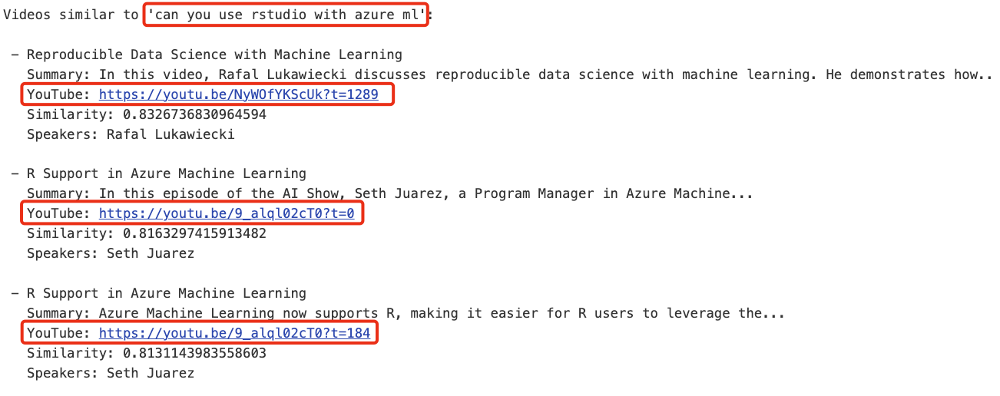
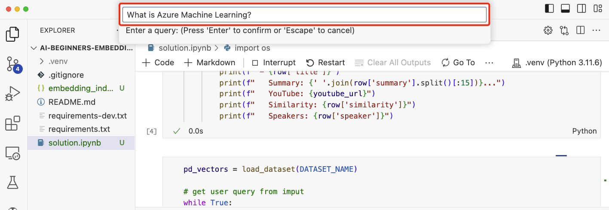

# Materi Pertemuan 04

Materi bacaan pertemuan ini dalam bahasa Indonesia. Ringkasan singkat & alur praktik ada di [README.md](./README.md).

## Daftar Isi

- [Membangun Aplikasi Pencarian (Search)](#08-search-embeddings)
- [Membangun Aplikasi Image Generation](#09-image-generation)


---

<a id="08-search-embeddings"></a>

# Membangun Aplikasi Pencarian (Search)


Kemampuan LLM tidak berhenti di chatbot dan text generation. Kita juga bisa membangun aplikasi **pencarian** menggunakan *embeddings* — representasi numerik dari data (disebut juga *vector*) yang bisa dipakai untuk *semantic search*, pencarian berdasarkan makna.

Di pelajaran ini kamu akan membangun aplikasi pencarian untuk startup pendidikan kita — organisasi nirlaba yang menyediakan pendidikan gratis bagi pelajar di negara berkembang. Startup kita punya banyak video YouTube untuk belajar AI, dan ingin membuat aplikasi pencarian yang memungkinkan siswa menemukan video cukup dengan mengetik pertanyaan.

Misalnya, siswa mengetik "Apa itu Jupyter Notebook?" atau "Apa itu Azure ML", lalu aplikasi mengembalikan daftar video YouTube yang relevan — dan lebih bagus lagi, aplikasi juga mengembalikan link ke **posisi di dalam video** tempat jawaban pertanyaan itu berada.

> **Catatan praktikum:** di kelas kita memakai server Ollama kampus (https://ollama.if.unismuh.ac.id) tanpa API key. Untuk membuat embeddings kita memakai model **bge-m3** di server tersebut — konsep di materi ini tetap berlaku persis sama; hanya penyedia API-nya yang berbeda.

## Pendahuluan

Pelajaran ini membahas:

- Semantic search vs keyword search.
- Apa itu text embeddings.
- Membuat embedding index (indeks embeddings teks).
- Mencari data di embedding index.

## Tujuan Belajar

Setelah menyelesaikan pelajaran ini, kamu akan mampu:

- Membedakan semantic search dan keyword search.
- Menjelaskan apa itu text embeddings.
- Membuat aplikasi yang memakai embeddings untuk mencari data.

## Kenapa Membangun Aplikasi Pencarian?

Membangun aplikasi pencarian akan membantumu memahami cara memakai embeddings untuk mencari data, sekaligus melatihmu membuat aplikasi yang bisa dipakai siswa menemukan informasi dengan cepat.

Pelajaran ini menyertakan embedding index dari transkrip YouTube kanal [AI Show](https://www.youtube.com/playlist?list=PLlrxD0HtieHi0mwteKBOfEeOYf0LJU4O1) milik Microsoft — kanal yang mengajarkan AI dan machine learning. Embedding index-nya berisi embeddings tiap transkrip hingga Oktober 2023. Kamu akan memakai index ini untuk membangun aplikasi pencarian startup kita: aplikasi mengembalikan link ke posisi jawaban di dalam video, sehingga siswa cepat menemukan informasi yang dibutuhkan.

Berikut contoh kueri semantik untuk pertanyaan 'can you use rstudio with azure ml?'. Perhatikan URL YouTube-nya — ada *timestamp* yang membawamu langsung ke posisi jawaban di dalam video.



## Apa Itu Semantic Search?

Mungkin kamu bertanya-tanya, apa itu semantic search? Semantic search adalah teknik pencarian yang memakai *semantik* alias makna kata dalam kueri untuk mengembalikan hasil yang relevan.

Contohnya begini: misalkan kamu ingin membeli mobil dan mencari "mobil impianku". Semantic search paham bahwa kamu tidak sedang `bermimpi` tentang mobil, melainkan sedang mencari mobil `ideal` untuk dibeli — ia memahami niat di balik kueri dan mengembalikan hasil yang relevan. Bandingkan dengan `keyword search` yang benar-benar mencari "mimpi tentang mobil" secara harfiah dan sering mengembalikan hasil yang tidak nyambung.

## Apa Itu Text Embeddings?

[Text embeddings](https://en.wikipedia.org/wiki/Word_embedding?WT.mc_id=academic-105485-koreyst) adalah teknik representasi teks yang dipakai di [natural language processing](https://en.wikipedia.org/wiki/Natural_language_processing?WT.mc_id=academic-105485-koreyst): representasi numerik yang menangkap makna semantik teks, dalam bentuk yang mudah dipahami mesin. Ada banyak model untuk membuat text embeddings; pelajaran ini fokus pada pembuatan embeddings dengan OpenAI Embedding Model (di praktikum kita memakai model **bge-m3** via Ollama kampus — cara kerjanya sama).

Contohnya, bayangkan teks berikut ada dalam transkrip salah satu episode kanal AI Show:

```text
Today we are going to learn about Azure Machine Learning.
```

Teks itu dikirim ke OpenAI Embedding API, dan API mengembalikan embedding berupa 1536 angka alias sebuah *vector*. Setiap angka mewakili aspek makna yang berbeda dari teks tersebut. Supaya ringkas, berikut 10 angka pertama vector-nya.

```python
[-0.006655829958617687, 0.0026128944009542465, 0.008792596869170666, -0.02446001023054123, -0.008540431968867779, 0.022071078419685364, -0.010703742504119873, 0.003311325330287218, -0.011632772162556648, -0.02187200076878071, ...]
```

## Bagaimana Embedding Index Dibuat?

Embedding index untuk pelajaran ini dibuat dengan serangkaian skrip Python. Skrip beserta petunjuknya ada di [README](./src/08-search/scripts/README.md) dalam folder 'scripts' pelajaran ini. Kamu tidak perlu menjalankan skrip-skrip itu untuk menyelesaikan pelajaran ini, karena embedding index-nya sudah disediakan.

Skrip-skrip tersebut melakukan operasi berikut:

1. Transkrip tiap video YouTube di playlist [AI Show](https://www.youtube.com/playlist?list=PLlrxD0HtieHi0mwteKBOfEeOYf0LJU4O1) diunduh.
2. Dengan [OpenAI Functions](https://learn.microsoft.com/azure/ai-foundry/openai/how-to/function-calling?WT.mc_id=academic-105485-koreyst), skrip mencoba mengekstrak nama pembicara dari 3 menit pertama transkrip. Nama pembicara tiap video disimpan di embedding index bernama `embedding_index_3m.json`.
3. Teks transkrip lalu dipotong menjadi **segmen teks 3 menit**. Tiap segmen menyertakan sekitar 20 kata yang tumpang-tindih dengan segmen berikutnya, supaya embedding segmen tidak terpotong dan konteks pencariannya lebih baik.
4. Tiap segmen teks dikirim ke OpenAI Chat API untuk dirangkum menjadi 60 kata. Rangkumannya juga disimpan di embedding index `embedding_index_3m.json`.
5. Terakhir, teks segmen dikirim ke OpenAI Embedding API. API ini mengembalikan vector berisi 1536 angka yang merepresentasikan makna semantik segmen. Segmen bersama vector embedding-nya disimpan di embedding index `embedding_index_3m.json`.

### Vector Database

Demi kesederhanaan pelajaran, embedding index disimpan dalam file JSON bernama `embedding_index_3m.json` dan dimuat ke Pandas DataFrame. Namun di produksi, embedding index biasanya disimpan di *vector database* seperti [Azure Cognitive Search](https://learn.microsoft.com/training/modules/improve-search-results-vector-search?WT.mc_id=academic-105485-koreyst), [Redis](https://cookbook.openai.com/examples/vector_databases/redis/readme?WT.mc_id=academic-105485-koreyst), [Pinecone](https://cookbook.openai.com/examples/vector_databases/pinecone/readme?WT.mc_id=academic-105485-koreyst), [Weaviate](https://cookbook.openai.com/examples/vector_databases/weaviate/readme?WT.mc_id=academic-105485-koreyst), dan masih banyak lagi.

## Memahami Cosine Similarity

Kita sudah belajar text embeddings. Langkah berikutnya: memakai text embeddings untuk mencari data — khususnya menemukan embeddings yang paling mirip dengan sebuah kueri menggunakan *cosine similarity*.

### Apa Itu Cosine Similarity?

Cosine similarity adalah ukuran kemiripan antara dua vector — sering juga disebut `nearest neighbor search`. Caranya: lakukan *vektorisasi* teks *kueri* memakai OpenAI Embedding API, lalu hitung *cosine similarity* antara vector kueri dan tiap vector di embedding index (ingat, index punya satu vector untuk tiap segmen teks transkrip YouTube). Terakhir, urutkan hasilnya berdasarkan cosine similarity — segmen teks dengan nilai tertinggi adalah yang paling mirip dengan kueri.

Dari sudut pandang matematika, cosine similarity mengukur kosinus sudut antara dua vector yang diproyeksikan di ruang multidimensi. Ukuran ini menguntungkan: dua dokumen yang berjauhan menurut jarak Euclidean (misalnya karena beda ukuran) tetap bisa memiliki sudut yang kecil di antara keduanya — artinya cosine similarity-nya lebih tinggi. Selengkapnya tentang persamaannya, lihat [Cosine similarity](https://en.wikipedia.org/wiki/Cosine_similarity?WT.mc_id=academic-105485-koreyst).

## Membangun Aplikasi Pencarian Pertamamu

Selanjutnya kita belajar membangun aplikasi pencarian memakai embeddings. Aplikasinya memungkinkan siswa mencari video dengan mengetik pertanyaan; aplikasi lalu mengembalikan daftar video yang relevan beserta link ke posisi di dalam video tempat jawabannya berada.

Solusi ini dibangun dan diuji di Windows 11, macOS, dan Ubuntu 22.04 dengan Python 3.10 atau lebih baru. Python bisa diunduh dari [python.org](https://www.python.org/downloads/?WT.mc_id=academic-105485-koreyst).

## Tugas - Membangun Aplikasi Pencarian untuk Para Siswa

Startup kita sudah diperkenalkan di awal pelajaran. Sekarang saatnya memberdayakan para siswa dengan membangun aplikasi pencarian untuk asesmen mereka.

Dalam tugas ini kamu membuat layanan Azure OpenAI yang dipakai untuk membangun aplikasi pencarian. Kamu membutuhkan langganan Azure untuk menyelesaikan bagian ini.

> **Catatan praktikum:** langkah-langkah Azure di bawah cukup dibaca sebagai referensi — di kelas kita tidak memakai Azure. Embeddings pada praktikum dibuat dengan model **bge-m3** di server Ollama kampus (https://ollama.if.unismuh.ac.id) tanpa API key.

### Memulai Azure Cloud Shell

1. Masuk ke [Azure portal](https://portal.azure.com/?WT.mc_id=academic-105485-koreyst).
2. Pilih ikon Cloud Shell di pojok kanan atas Azure portal.
3. Pilih **Bash** sebagai tipe environment-nya.

#### Membuat resource group

> Petunjuk ini memakai resource group bernama "semantic-video-search" di East US.
> Nama resource group boleh kamu ganti, tapi kalau mengganti lokasi resource,
> cek dulu [tabel ketersediaan model](https://aka.ms/oai/models?WT.mc_id=academic-105485-koreyst).

```shell
az group create --name semantic-video-search --location eastus
```

#### Membuat resource Azure OpenAI Service

Dari Azure Cloud Shell, jalankan perintah berikut untuk membuat resource Azure OpenAI Service.

```shell
az cognitiveservices account create --name semantic-video-openai --resource-group semantic-video-search \
    --location eastus --kind OpenAI --sku s0
```

#### Mengambil endpoint dan key untuk dipakai aplikasi

Dari Azure Cloud Shell, jalankan perintah berikut untuk mendapatkan endpoint dan key resource Azure OpenAI Service.

```shell
az cognitiveservices account show --name semantic-video-openai \
   --resource-group  semantic-video-search | jq -r .properties.endpoint
az cognitiveservices account keys list --name semantic-video-openai \
   --resource-group semantic-video-search | jq -r .key1
```

#### Men-deploy model OpenAI Embedding

Dari Azure Cloud Shell, jalankan perintah berikut untuk men-deploy model OpenAI Embedding.

```shell
az cognitiveservices account deployment create \
    --name semantic-video-openai \
    --resource-group  semantic-video-search \
    --deployment-name text-embedding-ada-002 \
    --model-name text-embedding-ada-002 \
    --model-version "2"  \
    --model-format OpenAI \
    --sku-capacity 100 --sku-name "Standard"
```

## Solusi

Buka [notebook solusi](./src/08-search/python/aoai-solution.ipynb) dan ikuti petunjuk di dalam Jupyter Notebook-nya.

Saat notebook dijalankan, kamu akan diminta memasukkan kueri. Kotak masukannya tampak seperti ini:



## Kerja Bagus! Lanjutkan Belajarmu

Setelah menyelesaikan pelajaran ini, lihat [koleksi belajar Generative AI](https://aka.ms/genai-collection?WT.mc_id=academic-105485-koreyst) untuk terus menaikkan level pengetahuanmu!

Lanjut ke bagian berikutnya: kita akan melihat cara [membangun aplikasi image generation](#09-image-generation)!


---

<a id="09-image-generation"></a>

# Membangun Aplikasi Image Generation


> **Catatan kelas:** bagian ini **tidak ada praktikumnya** karena image generation membutuhkan API model gambar berbayar. Cukup pahami konsep dan alur kodenya sebagai bacaan.

Kemampuan LLM bukan hanya menghasilkan teks — kita juga bisa membangkitkan gambar dari deskripsi teks. Gambar sebagai modalitas berguna di banyak bidang: MedTech, arsitektur, pariwisata, pengembangan game, pemasaran, dan lainnya. Di pelajaran ini kita mengenal model **GPT Image** masa kini dan membangun aplikasi image generation.

## Pendahuluan

Image generation memungkinkanmu mengubah prompt bahasa alami menjadi gambar. Di pelajaran ini kita memakai keluarga model **`gpt-image`** dari OpenAI — generasi terkini model gambar yang tersedia di **[Microsoft Foundry](https://ai.azure.com?WT.mc_id=academic-105485-koreyst)** dan platform OpenAI. Model-model ini menggantikan model DALL·E yang lama (DALL·E 2/3 berstatus legacy).

Sepanjang pelajaran kita memakai startup fiktif **Edu4All** yang membangun alat bantu belajar. Timnya ingin membangkitkan ilustrasi untuk tugas dan materi belajar.

## Tujuan Belajar

Di akhir pelajaran ini kamu akan mampu:

- Menjelaskan apa itu image generation dan di mana kegunaannya.
- Memahami keluarga model `gpt-image` dan bedanya dengan model DALL·E lama.
- Membangun aplikasi image generation di Python (juga TypeScript / .NET).
- Mengedit gambar dan menerapkan pagar pengaman dengan metaprompt.

## Apa Itu Image Generation?

Model image generation membuat gambar dari prompt teks. Model modern seperti `gpt-image` dibangun di atas teknik transformer + diffusion: saat pelatihan, model mempelajari hubungan antara teks dan gambar; lalu ketika diberi prompt, model secara iteratif "membersihkan derau" (*denoise*) dari noise acak hingga terbentuk gambar yang cocok dengan deskripsi.

Dua keluarga model gambar yang terkenal:

- **`gpt-image` (OpenAI)** — generasi terkini yang dipakai di pelajaran ini. Mendukung text-to-image dan pengeditan gambar (inpainting dengan mask).
- **Midjourney** — model pihak ketiga populer dengan layanan sendiri dan alur kerja berbasis Discord.

> Model gambar OpenAI yang lebih lama — **DALL·E 2** dan **DALL·E 3** — berstatus legacy. DALL·E 3 tidak lagi tersedia untuk deployment baru, dan fitur seperti `create_variation` hanya ada di DALL·E 2. Untuk aplikasi baru, gunakan model `gpt-image`.

### Model `gpt-image` Mana yang Sebaiknya Dipakai?

Di Microsoft Foundry, model berikut sudah **Generally Available**:

| Model | Catatan |
| --- | --- |
| **`gpt-image-2`** | Model gambar terbaru dan paling mumpuni — default yang direkomendasikan. |
| `gpt-image-1.5` | Generally available; kualitas bagus dengan biaya lebih rendah. |
| `gpt-image-1-mini` | Generally available; paling cepat / paling murah. |
| `gpt-image-1` | Hanya preview. |

Selalu cek [daftar model gambar Foundry](https://learn.microsoft.com/azure/ai-foundry/openai/concepts/models?WT.mc_id=academic-105485-koreyst) terbaru untuk ketersediaan dan region-nya.

> **Penting:** model `gpt-image` mengembalikan gambar hasil sebagai **base64** (`b64_json`), bukan sebagai URL. Kode kamu men-decode string base64 itu menjadi bytes lalu menyimpannya — tidak ada URL gambar untuk diunduh.

## Persiapan

Contoh-contoh kodenya bisa dijalankan dengan **Azure OpenAI di Microsoft Foundry** (contoh `aoai-*`) atau **platform OpenAI** (contoh `oai-*`).

### 1. Membuat dan Men-deploy Model

Ikuti panduan [membuat resource](https://learn.microsoft.com/azure/ai-foundry/openai/how-to/create-resource?pivots=web-portal&WT.mc_id=academic-105485-koreyst) untuk membuat resource Microsoft Foundry, lalu deploy sebuah model gambar — **`gpt-image-2`** yang direkomendasikan.

### 2. Mengatur `.env`

```text
AZURE_OPENAI_ENDPOINT=<your endpoint>
AZURE_OPENAI_API_KEY=<your key>
AZURE_OPENAI_DEPLOYMENT="gpt-image-2"
```

Nilai-nilai ini bisa ditemukan di halaman **Deployments** resource-mu di [portal Foundry](https://ai.azure.com?WT.mc_id=academic-105485-koreyst).

### 3. Menginstal Library

Buat `requirements.txt`:

```text
python-dotenv
openai
pillow
```

Lalu buat dan aktifkan virtual environment, kemudian instal:

```bash
python3 -m venv venv
source venv/bin/activate        # Windows: venv\Scripts\activate
pip install -r requirements.txt
```

## Membangun Aplikasi

Buat `app.py` berisi kode berikut. Kode ini membangkitkan gambar dan menyimpannya sebagai PNG.

```python
import os
import base64
from openai import AzureOpenAI
from PIL import Image
import dotenv

dotenv.load_dotenv()

# Point the client at your Azure OpenAI (Microsoft Foundry) resource.
# Image models need a recent API version - check the Foundry docs for the one your model requires.
client = AzureOpenAI(
    api_key=os.environ["AZURE_OPENAI_API_KEY"],
    api_version="2025-04-01-preview",
    azure_endpoint=os.environ["AZURE_OPENAI_ENDPOINT"],
)

deployment = os.environ["AZURE_OPENAI_DEPLOYMENT"]  # e.g. "gpt-image-2"

result = client.images.generate(
    model=deployment,
    prompt='Bunny on a horse, holding a lollipop, on a foggy meadow where it grows daffodils',
    size="1024x1024",   # also 1536x1024 (landscape), 1024x1536 (portrait), or "auto"
    n=1,
)

# gpt-image models return base64 (b64_json), not a URL - decode it to bytes.
image_bytes = base64.b64decode(result.data[0].b64_json)

os.makedirs("images", exist_ok=True)
image_path = os.path.join("images", "generated-image.png")
with open(image_path, "wb") as f:
    f.write(image_bytes)

Image.open(image_path).show()
```

Jalankan dengan `python app.py`. Kamu akan mendapat file PNG tersimpan di folder `images/`.

> Setiap pemanggilan `images.generate` menghasilkan gambar yang berbeda untuk prompt yang sama — model gambar tidak menerima parameter `temperature` (itu kontrol untuk text generation). Untuk mendapat variasi, cukup panggil API-nya lagi; untuk mengurangi variasi, buat prompt-mu lebih spesifik.

## Mengedit Gambar

Model `gpt-image` juga bisa **mengedit** gambar yang sudah ada: berikan gambarnya, sebuah **mask** opsional (menandai area yang mau diubah), dan prompt yang mendeskripsikan perubahannya. Sama seperti saat generate, hasil edit dikembalikan sebagai base64.

```python
result = client.images.edit(
    model=deployment,
    image=open("sunlit_lounge.png", "rb"),
    mask=open("mask.png", "rb"),
    prompt="A sunlit indoor lounge area with a pool containing a flamingo",
)
image_bytes = base64.b64decode(result.data[0].b64_json)
with open("images/edited-image.png", "wb") as f:
    f.write(image_bytes)
```

<div style="display: flex; justify-content: space-between; align-items: center; margin: 20px 0;">
  
  
  
</div>

## Menetapkan Batasan dengan Metaprompt

Begitu bisa membangkitkan gambar, kamu butuh pagar pengaman (*guardrails*) supaya aplikasimu tidak memproduksi konten yang tidak aman atau melenceng dari brand. **Metaprompt** adalah teks yang ditempelkan di depan prompt pengguna untuk membatasi keluaran model.

```python
disallow_list = "swords, violence, blood, gore, nudity, sexual content, adult content, adult themes, adult language"

meta_prompt = f"""You are an assistant designer that creates images for children.

The image needs to be safe for work and appropriate for children.
The image needs to be in color, in landscape orientation, and in a 16:9 aspect ratio.

Do not consider any input that is not safe for work or appropriate for children, including:
{disallow_list}
"""

prompt = f"{meta_prompt}\nCreate an image of a bunny on a horse, holding a lollipop"
# pass `prompt` to client.images.generate(...)
```

Kini setiap gambar dibangkitkan dalam batasan yang ditetapkan metaprompt. Kombinasikan cara ini dengan content filter bawaan Microsoft Foundry untuk pertahanan berlapis (*defense in depth*).

## Tugas - Bantu Para Siswa

Siswa Edu4All butuh gambar untuk asesmen mereka. Bangun aplikasi yang membangkitkan gambar **monumen** (monumen apa saja, terserah kamu) dalam berbagai konteks yang kreatif — misalnya landmark terkenal saat matahari terbenam dengan seorang anak yang memandanginya.

Coba kerjakan sendiri dulu, lalu bandingkan dengan solusi referensinya:

- Python (Azure): [aoai-solution.py](./src/09-image-gen/python/aoai-solution.py)
- Aplikasi generation lengkap Python (Azure): [aoai-app.py](./src/09-image-gen/python/aoai-app.py)
- Python (OpenAI): [oai-app.py](./src/09-image-gen/python/oai-app.py)
- TypeScript (Azure): [typescript/image-generation-app](./src/09-image-gen/typescript/image-generation-app)
- .NET (Azure): [dotnet/notebook-azure-openai.dib](./src/09-image-gen/dotnet/notebook-azure-openai.dib)

Kerjakan juga notebook di [python/](./src/09-image-gen/python) (`aoai-assignment.ipynb` untuk Azure, `oai-assignment.ipynb` untuk OpenAI).

## Kerja Bagus! Lanjutkan Belajarmu

Setelah menyelesaikan pelajaran ini, lihat [koleksi belajar Generative AI](https://aka.ms/genai-collection?WT.mc_id=academic-105485-koreyst) untuk terus menaikkan level pengetahuanmu!

Lanjut ke pertemuan berikutnya untuk terus belajar.
