# Materi Pertemuan 05

Materi bacaan pertemuan ini dalam bahasa Indonesia. Ringkasan singkat & alur praktik ada di [README.md](./README.md).

## Daftar Isi

- [Membangun Aplikasi AI Low-Code](#10-low-code)
- [Tugas Lesson 10](#10-assignment)
- [Integrasi dengan Function Calling](#11-function-calling)
- [Merancang UX untuk Aplikasi AI](#12-ux-ai)


---

<a id="10-low-code"></a>

# Membangun Aplikasi AI Low-Code


## Pendahuluan

Setelah belajar membangun aplikasi penghasil gambar, sekarang kita bicara soal low code. Generative AI bisa dipakai di banyak area — termasuk low code. Tapi apa itu low code, dan bagaimana kita menambahkan AI ke dalamnya?

Membangun aplikasi dan solusi kini jauh lebih mudah, baik bagi developer tradisional maupun non-developer, berkat *Low Code Development Platform* — platform yang memungkinkanmu membangun aplikasi dengan sedikit atau tanpa kode sama sekali. Caranya: platform menyediakan lingkungan pengembangan visual tempat kamu cukup melakukan *drag and drop* komponen. Hasilnya, aplikasi bisa dibangun lebih cepat dengan sumber daya lebih sedikit. Di pelajaran ini kita mendalami cara memakai low code dan bagaimana memperkaya pengembangan low code dengan AI menggunakan Power Platform.

Power Platform memberi organisasi peluang memberdayakan timnya membangun solusi sendiri lewat lingkungan low-code/no-code yang intuitif. Lingkungan ini menyederhanakan proses membangun solusi: dengan Power Platform, solusi bisa jadi dalam hitungan hari atau minggu — bukan bulan atau tahun. Power Platform terdiri dari lima produk utama: Power Apps, Power Automate, Power BI, Power Pages, dan Copilot Studio.

Pelajaran ini membahas:

- Pengenalan Generative AI di Power Platform
- Pengenalan Copilot dan cara memakainya
- Memakai Generative AI untuk membangun aplikasi dan flow di Power Platform
- Memahami AI Model di Power Platform lewat AI Builder
- Membangun agen cerdas dengan Microsoft Copilot Studio

> Catatan kelas: bagian low-code ini bersifat wawasan/teori — tidak ada praktikum untuk bagian ini.

## Tujuan Belajar

Di akhir pelajaran ini, kamu akan mampu:

- Memahami cara kerja Copilot di Power Platform.

- Membangun aplikasi *Student Assignment Tracker* (pelacak tugas siswa) untuk startup pendidikan kita.

- Membangun *Invoice Processing Flow* (alur pemrosesan faktur) yang memakai AI untuk mengekstrak informasi dari faktur.

- Menerapkan praktik terbaik saat memakai AI Model "Create Text with GPT".

- Memahami apa itu Microsoft Copilot Studio dan cara membangun agen cerdas dengannya.

Alat dan teknologi yang dipakai di pelajaran ini:

- **Power Apps**, untuk aplikasi Student Assignment Tracker — lingkungan pengembangan low-code untuk membangun aplikasi yang melacak, mengelola, dan berinteraksi dengan data.

- **Dataverse**, untuk menyimpan data aplikasi Student Assignment Tracker — Dataverse menyediakan platform data low-code sebagai tempat penyimpanan data aplikasi.

- **Power Automate**, untuk flow pemrosesan faktur — lingkungan pengembangan low-code untuk membangun *workflow* (alur kerja) yang mengotomatiskan proses pemrosesan faktur.

- **AI Builder**, untuk AI Model pemrosesan faktur — memakai model AI siap pakai (*prebuilt*) untuk memproses faktur startup kita.

## Generative AI di Power Platform

Memperkaya pengembangan low-code dengan generative AI adalah fokus utama Power Platform. Tujuannya: semua orang bisa membangun aplikasi, situs, dashboard bertenaga AI, dan mengotomatiskan proses dengan AI, _tanpa perlu keahlian data science_. Tujuan ini dicapai dengan mengintegrasikan generative AI ke pengalaman pengembangan low-code Power Platform dalam bentuk Copilot dan AI Builder.

### Bagaimana Cara Kerjanya?

Copilot adalah asisten AI yang memungkinkanmu membangun solusi Power Platform dengan mendeskripsikan kebutuhan lewat serangkaian langkah percakapan dalam bahasa alami. Misalnya, kamu bisa menginstruksikan asisten AI menyebutkan field apa saja yang dipakai aplikasimu — ia lalu membuat aplikasinya sekaligus model data di baliknya; atau kamu bisa menentukan bagaimana sebuah flow disusun di Power Automate.

Fungsionalitas berbasis Copilot juga bisa dipakai sebagai fitur di layar aplikasimu, sehingga pengguna dapat menggali *insight* lewat interaksi percakapan.

AI Builder adalah kapabilitas AI low-code di Power Platform yang memungkinkanmu memakai AI Model untuk mengotomatiskan proses dan memprediksi hasil. Dengan AI Builder, kamu bisa membawa AI ke aplikasi dan flow yang terhubung ke datamu di Dataverse maupun berbagai sumber data cloud seperti SharePoint, OneDrive, atau Azure.

Copilot tersedia di semua produk Power Platform: Power Apps, Power Automate, Power BI, Power Pages, dan Copilot Studio (dulu bernama Power Virtual Agents). AI Builder tersedia di Power Apps dan Power Automate. Di pelajaran ini kita fokus memakai Copilot dan AI Builder di Power Apps dan Power Automate untuk membangun solusi bagi startup pendidikan kita.

### Copilot di Power Apps

Sebagai bagian dari Power Platform, Power Apps menyediakan lingkungan pengembangan low-code untuk membangun aplikasi yang melacak, mengelola, dan berinteraksi dengan data. Ia merupakan rangkaian layanan pengembangan aplikasi dengan platform data yang *scalable* serta kemampuan terhubung ke layanan cloud dan data *on-premises*. Aplikasi yang dibangun bisa berjalan di browser, tablet, dan ponsel, serta bisa dibagikan ke rekan kerja. Antarmukanya sederhana, sehingga setiap pengguna bisnis maupun developer profesional bisa membuat aplikasi kustom. Pengalaman pengembangan aplikasinya pun diperkaya generative AI lewat Copilot.

Fitur asisten AI Copilot di Power Apps memungkinkanmu mendeskripsikan aplikasi seperti apa yang dibutuhkan dan informasi apa yang ingin dilacak, dikumpulkan, atau ditampilkan. Copilot lalu menghasilkan aplikasi Canvas responsif berdasarkan deskripsimu, yang kemudian bisa kamu kustomisasi sesuai kebutuhan. Copilot juga membuatkan dan menyarankan Dataverse Table berisi field yang dibutuhkan untuk menyimpan data plus contoh datanya. (Apa itu Dataverse dan cara memakainya di Power Apps dibahas nanti di pelajaran ini.) Tabel itu bisa kamu sesuaikan lewat langkah-langkah percakapan dengan asisten Copilot. Fitur ini langsung tersedia dari layar utama Power Apps.

### Copilot di Power Automate

Sebagai bagian dari Power Platform, Power Automate memungkinkan pengguna membuat alur kerja otomatis antar-aplikasi dan layanan. Ia membantu mengotomatiskan proses bisnis berulang seperti komunikasi, pengumpulan data, dan persetujuan keputusan. Antarmukanya sederhana sehingga pengguna dengan kompetensi teknis apa pun (dari pemula sampai developer kawakan) bisa mengotomatiskan tugas kerjanya. Pengalaman pengembangan workflow juga diperkaya generative AI lewat Copilot.

Fitur asisten AI Copilot di Power Automate memungkinkanmu mendeskripsikan flow seperti apa yang dibutuhkan dan aksi apa yang harus dijalankan flow tersebut. Copilot lalu menghasilkan flow berdasarkan deskripsimu, lengkap dengan saran aksi-aksi yang diperlukan untuk tugas yang ingin diotomatiskan. (Apa itu flow dan cara memakainya di Power Automate dibahas nanti di pelajaran ini.) Flow itu bisa kamu sesuaikan lewat langkah-langkah percakapan dengan asisten Copilot. Fitur ini langsung tersedia dari layar utama Power Automate.

## Membangun Agen Cerdas dengan Microsoft Copilot Studio

[Microsoft Copilot Studio](https://learn.microsoft.com/microsoft-copilot-studio/fundamentals-what-is-copilot-studio?WT.mc_id=academic-105485-koreyst) (dulu Power Virtual Agents) adalah anggota low-code Power Platform untuk membangun **AI agent** — copilot percakapan yang bisa menjawab pertanyaan, menjalankan aksi, dan mengotomatiskan tugas atas nama penggunamu. Seperti anggota Power Platform lainnya, agen ini dibangun lewat pengalaman visual yang mengutamakan bahasa alami: kamu mendeskripsikan apa yang harus dilakukan agen, dan Copilot Studio membantu menyusun instruksi, pengetahuan, dan aksinya.

Untuk startup pendidikan kita, kamu bisa membangun agen yang menjawab pertanyaan mahasiswa tentang mata kuliah, mengecek tenggat tugas, bahkan mengirim email ke dosen — semuanya tanpa menulis kode.

Beberapa kapabilitas terbaru yang membuat Copilot Studio kuat:

- **Jawaban generatif dari pengetahuanmu (generative answers)**. Alih-alih menulis skenario percakapan satu per satu, kamu bisa menghubungkan **knowledge source** — situs web publik, SharePoint, OneDrive, Dataverse, file unggahan, atau data enterprise lewat konektor — dan agen menghasilkan jawaban yang berpijak (grounded) pada sumber-sumber itu.

- **Orkestrasi generatif (generative orchestration)**. Alih-alih bergantung pada frasa pemicu yang kaku, agen memakai AI untuk memahami permintaan dan secara dinamis memutuskan kombinasi pengetahuan, topik, dan aksi mana yang dipakai untuk memenuhinya — termasuk merangkai beberapa langkah sekaligus.

- **Aksi dan konektor**. Agen bisa *melakukan* sesuatu, bukan cuma mengobrol. Kamu bisa memberi agen aksi yang ditopang 1.500+ konektor Power Platform siap pakai, flow Power Automate, REST API kustom, prompt, atau server **Model Context Protocol (MCP)**.

- **Agen otonom (autonomous agents)**. Agen tidak terbatas merespons di jendela chat. Kamu bisa membangun **agen otonom** yang terpicu oleh event — misalnya email baru, record baru di Dataverse, atau file yang diunggah — lalu bekerja di latar belakang menyelesaikan tugas.

- **Orkestrasi multi-agen**. Agen bisa memanggil agen lain. Agen Copilot Studio bisa menyerahkan tugas ke — atau diperluas oleh — agen lain, termasuk agen yang dipublikasikan ke Microsoft 365 Copilot dan agen yang dibangun di Microsoft Foundry.

- **Pilihan model**. Selain model bawaan, kamu bisa membawa model dari katalog model Microsoft Foundry untuk mengatur cara agen bernalar dan merespons.

- **Publikasikan di mana saja**. Setelah jadi, agen bisa dipublikasikan ke banyak kanal — Microsoft Teams, Microsoft 365 Copilot, situs web atau aplikasi kustom, dan lainnya — dengan keamanan, autentikasi, dan analitik yang dikelola lewat pengalaman admin Power Platform.

Kamu bisa mulai membangun agen pertamamu di [copilotstudio.microsoft.com](https://copilotstudio.microsoft.com?WT.mc_id=academic-105485-koreyst) dan belajar lebih lanjut di [dokumentasi Microsoft Copilot Studio](https://learn.microsoft.com/microsoft-copilot-studio/?WT.mc_id=academic-105485-koreyst).

## Tugas: Mengelola Tugas Siswa dan Faktur Startup Kita dengan Copilot

Startup kita menyediakan kursus online bagi siswa. Startup ini tumbuh pesat dan kini kewalahan memenuhi permintaan kursusnya. Mereka merekrutmu sebagai developer Power Platform untuk membangun solusi low code yang membantu mengelola tugas siswa dan faktur. Solusinya harus bisa membantu melacak dan mengelola tugas siswa lewat sebuah aplikasi, serta mengotomatiskan proses pemrosesan faktur lewat sebuah workflow. Kamu diminta memakai Generative AI untuk mengembangkan solusi tersebut.

Saat mulai memakai Copilot, kamu bisa memanfaatkan [Power Platform Copilot Prompt Library](https://github.com/pnp/powerplatform-prompts?WT.mc_id=academic-109639-somelezediko) sebagai titik awal. Pustaka ini berisi daftar prompt untuk membangun aplikasi dan flow dengan Copilot — sekaligus memberi gambaran cara mendeskripsikan kebutuhanmu ke Copilot.

### Membangun Aplikasi Student Assignment Tracker untuk Startup Kita

Para pengajar di startup kita kesulitan melacak tugas siswa. Selama ini mereka memakai spreadsheet, tapi itu makin sulit dikelola seiring bertambahnya jumlah siswa. Mereka memintamu membangun aplikasi untuk melacak dan mengelola tugas siswa: menambah tugas baru, melihat, memperbarui, dan menghapus tugas. Aplikasi juga harus memungkinkan pengajar dan siswa melihat tugas mana yang sudah dinilai dan mana yang belum.

Kamu akan membangun aplikasinya memakai Copilot di Power Apps dengan langkah-langkah berikut:

1. Buka layar utama [Power Apps](https://make.powerapps.com?WT.mc_id=academic-105485-koreyst).

1. Gunakan area teks di layar utama untuk mendeskripsikan aplikasi yang ingin dibangun. Misalnya, **_I want to build an app to track and manage student assignments_**. Klik tombol **Send** untuk mengirim prompt ke AI Copilot.

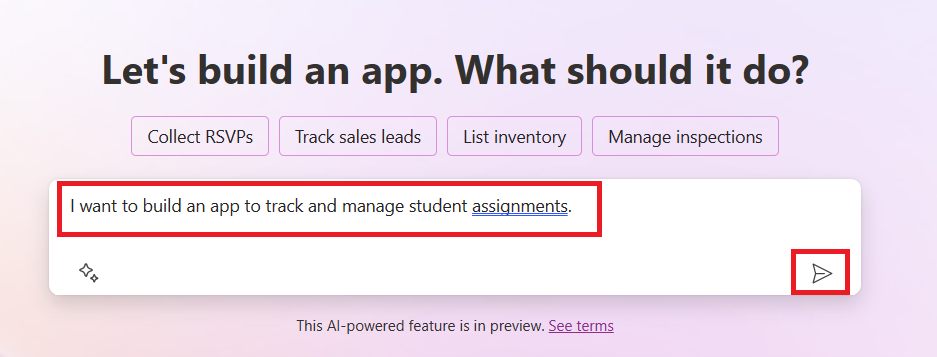

1. AI Copilot akan menyarankan Dataverse Table berisi field yang dibutuhkan untuk menyimpan data yang ingin dilacak, plus contoh data. Kamu lalu bisa menyesuaikan tabel itu lewat langkah-langkah percakapan dengan asisten Copilot.

   > **Penting**: Dataverse adalah platform data yang mendasari Power Platform — platform data low-code untuk menyimpan data aplikasi. Ia layanan terkelola penuh (*fully managed*) yang menyimpan data secara aman di Microsoft Cloud dan disediakan di dalam environment Power Platform-mu. Dataverse punya kapabilitas tata kelola data bawaan seperti klasifikasi data, *data lineage*, kontrol akses granular, dan lainnya. Pelajari Dataverse lebih lanjut [di sini](https://learn.microsoft.com/power-apps/maker/data-platform/data-platform-intro?WT.mc_id=academic-109639-somelezediko).

   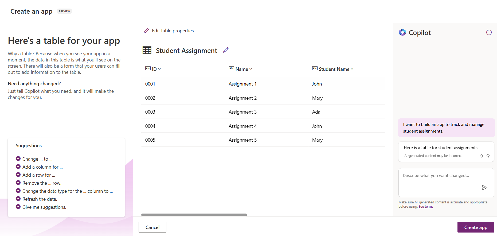

1. Pengajar ingin mengirim email ke siswa yang sudah mengumpulkan tugas agar mereka tahu perkembangan tugasnya. Kamu bisa memakai Copilot untuk menambahkan field baru ke tabel untuk menyimpan email siswa. Misalnya, gunakan prompt berikut: **_I want to add a column to store student email_**. Klik tombol **Send** untuk mengirim prompt ke AI Copilot.

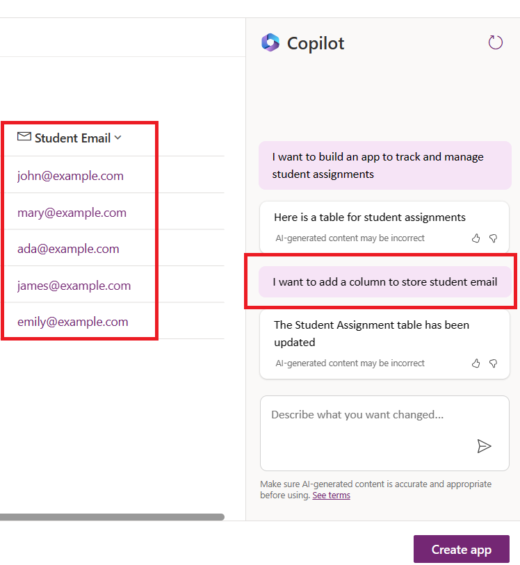

1. AI Copilot membuat field baru, lalu kamu bisa menyesuaikannya sesuai kebutuhan.

1. Setelah selesai dengan tabelnya, klik tombol **Create app** untuk membuat aplikasi.

1. AI Copilot membuat aplikasi Canvas responsif berdasarkan deskripsimu. Kamu bisa menyesuaikannya sesuai kebutuhan.

1. Agar pengajar bisa mengirim email ke siswa, kamu bisa memakai Copilot untuk menambahkan layar (screen) baru ke aplikasi. Misalnya, gunakan prompt berikut: **_I want to add a screen to send emails to students_**. Klik tombol **Send** untuk mengirim prompt ke AI Copilot.

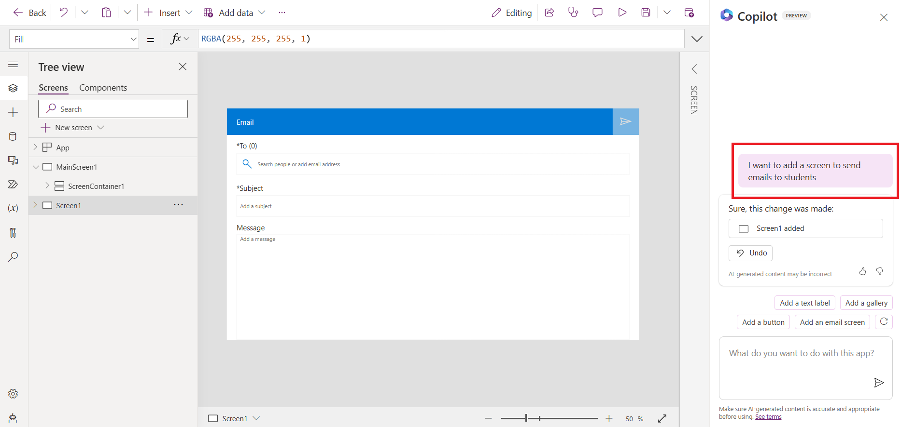

1. AI Copilot membuat layar baru, lalu kamu bisa menyesuaikannya sesuai kebutuhan.

1. Setelah aplikasimu selesai, klik tombol **Save** untuk menyimpannya.

1. Untuk membagikan aplikasi ke para pengajar, klik tombol **Share** lalu klik tombol **Share** sekali lagi. Kamu kemudian bisa membagikan aplikasi dengan memasukkan alamat email mereka.

> **PR untukmu**: Aplikasi yang baru kamu bangun adalah awal yang bagus, tapi masih bisa ditingkatkan. Dengan fitur email tadi, pengajar hanya bisa mengirim email secara manual dengan mengetik alamatnya. Bisakah kamu memakai Copilot untuk membangun otomasi yang mengirim email ke siswa secara otomatis saat mereka mengumpulkan tugas? Petunjuk: dengan prompt yang tepat, kamu bisa memakai Copilot di Power Automate untuk membangunnya.

### Membangun Tabel Informasi Faktur untuk Startup Kita

Tim keuangan startup kita kesulitan melacak faktur (invoice). Mereka memakai spreadsheet, tapi itu makin sulit dikelola seiring bertambahnya jumlah faktur. Mereka memintamu membangun tabel untuk menyimpan, melacak, dan mengelola informasi faktur yang diterima. Tabel ini akan dipakai untuk membangun otomasi yang mengekstrak semua informasi faktur dan menyimpannya ke tabel. Tabel juga harus memungkinkan tim keuangan melihat faktur mana yang sudah dibayar dan mana yang belum.

Power Platform punya platform data yang mendasarinya bernama Dataverse untuk menyimpan data aplikasi dan solusimu. Dataverse menyediakan platform data low-code untuk menyimpan data aplikasi. Ia layanan terkelola penuh yang menyimpan data secara aman di Microsoft Cloud dan disediakan di dalam environment Power Platform-mu, dengan kapabilitas tata kelola data bawaan seperti klasifikasi data, *data lineage*, kontrol akses granular, dan lainnya. Pelajari lebih lanjut [tentang Dataverse di sini](https://learn.microsoft.com/power-apps/maker/data-platform/data-platform-intro?WT.mc_id=academic-109639-somelezediko).

Kenapa kita perlu Dataverse untuk startup kita? Tabel standar dan kustom di Dataverse menyediakan penyimpanan data berbasis cloud yang aman. Tabel memungkinkanmu menyimpan berbagai jenis data — mirip memakai beberapa worksheet dalam satu workbook Excel. Kamu bisa memakai tabel untuk menyimpan data yang spesifik untuk kebutuhan organisasi atau bisnismu. Beberapa manfaat Dataverse bagi startup kita antara lain:

- **Mudah dikelola**: Metadata dan data tersimpan di cloud, jadi kamu tidak perlu memikirkan detail penyimpanan atau pengelolaannya — fokus saja membangun aplikasi dan solusi.

- **Aman**: Dataverse menyediakan penyimpanan cloud yang aman. Kamu bisa mengontrol siapa yang boleh mengakses data di tabelmu dan bagaimana caranya, memakai *role based security* (keamanan berbasis peran).

- **Metadata yang kaya**: Tipe data dan relasi dipakai langsung di dalam Power Apps.

- **Logika dan validasi**: Kamu bisa memakai *business rules*, *calculated fields*, dan aturan validasi untuk menegakkan logika bisnis dan menjaga akurasi data.

Setelah tahu apa itu Dataverse dan kenapa memakainya, mari lihat cara memakai Copilot untuk membuat tabel di Dataverse yang memenuhi kebutuhan tim keuangan kita.

> **Catatan**: Tabel ini akan kamu pakai di bagian berikutnya untuk membangun otomasi yang mengekstrak semua informasi faktur dan menyimpannya ke tabel.

Untuk membuat tabel di Dataverse memakai Copilot, ikuti langkah berikut:

1. Buka layar utama [Power Apps](https://make.powerapps.com?WT.mc_id=academic-105485-koreyst).

2. Pada bilah navigasi kiri, pilih **Tables** lalu klik **Describe the new Table**.

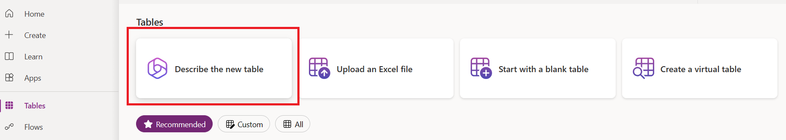

1. Pada layar **Describe the new Table**, gunakan area teks untuk mendeskripsikan tabel yang ingin dibuat. Misalnya, **_I want to create a table to store invoice information_**. Klik tombol **Send** untuk mengirim prompt ke AI Copilot.

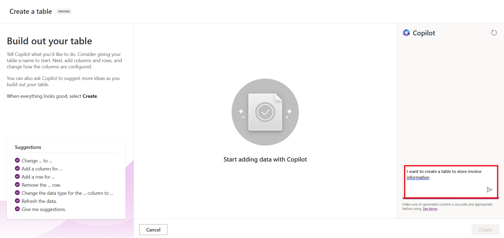

1. AI Copilot akan menyarankan Dataverse Table berisi field yang dibutuhkan untuk menyimpan data yang ingin dilacak, plus contoh data. Kamu lalu bisa menyesuaikan tabel itu lewat langkah-langkah percakapan dengan asisten Copilot.

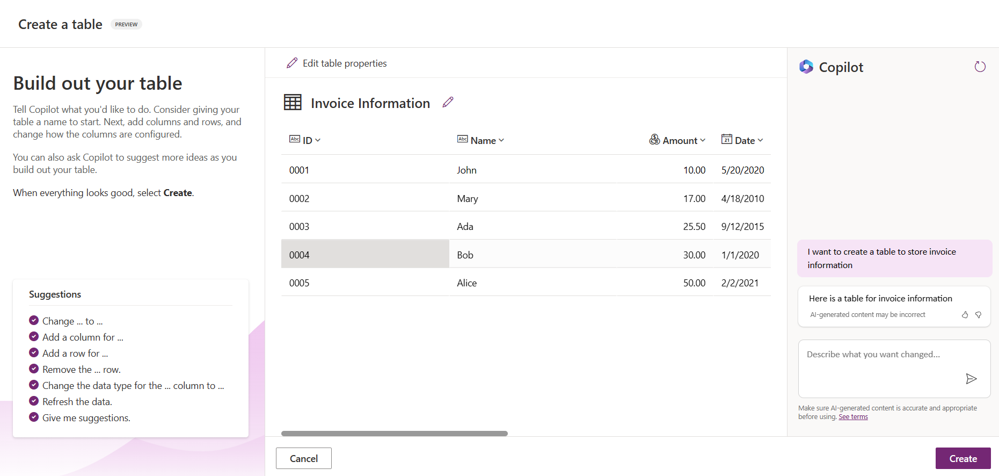

1. Tim keuangan ingin mengirim email ke pemasok (supplier) untuk mengabari status terkini fakturnya. Gunakan Copilot untuk menambahkan field baru penyimpan email pemasok. Misalnya, pakai prompt berikut: **_I want to add a column to store supplier email_**. Klik tombol **Send** untuk mengirim prompt ke AI Copilot.

1. AI Copilot membuat field baru, lalu kamu bisa menyesuaikannya sesuai kebutuhan.

1. Setelah selesai dengan tabelnya, klik tombol **Create** untuk membuat tabel.

## AI Model di Power Platform dengan AI Builder

AI Builder adalah kapabilitas AI low-code di Power Platform yang memungkinkanmu memakai AI Model untuk mengotomatiskan proses dan memprediksi hasil. Dengan AI Builder kamu bisa membawa AI ke aplikasi dan flow yang terhubung ke datamu di Dataverse maupun berbagai sumber data cloud seperti SharePoint, OneDrive, atau Azure.

## Prebuilt AI Model vs Custom AI Model

AI Builder menyediakan dua jenis AI Model: *Prebuilt AI Model* dan *Custom AI Model*. Prebuilt AI Model adalah model AI siap pakai yang dilatih oleh Microsoft dan tersedia di Power Platform. Model-model ini membantumu menambahkan kecerdasan ke aplikasi dan flow tanpa harus mengumpulkan data lalu membangun, melatih, dan mempublikasikan model sendiri. Kamu bisa memakainya untuk mengotomatiskan proses dan memprediksi hasil.

Beberapa Prebuilt AI Model yang tersedia di Power Platform:

- **Key Phrase Extraction**: Mengekstrak frasa kunci dari teks.
- **Language Detection**: Mendeteksi bahasa dari sebuah teks.
- **Sentiment Analysis**: Mendeteksi sentimen positif, negatif, netral, atau campuran dalam teks.
- **Business Card Reader**: Mengekstrak informasi dari kartu nama.
- **Text Recognition**: Mengekstrak teks dari gambar.
- **Object Detection**: Mendeteksi dan mengekstrak objek dari gambar.
- **Document processing**: Mengekstrak informasi dari formulir.
- **Invoice Processing**: Mengekstrak informasi dari faktur.

Dengan Custom AI Model, kamu bisa membawa modelmu sendiri ke AI Builder sehingga berfungsi seperti model kustom AI Builder lainnya — kamu bisa melatihnya dengan datamu sendiri, lalu memakainya untuk mengotomatiskan proses dan memprediksi hasil di Power Apps maupun Power Automate. Saat memakai model sendiri, ada batasan yang berlaku — baca lebih lanjut tentang [batasan-batasan ini](https://learn.microsoft.com/ai-builder/byo-model#limitations?WT.mc_id=academic-105485-koreyst).

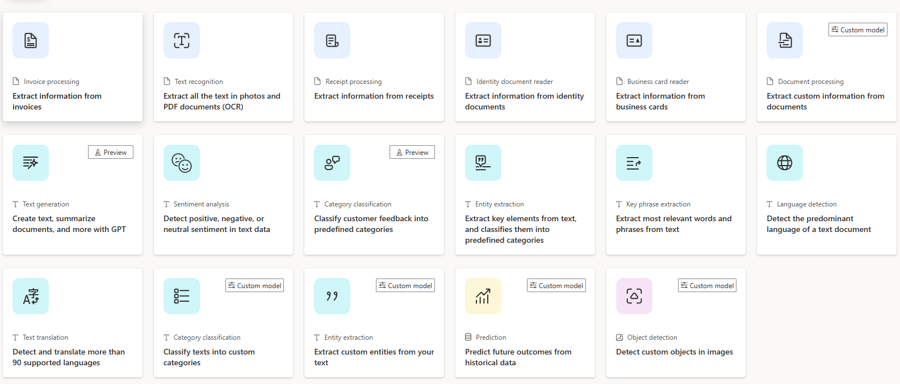

## Tugas #2 - Membangun Flow Pemrosesan Faktur untuk Startup Kita

Tim keuangan kesulitan memproses faktur. Mereka memakai spreadsheet, tapi itu makin sulit dikelola seiring bertambahnya faktur. Mereka memintamu membangun workflow yang membantu memproses faktur memakai AI: mengekstrak informasi dari faktur dan menyimpannya ke tabel Dataverse, lalu mengirim email ke tim keuangan berisi informasi hasil ekstraksi.

Setelah tahu apa itu AI Builder dan kenapa memakainya, mari lihat cara memakai AI Model *Invoice Processing* di AI Builder (yang sudah kita bahas sebelumnya) untuk membangun workflow yang membantu tim keuangan memproses faktur.

Untuk membangun workflow tersebut, ikuti langkah berikut:

1. Buka layar utama [Power Automate](https://make.powerautomate.com?WT.mc_id=academic-105485-koreyst).

2. Gunakan area teks di layar utama untuk mendeskripsikan workflow yang ingin dibangun. Misalnya, **_Process an invoice when it arrives in my mailbox_**. Klik tombol **Send** untuk mengirim prompt ke AI Copilot.

   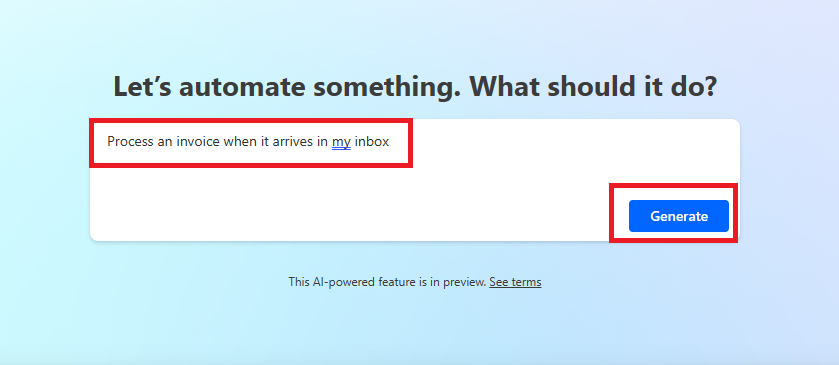

3. AI Copilot menyarankan aksi-aksi yang dibutuhkan untuk tugas yang ingin diotomatiskan. Klik tombol **Next** untuk melanjutkan ke langkah berikutnya.

4. Pada langkah berikutnya, Power Automate memintamu menyiapkan koneksi yang diperlukan flow. Setelah selesai, klik tombol **Create flow** untuk membuat flow.

5. AI Copilot membuat flow, lalu kamu bisa menyesuaikannya sesuai kebutuhan.

6. Perbarui trigger flow: atur **Folder** ke folder tempat faktur akan diterima, misalnya **Inbox**. Klik **Show advanced options** dan atur **Only with Attachments** ke **Yes**. Ini memastikan flow hanya berjalan ketika email dengan lampiran diterima di folder tersebut.

7. Hapus aksi-aksi berikut dari flow karena tidak akan dipakai: **HTML to text**, **Compose**, **Compose 2**, **Compose 3**, dan **Compose 4**.

8. Hapus aksi **Condition** dari flow karena tidak akan dipakai. Hasilnya akan terlihat seperti tangkapan layar berikut:

   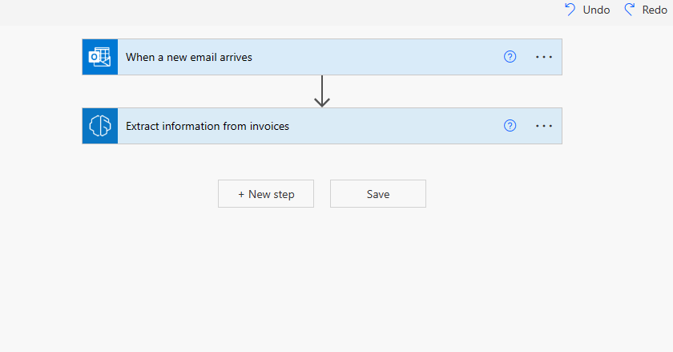

9. Klik tombol **Add an action** dan cari **Dataverse**. Pilih aksi **Add a new row**.

10. Pada aksi **Extract Information from invoices**, perbarui **Invoice File** agar menunjuk ke **Attachment Content** dari email. Ini memastikan flow mengekstrak informasi dari lampiran faktur.

11. Pilih **Table** yang kamu buat sebelumnya, misalnya tabel **Invoice Information**. Pilih *dynamic content* dari aksi sebelumnya untuk mengisi field berikut:

    - ID
    - Amount
    - Date
    - Name
    - Status — atur **Status** ke **Pending**.
    - Supplier Email — gunakan dynamic content **From** dari trigger **When a new email arrives**.

    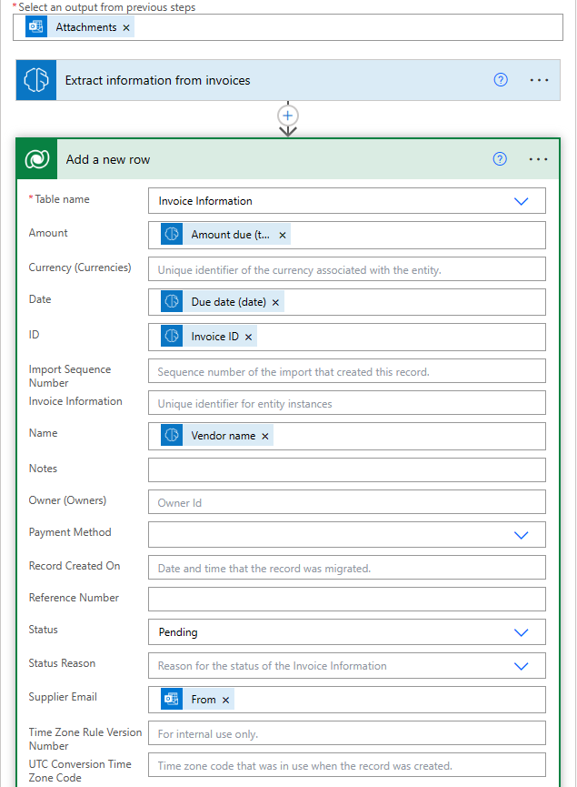

12. Setelah flow selesai, klik tombol **Save** untuk menyimpannya. Kamu bisa mengujinya dengan mengirim email berisi faktur ke folder yang kamu tentukan di trigger.

> **PR untukmu**: Flow yang baru kamu bangun adalah awal yang bagus. Sekarang pikirkan bagaimana membangun otomasi agar tim keuangan bisa mengirim email ke pemasok untuk mengabari status terkini fakturnya. Petunjuk: flow harus berjalan ketika status faktur berubah.

## Memakai AI Model Text Generation di Power Automate

AI Model *Create Text with GPT* di AI Builder memungkinkanmu menghasilkan teks berdasarkan prompt, ditenagai Microsoft Azure OpenAI Service. Dengan kapabilitas ini, kamu bisa menanamkan teknologi GPT (Generative Pre-Trained Transformer) ke aplikasi dan flow untuk membangun beragam alur otomatis dan aplikasi yang kaya insight.

Model GPT menjalani pelatihan ekstensif pada data dalam jumlah besar, sehingga bisa menghasilkan teks yang sangat mirip bahasa manusia ketika diberi prompt. Dipadukan dengan otomasi workflow, model AI seperti GPT bisa dimanfaatkan untuk merampingkan dan mengotomatiskan berbagai macam tugas.

Misalnya, kamu bisa membangun flow yang otomatis menghasilkan teks untuk beragam kebutuhan: draf email, deskripsi produk, dan lainnya. Kamu juga bisa memakai model ini untuk menghasilkan teks bagi berbagai aplikasi, seperti chatbot dan aplikasi layanan pelanggan yang membantu agen merespons pertanyaan pelanggan secara efektif dan efisien.

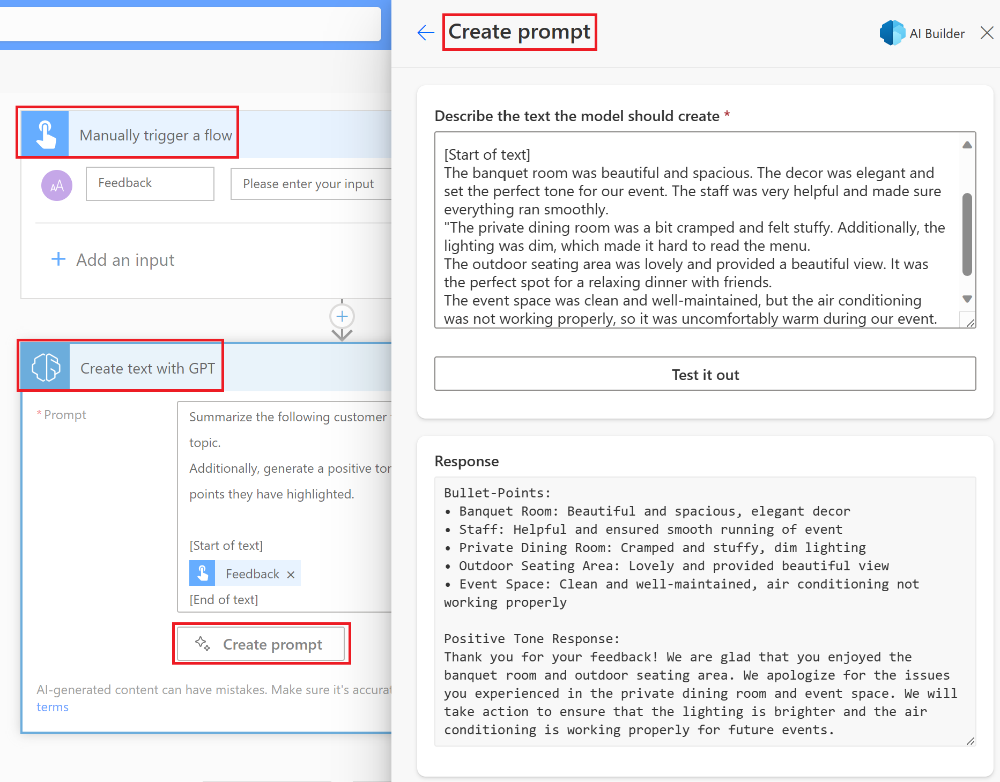

Untuk belajar memakai AI Model ini di Power Automate, ikuti modul [Add intelligence with AI Builder and GPT](https://learn.microsoft.com/training/modules/ai-builder-text-generation/?WT.mc_id=academic-109639-somelezediko).

## Kerja Bagus! Lanjutkan Belajarmu

Setelah menyelesaikan pelajaran ini, cek [koleksi belajar Generative AI](https://aka.ms/genai-collection?WT.mc_id=academic-105485-koreyst) untuk terus menaikkan level pengetahuanmu!

Ingin mengustomisasi dan memaksimalkan Copilot? Jelajahi [Awesome Copilot](https://github.com/github/awesome-copilot?WT.mc_id=academic-105485-koreyst) — koleksi kontribusi komunitas berisi instruksi, agen, skill, dan konfigurasi untuk memaksimalkan GitHub Copilot.

Lanjut ke Lesson 11: kita akan melihat cara [mengintegrasikan Generative AI dengan Function Calling](#11-function-calling)!


---

<a id="10-assignment"></a>

_Tugas (assignment) lesson 10 sudah tercakup pada bagian di atas — lihat "Tugas: Mengelola Tugas Siswa dan Faktur" beserta "Tugas #2" pada materi low-code._

---

<a id="11-function-calling"></a>

# Integrasi dengan Function Calling


Kamu sudah belajar cukup banyak di pelajaran-pelajaran sebelumnya. Tapi kita masih bisa melangkah lebih jauh. Ada beberapa hal yang bisa dibenahi: bagaimana mendapatkan format respons yang lebih konsisten agar lebih mudah diolah di tahap berikutnya (*downstream*), dan bagaimana menambahkan data dari sumber lain untuk memperkaya aplikasi kita.

Kedua masalah itulah yang dibahas bab ini.

## Pendahuluan

Pelajaran ini membahas:

- Apa itu function calling dan kasus penggunaannya.
- Membuat function call memakai Azure OpenAI (catatan: di praktikum kelas kita memakai server Ollama kampus https://ollama.if.unismuh.ac.id tanpa API key dengan model `llama3.2` yang mendukung tools — lihat [praktikum/PRAKTIKUM.md](./praktikum/PRAKTIKUM.md)).
- Cara mengintegrasikan function call ke dalam aplikasi.

## Tujuan Belajar

Di akhir pelajaran ini, kamu akan mampu:

- Menjelaskan tujuan memakai function calling.
- Menyiapkan Function Call memakai Azure OpenAI Service.
- Merancang function call yang efektif sesuai kasus penggunaan aplikasimu.

## Skenario: Meningkatkan Chatbot Kita dengan Function

Di pelajaran ini, kita ingin membangun fitur untuk startup pendidikan kita: chatbot yang membantu pengguna menemukan kursus teknis. Kita akan merekomendasikan kursus yang cocok dengan tingkat keahlian, peran (role) saat ini, dan teknologi yang diminati pengguna.

Untuk mewujudkannya, kita memakai kombinasi:

- `Azure OpenAI` untuk membangun pengalaman chat bagi pengguna (di praktikum kelas, peran ini digantikan server Ollama kampus dengan model `llama3.2`).
- `Microsoft Learn Catalog API` untuk membantu pengguna menemukan kursus sesuai permintaannya.
- `Function Calling` untuk mengambil kueri pengguna dan mengirimkannya ke sebuah function yang melakukan permintaan API.

Sebagai permulaan, mari lihat dulu kenapa kita perlu function calling:

## Kenapa Function Calling

Sebelum ada function calling, respons dari LLM tidak terstruktur dan tidak konsisten. Developer harus menulis kode validasi yang rumit untuk menangani setiap variasi respons. Pengguna juga tidak bisa mendapat jawaban seperti "Bagaimana cuaca terkini di Stockholm?" karena model terbatas pada data saat ia dilatih.

Function Calling adalah fitur Azure OpenAI Service untuk mengatasi keterbatasan berikut:

- **Format respons yang konsisten**. Jika format respons bisa kita kendalikan, respons itu lebih mudah diintegrasikan ke sistem-sistem lain di hilir.
- **Data eksternal**. Kemampuan memakai data dari sumber lain milik aplikasi di dalam konteks chat.

## Mengilustrasikan Masalah lewat Skenario

> Kami sarankan memakai [notebook yang disertakan](./src/11-function-calling/python/aoai-assignment.ipynb) kalau kamu ingin menjalankan skenario di bawah. Kamu juga boleh sekadar membaca, karena di sini kita mencoba mengilustrasikan masalah yang bisa diatasi oleh function. (Catatan: notebook ini memakai Azure OpenAI; di praktikum kelas kita memakai server Ollama kampus — lihat [praktikum/PRAKTIKUM.md](./praktikum/PRAKTIKUM.md).)

Mari lihat contoh yang mengilustrasikan masalah format respons:

Misalkan kita ingin membuat database data siswa supaya bisa menyarankan kursus yang tepat untuk mereka. Di bawah ini ada dua deskripsi siswa yang isinya sangat mirip.

1. Buat koneksi ke resource Azure OpenAI kita:

   ```python
   import os
   import json
   from openai import OpenAI
   from dotenv import load_dotenv
   load_dotenv()

   # The Responses API is served from the Azure OpenAI (Microsoft Foundry) v1
   # endpoint, so we point the OpenAI client at <your-endpoint>/openai/v1/.
   endpoint = os.environ['AZURE_OPENAI_ENDPOINT']
   client = OpenAI(
   api_key=os.environ['AZURE_OPENAI_API_KEY'],
   base_url=f"{endpoint.rstrip('/')}/openai/v1/",
   )

   deployment=os.environ['AZURE_OPENAI_DEPLOYMENT']
   ```

   Di atas adalah kode Python untuk mengonfigurasi koneksi ke Azure OpenAI. Karena memakai endpoint v1, kita hanya perlu mengatur `api_key` dan `base_url` (tanpa `api_version`).

1. Buat dua deskripsi siswa memakai variabel `student_1_description` dan `student_2_description`.

   ```python
   student_1_description="Emily Johnson is a sophomore majoring in computer science at Duke University. She has a 3.7 GPA. Emily is an active member of the university's Chess Club and Debate Team. She hopes to pursue a career in software engineering after graduating."

   student_2_description = "Michael Lee is a sophomore majoring in computer science at Stanford University. He has a 3.8 GPA. Michael is known for his programming skills and is an active member of the university's Robotics Club. He hopes to pursue a career in artificial intelligence after finishing his studies."
   ```

   Kita ingin mengirim kedua deskripsi siswa di atas ke LLM untuk mem-parsing datanya. Data itu nantinya bisa dipakai aplikasi kita, dikirim ke API, atau disimpan di database.

1. Buat dua prompt identik yang menginstruksikan LLM informasi apa yang kita butuhkan:

   ```python
   prompt1 = f'''
   Please extract the following information from the given text and return it as a JSON object:

   name
   major
   school
   grades
   club

   This is the body of text to extract the information from:
   {student_1_description}
   '''

   prompt2 = f'''
   Please extract the following information from the given text and return it as a JSON object:

   name
   major
   school
   grades
   club

   This is the body of text to extract the information from:
   {student_2_description}
   '''
   ```

   Kedua prompt di atas menginstruksikan LLM untuk mengekstrak informasi dan mengembalikan respons dalam format JSON.

1. Setelah menyiapkan prompt dan koneksi ke Azure OpenAI, kita kirim prompt ke LLM memakai `client.responses.create`. Prompt disimpan di variabel `input` dengan role `user` — meniru pesan pengguna yang diketik ke chatbot.

   ```python
   # response from prompt one
   openai_response1 = client.responses.create(
   model=deployment,
   input = [{'role': 'user', 'content': prompt1}],
   store=False,
   )
   openai_response1.output_text

   # response from prompt two
   openai_response2 = client.responses.create(
   model=deployment,
   input = [{'role': 'user', 'content': prompt2}],
   store=False,
   )
   openai_response2.output_text
   ```

Sekarang kita bisa mengirim kedua permintaan ke LLM dan memeriksa respons yang diterima lewat `openai_response1.output_text`.

1. Terakhir, kita ubah respons ke format JSON dengan memanggil `json.loads`:

   ```python
   # Loading the response as a JSON object
   json_response1 = json.loads(openai_response1.output_text)
   json_response1
   ```

   Respons 1:

   ```json
   {
     "name": "Emily Johnson",
     "major": "computer science",
     "school": "Duke University",
     "grades": "3.7",
     "club": "Chess Club"
   }
   ```

   Respons 2:

   ```json
   {
     "name": "Michael Lee",
     "major": "computer science",
     "school": "Stanford University",
     "grades": "3.8 GPA",
     "club": "Robotics Club"
   }
   ```

   Meski prompt-nya sama dan deskripsinya mirip, format nilai properti `Grades` bisa berbeda-beda — kadang `3.7`, kadang `3.7 GPA`.

   Ini terjadi karena LLM menerima data tak terstruktur (prompt tertulis) dan mengembalikan data yang juga tak terstruktur. Padahal kita butuh format terstruktur agar tahu apa yang diharapkan saat menyimpan atau memakai data ini.

Lalu bagaimana menyelesaikan masalah format ini? Dengan function calling, kita bisa memastikan menerima kembali data yang terstruktur. Saat memakai function calling, LLM sebenarnya **tidak** memanggil atau menjalankan function apa pun. Kita hanya membuat struktur yang harus diikuti LLM dalam responsnya, lalu memakai respons terstruktur itu untuk menentukan function mana yang dijalankan di aplikasi kita.

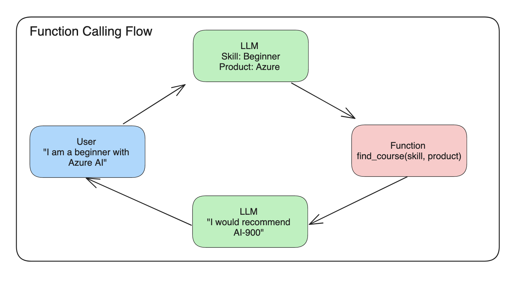

Hasil kembalian function itu lalu kita kirim balik ke LLM, dan LLM merespons dengan bahasa alami untuk menjawab kueri pengguna.

## Kasus Penggunaan Function Call

Ada banyak kasus di mana function call bisa meningkatkan aplikasimu, misalnya:

- **Memanggil Tool Eksternal**. Chatbot pandai menjawab pertanyaan pengguna. Dengan function calling, chatbot bisa memakai pesan pengguna untuk menyelesaikan tugas tertentu. Misalnya, siswa bisa meminta chatbot: "Kirim email ke dosenku bahwa aku butuh bimbingan tambahan di mata kuliah ini" — yang memicu function call `send_email(to: string, body: string)`.

- **Membuat Query API atau Database**. Pengguna bisa mencari informasi dengan bahasa alami yang lalu dikonversi menjadi kueri atau permintaan API terformat. Contoh: guru bertanya "Siapa saja siswa yang sudah menyelesaikan tugas terakhir?" — yang memanggil function `get_completed(student_name: string, assignment: int, current_status: string)`.

- **Membuat Data Terstruktur**. Pengguna bisa mengambil blok teks atau CSV dan memakai LLM untuk mengekstrak informasi penting darinya. Misalnya, siswa mengubah artikel Wikipedia tentang perjanjian damai menjadi kartu belajar (flashcard) AI, lewat function `get_important_facts(agreement_name: string, date_signed: string, parties_involved: list)`.

## Membuat Function Call Pertamamu

Proses membuat function call terdiri dari 3 langkah utama:

1. **Memanggil** Responses API dengan daftar function (tools) dan pesan pengguna.
2. **Membaca** respons model untuk melakukan aksi, yaitu mengeksekusi function atau panggilan API.
3. **Memanggil** Responses API sekali lagi dengan hasil dari function-mu, agar informasi itu dipakai untuk menyusun respons ke pengguna.

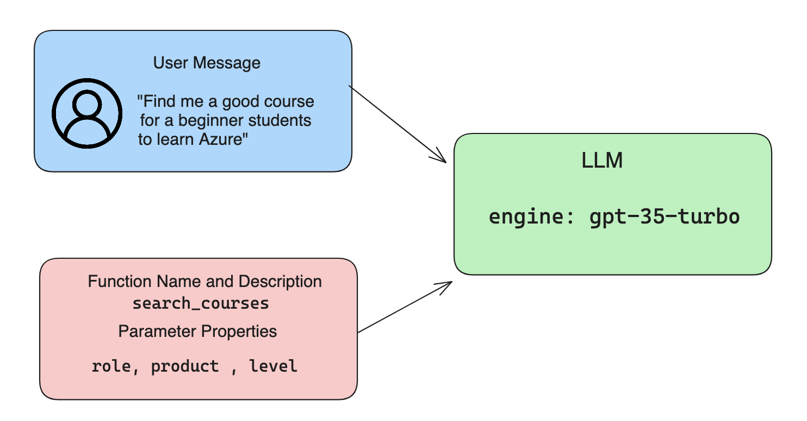

### Langkah 1 - Membuat Messages

Langkah pertama adalah membuat pesan pengguna. Nilainya bisa diambil secara dinamis dari sebuah input teks, atau kamu tetapkan langsung di sini. Kalau ini pertama kalinya kamu memakai Responses API: kita perlu mendefinisikan `role` dan `content` dari pesan.

`role` bisa berupa `system` (membuat aturan), `assistant` (model), atau `user` (pengguna akhir). Untuk function calling, kita pakai `user` beserta contoh pertanyaannya.

```python
messages= [ {"role": "user", "content": "Find me a good course for a beginner student to learn Azure."} ]
```

Dengan memberi role yang berbeda-beda, LLM jadi tahu mana ucapan sistem dan mana ucapan pengguna — ini membantu membangun riwayat percakapan yang bisa dimanfaatkan LLM.

### Langkah 2 - Membuat Functions

Berikutnya kita definisikan sebuah function beserta parameternya. Di sini kita memakai satu function saja bernama `search_courses`, tapi kamu bisa membuat lebih dari satu.

> **Penting**: Function disertakan dalam pesan sistem ke LLM dan ikut dihitung dalam jumlah token yang tersedia.

Di bawah ini, function dibuat sebagai array berisi item-item. Setiap item adalah sebuah tool dalam format flat Responses API dengan properti `type`, `name`, `description`, dan `parameters`:

```python
functions = [
   {
      "type":"function",
      "name":"search_courses",
      "description":"Retrieves courses from the search index based on the parameters provided",
      "parameters":{
         "type":"object",
         "properties":{
            "role":{
               "type":"string",
               "description":"The role of the learner (i.e. developer, data scientist, student, etc.)"
            },
            "product":{
               "type":"string",
               "description":"The product that the lesson is covering (i.e. Azure, Power BI, etc.)"
            },
            "level":{
               "type":"string",
               "description":"The level of experience the learner has prior to taking the course (i.e. beginner, intermediate, advanced)"
            }
         },
         "required":[
            "role"
         ]
      }
   }
]
```

Mari jabarkan tiap bagian dari definisi function di atas:

- `name` - Nama function yang ingin kita panggil.
- `description` - Deskripsi cara kerja function. Di sini penting untuk spesifik dan jelas.
- `parameters` - Daftar nilai dan format yang kamu ingin model hasilkan dalam responsnya. Array parameters terdiri dari item-item dengan properti berikut:
  1.  `type` - Tipe data tempat properti akan disimpan.
  1.  `properties` - Daftar nilai spesifik yang akan dipakai model dalam responsnya.
      1. `name` - Kunci (key) berupa nama properti yang dipakai model dalam respons terformatnya, misalnya `product`.
      1. `type` - Tipe data properti ini, misalnya `string`.
      1. `description` - Deskripsi properti yang bersangkutan.

Ada juga properti opsional `required` - properti yang wajib ada agar function call bisa diselesaikan.

### Langkah 3 - Melakukan Function Call

Setelah mendefinisikan function, kita sertakan ia dalam panggilan ke Responses API dengan menambahkan `tools` ke request — dalam hal ini `tools=functions`.

Ada juga opsi mengatur `tool_choice` ke `auto`, artinya kita membiarkan LLM sendiri yang memutuskan function mana yang dipanggil berdasarkan pesan pengguna, alih-alih kita tentukan manual.

Berikut kode yang memanggil `client.responses.create` — perhatikan `tools=functions` dan `tool_choice="auto"`, yang memberi LLM pilihan kapan memanggil function yang kita sediakan:

```python
response = client.responses.create(model=deployment,
                                        input=messages,
                                        tools=functions,
                                        tool_choice="auto",
                                        store=False)

print(response.output)
```

Respons yang kembali sekarang berisi item `function_call` di dalam `response.output` yang terlihat seperti ini:

```json
{
  "type": "function_call",
  "name": "search_courses",
  "call_id": "call_abc123",
  "arguments": "{\n  \"role\": \"student\",\n  \"product\": \"Azure\",\n  \"level\": \"beginner\"\n}"
}
```

Di sini terlihat function `search_courses` dipanggil beserta argumennya, seperti tercantum di properti `arguments` dalam respons JSON.

Kesimpulannya: LLM mampu menemukan data yang cocok dengan argumen function karena ia mengekstraknya dari nilai yang diberikan ke parameter `input` pada panggilan Responses API. Sebagai pengingat, ini nilai `messages`-nya:

```python
messages= [ {"role": "user", "content": "Find me a good course for a beginner student to learn Azure."} ]
```

Seperti terlihat, `student`, `Azure`, dan `beginner` diekstrak dari `messages` dan dijadikan input function. Memakai function dengan cara ini sangat berguna untuk mengekstrak informasi dari prompt sekaligus memberi struktur pada LLM dan mendapatkan fungsionalitas yang bisa dipakai ulang.

Selanjutnya, mari lihat cara memakainya di dalam aplikasi kita.

## Mengintegrasikan Function Call ke dalam Aplikasi

Setelah menguji respons terformat dari LLM, sekarang kita integrasikan ke dalam aplikasi.

### Mengelola Alurnya

Untuk mengintegrasikannya ke aplikasi, ikuti langkah berikut:

1. Pertama, panggil layanan OpenAI dan ekstrak item function call dari `output` respons.

   ```python
   response_items = response.output
   tool_calls = [item for item in response_items if item.type == "function_call"]
   ```

1. Sekarang definisikan function yang akan memanggil Microsoft Learn API untuk mendapatkan daftar kursus:

   ```python
   import requests

   def search_courses(role, product, level):
     url = "https://learn.microsoft.com/api/catalog/"
     params = {
        "role": role,
        "product": product,
        "level": level
     }
     response = requests.get(url, params=params)
     modules = response.json()["modules"]
     results = []
     for module in modules[:5]:
        title = module["title"]
        url = module["url"]
        results.append({"title": title, "url": url})
     return str(results)
   ```

   Perhatikan: sekarang kita membuat function Python sungguhan yang namanya dipetakan ke nama-nama function di variabel `functions`. Kita juga melakukan panggilan API eksternal sungguhan untuk mengambil data yang dibutuhkan — dalam hal ini ke Microsoft Learn API untuk mencari modul pelatihan.

Oke, kita sudah membuat variabel `functions` dan function Python padanannya. Lalu bagaimana memberi tahu LLM cara memetakan keduanya agar function Python kita terpanggil?

1. Untuk mengetahui apakah function Python perlu dipanggil, kita periksa respons LLM: apakah ada item `function_call` di dalamnya, lalu panggil function yang ditunjuk. Begini cara melakukan pengecekan tersebut:

   ```python
   # Check if the model wants to call a function
   if tool_calls:
    for tool_call in tool_calls:
     print("Recommended Function call:")
     print(tool_call.name)
     print()

     # Call the function.
     function_name = tool_call.name

     available_functions = {
             "search_courses": search_courses,
     }
     function_to_call = available_functions[function_name]

     function_args = json.loads(tool_call.arguments)
     function_response = function_to_call(**function_args)

     print("Output of function call:")
     print(function_response)
     print(type(function_response))

     # Add the function call and its result back to the conversation.
     # The model's function_call item must be appended before its output.
     messages.append(tool_call)  # the assistant's function_call item
     messages.append( # the function result
         {
             "type": "function_call_output",
             "call_id": tool_call.call_id,
             "output": function_response,
         }
     )
   ```

   Tiga baris ini yang memastikan kita mengekstrak nama function, argumennya, lalu melakukan pemanggilan:

   ```python
   function_to_call = available_functions[function_name]

   function_args = json.loads(tool_call.arguments)
   function_response = function_to_call(**function_args)
   ```

   Berikut keluaran dari menjalankan kode kita:

   **Keluaran**

   ```Recommended Function call:
   {
     "name": "search_courses",
     "arguments": "{\n  \"role\": \"student\",\n  \"product\": \"Azure\",\n  \"level\": \"beginner\"\n}"
   }

   Output of function call:
   [{'title': 'Describe concepts of cryptography', 'url': 'https://learn.microsoft.com/training/modules/describe-concepts-of-cryptography/?
   WT.mc_id=api_CatalogApi'}, {'title': 'Introduction to audio classification with TensorFlow', 'url': 'https://learn.microsoft.com/en-
   us/training/modules/intro-audio-classification-tensorflow/?WT.mc_id=api_CatalogApi'}, {'title': 'Design a Performant Data Model in Azure SQL
   Database with Azure Data Studio', 'url': 'https://learn.microsoft.com/training/modules/design-a-data-model-with-ads/?
   WT.mc_id=api_CatalogApi'}, {'title': 'Getting started with the Microsoft Cloud Adoption Framework for Azure', 'url':
   'https://learn.microsoft.com/training/modules/cloud-adoption-framework-getting-started/?WT.mc_id=api_CatalogApi'}, {'title': 'Set up the
   Rust development environment', 'url': 'https://learn.microsoft.com/training/modules/rust-set-up-environment/?WT.mc_id=api_CatalogApi'}]
   <class 'str'>
   ```

1. Sekarang kirim `messages` yang sudah diperbarui ke LLM agar kita menerima respons bahasa alami, bukan respons berformat JSON API.

   ```python
   print("Messages in next request:")
   print(messages)
   print()

   second_response = client.responses.create(
      input=messages,
      model=deployment,
      tool_choice="auto",
      tools=functions,
      temperature=0,
      store=False,
         )  # get a new response from the model where it can see the function response


   print(second_response.output_text)
   ```

   **Keluaran**

   ```text
   I found some good courses for beginner students to learn Azure:

   1. [Describe concepts of cryptography](https://learn.microsoft.com/training/modules/describe-concepts-of-cryptography/?WT.mc_id=api_CatalogApi)
   2. [Introduction to audio classification with TensorFlow](https://learn.microsoft.com/training/modules/intro-audio-classification-tensorflow/?WT.mc_id=api_CatalogApi)
   3. [Design a Performant Data Model in Azure SQL Database with Azure Data Studio](https://learn.microsoft.com/training/modules/design-a-data-model-with-ads/?WT.mc_id=api_CatalogApi)
   4. [Getting started with the Microsoft Cloud Adoption Framework for Azure](https://learn.microsoft.com/training/modules/cloud-adoption-framework-getting-started/?WT.mc_id=api_CatalogApi)
   5. [Set up the Rust development environment](https://learn.microsoft.com/training/modules/rust-set-up-environment/?WT.mc_id=api_CatalogApi)

   You can click on the links to access the courses.
   ```

## Tugas

Untuk melanjutkan belajar Function Calling Azure OpenAI (di praktikum kelas: server Ollama kampus, lihat [praktikum/PRAKTIKUM.md](./praktikum/PRAKTIKUM.md)), kamu bisa membangun:

- Parameter tambahan pada function yang mungkin membantu pengguna menemukan lebih banyak kursus.
- Function call lain yang mengambil informasi tambahan dari pengguna, misalnya bahasa ibunya.
- Penanganan error (error handling) ketika function call dan/atau panggilan API tidak mengembalikan kursus yang cocok.

Petunjuk: Ikuti halaman [dokumentasi referensi Learn API](https://learn.microsoft.com/training/support/catalog-api-developer-reference?WT.mc_id=academic-105485-koreyst) untuk melihat bagaimana dan di mana data ini tersedia.

## Kerja Bagus! Lanjutkan Perjalananmu

Setelah menyelesaikan pelajaran ini, cek [koleksi belajar Generative AI](https://aka.ms/genai-collection?WT.mc_id=academic-105485-koreyst) untuk terus menaikkan level pengetahuanmu!

Lanjut ke Lesson 12: kita akan melihat cara [merancang UX untuk aplikasi AI](#12-ux-ai)!


---

<a id="12-ux-ai"></a>

# Merancang UX untuk Aplikasi AI


User experience (UX, pengalaman pengguna) adalah aspek yang sangat penting dalam membangun aplikasi. Pengguna harus bisa memakai aplikasimu secara efisien untuk menyelesaikan tugasnya. Efisien saja tidak cukup — aplikasi juga harus dirancang agar bisa dipakai semua orang alias _accessible_ (aksesibel). Bab ini berfokus pada area tersebut, supaya kamu berujung merancang aplikasi yang orang *bisa* dan *mau* pakai.

> Catatan kelas: bagian UX ini bersifat wawasan/teori — tidak ada praktikum untuk bagian ini.

## Pendahuluan

User experience adalah bagaimana pengguna berinteraksi dengan dan memakai suatu produk atau layanan — entah itu sistem, tool, atau desain. Saat mengembangkan aplikasi AI, developer tidak hanya memastikan pengalaman pengguna yang efektif, tapi juga etis. Di pelajaran ini kita membahas cara membangun aplikasi Artificial Intelligence (AI) yang menjawab kebutuhan pengguna.

Pelajaran ini mencakup area berikut:

- Pengenalan User Experience dan Memahami Kebutuhan Pengguna
- Merancang Aplikasi AI untuk Kepercayaan (Trust) dan Transparansi
- Merancang Aplikasi AI untuk Kolaborasi dan Umpan Balik (Feedback)

## Tujuan Belajar

Setelah mengikuti pelajaran ini, kamu akan mampu:

- Memahami cara membangun aplikasi AI yang memenuhi kebutuhan pengguna.
- Merancang aplikasi AI yang mendorong kepercayaan dan kolaborasi.

### Prasyarat

Luangkan waktu membaca lebih lanjut tentang [user experience dan design thinking.](https://learn.microsoft.com/training/modules/ux-design?WT.mc_id=academic-105485-koreyst)

## Pengenalan User Experience dan Memahami Kebutuhan Pengguna

Di startup pendidikan fiktif kita, ada dua pengguna utama: guru dan siswa. Masing-masing punya kebutuhan unik. *User-centered design* (desain berpusat pada pengguna) memprioritaskan pengguna, memastikan produk relevan dan bermanfaat bagi orang yang dituju.

Aplikasi harus **useful (berguna), reliable (andal), accessible (aksesibel), dan pleasant (menyenangkan)** untuk memberikan pengalaman pengguna yang baik.

### Usability (Kebergunaan)

Berguna berarti aplikasi punya fungsionalitas yang sesuai tujuannya, misalnya mengotomatiskan proses penilaian atau menghasilkan flashcard untuk belajar ulang. Aplikasi yang mengotomatiskan penilaian harus mampu memberi skor pada pekerjaan siswa secara akurat dan efisien berdasarkan kriteria yang sudah ditetapkan. Begitu pula aplikasi penghasil flashcard: ia harus mampu membuat pertanyaan yang relevan dan beragam berdasarkan datanya.

### Reliability (Keandalan)

Andal berarti aplikasi bisa menjalankan tugasnya secara konsisten dan tanpa error. Namun AI — sama seperti manusia — tidak sempurna dan bisa saja keliru. Aplikasi mungkin menemui error atau situasi tak terduga yang memerlukan intervensi atau koreksi manusia. Bagaimana caramu menangani error? Di bagian akhir pelajaran ini kita membahas bagaimana sistem dan aplikasi AI dirancang untuk kolaborasi dan umpan balik.

### Accessibility (Aksesibilitas)

Aksesibel berarti memperluas pengalaman pengguna ke pengguna dengan berbagai kemampuan, termasuk penyandang disabilitas, memastikan tidak ada yang tertinggal. Dengan mengikuti pedoman dan prinsip aksesibilitas, solusi AI menjadi lebih inklusif, lebih mudah dipakai, dan lebih bermanfaat untuk semua pengguna.

### Pleasant (Menyenangkan)

Menyenangkan berarti aplikasi nyaman dan nikmat dipakai. Pengalaman pengguna yang menarik berdampak positif: pengguna terdorong kembali memakai aplikasi, dan pendapatan bisnis pun meningkat.

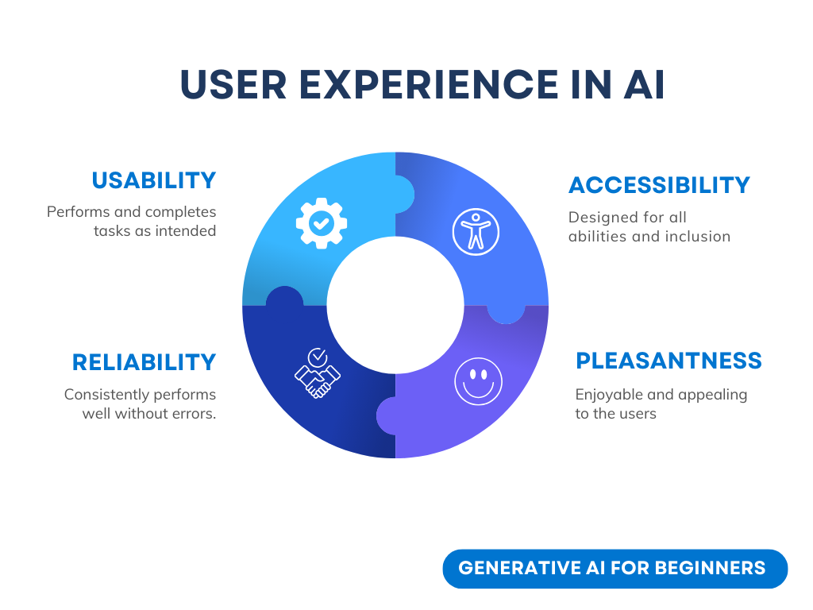

Tidak semua tantangan bisa diselesaikan dengan AI. Peran AI adalah memperkuat (augment) pengalaman pengguna — entah mengotomatiskan tugas manual atau mempersonalisasi pengalaman pengguna.

## Merancang Aplikasi AI untuk Kepercayaan dan Transparansi

Membangun kepercayaan (trust) sangat krusial saat merancang aplikasi AI. Kepercayaan memastikan pengguna yakin aplikasi akan menyelesaikan pekerjaan, memberikan hasil secara konsisten, dan hasilnya memang yang dibutuhkan pengguna. Risiko di area ini adalah *mistrust* (ketidakpercayaan) dan *overtrust* (kepercayaan berlebihan). Mistrust terjadi ketika pengguna hampir atau sama sekali tidak percaya pada sistem AI — akibatnya aplikasimu ditolak. Overtrust terjadi ketika pengguna melebih-lebihkan kemampuan sistem AI sehingga terlalu percaya. Contohnya, pada sistem penilaian otomatis, overtrust bisa membuat guru tidak memeriksa ulang sebagian lembar jawaban untuk memastikan sistemnya bekerja benar. Akibatnya nilai siswa bisa tidak adil atau tidak akurat, dan kesempatan memberi umpan balik serta perbaikan pun hilang.

Dua cara memastikan kepercayaan berada tepat di pusat desain adalah *explainability* (keterjelasan) dan *control* (kendali).

### Explainability (Keterjelasan)

Ketika AI ikut menopang keputusan — misalnya menyampaikan pengetahuan ke generasi mendatang — penting bagi guru dan orang tua memahami bagaimana keputusan AI dibuat. Inilah explainability: memahami bagaimana aplikasi AI mengambil keputusan. Merancang untuk explainability termasuk menambahkan detail yang menyoroti bagaimana AI sampai pada keluarannya. Audiens juga harus sadar bahwa keluaran itu dihasilkan AI, bukan manusia. Misalnya, alih-alih menulis "Mulai mengobrol dengan tutormu sekarang", tulis "Gunakan tutor AI yang menyesuaikan kebutuhanmu dan membantumu belajar sesuai ritmemu."

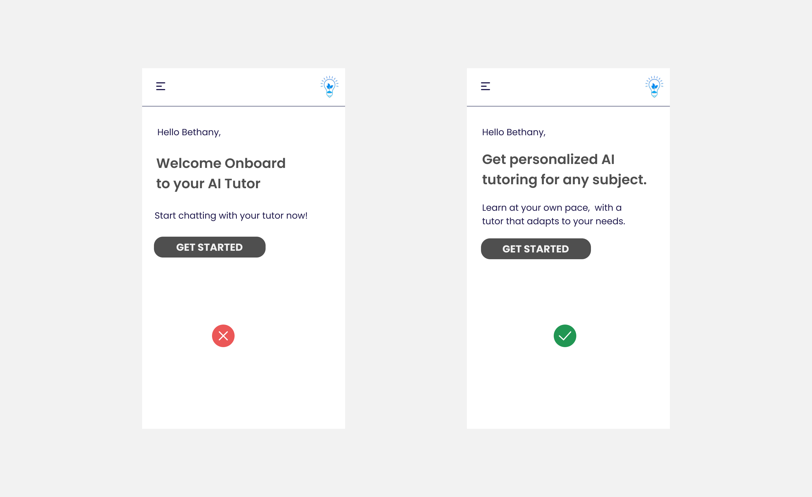

Contoh lain adalah bagaimana AI memakai data pengguna dan data pribadi. Misalnya, pengguna dengan persona siswa mungkin punya batasan sesuai personanya: AI tidak boleh membocorkan jawaban soal, tapi bisa membimbing pengguna berpikir bagaimana memecahkan masalahnya.

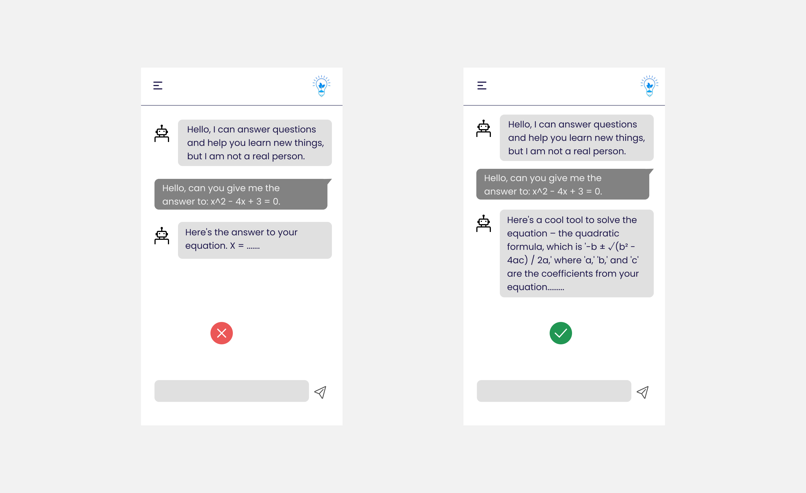

Bagian kunci terakhir dari explainability adalah penyederhanaan penjelasan. Siswa dan guru mungkin bukan pakar AI, karena itu penjelasan tentang apa yang bisa dan tidak bisa dilakukan aplikasi harus disederhanakan dan mudah dipahami.

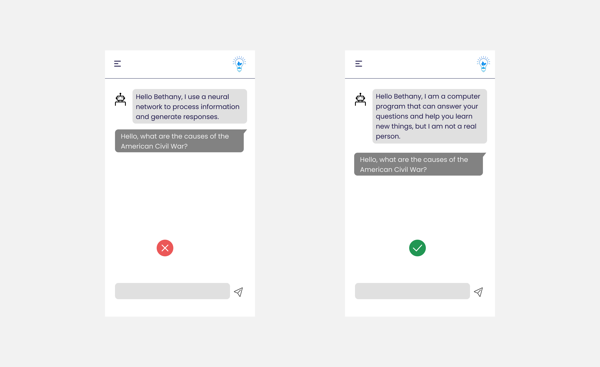

### Control (Kendali)

Generative AI menciptakan kolaborasi antara AI dan pengguna — misalnya pengguna bisa memodifikasi prompt untuk hasil berbeda. Selain itu, setelah keluaran dihasilkan, pengguna harus bisa memodifikasi hasilnya, memberi mereka rasa kendali. Contoh: saat memakai Microsoft Copilot (dulu Bing Chat), kamu bisa menyetel prompt berdasarkan format, nada (tone), dan panjang. Kamu juga bisa menambahkan perubahan dan memodifikasi keluarannya seperti di bawah:

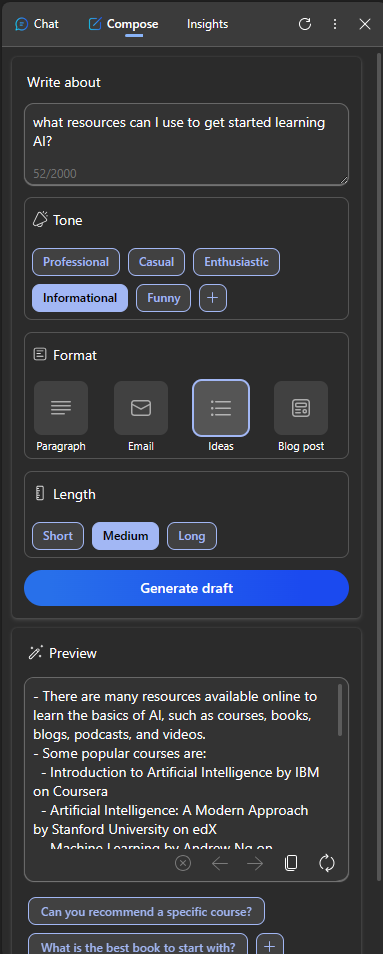

Fitur lain di Microsoft Copilot yang memberi pengguna kendali adalah kemampuan *opt-in* dan *opt-out* terhadap data yang dipakai AI. Untuk aplikasi sekolah, seorang siswa mungkin ingin memakai catatannya sendiri sekaligus materi dari guru sebagai bahan belajar ulang.

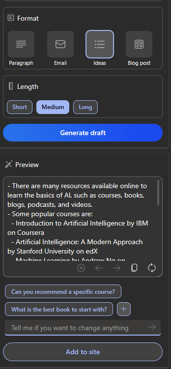

> Saat merancang aplikasi AI, kesengajaan (intentionality) adalah kunci agar pengguna tidak overtrust dan tidak menaruh ekspektasi yang tidak realistis pada kemampuannya. Salah satu caranya: ciptakan "gesekan" (friction) antara prompt dan hasil — ingatkan pengguna bahwa ini AI, bukan sesama manusia.

## Merancang Aplikasi AI untuk Kolaborasi dan Umpan Balik

Seperti disebut sebelumnya, generative AI menciptakan kolaborasi antara pengguna dan AI. Sebagian besar interaksinya: pengguna memasukkan prompt, AI menghasilkan keluaran. Bagaimana kalau keluarannya salah? Bagaimana aplikasi menangani error kalau terjadi? Apakah AI menyalahkan pengguna, atau meluangkan waktu menjelaskan errornya?

Aplikasi AI seharusnya dibangun untuk menerima dan memberi umpan balik. Ini tidak hanya membantu sistem AI membaik, tapi juga membangun kepercayaan pengguna. *Feedback loop* (lingkar umpan balik) harus disertakan dalam desain — contohnya sesederhana tombol jempol naik/turun (thumbs up/down) pada keluaran.

Cara lain menanganinya adalah mengomunikasikan dengan jelas kapabilitas dan batasan sistem. Ketika pengguna keliru meminta sesuatu di luar kemampuan AI, harus ada cara menanganinya juga, seperti ditunjukkan di bawah.

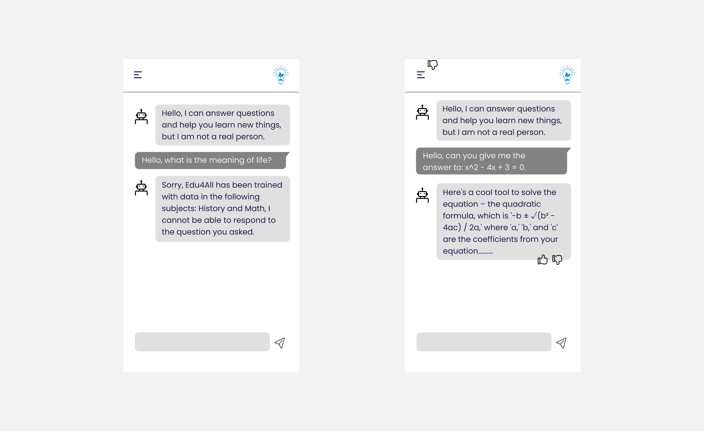

Error sistem umum terjadi pada aplikasi — misalnya pengguna butuh informasi di luar cakupan AI, atau aplikasi punya batas jumlah pertanyaan/mata pelajaran yang bisa dirangkum. Contoh: aplikasi AI yang dilatih dengan data mata pelajaran terbatas (misalnya Sejarah dan Matematika) mungkin tidak bisa menangani pertanyaan Geografi. Untuk memitigasinya, sistem AI bisa memberi respons seperti: "Maaf, produk kami dilatih dengan data pada mata pelajaran berikut....., saya tidak bisa menjawab pertanyaan yang kamu ajukan."

Aplikasi AI tidak sempurna, karena itu pasti pernah keliru. Saat merancang aplikasimu, pastikan kamu menyediakan ruang untuk umpan balik dari pengguna dan penanganan error dengan cara yang sederhana dan mudah dijelaskan.

## Tugas

Ambil aplikasi AI apa pun yang sudah kamu bangun sejauh ini, lalu pertimbangkan menerapkan langkah-langkah berikut:

- **Pleasant (menyenangkan):** Pikirkan bagaimana membuat aplikasimu lebih menyenangkan. Apakah kamu menambahkan penjelasan di mana-mana? Apakah kamu mendorong pengguna untuk bereksplorasi? Bagaimana kamu menyusun kata pada pesan error?

- **Usability (kebergunaan):** Saat membangun aplikasi web, pastikan aplikasimu bisa dinavigasi baik dengan mouse maupun keyboard.

- **Kepercayaan dan transparansi:** Jangan percaya sepenuhnya pada AI dan keluarannya — pikirkan bagaimana menambahkan manusia dalam proses (human in the loop) untuk memverifikasi keluaran. Pertimbangkan dan terapkan juga cara-cara lain mencapai kepercayaan dan transparansi.

- **Control (kendali):** Beri pengguna kendali atas data yang mereka serahkan ke aplikasi. Implementasikan cara pengguna bisa opt-in dan opt-out dari pengumpulan data di aplikasi AI.

<!-- ## [Post-lecture quiz](quiz-url) -->

## Lanjutkan Belajarmu!

Setelah menyelesaikan pelajaran ini, cek [koleksi belajar Generative AI](https://aka.ms/genai-collection?WT.mc_id=academic-105485-koreyst) untuk terus menaikkan level pengetahuanmu!

Lanjut ke Lesson 13: kita akan melihat cara [mengamankan aplikasi AI](../pertemuan-06/MATERI.md#13-securing-ai)!
