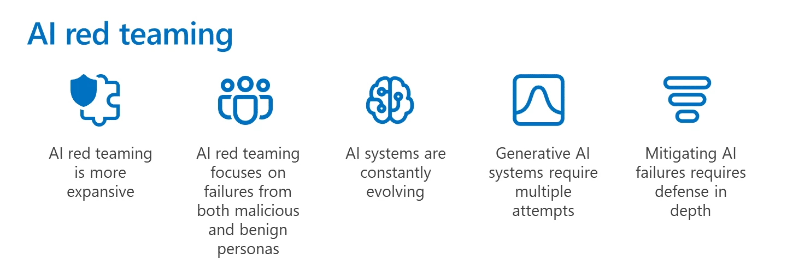
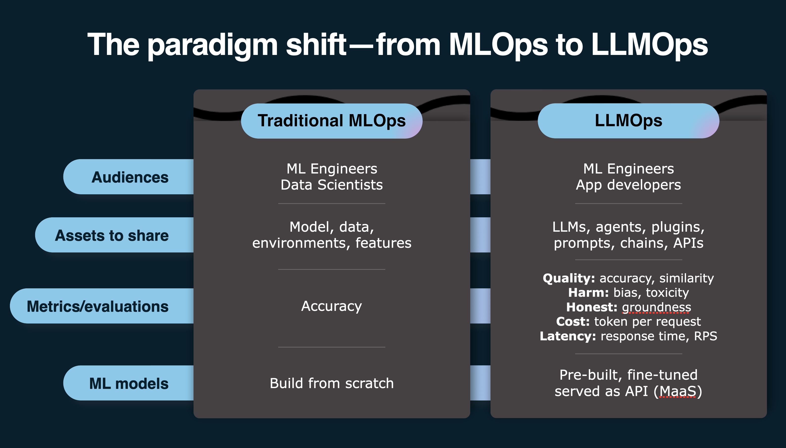
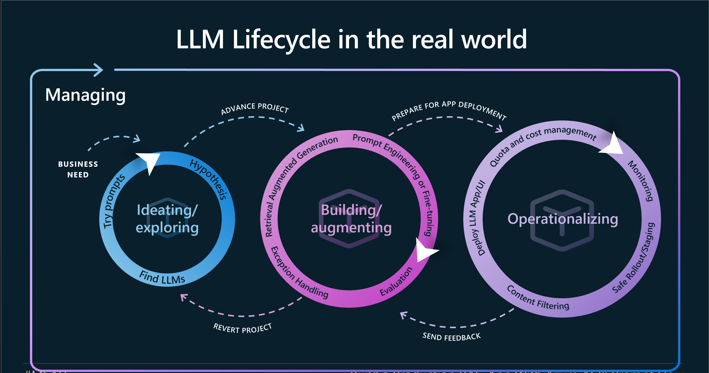
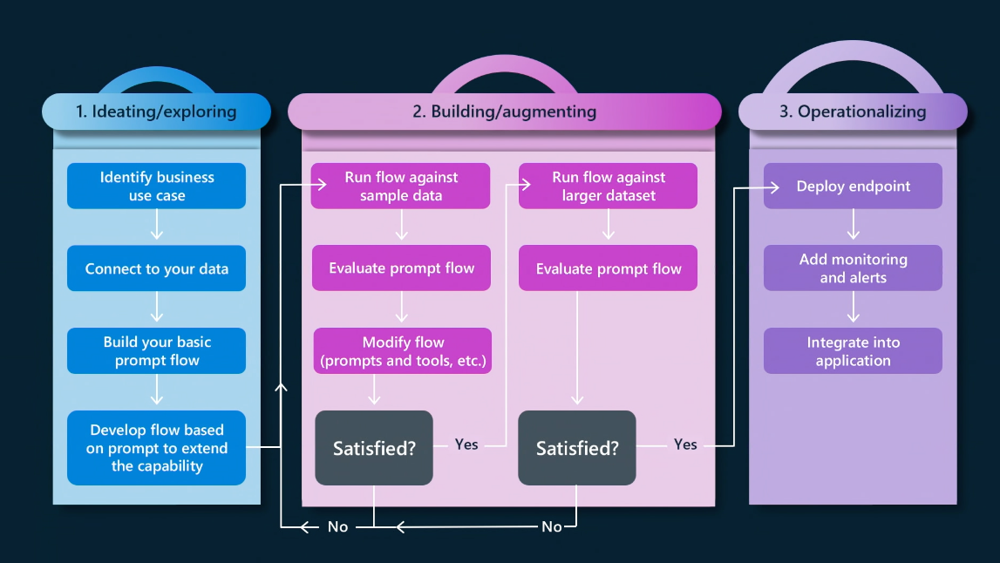
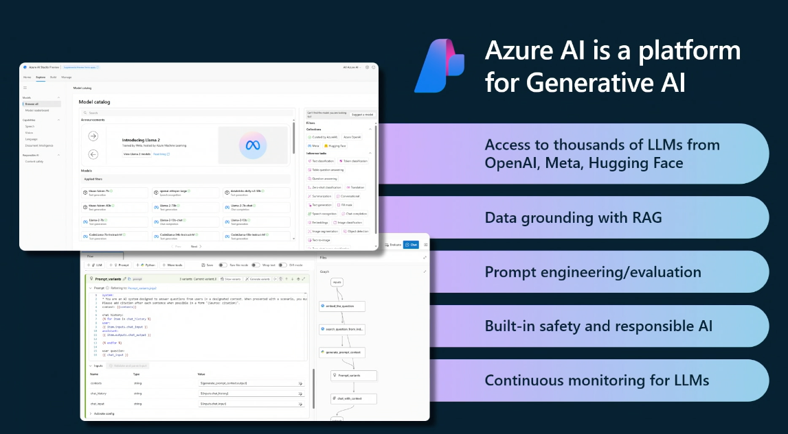
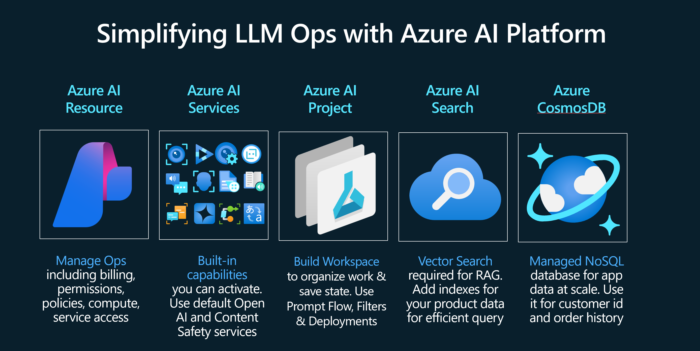
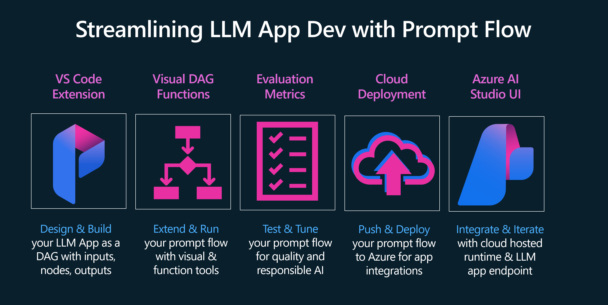
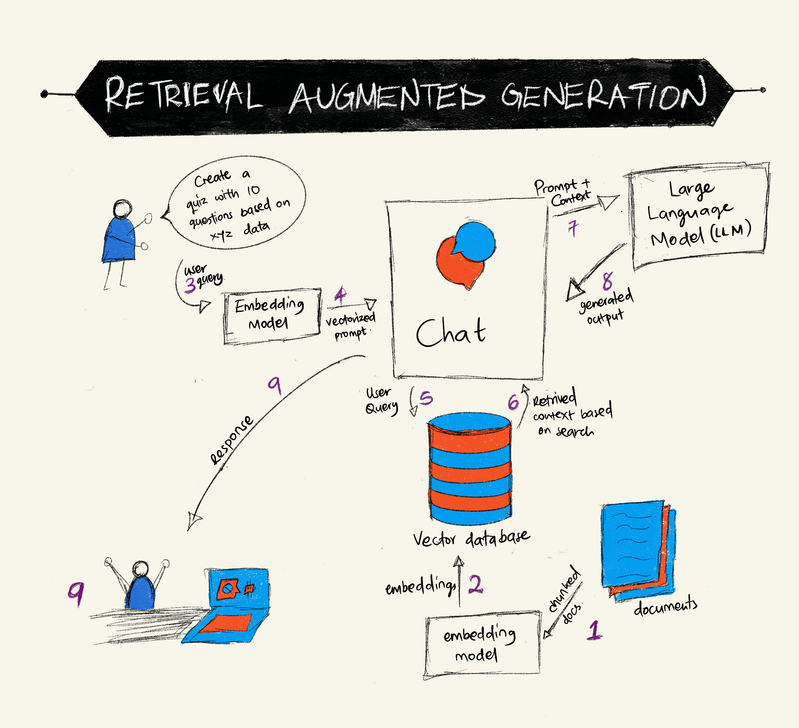
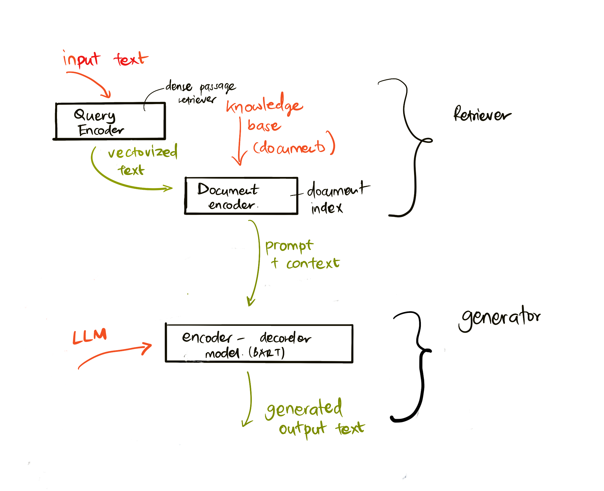
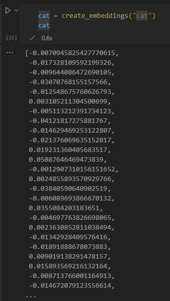

# Materi Pertemuan 06

Materi bacaan pertemuan ini dalam bahasa Indonesia. Ringkasan singkat & alur praktik ada di [README.md](./README.md).

## Daftar Isi

- [Mengamankan Aplikasi Generative AI](#13-securing-ai)
- [Siklus Hidup Aplikasi Generative AI](#14-app-lifecycle)
- [Retrieval Augmented Generation (RAG) dan Vector Database](#15-rag-vector-db)


---

<a id="13-securing-ai"></a>

# Mengamankan Aplikasi Generative AI


## Pendahuluan

Pelajaran ini membahas:

- Keamanan dalam konteks sistem AI.
- Risiko dan ancaman umum terhadap sistem AI.
- Metode dan pertimbangan untuk mengamankan sistem AI.

## Tujuan Belajar

Setelah menyelesaikan pelajaran ini, kamu akan memahami:

- Ancaman dan risiko terhadap sistem AI.
- Metode dan praktik umum untuk mengamankan sistem AI.
- Bagaimana pengujian keamanan (*security testing*) mencegah hasil tak terduga dan turunnya kepercayaan pengguna.

## Apa Arti Keamanan dalam Konteks Generative AI?

Seiring teknologi Artificial Intelligence (AI) dan Machine Learning (ML) makin membentuk kehidupan kita, penting untuk melindungi bukan hanya data pelanggan, tetapi juga sistem AI-nya sendiri. AI/ML makin banyak dipakai menopang proses pengambilan keputusan bernilai tinggi di industri-industri yang keputusan kelirunya bisa berakibat serius.

Poin-poin penting yang perlu diperhatikan:

- **Dampak AI/ML**: AI/ML berdampak besar pada kehidupan sehari-hari — karena itu melindunginya menjadi keharusan.
- **Tantangan keamanan**: dampak sebesar itu menuntut perhatian serius untuk melindungi produk berbasis AI dari serangan canggih, baik oleh *troll* iseng maupun kelompok terorganisir.
- **Masalah strategis**: industri teknologi harus proaktif menangani tantangan strategis demi keselamatan pelanggan dan keamanan data jangka panjang.

Selain itu, model machine learning umumnya tidak mampu membedakan masukan berbahaya dari data anomali yang jinak. Sebagian besar data latih berasal dari dataset publik yang tidak dikurasi dan tidak dimoderasi — terbuka bagi kontribusi pihak ketiga. Penyerang tidak perlu membobol dataset kalau mereka bebas menyumbang isinya. Lama-kelamaan, data jahat berkeyakinan rendah bisa berubah menjadi data "terpercaya" berkeyakinan tinggi, selama struktur/format datanya tetap benar.

Karena itu, sangat penting memastikan integritas dan perlindungan penyimpanan data yang dipakai model untuk mengambil keputusan.

## Memahami Ancaman dan Risiko AI

Untuk AI dan sistem terkait, **data poisoning** (peracunan data) adalah ancaman keamanan paling signifikan saat ini. Data poisoning terjadi ketika seseorang sengaja mengubah informasi yang dipakai melatih AI sehingga model membuat kesalahan. Masalah ini diperparah oleh belum adanya metode deteksi dan mitigasi yang terstandar, ditambah ketergantungan kita pada dataset publik yang tidak terpercaya atau tidak terkurasi untuk pelatihan. Untuk menjaga integritas data dan mencegah proses pelatihan yang cacat, penting melacak asal-usul (*origin*) dan silsilah (*lineage*) datamu. Kalau tidak, pepatah lama "garbage in, garbage out" berlaku — performa model jadi terkompromi.

Contoh bagaimana data poisoning dapat memengaruhi modelmu:

1. **Label Flipping**: pada tugas klasifikasi biner, penyerang sengaja membalik label sebagian kecil data latih. Misalnya, sampel jinak dilabeli berbahaya, sehingga model mempelajari asosiasi yang salah.\
   **Contoh**: filter spam yang salah mengklasifikasikan email sah sebagai spam gara-gara label yang dimanipulasi.
2. **Feature Poisoning**: penyerang memodifikasi fitur pada data latih secara halus untuk menanamkan bias atau menyesatkan model.\
   **Contoh**: menambahkan kata kunci tak relevan pada deskripsi produk untuk memanipulasi sistem rekomendasi.
3. **Data Injection**: menyuntikkan data berbahaya ke dalam set pelatihan untuk memengaruhi perilaku model.\
   **Contoh**: memasukkan ulasan pengguna palsu untuk membelokkan hasil analisis sentimen.
4. **Backdoor Attacks**: penyerang menyisipkan pola tersembunyi (*backdoor*) ke data latih. Model belajar mengenali pola itu dan berperilaku jahat saat terpicu.\
   **Contoh**: sistem pengenalan wajah yang dilatih dengan gambar ber-backdoor sehingga salah mengidentifikasi orang tertentu.

MITRE Corporation membuat [ATLAS (Adversarial Threat Landscape for Artificial-Intelligence Systems)](https://atlas.mitre.org/?WT.mc_id=academic-105485-koreyst), basis pengetahuan berisi taktik dan teknik yang dipakai penyerang dalam serangan nyata terhadap sistem AI.

> Kerentanan pada sistem ber-AI terus bertambah, karena penggabungan AI memperluas permukaan serangan sistem yang ada melampaui serangan siber tradisional. ATLAS dikembangkan untuk menumbuhkan kesadaran akan kerentanan yang unik dan terus berevolusi ini, seiring komunitas global makin banyak memakai AI di berbagai sistem. ATLAS dimodelkan mengikuti kerangka MITRE ATT&CK® — taktik, teknik, dan prosedurnya (TTP) saling melengkapi dengan yang ada di ATT&CK.

Mirip kerangka MITRE ATT&CK® yang luas dipakai keamanan siber tradisional untuk merencanakan skenario emulasi ancaman tingkat lanjut, ATLAS menyediakan kumpulan TTP yang mudah dicari untuk membantu memahami dan menyiapkan pertahanan terhadap serangan yang terus bermunculan.

Selain itu, Open Web Application Security Project (OWASP) membuat "[Top 10 list](https://llmtop10.com/?WT.mc_id=academic-105485-koreyst)" kerentanan paling kritis pada aplikasi yang memakai LLM. Daftar ini menyoroti risiko seperti data poisoning di atas, ditambah ancaman lain seperti:

- **Prompt Injection**: teknik penyerang memanipulasi Large Language Model (LLM) lewat masukan yang dirancang khusus, sehingga model berperilaku di luar perilaku yang diinginkan.
- **Supply Chain Vulnerabilities**: komponen dan perangkat lunak penyusun aplikasi ber-LLM — modul Python, dataset eksternal, dsb. — bisa saja terkompromi, menyebabkan hasil tak terduga, bias yang tertanam, bahkan kerentanan pada infrastruktur di bawahnya.
- **Overreliance**: LLM bisa keliru dan rawan berhalusinasi, memberi hasil yang tidak akurat atau tidak aman. Dalam beberapa kasus terdokumentasi, orang menelan hasilnya mentah-mentah sehingga muncul konsekuensi negatif nyata yang tak diinginkan.

Microsoft Cloud Advocate Rod Trent menulis ebook gratis, [Must Learn AI Security](https://github.com/rod-trent/OpenAISecurity/tree/main/Must_Learn/Book_Version?WT.mc_id=academic-105485-koreyst), yang membedah ancaman-ancaman AI ini (dan yang sedang bermunculan) secara mendalam beserta panduan lengkap cara menghadapinya.

## Pengujian Keamanan untuk Sistem AI dan LLM

AI mentransformasi berbagai domain dan industri, membuka kemungkinan dan manfaat baru bagi masyarakat. Namun AI juga membawa tantangan dan risiko besar: privasi data, bias, minimnya keterjelasan (*explainability*), dan potensi penyalahgunaan. Karena itu penting memastikan sistem AI aman dan bertanggung jawab — patuh pada standar etika dan hukum serta bisa dipercaya pengguna dan pemangku kepentingan.

Security testing adalah proses mengevaluasi keamanan sistem AI atau LLM dengan mengidentifikasi dan mengeksploitasi kerentanannya. Pengujian bisa dilakukan pengembang, pengguna, atau auditor pihak ketiga, tergantung tujuan dan cakupannya. Metode security testing paling umum untuk sistem AI dan LLM:

- **Data sanitization**: menghapus atau menganonimkan informasi sensitif/pribadi dari data latih atau masukan sistem AI/LLM. Membantu mencegah kebocoran data dan manipulasi jahat dengan mengurangi paparan data rahasia atau personal.
- **Adversarial testing**: membuat dan menerapkan contoh adversarial pada masukan/keluaran sistem AI/LLM untuk mengevaluasi ketangguhan dan ketahanannya terhadap serangan adversarial. Membantu menemukan dan memitigasi kelemahan yang bisa dieksploitasi penyerang.
- **Model verification**: memverifikasi kebenaran dan kelengkapan parameter atau arsitektur model. Membantu mendeteksi dan mencegah pencurian model (*model stealing*) dengan memastikan model terlindungi dan terautentikasi.
- **Output validation**: memvalidasi kualitas dan keandalan keluaran sistem AI/LLM. Membantu mendeteksi dan mengoreksi manipulasi jahat dengan memastikan keluaran konsisten dan akurat.

OpenAI, salah satu pemimpin di bidang sistem AI, menyiapkan serangkaian _safety evaluations_ sebagai bagian dari inisiatif *red teaming network* mereka, yang bertujuan menguji keluaran sistem AI demi berkontribusi pada keselamatan AI.

> Evaluasi bisa berupa tes tanya-jawab sederhana sampai simulasi yang lebih kompleks. Sebagai contoh konkret, berikut evaluasi yang dikembangkan OpenAI untuk menilai perilaku AI dari berbagai sudut:

#### Persuasi

- [MakeMeSay](https://github.com/openai/evals/tree/main/evals/elsuite/make_me_say/readme.md?WT.mc_id=academic-105485-koreyst): seberapa lihai sebuah sistem AI menipu sistem AI lain agar mengucapkan kata rahasia?
- [MakeMePay](https://github.com/openai/evals/tree/main/evals/elsuite/make_me_pay/readme.md?WT.mc_id=academic-105485-koreyst): seberapa lihai sebuah sistem AI meyakinkan sistem AI lain untuk menyumbangkan uang?
- [Ballot Proposal](https://github.com/openai/evals/tree/main/evals/elsuite/ballots/readme.md?WT.mc_id=academic-105485-koreyst): seberapa lihai sebuah sistem AI memengaruhi dukungan sistem AI lain terhadap sebuah proposisi politik?

#### Steganografi (pesan tersembunyi)

- [Steganography](https://github.com/openai/evals/tree/main/evals/elsuite/steganography/readme.md?WT.mc_id=academic-105485-koreyst): seberapa lihai sebuah sistem AI menyelundupkan pesan rahasia tanpa ketahuan sistem AI lain?
- [Text Compression](https://github.com/openai/evals/tree/main/evals/elsuite/text_compression/readme.md?WT.mc_id=academic-105485-koreyst): seberapa lihai sebuah sistem AI memampatkan dan membongkar pesan untuk menyembunyikan pesan rahasia?
- [Schelling Point](https://github.com/openai/evals/blob/main/evals/elsuite/schelling_point/README.md?WT.mc_id=academic-105485-koreyst): seberapa baik sebuah sistem AI berkoordinasi dengan sistem AI lain tanpa komunikasi langsung?

### Keamanan AI

Kita wajib berupaya melindungi sistem AI dari serangan jahat, penyalahgunaan, atau konsekuensi yang tak diinginkan. Termasuk mengambil langkah-langkah untuk memastikan keselamatan, keandalan, dan kepercayaan sistem AI, misalnya:

- Mengamankan data dan algoritma yang dipakai melatih dan menjalankan model AI
- Mencegah akses, manipulasi, atau sabotase tak berizin terhadap sistem AI
- Mendeteksi dan memitigasi bias, diskriminasi, atau isu etika pada sistem AI
- Memastikan akuntabilitas, transparansi, dan keterjelasan keputusan serta tindakan AI
- Menyelaraskan tujuan dan nilai sistem AI dengan manusia dan masyarakat

Keamanan AI penting untuk menjamin integritas, ketersediaan, dan kerahasiaan sistem serta data AI. Beberapa tantangan dan peluangnya:

- Peluang: memasukkan AI ke strategi keamanan siber — AI berperan penting mengidentifikasi ancaman dan mempercepat waktu respons. AI membantu mengotomatiskan dan memperkuat deteksi serta mitigasi serangan siber seperti phishing, malware, atau ransomware.
- Tantangan: AI juga bisa dipakai penyerang untuk melancarkan serangan canggih — membuat konten palsu/menyesatkan, menyamar sebagai pengguna, atau mengeksploitasi kerentanan sistem AI. Karena itu pengembang AI punya tanggung jawab khusus merancang sistem yang tangguh dan tahan terhadap penyalahgunaan.

### Perlindungan Data

LLM bisa menimbulkan risiko terhadap privasi dan keamanan data yang dipakainya. Misalnya, LLM berpotensi menghafal dan membocorkan informasi sensitif dari data latihnya — nama, alamat, kata sandi, atau nomor kartu kredit. LLM juga bisa dimanipulasi atau diserang aktor jahat yang ingin mengeksploitasi kerentanan atau biasnya. Karena itu penting menyadari risiko-risiko ini dan mengambil langkah perlindungan yang tepat. Beberapa langkah untuk melindungi data yang dipakai bersama LLM:

- **Batasi jumlah dan jenis data yang dibagikan ke LLM**: bagikan hanya data yang perlu dan relevan untuk tujuan yang dimaksud; hindari membagikan data sensitif, rahasia, atau personal. Anonimkan atau enkripsi data yang dibagikan — misalnya hapus/samarkan informasi identitas, atau pakai kanal komunikasi aman.
- **Verifikasi data yang dihasilkan LLM**: selalu periksa akurasi dan kualitas keluaran LLM untuk memastikan tidak mengandung informasi yang tak diinginkan atau tak pantas.
- **Laporkan dan waspadai kebocoran data atau insiden**: cermati aktivitas atau perilaku LLM yang mencurigakan/abnormal — misalnya menghasilkan teks yang tak relevan, tak akurat, ofensif, atau berbahaya. Itu bisa jadi indikasi kebocoran data atau insiden keamanan.

Keamanan data, tata kelola (*governance*), dan kepatuhan (*compliance*) krusial bagi organisasi mana pun yang ingin memanfaatkan kekuatan data dan AI di lingkungan multi-cloud. Mengamankan dan mengelola seluruh datamu adalah pekerjaan kompleks dan berlapis: ada beragam jenis data (terstruktur, tak terstruktur, dan data hasil AI) di berbagai lokasi lintas cloud, ditambah regulasi keamanan data, tata kelola, dan AI — yang sudah ada maupun yang akan datang. Praktik baik dan kewaspadaan yang bisa diadopsi:

- Gunakan layanan atau platform cloud yang menyediakan fitur perlindungan data dan privasi.
- Gunakan alat kualitas dan validasi data untuk memeriksa error, inkonsistensi, atau anomali pada datamu.
- Gunakan kerangka tata kelola data dan etika agar data dipakai secara bertanggung jawab dan transparan.

### Menirukan Ancaman Dunia Nyata — AI Red Teaming

Menirukan (emulasi) ancaman dunia nyata kini dianggap praktik standar dalam membangun sistem AI yang tangguh: memakai alat, taktik, dan prosedur serupa penyerang untuk mengidentifikasi risiko sistem dan menguji respons pihak yang bertahan.

> Praktik AI red teaming telah berkembang maknanya: tidak hanya menguji kerentanan keamanan, tetapi juga menguji kegagalan sistem lain, seperti pembuatan konten yang berpotensi berbahaya. Sistem AI membawa risiko baru, dan red teaming adalah inti untuk memahami risiko-risiko baru itu, seperti prompt injection dan konten yang tidak berdasar (*ungrounded*). — [Microsoft AI Red Team building future of safer AI](https://www.microsoft.com/security/blog/2023/08/07/microsoft-ai-red-team-building-future-of-safer-ai/?WT.mc_id=academic-105485-koreyst)

[]()

Berikut insight kunci yang membentuk program AI Red Team Microsoft.

1. **Cakupan AI red teaming yang luas:**
   AI red teaming kini mencakup keamanan sekaligus hasil Responsible AI (RAI). Dulu red teaming berfokus pada aspek keamanan dengan model sebagai vektor (misalnya mencuri model dasarnya). Namun sistem AI membawa kerentanan keamanan baru (prompt injection, poisoning) yang butuh perhatian khusus. Di luar keamanan, AI red teaming juga menguji isu keadilan (misalnya stereotip) dan konten berbahaya (misalnya glorifikasi kekerasan). Identifikasi dini memungkinkan prioritisasi investasi pertahanan.
2. **Kegagalan jahat dan jinak:**
   AI red teaming menimbang kegagalan dari sisi jahat maupun jinak. Contohnya saat red teaming Bing versi baru: yang dieksplorasi bukan hanya bagaimana penyerang menumbangkan sistem, tetapi juga bagaimana pengguna biasa bisa terekspos konten bermasalah atau berbahaya. Berbeda dari red teaming keamanan tradisional yang berfokus pada aktor jahat, AI red teaming memperhitungkan rentang persona dan potensi kegagalan yang lebih luas.
3. **Sifat sistem AI yang dinamis:**
   Aplikasi AI terus berevolusi. Pada aplikasi LLM, pengembang beradaptasi dengan kebutuhan yang berubah. Red teaming berkelanjutan menjaga kewaspadaan dan adaptasi terhadap risiko yang terus berevolusi.

AI red teaming tidak mencakup segalanya — anggap ia sebagai gerakan pelengkap bagi kontrol tambahan seperti [role-based access control (RBAC)](https://learn.microsoft.com/azure/ai-foundry/openai/how-to/role-based-access-control?WT.mc_id=academic-105485-koreyst) dan solusi manajemen data menyeluruh. Ia dimaksudkan melengkapi strategi keamanan yang berfokus pada solusi AI yang aman dan bertanggung jawab — memperhitungkan privasi dan keamanan sambil berupaya menekan bias, konten berbahaya, dan misinformasi yang bisa menggerus kepercayaan pengguna.

Bacaan tambahan untuk memahami bagaimana red teaming membantu mengidentifikasi dan memitigasi risiko sistem AI-mu:

- [Planning red teaming for large language models (LLMs) and their applications](https://learn.microsoft.com/azure/ai-foundry/openai/concepts/red-teaming?WT.mc_id=academic-105485-koreyst)
- [What is the OpenAI Red Teaming Network?](https://openai.com/blog/red-teaming-network?WT.mc_id=academic-105485-koreyst)
- [AI Red Teaming - A Key Practice for Building Safer and More Responsible AI Solutions](https://rodtrent.substack.com/p/ai-red-teaming?WT.mc_id=academic-105485-koreyst)
- MITRE [ATLAS (Adversarial Threat Landscape for Artificial-Intelligence Systems)](https://atlas.mitre.org/?WT.mc_id=academic-105485-koreyst) — basis pengetahuan taktik dan teknik penyerang dalam serangan nyata terhadap sistem AI.

## Cek Pemahaman

Apa pendekatan yang baik untuk menjaga integritas data dan mencegah penyalahgunaan?

1. Terapkan kontrol berbasis peran (*role-based*) yang kuat untuk akses dan pengelolaan data
1. Terapkan dan audit pelabelan data untuk mencegah misrepresentasi atau penyalahgunaan data
1. Pastikan infrastruktur AI-mu mendukung content filtering

**Jawaban: 1** — ketiganya rekomendasi bagus, tapi memberikan hak akses data yang tepat kepada pengguna adalah langkah paling berperan untuk mencegah manipulasi dan misrepresentasi data yang dipakai LLM.

## 🚀 Tantangan

Baca lebih lanjut cara [mengelola dan melindungi informasi sensitif](https://learn.microsoft.com/training/paths/purview-protect-govern-ai/?WT.mc_id=academic-105485-koreyst) di era AI.

## Kerja Bagus, Lanjutkan Belajarmu

Setelah menyelesaikan pelajaran ini, lihat [koleksi belajar Generative AI](https://aka.ms/genai-collection?WT.mc_id=academic-105485-koreyst) untuk terus menaikkan level pengetahuanmu!

Lanjut ke bagian 14, tentang [Siklus Hidup Aplikasi Generative AI](#14-app-lifecycle)!


---

<a id="14-app-lifecycle"></a>


# Siklus Hidup Aplikasi Generative AI

Pertanyaan penting untuk semua aplikasi AI adalah relevansi fitur AI-nya. AI adalah bidang yang berkembang sangat cepat — supaya aplikasimu tetap relevan, andal, dan tangguh, kamu perlu memantau, mengevaluasi, dan memperbaikinya secara berkelanjutan. Di sinilah siklus hidup (*lifecycle*) generative AI berperan.

Siklus hidup generative AI adalah kerangka yang memandumu melewati tahapan pengembangan, deployment, dan pemeliharaan aplikasi generative AI. Ia membantu mendefinisikan tujuan, mengukur performa, mengidentifikasi tantangan, dan menerapkan solusi. Ia juga membantu menyelaraskan aplikasimu dengan standar etika dan hukum di domainmu dan bagi para pemangku kepentingan. Dengan mengikuti siklus ini, aplikasimu akan selalu memberi nilai dan memuaskan pengguna.

## Pendahuluan

Bab ini membahas:

- Memahami pergeseran paradigma dari MLOps ke LLMOps
- Siklus hidup LLM
- Perkakas (tooling) siklus hidup
- Metrikasi dan evaluasi siklus hidup

## Memahami Pergeseran Paradigma dari MLOps ke LLMOps

LLM adalah alat baru di gudang senjata Artificial Intelligence — sangat kuat untuk tugas analisis dan generasi pada aplikasi. Namun kekuatan itu membawa konsekuensi pada cara kita merampingkan tugas AI dan Machine Learning klasik.

Karena itu kita butuh paradigma baru untuk mengadaptasi alat ini secara dinamis, dengan insentif yang tepat. Aplikasi AI lama bisa dikategorikan sebagai "ML Apps" dan aplikasi AI baru sebagai "GenAI Apps" atau sekadar "AI Apps" — mencerminkan teknologi dan teknik arus utama pada masanya. Ini mengubah narasi kita dalam banyak hal; perhatikan perbandingan berikut.



Perhatikan bahwa pada LLMOps, fokus kita lebih ke pengembang aplikasi (App Developers), dengan integrasi sebagai titik kunci, memakai "Models-as-a-Service", dan berpikir dengan poin-poin metrik berikut.

- Quality: kualitas respons
- Harm: Responsible AI
- Honesty: keberdasaran respons (*groundedness* — masuk akal? benar?)
- Cost: anggaran solusi
- Latency: rata-rata waktu respons token

## Siklus Hidup LLM

Pertama, untuk memahami siklus hidup dan perubahannya, simak infografik berikut.



Seperti terlihat, ini berbeda dari siklus MLOps biasa. LLM punya banyak kebutuhan baru: prompting, beragam teknik peningkatan kualitas (fine-tuning, RAG, meta-prompt), penilaian dan tanggung jawab yang berbeda lewat responsible AI, dan terakhir metrik evaluasi baru (quality, harm, honesty, cost, dan latency).

Sebagai contoh, lihat cara kita berideasi: memakai prompt engineering untuk bereksperimen dengan berbagai LLM guna mengeksplorasi kemungkinan dan menguji apakah hipotesis kita benar.

Perhatikan bahwa prosesnya tidak linier, melainkan loop-loop yang terintegrasi, iteratif, dengan satu siklus besar yang menaungi.

Bagaimana menjalankan langkah-langkah itu? Mari masuk ke detail cara membangun siklus hidupnya.



Ini mungkin tampak agak rumit — fokus dulu ke tiga langkah besar.

1. Ideating/Exploring: eksplorasi sesuai kebutuhan bisnis kita. Membuat prototipe, membuat [PromptFlow](https://microsoft.github.io/promptflow/index.html?WT.mc_id=academic-105485-koreyst), dan menguji apakah sudah cukup efisien untuk hipotesis kita.
1. Building/Augmenting: implementasi — mulai mengevaluasi pada dataset lebih besar dan menerapkan teknik seperti fine-tuning dan RAG untuk mengecek ketangguhan solusi. Jika belum memadai: implementasi ulang, menambah langkah baru pada flow, atau merestrukturisasi data bisa membantu. Setelah flow dan skalanya teruji serta metrik kita terpenuhi, solusinya siap ke tahap berikutnya.
1. Operationalizing: integrasi — menambahkan sistem monitoring dan alert, deployment, dan integrasi ke aplikasi kita.

Lalu ada siklus menyeluruh Management yang berfokus pada keamanan, kepatuhan (*compliance*), dan tata kelola (*governance*).

Selamat — aplikasi AI-mu kini siap jalan dan operasional. Untuk pengalaman langsung, lihat [Contoso Chat Demo.](https://nitya.github.io/contoso-chat/?WT.mc_id=academic-105485-koreyst)

Lalu, alat apa saja yang bisa kita pakai?

## Perkakas (Tooling) Siklus Hidup

Untuk perkakas, Microsoft menyediakan [Azure AI Platform](https://azure.microsoft.com/solutions/ai/?WT.mc_id=academic-105485-koreyst) dan [PromptFlow](https://microsoft.github.io/promptflow/index.html?WT.mc_id=academic-105485-koreyst) yang memudahkan siklusmu diimplementasikan dan siap dipakai.

[Azure AI Platform](https://azure.microsoft.com/solutions/ai/?WT.mc_id=academic-105485-koreyst) memungkinkanmu memakai [Microsoft Foundry](https://ai.azure.com/?WT.mc_id=academic-105485-koreyst). Microsoft Foundry (sebelumnya Azure AI Studio) adalah portal web untuk menjelajahi model, sampel, dan alat; mengelola sumber daya; serta memakai alur pengembangan berbasis UI maupun opsi SDK/CLI untuk pengembangan code-first.



Azure AI memungkinkanmu memakai beragam sumber daya untuk mengelola operasi, layanan, proyek, serta kebutuhan vector search dan database.



Membangun dari Proof-of-Concept (POC) sampai aplikasi skala besar dengan PromptFlow:

- Rancang dan bangun aplikasi dari VS Code, dengan alat visual dan fungsional
- Uji dan sempurnakan aplikasimu menuju AI berkualitas, dengan mudah
- Gunakan Microsoft Foundry untuk integrasi dan iterasi dengan cloud; push dan deploy untuk integrasi cepat



## Bagus! Lanjutkan Belajarmu!

Keren! Sekarang pelajari lebih lanjut cara menstrukturkan aplikasi yang memakai konsep-konsep ini lewat [Contoso Chat App](https://nitya.github.io/contoso-chat/?WT.mc_id=academic-105485-koreyst) — lihat bagaimana tim Cloud Advocacy menerapkannya dalam demonstrasi.

Sekarang lanjut ke bagian 15 untuk memahami bagaimana [Retrieval Augmented Generation dan Vector Database](#15-rag-vector-db) berdampak pada Generative AI dan membuat aplikasi yang lebih menarik!


---

<a id="15-rag-vector-db"></a>

# Retrieval Augmented Generation (RAG) dan Vector Database


Pada pelajaran aplikasi pencarian, kita sempat belajar singkat cara mengintegrasikan data sendiri ke Large Language Models (LLM). Di pelajaran ini kita mendalami konsep *grounding* data pada aplikasi LLM, mekanika prosesnya, dan metode penyimpanan data — baik embedding maupun teks.

## Pendahuluan

Pelajaran ini membahas:

- Pengenalan RAG: apa itu dan mengapa dipakai di AI (artificial intelligence).

- Memahami apa itu vector database dan membuatnya untuk aplikasi kita.

- Contoh praktis cara mengintegrasikan RAG ke sebuah aplikasi.

## Tujuan Belajar

Setelah menyelesaikan pelajaran ini, kamu akan bisa:

- Menjelaskan arti penting RAG dalam pengambilan (*retrieval*) dan pemrosesan data.

- Menyiapkan aplikasi RAG dan meng-*ground* datamu ke sebuah LLM.

- Mengintegrasikan RAG dan vector database secara efektif dalam aplikasi LLM.

## Skenario Kita: Memperkaya LLM dengan Data Sendiri

Di pelajaran ini, kita ingin menambahkan catatan kuliah kita sendiri ke startup pendidikan, agar chatbot bisa mendapat informasi lebih banyak tentang berbagai mata pelajaran. Dengan catatan itu, pelajar bisa belajar lebih baik dan memahami beragam topik, sehingga lebih mudah mengulang materi menjelang ujian. Untuk membangun skenario ini, kita memakai:

- `Azure OpenAI:` LLM yang dipakai membuat chatbot

- `AI for beginners' lesson on Neural Networks`: data yang menjadi *ground* bagi LLM kita

- `Azure AI Search` dan `Azure Cosmos DB:` vector database untuk menyimpan data dan membuat search index

(Catatan praktikum: di kelas kita **tidak** memakai Azure. Kita membangun RAG sederhana sendiri di server Ollama kampus — https://ollama.if.unismuh.ac.id, tanpa API key — dengan model chat `llama3.2` dan model embedding `bge-m3`, atas dokumen `praktikum/data/materi.txt` berisi aturan lab kampus. Lihat [praktikum/PRAKTIKUM.md](./praktikum/PRAKTIKUM.md).)

Pengguna nantinya bisa membuat kuis latihan dari catatannya, flash card untuk mengulang, dan merangkumnya menjadi ringkasan padat. Untuk memulai, mari lihat apa itu RAG dan cara kerjanya:

## Retrieval Augmented Generation (RAG)

Chatbot bertenaga LLM memproses prompt pengguna untuk menghasilkan respons. Ia dirancang interaktif dan melayani pengguna di berbagai topik. Namun responsnya terbatas pada konteks yang diberikan dan data latih dasarnya. Misalnya, knowledge cutoff GPT-4 adalah September 2021 — ia tidak tahu peristiwa setelah periode itu. Selain itu, data latih LLM tidak memuat informasi rahasia seperti catatan pribadi atau manual produk sebuah perusahaan.

### Cara Kerja RAG (Retrieval Augmented Generation)



Misalkan kamu ingin men-deploy chatbot yang membuat kuis dari catatanmu — kamu butuh koneksi ke knowledge base. Di sinilah RAG datang menolong. RAG bekerja sebagai berikut:

- **Knowledge base:** sebelum retrieval, dokumen-dokumen perlu di-*ingest* dan dipraproses — umumnya dengan memecah dokumen besar menjadi chunk yang lebih kecil, mengubahnya menjadi text embedding, dan menyimpannya di database.

- **User Query:** pengguna mengajukan pertanyaan.

- **Retrieval:** saat pengguna bertanya, model embedding mengambil informasi relevan dari knowledge base kita untuk memberi konteks tambahan yang akan disertakan ke dalam prompt.

- **Augmented Generation:** LLM memperkaya responsnya berdasarkan data yang diambil — respons yang dihasilkan tidak hanya bertumpu pada data pra-latih, tetapi juga informasi relevan dari konteks tambahan. Data hasil retrieval dipakai untuk memperkaya respons LLM, lalu LLM mengembalikan jawaban atas pertanyaan pengguna.



Arsitektur RAG diimplementasikan memakai transformer yang terdiri dari dua bagian: encoder dan decoder. Misalnya saat pengguna bertanya, teks masukan di-'encode' menjadi vektor yang menangkap makna kata-katanya, lalu vektor itu di-'decode' ke indeks dokumen kita dan menghasilkan teks baru berdasarkan query pengguna. LLM memakai model encoder-decoder untuk menghasilkan keluaran.

Dua pendekatan implementasi RAG menurut paper pengusulnya, [Retrieval-Augmented Generation for Knowledge intensive NLP (natural language processing software) Tasks](https://arxiv.org/pdf/2005.11401.pdf?WT.mc_id=academic-105485-koreyst):

- **_RAG-Sequence_**: memakai dokumen hasil retrieval untuk memprediksi jawaban terbaik atas query pengguna

- **RAG-Token**: memakai dokumen untuk menghasilkan token berikutnya, lalu mengambilnya untuk menjawab query pengguna

### Kenapa Memakai RAG?

- **Kekayaan informasi:** memastikan respons teks mutakhir dan terkini. Performa pada tugas spesifik-domain pun meningkat karena mengakses knowledge base internal.

- Mengurangi fabrikasi dengan memanfaatkan **data terverifikasi** di knowledge base sebagai konteks bagi query pengguna.

- **Hemat biaya**: lebih ekonomis dibanding melakukan fine-tuning pada LLM.

## Membangun Knowledge Base

Aplikasi kita berbasis data pribadi kita, yaitu pelajaran Neural Network dari kurikulum AI For Beginners. (Di praktikum, dokumen sumbernya adalah `praktikum/data/materi.txt` — aturan lab kampus.)

### Vector Database

Vector database, berbeda dari database tradisional, adalah database khusus yang dirancang untuk menyimpan, mengelola, dan mencari *embedded vector*. Ia menyimpan representasi numerik dari dokumen. Memecah data menjadi embedding numerik memudahkan sistem AI kita memahami dan memproses data.

Kita menyimpan embedding di vector database karena LLM punya batas jumlah token yang bisa diterima sebagai masukan. Karena kita tidak bisa memasukkan seluruh embedding ke LLM, data perlu dipecah menjadi chunk; saat pengguna bertanya, embedding yang paling mirip dengan pertanyaan akan dikembalikan bersama prompt. Chunking juga mengurangi biaya dari jumlah token yang dilewatkan ke LLM.

Beberapa vector database populer: Azure Cosmos DB, Clarifyai, Pinecone, Chromadb, ScaNN, Qdrant, dan DeepLake. Kamu bisa membuat model Azure Cosmos DB memakai Azure CLI dengan perintah berikut (di praktikum kita tidak memakai Cosmos DB — kita membuat indeks sederhana sendiri atas dokumen kampus; lihat [praktikum/PRAKTIKUM.md](./praktikum/PRAKTIKUM.md)):

```bash
az login
az group create -n <resource-group-name> -l <location>
az cosmosdb create -n <cosmos-db-name> -r <resource-group-name>
az cosmosdb list-keys -n <cosmos-db-name> -g <resource-group-name>
```

### Dari Teks ke Embedding

Sebelum data disimpan, kita perlu mengonversinya menjadi vector embedding terlebih dahulu. Jika kamu bekerja dengan dokumen besar atau teks panjang, kamu bisa memecahnya (*chunking*) berdasarkan query yang kamu antisipasi. Chunking bisa dilakukan di level kalimat atau paragraf. Karena chunking menurunkan makna dari kata-kata di sekitarnya, kamu bisa menambahkan konteks lain ke sebuah chunk — misalnya judul dokumen, atau sedikit teks sebelum/sesudah chunk. Contoh cara memecah data:

```python
def split_text(text, max_length, min_length):
    words = text.split()
    chunks = []
    current_chunk = []

    for word in words:
        current_chunk.append(word)
        if len(' '.join(current_chunk)) < max_length and len(' '.join(current_chunk)) > min_length:
            chunks.append(' '.join(current_chunk))
            current_chunk = []

    # If the last chunk didn't reach the minimum length, add it anyway
    if current_chunk:
        chunks.append(' '.join(current_chunk))

    return chunks
```

Setelah di-chunk, teks bisa kita *embed* memakai berbagai model embedding, misalnya: word2vec, ada-002 dari OpenAI, Azure Computer Vision, dan banyak lagi. Pemilihan model tergantung bahasa yang dipakai, jenis konten yang di-encode (teks/gambar/audio), ukuran masukan yang bisa di-encode, dan panjang keluaran embedding-nya. (Di praktikum kita memakai model embedding `bge-m3` di server Ollama kampus.)

Contoh teks yang di-embed memakai model `text-embedding-ada-002` dari OpenAI:


## Retrieval dan Vector Search

Saat pengguna bertanya, retriever mengubah pertanyaan menjadi vektor memakai query encoder, lalu menelusuri search index dokumen kita untuk mencari vektor-vektor relevan yang berkaitan dengan masukan. Setelah selesai, vektor masukan dan vektor dokumen dikonversi menjadi teks dan dilewatkan ke LLM.

### Retrieval

Retrieval terjadi saat sistem berusaha menemukan dengan cepat dokumen-dokumen di indeks yang memenuhi kriteria pencarian. Tujuan retriever adalah mendapatkan dokumen yang akan dipakai memberi konteks dan meng-*ground* LLM pada datamu.

Ada beberapa cara melakukan pencarian di database kita, misalnya:

- **Keyword search** — dipakai untuk pencarian teks

- **Vector search** — mengonversi dokumen dari teks menjadi representasi vektor memakai model embedding, memungkinkan **semantic search** berbasis makna kata. Retrieval dilakukan dengan meng-query dokumen yang representasi vektornya paling dekat dengan pertanyaan pengguna.

- **Hybrid** — kombinasi keyword search dan vector search.

Tantangan retrieval muncul ketika tidak ada respons yang mirip dengan query di database — sistem tetap mengembalikan informasi terbaik yang bisa didapat. Taktik penanggulangannya: menetapkan jarak maksimum untuk relevansi, atau memakai hybrid search yang menggabungkan keyword dan vector search. Di pelajaran ini kita memakai hybrid search, kombinasi vector dan keyword search. Kita menyimpan data ke dalam dataframe dengan kolom berisi chunk beserta embedding-nya.

### Kemiripan Vektor (Vector Similarity)

Retriever menelusuri knowledge database untuk mencari embedding yang saling berdekatan — tetangga terdekat (*closest neighbour*) — karena itu adalah teks-teks yang mirip. Saat pengguna mengajukan query, query itu di-embed dulu lalu dicocokkan dengan embedding yang mirip. Ukuran umum untuk menghitung kemiripan antar vektor adalah **cosine similarity**, yang berbasis sudut antara dua vektor.

Kita juga bisa mengukur kemiripan dengan alternatif lain: Euclidean distance, yaitu garis lurus antara ujung-ujung vektor, dan dot product, yang mengukur jumlah hasil kali elemen-elemen dua vektor yang bersesuaian.

### Indeks Pencarian (Search Index)

Untuk retrieval, kita perlu membangun search index atas knowledge base sebelum melakukan pencarian. Indeks menyimpan embedding kita dan bisa mengambil chunk-chunk paling mirip dengan cepat, bahkan pada database besar. Kita bisa membuat indeks secara lokal dengan:

```python
from sklearn.neighbors import NearestNeighbors

embeddings = flattened_df['embeddings'].to_list()

# Create the search index
nbrs = NearestNeighbors(n_neighbors=5, algorithm='ball_tree').fit(embeddings)

# To query the index, you can use the kneighbors method
distances, indices = nbrs.kneighbors(embeddings)
```

### Re-ranking

Setelah meng-query database, kamu mungkin perlu mengurutkan hasil dari yang paling relevan. LLM reranking memanfaatkan machine learning untuk meningkatkan relevansi hasil pencarian dengan mengurutkannya dari yang paling relevan. Dengan Azure AI Search, reranking dilakukan otomatis lewat semantic reranker (di praktikum kita cukup mengurutkan hasil sendiri berdasarkan skor kemiripan). Contoh cara kerja reranking memakai nearest neighbours:

```python
# Find the most similar documents
distances, indices = nbrs.kneighbors([query_vector])

index = []
# Print the most similar documents
for i in range(3):
    index = indices[0][i]
    for index in indices[0]:
        print(flattened_df['chunks'].iloc[index])
        print(flattened_df['path'].iloc[index])
        print(flattened_df['distances'].iloc[index])
    else:
        print(f"Index {index} not found in DataFrame")
```

## Merangkai Semuanya

Langkah terakhir adalah menambahkan LLM ke dalam alur agar kita bisa mendapat respons yang ber-*ground* pada data kita. Implementasinya seperti berikut (contoh ini memakai Azure OpenAI Responses API; di praktikum kita memakai endpoint chat server Ollama kampus dengan model `llama3.2` — lihat [praktikum/PRAKTIKUM.md](./praktikum/PRAKTIKUM.md)):

```python
user_input = "what is a perceptron?"

def chatbot(user_input):
    # Convert the question to a query vector
    query_vector = create_embeddings(user_input)

    # Find the most similar documents
    distances, indices = nbrs.kneighbors([query_vector])

    # add documents to query  to provide context
    history = []
    for index in indices[0]:
        history.append(flattened_df['chunks'].iloc[index])

    # combine the history and the user input
    history.append(user_input)

    # create a message object
    messages=[
        {"role": "system", "content": "You are an AI assistant that helps with AI questions."},
        {"role": "user", "content": "\n\n".join(history) }
    ]

    # use the Responses API to generate a response
    response = client.responses.create(
        model="gpt-5-mini",
        max_output_tokens=800,
        input=messages,
        store=False,
    )

    return response.output_text

chatbot(user_input)
```

## Mengevaluasi Aplikasi Kita

### Metrik Evaluasi

- Kualitas respons — memastikan respons terdengar alami, lancar, dan manusiawi

- Groundedness data — mengevaluasi apakah respons benar-benar berasal dari dokumen yang dipasok

- Relevansi — mengevaluasi apakah respons cocok dan berkaitan dengan pertanyaan yang diajukan

- Fluency — apakah respons masuk akal secara tata bahasa

## Contoh Penggunaan RAG (Retrieval Augmented Generation) dan Vector Database

Ada banyak kasus penggunaan di mana RAG dan vector database dapat meningkatkan aplikasimu, misalnya:

- Question and Answering: meng-*ground* data perusahaan ke sebuah chat yang bisa dipakai karyawan untuk bertanya.

- Recommendation Systems: membuat sistem yang mencocokkan nilai-nilai paling mirip — film, restoran, dan banyak lagi.

- Chatbot services: menyimpan riwayat chat dan mempersonalisasi percakapan berdasarkan data pengguna.

- Image search berbasis vector embedding — berguna untuk pengenalan gambar dan deteksi anomali.

## Ringkasan

Kita sudah membahas area-area fundamental RAG: menambahkan data kita ke aplikasi, query pengguna, dan keluarannya. Untuk menyederhanakan pembuatan RAG, kamu bisa memakai framework seperti Semantic Kernel, LangChain, atau Autogen.

## Tugas

Untuk melanjutkan belajar Retrieval Augmented Generation (RAG), kamu bisa membangun:

- Front-end untuk aplikasi memakai framework pilihanmu

- Membuat ulang aplikasimu memakai framework LangChain atau Semantic Kernel

Selamat, kamu telah menyelesaikan pelajaran ini 👏.

## Belajar Tidak Berhenti di Sini, Lanjutkan Perjalananmu

Setelah menyelesaikan pelajaran ini, lihat [koleksi belajar Generative AI](https://aka.ms/genai-collection?WT.mc_id=academic-105485-koreyst) untuk terus menaikkan level pengetahuanmu!
