# Materi Pertemuan 07

Materi bacaan pertemuan ini dalam bahasa Indonesia. Bagian 16 (model open source) dan 17 (AI agent) adalah **materi inti** pertemuan; bagian 18–21 (fine-tuning, sumber belajar, SLM, Mistral, dan Meta) merupakan **wawasan tambahan** untuk memperluas pemahamanmu. Ringkasan singkat & alur praktik ada di [README.md](./README.md).

## Daftar Isi

- [Model Open Source](#16-open-source-models)
- [AI Agents](#17-ai-agents)
- [Fine-Tuning LLM-mu](#18-fine-tuning)
- [Sumber Belajar Mandiri](#18-resources)
- [Pengenalan Small Language Model (SLM)](#19-slm)
- [Membangun dengan Model Mistral](#20-mistral)
- [Membangun dengan Keluarga Model Meta](#21-meta)


---

<a id="16-open-source-models"></a>


## Pendahuluan

Dunia LLM open-source sangat menarik dan terus berkembang. Pelajaran ini memberikan tinjauan mendalam tentang model open source. Jika kamu mencari perbandingan antara model proprietary (tertutup) dan model open source, lihat [pelajaran "Menjelajahi dan Membandingkan Berbagai LLM"](../pertemuan-01/MATERI.md#02-exploring-llms). Pelajaran ini juga menyinggung topik fine-tuning, tetapi penjelasan yang lebih detail ada di [pelajaran "Fine-Tuning LLM"](#18-fine-tuning).

## Tujuan Belajar

- Memahami apa itu model open source
- Memahami manfaat bekerja dengan model open source
- Menjelajahi model terbuka yang tersedia di Hugging Face dan katalog model Microsoft Foundry

## Apa Itu Model Open Source?

Perangkat lunak open source berperan penting dalam pertumbuhan teknologi di berbagai bidang. Open Source Initiative (OSI) menetapkan [10 kriteria perangkat lunak](https://web.archive.org/web/20241126001143/https://opensource.org/osd?WT.mc_id=academic-105485-koreyst) agar bisa disebut open source. Kode sumbernya harus dibagikan secara terbuka di bawah lisensi yang disetujui OSI.

Meski pengembangan LLM punya kemiripan dengan pengembangan perangkat lunak, prosesnya tidak persis sama. Hal ini memicu banyak diskusi di komunitas tentang definisi open source dalam konteks LLM. Agar sebuah model sesuai dengan definisi open source tradisional, informasi berikut harus tersedia untuk publik:

- Dataset yang dipakai untuk melatih model.
- Bobot model (weights) lengkap sebagai bagian dari pelatihan.
- Kode evaluasi.
- Kode fine-tuning.
- Bobot model lengkap beserta metrik pelatihan.

Saat ini hanya sedikit model yang memenuhi kriteria tersebut. [Model OLMo buatan Allen Institute for Artificial Intelligence (AllenAI)](https://huggingface.co/allenai/OLMo-7B?WT.mc_id=academic-105485-koreyst) adalah salah satu yang masuk kategori ini.

Karena kebanyakan model tidak memenuhi seluruh kriteria di atas, dalam pelajaran ini kita akan menyebutnya sebagai **"model terbuka" (open model)** — istilah untuk model yang bobotnya dibagikan secara publik (sering juga disebut *open-weight*).

## Manfaat Model Terbuka

**Sangat Bisa Dikustomisasi** — Karena model terbuka dirilis dengan informasi pelatihan yang detail, peneliti dan developer bisa memodifikasi bagian dalam model. Ini memungkinkan terciptanya model yang sangat terspesialisasi, hasil fine-tuning untuk tugas atau bidang tertentu. Contohnya: pembuatan kode (code generation), operasi matematika, dan biologi.

**Biaya** — Biaya per token untuk memakai dan men-deploy model ini lebih rendah dibanding model proprietary. Saat membangun aplikasi Generative AI, bandingkan performa vs harga model-model ini pada kasus penggunaanmu.

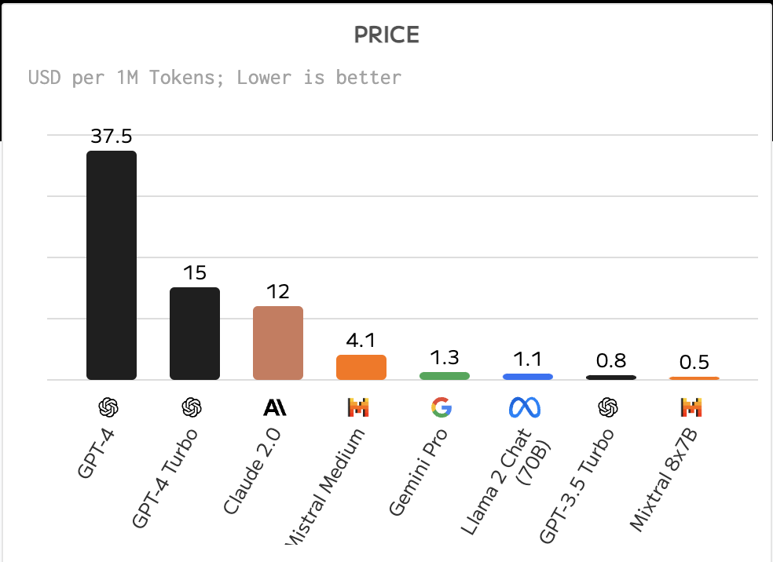
Sumber: Artificial Analysis

**Fleksibilitas** — Bekerja dengan model terbuka membuatmu leluasa memakai model yang berbeda-beda atau mengombinasikannya. Salah satu contohnya adalah [HuggingChat Assistants](https://huggingface.co/chat?WT.mc_id=academic-105485-koreyst), di mana pengguna bisa memilih model yang dipakai langsung dari antarmuka:

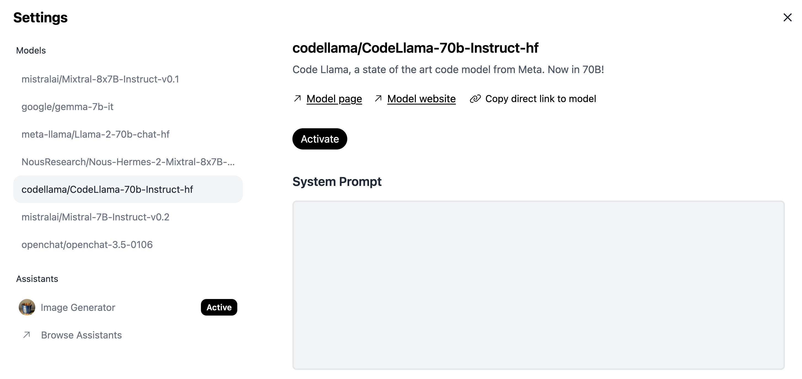

## Menjelajahi Berbagai Model Terbuka

### Llama 2

[Llama 2](https://huggingface.co/meta-llama?WT.mc_id=academic-105485-koreyst), dikembangkan oleh Meta, adalah model terbuka yang dioptimalkan untuk aplikasi berbasis chat. Ini berkat metode fine-tuning-nya yang melibatkan dialog dalam jumlah besar dan umpan balik manusia (human feedback). Dengan metode ini, model menghasilkan jawaban yang lebih sesuai harapan manusia, sehingga pengalaman pengguna lebih baik.

Beberapa contoh versi fine-tuning dari Llama antara lain [Japanese Llama](https://huggingface.co/elyza/ELYZA-japanese-Llama-2-7b?WT.mc_id=academic-105485-koreyst) yang mengkhususkan diri pada bahasa Jepang, dan [Llama Pro](https://huggingface.co/TencentARC/LLaMA-Pro-8B?WT.mc_id=academic-105485-koreyst), versi yang disempurnakan dari model dasarnya.

> **Catatan kelas:** model Llama yang kita pakai sepanjang praktikum lewat server Ollama kampus (https://ollama.if.unismuh.ac.id) adalah contoh nyata model terbuka keluarga ini — bobotnya tersedia publik sehingga bisa di-hosting sendiri tanpa bergantung pada API berbayar.

### Mistral

[Mistral](https://huggingface.co/mistralai?WT.mc_id=academic-105485-koreyst) adalah model terbuka yang berfokus kuat pada performa tinggi dan efisiensi. Model ini memakai pendekatan Mixture-of-Experts, yang menggabungkan sekelompok model "pakar" terspesialisasi ke dalam satu sistem — tergantung masukannya, hanya model tertentu yang dipilih untuk bekerja. Komputasi jadi lebih efektif karena tiap model hanya menangani masukan yang menjadi spesialisasinya.

Beberapa contoh versi fine-tuning dari Mistral antara lain [BioMistral](https://huggingface.co/BioMistral/BioMistral-7B?text=Mon+nom+est+Thomas+et+mon+principal?WT.mc_id=academic-105485-koreyst) yang berfokus pada domain medis, dan [OpenMath Mistral](https://huggingface.co/nvidia/OpenMath-Mistral-7B-v0.1-hf?WT.mc_id=academic-105485-koreyst) untuk komputasi matematika.

### Falcon

[Falcon](https://huggingface.co/tiiuae?WT.mc_id=academic-105485-koreyst) adalah LLM buatan Technology Innovation Institute (**TII**). Falcon-40B dilatih dengan 40 miliar parameter dan terbukti berkinerja lebih baik daripada GPT-3 dengan anggaran komputasi lebih kecil. Ini berkat penggunaan algoritma FlashAttention dan multiquery attention yang memangkas kebutuhan memori saat inference. Dengan waktu inference yang lebih singkat, Falcon-40B cocok untuk aplikasi chat.

Beberapa contoh versi fine-tuning dari Falcon adalah [OpenAssistant](https://huggingface.co/OpenAssistant/falcon-40b-sft-top1-560?WT.mc_id=academic-105485-koreyst), asisten yang dibangun di atas model terbuka, dan [GPT4ALL](https://huggingface.co/nomic-ai/gpt4all-falcon?WT.mc_id=academic-105485-koreyst) yang performanya lebih tinggi dari model dasarnya.

## Cara Memilih

Tidak ada satu jawaban pasti untuk memilih model terbuka. Titik awal yang baik adalah memakai fitur filter berdasarkan tugas (task) di katalog model Microsoft Foundry. Ini membantumu memahami model dilatih untuk jenis tugas apa saja. Hugging Face juga mengelola LLM Leaderboard yang menampilkan model berkinerja terbaik berdasarkan metrik tertentu.

Untuk membandingkan LLM lintas jenis, [Artificial Analysis](https://artificialanalysis.ai/?WT.mc_id=academic-105485-koreyst) adalah sumber lain yang sangat bagus:

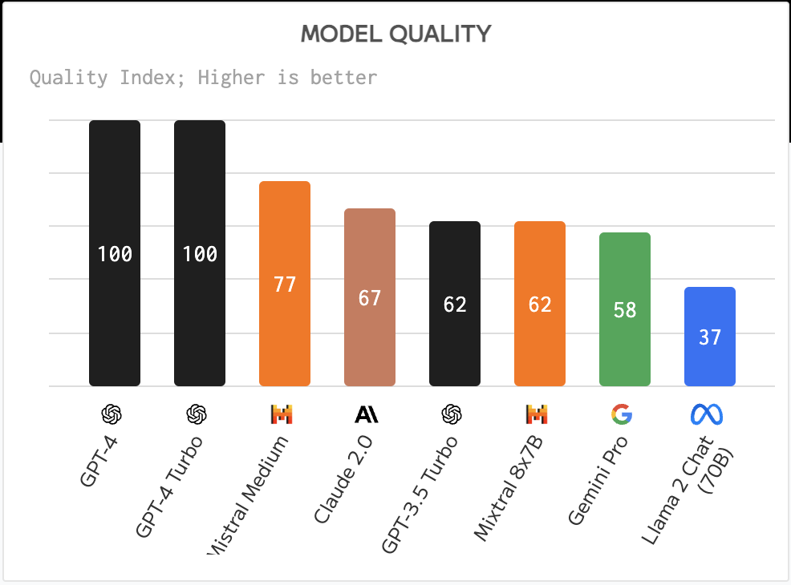
Sumber: Artificial Analysis

Jika mengerjakan kasus penggunaan spesifik, mencari versi fine-tuning yang fokus di bidang yang sama bisa efektif. Bereksperimen dengan beberapa model terbuka sekaligus untuk melihat performanya menurut ekspektasimu dan penggunamu juga merupakan praktik yang baik.

## Langkah Berikutnya

Bagian terbaik dari model terbuka: kamu bisa langsung mulai memakainya dengan cepat. Lihat [katalog model Microsoft Foundry](https://ai.azure.com?WT.mc_id=academic-105485-koreyst) yang memuat koleksi khusus Hugging Face berisi model-model yang kita bahas di sini.

## Belajar Tidak Berhenti di Sini, Lanjutkan Perjalananmu

Setelah menyelesaikan pelajaran ini, kunjungi [koleksi pembelajaran Generative AI](https://aka.ms/genai-collection?WT.mc_id=academic-105485-koreyst) untuk terus menaikkan level pengetahuan Generative AI-mu!


---

<a id="17-ai-agents"></a>


## Pendahuluan

AI Agent adalah perkembangan yang menarik dalam Generative AI: Large Language Model (LLM) berevolusi dari sekadar asisten menjadi *agent* yang mampu mengambil tindakan. Framework AI Agent memungkinkan developer membangun aplikasi yang memberi LLM akses ke *tools* (alat) dan pengelolaan *state* (konteks/keadaan). Framework ini juga meningkatkan visibilitas — pengguna dan developer bisa memantau aksi yang direncanakan LLM, sehingga pengelolaan pengalaman jadi lebih baik.

Pelajaran ini membahas:

- Memahami apa itu AI Agent — apa sebenarnya AI Agent itu?
- Menjelajahi lima framework AI Agent yang berbeda — apa keunikan masing-masing?
- Menerapkan AI Agent ke berbagai kasus penggunaan — kapan kita sebaiknya memakai AI Agent?

## Tujuan Belajar

Setelah pelajaran ini, kamu akan mampu:

- Menjelaskan apa itu AI Agent dan bagaimana penggunaannya.
- Memahami perbedaan beberapa framework AI Agent populer.
- Memahami cara kerja AI Agent agar bisa membangun aplikasi dengannya.

## Apa Itu AI Agent?

AI Agent adalah bidang yang sangat menarik di dunia Generative AI. Sayangnya, kehebohan ini kadang disertai kebingungan istilah dan penerapannya. Agar sederhana dan mencakup sebagian besar alat yang menyebut dirinya AI Agent, kita pakai definisi ini:

AI Agent memungkinkan Large Language Model (LLM) menjalankan tugas dengan memberinya akses ke **state** dan **tools**.

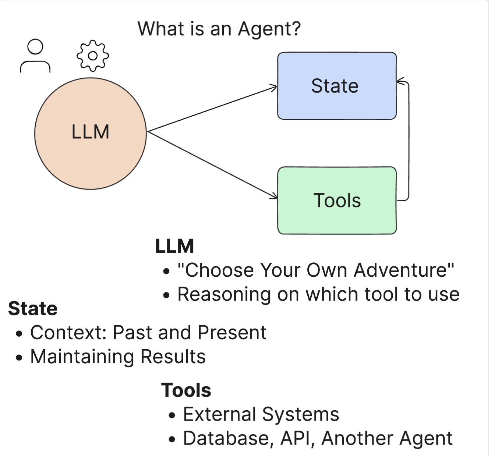

Mari definisikan istilah-istilah tersebut:

**Large Language Model** — model-model yang dirujuk sepanjang kursus ini, seperti GPT-5, GPT-4o, dan Llama 3.3, dsb.

**State** — konteks tempat LLM bekerja. LLM memakai konteks dari aksi-aksi sebelumnya dan konteks saat ini untuk memandu pengambilan keputusan pada aksi berikutnya. Framework AI Agent memudahkan developer memelihara konteks ini.

**Tools** — untuk menyelesaikan tugas yang diminta pengguna dan sudah direncanakan LLM, LLM butuh akses ke alat. Contoh tools: database, API, aplikasi eksternal, bahkan LLM lain!

Definisi ini semoga jadi pijakan yang kuat saat kita melihat implementasinya. Mari jelajahi beberapa framework AI Agent:

## LangChain Agents

[LangChain Agents](https://python.langchain.com/docs/how_to/#agents?WT.mc_id=academic-105485-koreyst) adalah implementasi dari definisi yang kita berikan di atas.

Untuk mengelola **state**, ia memakai fungsi bawaan bernama `AgentExecutor`. Fungsi ini menerima `agent` yang sudah didefinisikan beserta `tools` yang tersedia baginya.

`Agent Executor` juga menyimpan riwayat chat untuk menyediakan konteks percakapan.

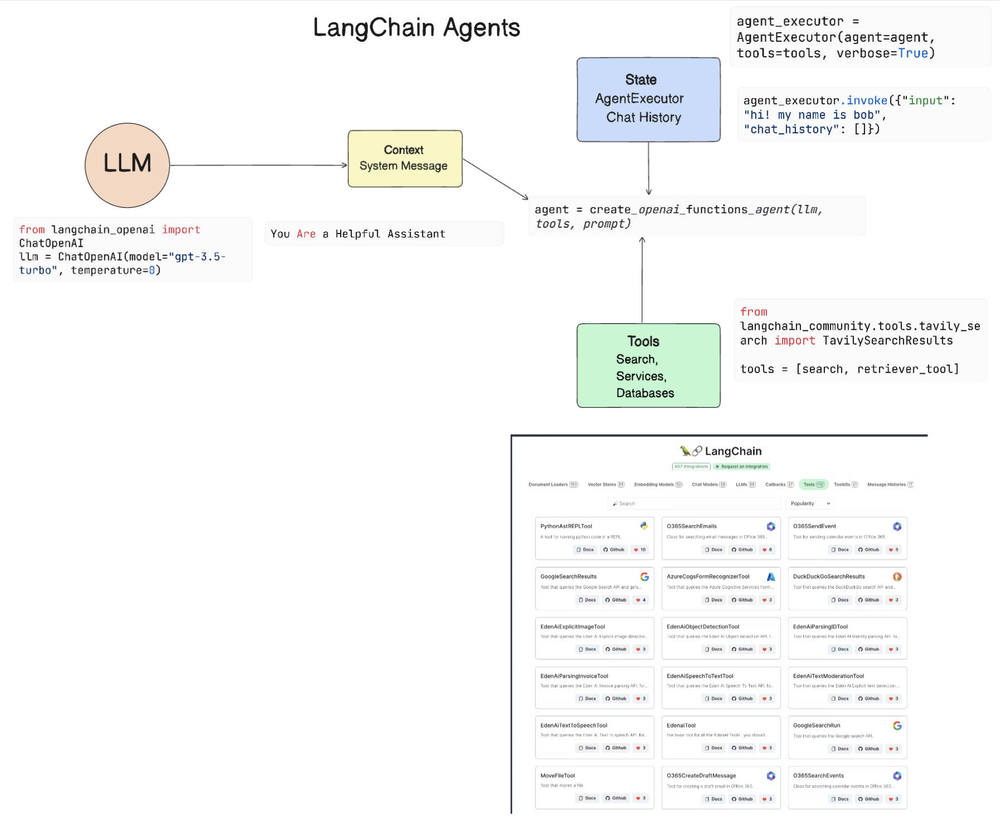

LangChain menyediakan [katalog tools](https://integrations.langchain.com/tools?WT.mc_id=academic-105485-koreyst) yang bisa diimpor ke aplikasimu untuk diakses LLM. Tools ini dibuat oleh komunitas dan tim LangChain.

Kamu kemudian bisa mendefinisikan tools tersebut dan meneruskannya ke `Agent Executor`.

Visibilitas adalah aspek penting lain ketika membicarakan AI Agent. Developer aplikasi perlu memahami tool mana yang dipakai LLM dan alasannya. Untuk itu, tim LangChain mengembangkan LangSmith.

## AutoGen

Framework AI Agent berikutnya adalah [AutoGen](https://microsoft.github.io/autogen/?WT.mc_id=academic-105485-koreyst). Fokus utama AutoGen adalah percakapan. Agent-nya bersifat **conversable** (bisa bercakap) dan **customizable** (bisa dikustomisasi).

**Conversable** — LLM bisa memulai dan melanjutkan percakapan dengan LLM lain untuk menyelesaikan tugas. Caranya dengan membuat `AssistantAgents` dan memberi masing-masing system message spesifik.

```python

autogen.AssistantAgent( name="Coder", llm_config=llm_config, ) pm = autogen.AssistantAgent( name="Product_manager", system_message="Creative in software product ideas.", llm_config=llm_config, )

```

**Customizable** — Agent bisa didefinisikan bukan hanya sebagai LLM, tapi juga sebagai pengguna atau tool. Sebagai developer, kamu bisa mendefinisikan `UserProxyAgent` yang bertugas berinteraksi dengan pengguna untuk meminta umpan balik dalam menyelesaikan tugas. Umpan balik ini bisa melanjutkan eksekusi tugas atau menghentikannya.

```python
user_proxy = UserProxyAgent(name="user_proxy")
```

### State dan Tools

Untuk mengubah dan mengelola state, assistant Agent menghasilkan kode Python guna menyelesaikan tugas.

Berikut contoh prosesnya:

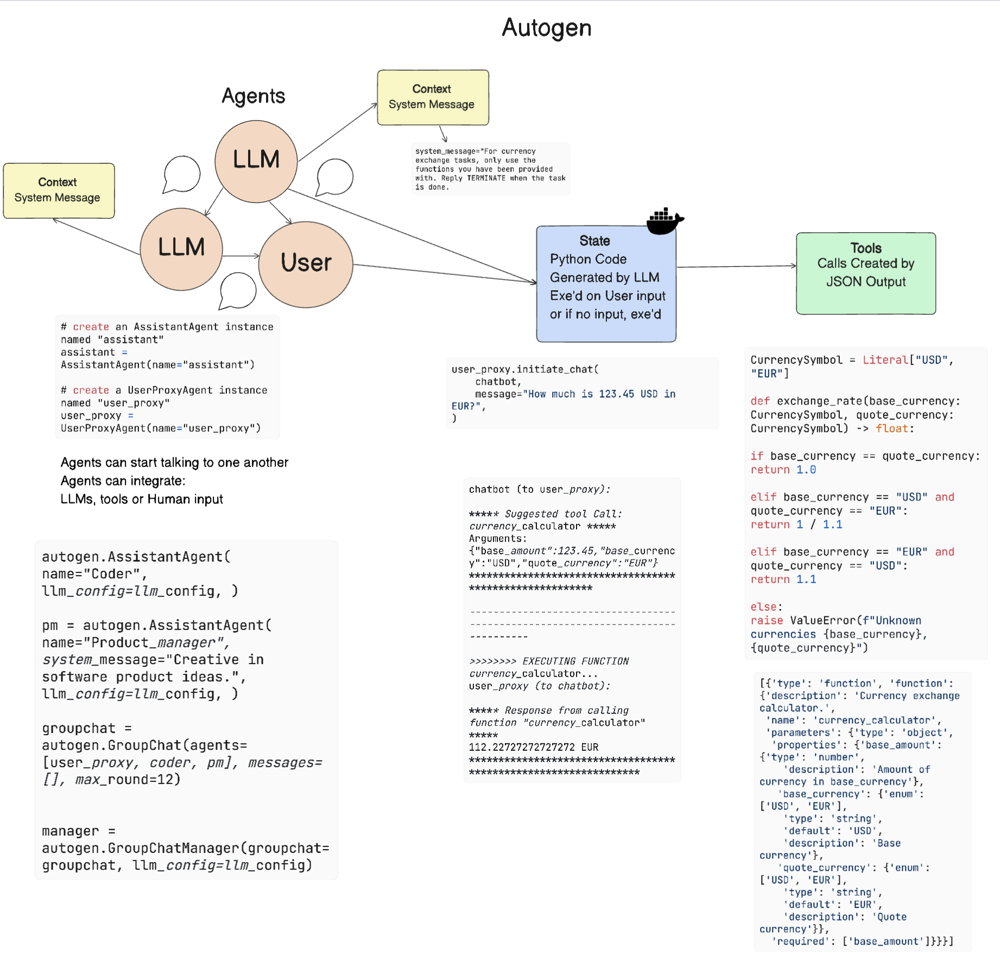

#### LLM Didefinisikan dengan System Message

```python
system_message="For weather related tasks, only use the functions you have been provided with. Reply TERMINATE when the task is done."
```

System message ini mengarahkan LLM tertentu tentang fungsi mana yang relevan untuk tugasnya. Ingat, dengan AutoGen kamu bisa punya banyak `AssistantAgent` dengan system message berbeda-beda.

#### Percakapan Dimulai oleh Pengguna

```python
user_proxy.initiate_chat( chatbot, message="I am planning a trip to NYC next week, can you help me pick out what to wear? ", )

```

Pesan dari user_proxy (manusia) inilah yang memulai proses Agent menjelajahi fungsi-fungsi yang mungkin perlu dieksekusi.

#### Fungsi Dieksekusi

```bash
chatbot (to user_proxy):

***** Suggested tool Call: get_weather ***** Arguments: {"location":"New York City, NY","time_periond:"7","temperature_unit":"Celsius"} ******************************************************** --------------------------------------------------------------------------------

>>>>>>>> EXECUTING FUNCTION get_weather... user_proxy (to chatbot): ***** Response from calling function "get_weather" ***** 112.22727272727272 EUR ****************************************************************

```

Setelah chat awal diproses, Agent mengirimkan usulan tool yang perlu dipanggil. Dalam kasus ini, fungsi bernama `get_weather`. Tergantung konfigurasimu, fungsi ini bisa dieksekusi otomatis dan dibaca oleh Agent, atau dieksekusi berdasarkan masukan pengguna.

Kamu bisa menemukan daftar [contoh kode AutoGen](https://microsoft.github.io/autogen/docs/Examples/?WT.mc_id=academic-105485-koreyst) untuk eksplorasi lebih lanjut.

## Microsoft Agent Framework

[Microsoft Agent Framework](https://learn.microsoft.com/agent-framework/?WT.mc_id=academic-105485-koreyst) adalah SDK open-source dari Microsoft untuk membangun AI Agent dan sistem multi-agent, tersedia untuk **Python** dan **.NET**. Framework ini menggabungkan kekuatan dua proyek Microsoft sebelumnya — fitur enterprise dari **Semantic Kernel** dan orkestrasi multi-agent dari **AutoGen** — menjadi satu framework tunggal yang didukung resmi. Jika kamu memulai proyek agent baru hari ini, inilah penerus AutoGen yang direkomendasikan.

Framework ini bisa menskalakan dari satu **chat agent** sederhana sampai **alur kerja multi-agent** yang kompleks, dan terintegrasi langsung dengan Microsoft Foundry, Azure OpenAI, serta OpenAI. Ia juga menyediakan observability bawaan lewat OpenTelemetry, sehingga kamu bisa melacak persis apa yang dilakukan agent-mu.

### State dan Tools

**State** — Framework mengelola konteks percakapan untukmu melalui **threads**. Agent menyimpan riwayat pesan (permintaan pengguna, pemanggilan tool, dan hasilnya), sehingga tiap giliran percakapan dibangun di atas giliran sebelumnya. Thread juga bisa dipersistenkan, memungkinkan percakapan dijeda dan dilanjutkan nanti.

**Tools** — Kamu memberi agent tools dengan meneruskan fungsi Python biasa. Parameter yang diberi anotasi tipe otomatis diubah menjadi skema, sehingga model tahu bagaimana dan kapan memanggilnya (function calling). Framework ini juga mendukung server Model Context Protocol (MCP) dan hosted tools seperti code interpreter.

Berikut contoh satu agent dengan tool kustom:

```python
import asyncio
from typing import Annotated

from pydantic import Field
from agent_framework import Agent
from agent_framework.openai import OpenAIChatClient


def get_weather(
    location: Annotated[str, Field(description="The location to get the weather for.")],
) -> str:
    """Get the weather for a given location."""
    return f"The weather in {location} is sunny with a high of 22°C."


async def main():
    agent = Agent(
        client=OpenAIChatClient(),
        instructions="You are a helpful assistant that can answer weather questions.",
        tools=[get_weather],
    )

    response = await agent.run("What's the weather in Amsterdam?")
    print(response)


asyncio.run(main())
```

Untuk terhubung ke Azure OpenAI di Microsoft Foundry, cukup teruskan endpoint dan kredensialmu ke client:

```python
from azure.identity.aio import AzureCliCredential
from agent_framework.openai import OpenAIChatClient

client = OpenAIChatClient(
    model="my-gpt-5-mini-deployment",
    azure_endpoint="https://my-resource.openai.azure.com",
    credential=AzureCliCredential(),
)
```

### Alur Kerja Multi-Agent

Keunggulan utama framework ini adalah mengorkestrasi beberapa agent sekaligus. Misalnya, kamu bisa menjalankan agent satu per satu secara berurutan (masing-masing meneruskan konteksnya ke agent berikutnya) atau menyebar (fan out) ke beberapa agent secara paralel lalu menggabungkan hasilnya:

```python
from agent_framework.orchestrations import SequentialBuilder, ConcurrentBuilder

# Run agents in sequence, passing the conversation context along the chain
sequential = SequentialBuilder(participants=[researcher, writer, editor]).build()

# Fan out to agents in parallel, then aggregate their responses
concurrent = ConcurrentBuilder(participants=[analyst_a, analyst_b, analyst_c]).build()
```

Untuk menginstal framework dan memulai:

```bash
pip install agent-framework-core
# Optional integrations
pip install agent-framework-openai       # OpenAI and Azure OpenAI
pip install agent-framework-foundry      # Microsoft Foundry
```

Kamu bisa mengeksplorasi lebih jauh di [repositori Microsoft Agent Framework](https://github.com/microsoft/agent-framework?WT.mc_id=academic-105485-koreyst) dan [dokumentasi resminya](https://learn.microsoft.com/agent-framework/?WT.mc_id=academic-105485-koreyst).

## Taskweaver

Framework agent berikutnya adalah [Taskweaver](https://microsoft.github.io/TaskWeaver/?WT.mc_id=academic-105485-koreyst). Ia dikenal sebagai agent "code-first" karena alih-alih bekerja hanya dengan `string`, ia bisa bekerja dengan DataFrame di Python. Ini sangat berguna untuk tugas analisis dan pembuatan data — misalnya membuat grafik dan diagram, atau menghasilkan bilangan acak.

### State dan Tools

Untuk mengelola state percakapan, TaskWeaver memakai konsep `Planner`. `Planner` adalah LLM yang menerima permintaan pengguna dan memetakan tugas-tugas yang perlu diselesaikan untuk memenuhi permintaan itu.

Untuk menyelesaikan tugas, `Planner` diberi akses ke koleksi tools bernama `Plugins` — bisa berupa class Python atau code interpreter umum. Plugin-plugin ini disimpan sebagai embeddings agar LLM lebih mudah mencari plugin yang tepat.

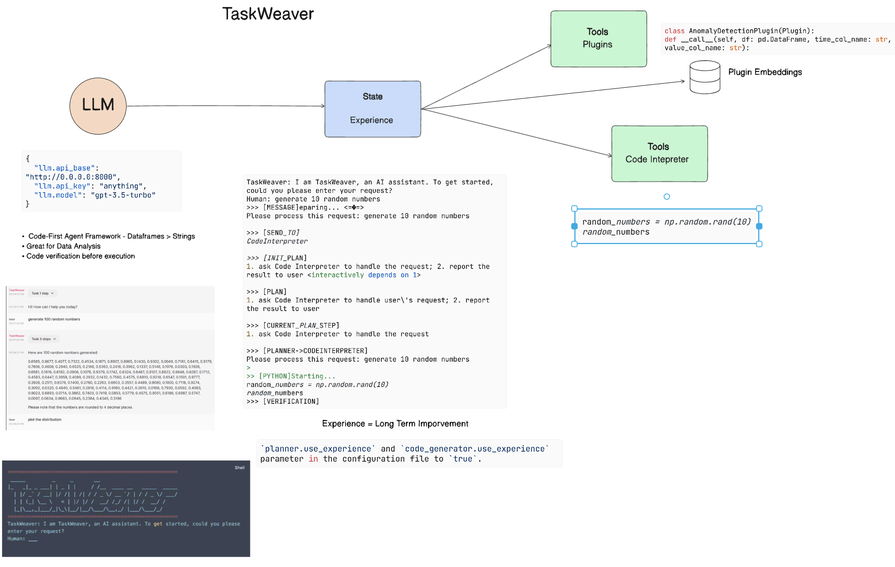

Berikut contoh plugin untuk menangani deteksi anomali:

```python
class AnomalyDetectionPlugin(Plugin): def __call__(self, df: pd.DataFrame, time_col_name: str, value_col_name: str):
```

Kode diverifikasi sebelum dieksekusi. Fitur lain untuk mengelola konteks di Taskweaver adalah `experience`. Experience memungkinkan konteks percakapan disimpan jangka panjang dalam file YAML. Ini bisa dikonfigurasi agar LLM makin baik pada tugas tertentu seiring waktu, karena ia terpapar percakapan-percakapan sebelumnya.

## JARVIS

Framework agent terakhir yang kita jelajahi adalah [JARVIS](https://github.com/microsoft/JARVIS?tab=readme-ov-file&WT.mc_id=academic-105485-koreyst). Keunikan JARVIS: ia memakai LLM untuk mengelola `state` percakapan, sedangkan `tools`-nya adalah model-model AI lain. Masing-masing adalah model terspesialisasi untuk tugas tertentu seperti deteksi objek, transkripsi, atau pemberian keterangan gambar (image captioning).

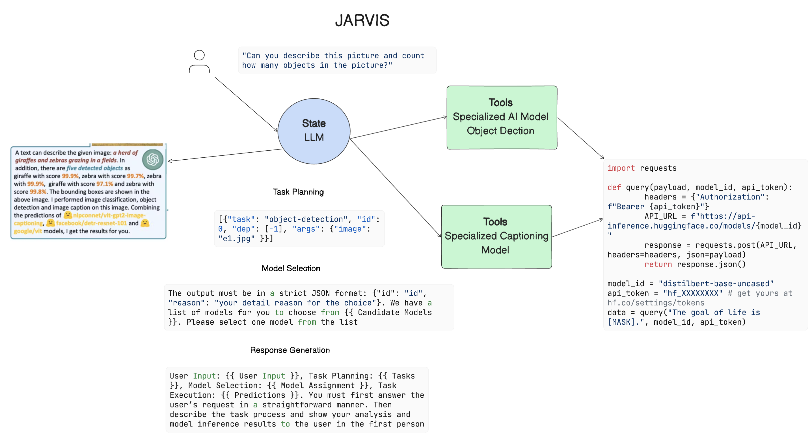

LLM, sebagai model serba guna, menerima permintaan pengguna lalu mengidentifikasi tugas spesifik beserta argumen/data yang dibutuhkan untuk menyelesaikannya.

```python
[{"task": "object-detection", "id": 0, "dep": [-1], "args": {"image": "e1.jpg" }}]
```

LLM kemudian memformat permintaan itu ke bentuk yang bisa ditafsirkan model AI terspesialisasi, misalnya JSON. Setelah model AI mengembalikan prediksinya, LLM menerima responsnya.

Jika beberapa model dibutuhkan untuk menyelesaikan tugas, LLM juga menafsirkan respons dari model-model itu sebelum menggabungkannya menjadi jawaban untuk pengguna.

Contoh di bawah menunjukkan cara kerjanya saat pengguna meminta deskripsi dan jumlah objek dalam sebuah gambar:

## Tugas

Untuk melanjutkan pembelajaranmu tentang AI Agent, kamu bisa membangun dengan Microsoft Agent Framework:

- Aplikasi yang menyimulasikan rapat bisnis dengan berbagai departemen dari sebuah startup pendidikan.
- Buat system message yang memandu LLM memahami persona dan prioritas yang berbeda-beda, lalu izinkan pengguna mem-pitch ide produk baru.
- LLM kemudian menghasilkan pertanyaan lanjutan dari tiap departemen untuk mempertajam dan memperbaiki pitch serta ide produk tersebut.

## Belajar Tidak Berhenti di Sini, Lanjutkan Perjalananmu

Setelah menyelesaikan pelajaran ini, kunjungi [koleksi pembelajaran Generative AI](https://aka.ms/genai-collection?WT.mc_id=academic-105485-koreyst) untuk terus menaikkan level pengetahuan Generative AI-mu!


---

<a id="18-fine-tuning"></a>


# Fine-Tuning LLM-mu

Menggunakan large language model untuk membangun aplikasi generative AI membawa tantangan baru. Isu kuncinya adalah memastikan kualitas respons (akurasi dan relevansi) pada konten yang dihasilkan model untuk permintaan pengguna. Di pelajaran-pelajaran sebelumnya, kita membahas teknik seperti prompt engineering dan retrieval-augmented generation yang mencoba menyelesaikan masalah dengan _memodifikasi masukan prompt_ ke model yang sudah ada.

Di pelajaran hari ini, kita membahas teknik ketiga, **fine-tuning**, yang mencoba menjawab tantangan tersebut dengan _melatih ulang modelnya sendiri_ menggunakan data tambahan. Mari kita selami detailnya.

## Tujuan Belajar

Pelajaran ini memperkenalkan konsep fine-tuning untuk model bahasa pre-trained, mengeksplorasi manfaat dan tantangan pendekatan ini, serta memberi panduan kapan dan bagaimana memakai fine-tuning untuk meningkatkan performa model generative AI-mu.

Di akhir pelajaran, kamu diharapkan bisa menjawab pertanyaan berikut:

- Apa itu fine-tuning untuk model bahasa?
- Kapan, dan mengapa, fine-tuning berguna?
- Bagaimana cara melakukan fine-tuning pada model pre-trained?
- Apa saja keterbatasan fine-tuning?

Siap? Mari kita mulai.

## Panduan Bergambar

Ingin melihat gambaran besar materi sebelum menyelam lebih dalam? Lihat panduan bergambar ini yang menggambarkan perjalanan belajar pelajaran ini — dari konsep inti dan motivasi fine-tuning, sampai memahami proses dan praktik terbaik menjalankan tugas fine-tuning. Topik ini sangat menarik untuk dieksplorasi, jadi jangan lupa cek halaman [Sumber Belajar](#18-resources) untuk tautan tambahan pendukung belajar mandirimu!

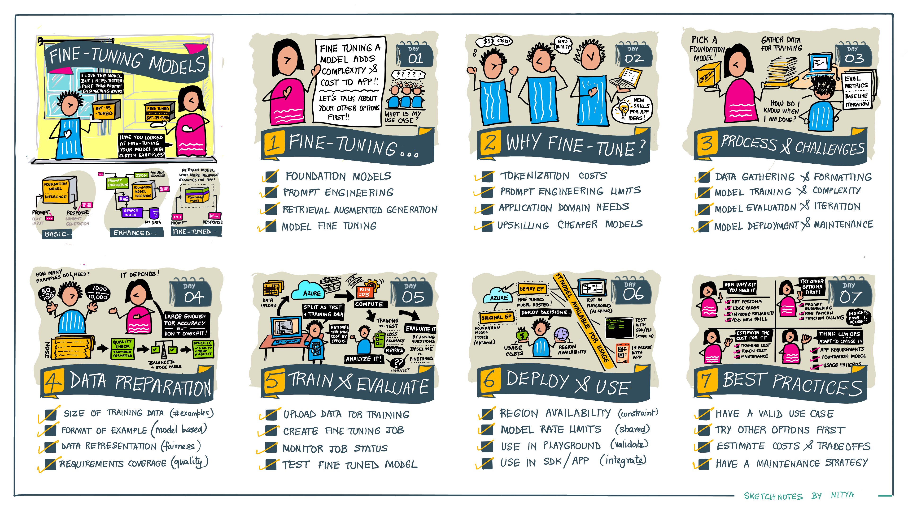

## Apa Itu Fine-Tuning untuk Model Bahasa?

Menurut definisinya, large language model itu _pre-trained_ (dilatih terlebih dahulu) pada teks dalam jumlah besar dari beragam sumber, termasuk internet. Seperti yang sudah kita pelajari, kita butuh teknik seperti _prompt engineering_ dan _retrieval-augmented generation_ untuk meningkatkan kualitas respons model terhadap pertanyaan pengguna ("prompt").

Salah satu teknik prompt engineering yang populer adalah memberi model panduan lebih tentang apa yang diharapkan dalam respons, baik lewat _instruksi_ (panduan eksplisit) maupun _beberapa contoh_ (panduan implisit). Ini disebut _few-shot learning_, tetapi punya dua keterbatasan:

- Batas token model dapat membatasi jumlah contoh yang bisa diberikan, sehingga membatasi efektivitas.
- Biaya token model bisa membuat penambahan contoh di setiap prompt jadi mahal, sehingga membatasi fleksibilitas.

Fine-tuning adalah praktik umum dalam sistem machine learning: kita mengambil model pre-trained lalu melatihnya ulang dengan data baru untuk meningkatkan performanya pada tugas spesifik. Dalam konteks model bahasa, kita bisa melakukan fine-tuning model pre-trained _dengan kumpulan contoh terkurasi untuk tugas atau domain aplikasi tertentu_ demi menciptakan **model kustom** yang mungkin lebih akurat dan relevan untuk tugas atau domain itu. Manfaat sampingan fine-tuning: mengurangi jumlah contoh yang dibutuhkan untuk few-shot learning — menekan pemakaian token dan biaya terkait.

## Kapan dan Mengapa Perlu Fine-Tuning?

Dalam konteks _ini_, ketika bicara fine-tuning, yang kita maksud adalah **supervised** fine-tuning, di mana pelatihan ulang dilakukan dengan **menambahkan data baru** yang bukan bagian dari dataset pelatihan awal. Ini berbeda dari pendekatan unsupervised fine-tuning, di mana model dilatih ulang pada data awal tetapi dengan hyperparameter berbeda.

Yang penting diingat: fine-tuning adalah teknik lanjutan yang membutuhkan tingkat keahlian tertentu agar hasilnya sesuai harapan. Jika dilakukan keliru, ia mungkin tidak memberikan peningkatan yang diharapkan — bahkan bisa menurunkan performa model pada domain targetmu.

Jadi, sebelum belajar "bagaimana" melakukan fine-tuning model bahasa, kamu perlu tahu "mengapa" harus mengambil jalur ini, dan "kapan" memulai prosesnya. Mulailah dengan menanyakan hal-hal berikut pada dirimu:

- **Kasus Penggunaan**: Apa _kasus penggunaan_ fine-tuning-mu? Aspek apa dari model pre-trained saat ini yang ingin kamu tingkatkan?
- **Alternatif**: Sudahkah kamu mencoba _teknik lain_ untuk mencapai hasil yang diinginkan? Gunakan itu sebagai baseline pembanding.
  - Prompt engineering: Coba teknik seperti few-shot prompting dengan contoh respons prompt yang relevan. Evaluasi kualitas responsnya.
  - Retrieval Augmented Generation: Coba melengkapi prompt dengan hasil kueri dari pencarian datamu. Evaluasi kualitas responsnya.
- **Biaya**: Sudahkah kamu mengidentifikasi biaya fine-tuning?
  - Tunability — apakah model pre-trained itu tersedia untuk fine-tuning?
  - Usaha — untuk menyiapkan data latih, mengevaluasi & menyempurnakan model.
  - Komputasi — untuk menjalankan job fine-tuning dan men-deploy model hasilnya.
  - Data — akses ke contoh berkualitas dalam jumlah cukup agar fine-tuning berdampak.
- **Manfaat**: Sudahkah kamu mengonfirmasi manfaat fine-tuning?
  - Kualitas — apakah model hasil fine-tuning mengungguli baseline?
  - Biaya — apakah ia mengurangi pemakaian token dengan menyederhanakan prompt?
  - Ekstensibilitas — bisakah model dasarnya dipakai ulang untuk domain baru?

Dengan menjawab pertanyaan-pertanyaan ini, kamu bisa memutuskan apakah fine-tuning adalah pendekatan yang tepat untuk kasusmu. Idealnya, pendekatan ini valid hanya jika manfaatnya melebihi biayanya. Begitu memutuskan lanjut, saatnya memikirkan _bagaimana_ melakukan fine-tuning pada model pre-trained.

## Bagaimana Cara Fine-Tuning Model Pre-Trained?

Untuk melakukan fine-tuning model pre-trained, kamu perlu punya:

- model pre-trained yang akan di-fine-tune
- dataset yang dipakai untuk fine-tuning
- lingkungan training untuk menjalankan job fine-tuning
- lingkungan hosting untuk men-deploy model hasil fine-tuning

## Fine-Tuning di Microsoft Foundry

[Microsoft Foundry](https://ai.azure.com?WT.mc_id=academic-105485-koreyst) adalah tempat kamu melakukan fine-tuning, deployment, dan pengelolaan model kustom di Azure saat ini (menggabungkan yang dulu bernama Azure OpenAI Studio dan Azure AI Studio). Sebelum memulai sebuah job, ada baiknya memahami pilihan yang diberikan Foundry — dan praktik terbaik yang direkomendasikan platform. Di balik layar, Foundry memakai **LoRA (low-rank adaptation)** untuk fine-tuning model secara efisien, sehingga training lebih cepat dan lebih murah daripada melatih ulang semua bobot.

### Langkah 1: Pilih Teknik Training

Foundry mendukung tiga teknik fine-tuning. **Mulailah dengan SFT** — teknik ini mencakup skenario paling luas.

| Teknik | Apa yang dilakukannya | Kapan dipakai |
| --- | --- | --- |
| **Supervised Fine-Tuning (SFT)** | Melatih model pada pasangan contoh input/output sehingga model belajar menghasilkan respons yang kamu inginkan. | Pilihan default untuk sebagian besar tugas: spesialisasi domain, performa tugas, gaya dan nada, kepatuhan pada instruksi, serta adaptasi bahasa. |
| **Direct Preference Optimization (DPO)** | Belajar dari pasangan respons _disukai vs tidak disukai_ untuk menyelaraskan keluaran dengan preferensi manusia. | Meningkatkan kualitas respons, keamanan, dan alignment ketika kamu punya umpan balik komparatif. |
| **Reinforcement Fine-Tuning (RFT)** | Memakai sinyal reward dari _grader_ untuk mengoptimalkan perilaku kompleks dengan reinforcement learning. | Domain objektif yang berat penalaran (matematika, kimia, fisika) dengan jawaban benar/salah yang jelas. Membutuhkan keahlian ML lebih tinggi. |

### Langkah 2: Pilih Tier Training

Foundry memberimu pilihan bagaimana dan di mana training berjalan:

- **Standard** — training di region resource-mu dan menjamin data residency. Pakai ini jika data harus tetap berada di region tertentu.
- **Global** — lebih murah dan antreannya lebih cepat karena memakai kapasitas di luar region-mu (data dan bobot disalin ke region training). Default yang baik jika data residency bukan syarat.
- **Developer** — biaya terendah, memakai kapasitas idle tanpa jaminan latensi/SLA (job bisa dihentikan sementara lalu dilanjutkan). Ideal untuk eksperimen.

### Langkah 3: Pilih Model Dasar

Model yang bisa di-fine-tune mencakup OpenAI `gpt-4o-mini`, `gpt-4o`, `gpt-4.1`, `gpt-4.1-mini`, dan `gpt-4.1-nano` (SFT; keluarga 4o/4.1 juga mendukung DPO), model reasoning `o4-mini` dan `gpt-5` (RFT), plus model open-source seperti `Ministral-3B`, `Qwen-32B`, `Llama-3.3-70B-Instruct`, dan `gpt-oss-20b` (SFT pada resource Foundry). Selalu cek [daftar model fine-tuning](https://learn.microsoft.com/azure/ai-foundry/foundry-models/concepts/models-sold-directly-by-azure?WT.mc_id=academic-105485-koreyst#fine-tuning-models) terkini untuk metode yang didukung, region, dan ketersediaannya.

> Foundry menawarkan dua modalitas: **serverless** (harga berbasis pemakaian, tanpa mengelola kuota GPU, untuk model OpenAI dan model terpilih) dan **managed compute** (bawa VM sendiri via Azure Machine Learning untuk jangkauan model terluas). Kebanyakan orang sebaiknya mulai dari serverless.

### Praktik Terbaik di Foundry

- **Ukur baseline dulu.** Ukur model dasar dengan prompt engineering dan RAG _sebelum_ fine-tuning, supaya kamu bisa membuktikan peningkatannya.
- **Mulai kecil, lalu skalakan.** Awali dengan 50–100 contoh berkualitas tinggi untuk memvalidasi pendekatan, lalu naikkan ke 500+ untuk produksi. Kualitas mengalahkan kuantitas — pangkas contoh yang berkualitas rendah.
- **Format data dengan benar.** File training dan validasi harus JSONL, UTF-8 **dengan BOM**, di bawah 512 MB, memakai format pesan chat-completions. Selalu sertakan file validasi agar kamu bisa memantau overfitting.
- **Pertahankan system prompt training saat inference.** Gunakan system message yang sama ketika memanggil model dengan yang dipakai saat training.
- **Evaluasi checkpoint — jangan asal deploy yang terakhir.** Foundry menyimpan tiga epoch terakhir sebagai checkpoint yang bisa di-deploy; pilih yang paling baik generalisasinya dengan memantau `train_loss` / `valid_loss` dan akurasi token.
- **Ukur biaya token bersama kualitas** saat membandingkan model hasil fine-tuning dengan baseline.
- **Iterasi dengan continuous fine-tuning.** Kamu bisa melakukan fine-tuning atas model yang sudah di-fine-tune dengan data baru (didukung untuk model OpenAI).
- **Perhatikan biaya hosting.** Model kustom yang di-deploy ditagih per jam, dan deployment yang tidak aktif dihapus setelah 15 hari — bersihkan yang tidak kamu perlukan.

Kerjakan panduan lengkapnya di [Customize a model with fine-tuning](https://learn.microsoft.com/azure/ai-foundry/openai/how-to/fine-tuning?WT.mc_id=academic-105485-koreyst), dan lihat panduan [DPO](https://learn.microsoft.com/azure/ai-foundry/openai/how-to/fine-tuning-direct-preference-optimization?WT.mc_id=academic-105485-koreyst) serta [RFT](https://learn.microsoft.com/azure/ai-foundry/openai/how-to/reinforcement-fine-tuning?WT.mc_id=academic-105485-koreyst) saat kamu siap dengan teknik lainnya.

## Fine-Tuning dalam Praktik

Sumber-sumber berikut menyediakan tutorial langkah demi langkah dengan contoh nyata pada model yang masih didukung, memakai dataset terkurasi. Untuk mengerjakannya, kamu butuh akun pada penyedia terkait beserta akses ke model dan dataset yang relevan.

| Penyedia     | Tutorial                                                                                                                                                                       | Deskripsi                                                                                                                                                                                                                                                                                                                                                                                                                        |
| ------------ | ------------------------------------------------------------------------------------------------------------------------------------------------------------------------------ | ---------------------------------------------------------------------------------------------------------------------------------------------------------------------------------------------------------------------------------------------------------------------------------------------------------------------------------------------------------------------------------------------------------------------------------- |
| OpenAI       | [How to fine-tune chat models](https://github.com/openai/openai-cookbook/blob/main/examples/How_to_finetune_chat_models.ipynb?WT.mc_id=academic-105485-koreyst)                | Belajar fine-tuning model chat OpenAI terbaru untuk domain spesifik ("asisten resep") dengan menyiapkan data training, menjalankan job fine-tuning, lalu memakai model hasil fine-tuning untuk inference.                                                                                                                                                                                                                              |
| Microsoft Foundry | [Customize a model with fine-tuning](https://learn.microsoft.com/azure/ai-foundry/openai/tutorials/fine-tune?WT.mc_id=academic-105485-koreyst) | Belajar fine-tuning model yang masih didukung seperti `gpt-4.1-mini` **di Azure** dengan Microsoft Foundry: menyiapkan & mengunggah data training dan validasi, menjalankan job fine-tuning, lalu men-deploy & memakai model barunya.                                                                                                                                                                                                                                                                 |
| Hugging Face | [Fine-tuning LLMs with Hugging Face](https://www.philschmid.de/fine-tune-llms-in-2024-with-trl?WT.mc_id=academic-105485-koreyst)                                               | Blog post ini memandu fine-tuning _LLM terbuka_ (contoh: `CodeLlama 7B`) memakai pustaka [transformers](https://huggingface.co/docs/transformers/index?WT.mc_id=academic-105485-koreyst) & [Transformer Reinforcement Learning (TRL)](https://huggingface.co/docs/trl/index?WT.mc_id=academic-105485-koreyst) dengan [datasets](https://huggingface.co/docs/datasets/index?WT.mc_id=academic-105485-koreyst) terbuka di Hugging Face. |
|              |                                                                                                                                                                                |                                                                                                                                                                                                                                                                                                                                                                                                                                    |
| 🤗 AutoTrain | [Fine-tuning LLMs with AutoTrain](https://github.com/huggingface/autotrain-advanced/?WT.mc_id=academic-105485-koreyst)                                                         | AutoTrain (atau AutoTrain Advanced) adalah pustaka Python dari Hugging Face untuk fine-tuning berbagai tugas, termasuk fine-tuning LLM. AutoTrain adalah solusi no-code dan fine-tuning bisa dilakukan di cloud milikmu sendiri, di Hugging Face Spaces, atau secara lokal. Ia mendukung GUI berbasis web, CLI, dan training via file konfigurasi yaml.                                                                               |
|              |                                                                                                                                                                                |                                                                                                                                                                                                                                                                                                                                                                                                                                    |
| 🦥 Unsloth | [Fine-tuning LLMs with Unsloth](https://github.com/unslothai/unsloth?WT.mc_id=academic-105485-koreyst)                                                         | Unsloth adalah framework open-source yang mendukung fine-tuning LLM dan reinforcement learning (RL). Unsloth mempermudah training, evaluasi, dan deployment lokal dengan [notebooks](https://github.com/unslothai/notebooks?WT.mc_id=academic-105485-koreyst) siap pakai. Ia juga mendukung text-to-speech (TTS), BERT, dan model multimodal. Untuk memulai, baca [Fine-tuning LLMs Guide](https://docs.unsloth.ai/get-started/fine-tuning-llms-guide) mereka.                                                                          |
|              |                                                                                                                                                                                |                                                                                                                                                                                                                                                                                                                                                                                                                                    |
## Tugas

Pilih salah satu tutorial di atas dan kerjakan sampai selesai. _Kami mungkin mereplikasi versi tutorial ini dalam Jupyter Notebook di repo ini hanya sebagai referensi. Gunakan sumber aslinya langsung untuk mendapatkan versi terbaru_.

## Kerja Bagus! Lanjutkan Belajarmu.

Setelah menyelesaikan pelajaran ini, kunjungi [koleksi pembelajaran Generative AI](https://aka.ms/genai-collection?WT.mc_id=academic-105485-koreyst) untuk terus menaikkan level pengetahuan Generative AI-mu!

Selamat!! Kamu telah menyelesaikan pelajaran terakhir dari seri v2 kursus ini! Jangan berhenti belajar dan membangun. \*\*Lihat halaman [SUMBER BELAJAR](#18-resources) untuk daftar saran tambahan seputar topik ini.

Seri pelajaran v1 kami juga sudah diperbarui dengan lebih banyak tugas dan konsep. Luangkan waktu untuk menyegarkan pengetahuanmu — dan silakan [bagikan pertanyaan dan masukanmu](https://github.com/microsoft/generative-ai-for-beginners/issues?WT.mc_id=academic-105485-koreyst) untuk membantu kami memperbaiki pelajaran-pelajaran ini bagi komunitas.


---

<a id="18-resources"></a>

# Sumber Belajar Mandiri

Pelajaran ini dibangun memakai sumber-sumber inti dari OpenAI dan Microsoft Foundry sebagai rujukan terminologi dan tutorial. Berikut daftar (tidak lengkap) untuk perjalanan belajar mandirimu. Setiap tautan di bawah menunjuk ke materi yang masih terkini dan didukung.

## 1. Sumber Utama

| Title/Link | Description |
| :--- | :--- |
| [Fine-tuning with OpenAI Models](https://platform.openai.com/docs/guides/fine-tuning?WT.mc_id=academic-105485-koreyst) | Fine-tuning improves on few-shot learning by training on many more examples than can fit in the prompt - saving costs, improving response quality, and enabling lower-latency requests. **Get an overview of fine-tuning from OpenAI.** |
| [When to use Microsoft Foundry fine-tuning](https://learn.microsoft.com/azure/ai-foundry/openai/concepts/fine-tuning-considerations?WT.mc_id=academic-105485-koreyst) | Understand **what fine-tuning is (concept)**, why you should consider it, what data to use, and how to measure quality - plus when SFT, DPO, or RFT is the right fit. |
| [Customize a model with fine-tuning](https://learn.microsoft.com/azure/ai-foundry/openai/how-to/fine-tuning?WT.mc_id=academic-105485-koreyst) | The end-to-end **how-to (process)** for fine-tuning in Microsoft Foundry using the portal, the OpenAI / Foundry Python SDK, or the REST API - covering data prep, training, checkpoints, and deployment. |
| [Continuous fine-tuning](https://learn.microsoft.com/azure/ai-foundry/openai/how-to/fine-tuning?WT.mc_id=academic-105485-koreyst#perform-continuous-fine-tuning) | The iterative process of selecting an already fine-tuned model as the base model and **fine-tuning it further** on new sets of training examples. |
| [Fine-tuning with tool (function) calling](https://learn.microsoft.com/azure/ai-foundry/openai/how-to/fine-tuning-functions?WT.mc_id=academic-105485-koreyst) | Fine-tuning your model **with tool-calling examples** improves output - more accurate, consistent, similarly-formatted responses using fewer prompt tokens. |
| [Fine-tuning models: Microsoft Foundry guidance](https://learn.microsoft.com/azure/ai-foundry/foundry-models/concepts/models-sold-directly-by-azure?WT.mc_id=academic-105485-koreyst#fine-tuning-models) | Look up **which models can be fine-tuned**, the methods they support (SFT / DPO / RFT), and the regions where they're available. |
| [Fine-tuning overview: techniques and modalities](https://learn.microsoft.com/azure/ai-foundry/concepts/fine-tuning-overview?WT.mc_id=academic-105485-koreyst) | Compare the three training techniques (SFT, DPO, RFT) and the two modalities (serverless vs. managed compute), with guidance on choosing a base model and getting started. |
| **Tutorial**: [Fine-tune a model in Microsoft Foundry](https://learn.microsoft.com/azure/ai-foundry/openai/tutorials/fine-tune?WT.mc_id=academic-105485-koreyst) | Create a sample dataset, prepare for fine-tuning, run a fine-tuning job on a currently supported model such as `gpt-4.1-mini`, and deploy the fine-tuned model on Azure. |
| **Tutorial**: [Fine-tune models with serverless API deployments](https://learn.microsoft.com/azure/ai-foundry/how-to/fine-tune-serverless?WT.mc_id=academic-105485-koreyst) | Tailor open and partner models (Phi, Llama, Mistral, and more) to your datasets _using a low-code, UI-based workflow_ in Microsoft Foundry. |
| **Tutorial**: [Fine-tune Hugging Face models on Azure Databricks](https://learn.microsoft.com/azure/databricks/machine-learning/train-model/huggingface/fine-tune-model?WT.mc_id=academic-105485-koreyst) | Fine-tune a Hugging Face model with the `transformers` library on a single GPU using Azure Databricks and the Hugging Face Trainer. |
| **Training**: [Fine-tune a foundation model with Azure Machine Learning](https://learn.microsoft.com/training/modules/finetune-foundation-model-with-azure-machine-learning/?WT.mc_id=academic-105485-koreyst) | The Azure Machine Learning model catalog offers many open-source models you can fine-tune. Part of the [Azure ML Generative AI Learning Path](https://learn.microsoft.com/training/paths/work-with-generative-models-azure-machine-learning/?WT.mc_id=academic-105485-koreyst). |
| **Tutorial**: [Azure OpenAI fine-tuning with Weights & Biases](https://docs.wandb.ai/guides/integrations/azure-openai-fine-tuning?WT.mc_id=academic-105485-koreyst) | Track and analyze fine-tuning runs on Azure with W&B. Extends the OpenAI fine-tuning guide with Azure-specific steps and experiment tracking. |

## 2. Sumber Tambahan

Bagian ini memuat sumber-sumber lain yang layak dieksplorasi tapi tidak sempat kita bahas di pelajaran. Gunakan untuk membangun keahlianmu sendiri seputar topik ini.

| Title/Link | Description |
| :--- | :--- |
| **OpenAI Cookbook**: [Data preparation and analysis for chat model fine-tuning](https://cookbook.openai.com/examples/chat_finetuning_data_prep?WT.mc_id=academic-105485-koreyst) | Preprocess and analyze a chat dataset before fine-tuning: check for format errors, get basic statistics, and estimate token counts (and cost). Pairs with the [OpenAI fine-tuning guide](https://platform.openai.com/docs/guides/fine-tuning?WT.mc_id=academic-105485-koreyst). |
| **OpenAI Cookbook**: [Fine-tuning for Retrieval Augmented Generation (RAG) with Qdrant](https://cookbook.openai.com/examples/fine-tuned_qa/ft_retrieval_augmented_generation_qdrant?WT.mc_id=academic-105485-koreyst) | A comprehensive example of fine-tuning OpenAI models for RAG, integrating Qdrant and few-shot learning to boost performance and reduce fabrications. |
| **OpenAI Cookbook**: [Fine-tuning GPT with Weights & Biases](https://cookbook.openai.com/examples/third_party/gpt_finetuning_with_wandb?WT.mc_id=academic-105485-koreyst) | Use W&B to track model training and fine-tuning. Read their [OpenAI Fine-Tuning](https://docs.wandb.ai/guides/integrations/openai-fine-tuning/?WT.mc_id=academic-105485-koreyst) guide first, then try the Cookbook exercise. |
| **Hugging Face Tutorial**: [How to Fine-Tune LLMs with Hugging Face TRL](https://www.philschmid.de/fine-tune-llms-in-2024-with-trl?WT.mc_id=academic-105485-koreyst) | Fine-tune open LLMs using Hugging Face TRL, Transformers, and datasets: define a use case, set up a dev environment, prepare a dataset, fine-tune, evaluate, and deploy. |
| **Hugging Face**: [AutoTrain Advanced](https://github.com/huggingface/autotrain-advanced?WT.mc_id=academic-105485-koreyst) | A no-code / low-code library from Hugging Face for fine-tuning many model types. Run it in your own cloud, on Hugging Face Spaces, or locally via GUI, CLI, or YAML config. |
| **Unsloth**: [Fine-tuning LLMs Guide](https://docs.unsloth.ai/get-started/fine-tuning-llms-guide) | An open-source framework that streamlines local LLM fine-tuning and reinforcement learning, with ready-to-use [notebooks](https://github.com/unslothai/notebooks?WT.mc_id=academic-105485-koreyst). |


---

<a id="19-slm"></a>

# Pengenalan Small Language Model untuk Pemula Generative AI
Generative AI adalah bidang kecerdasan buatan yang menarik, berfokus pada penciptaan sistem yang mampu menghasilkan konten baru — mulai dari teks dan gambar sampai musik, bahkan lingkungan virtual utuh. Salah satu penerapan generative AI yang paling seru ada di ranah model bahasa.

## Apa Itu Small Language Model?

Small Language Model (SLM) adalah varian "mini" dari large language model (LLM): ia memanfaatkan banyak prinsip arsitektur dan teknik LLM, tetapi dengan jejak komputasi yang jauh lebih kecil.

SLM adalah subset model bahasa yang dirancang menghasilkan teks menyerupai tulisan manusia. Berbeda dari saudara besarnya seperti GPT-4, SLM lebih ringkas dan efisien — ideal untuk aplikasi dengan sumber daya komputasi terbatas. Meski ukurannya lebih kecil, SLM tetap bisa mengerjakan beragam tugas. Umumnya SLM dibangun dengan mengompresi atau mendistilasi LLM, dengan tujuan mempertahankan sebagian besar fungsionalitas dan kemampuan linguistik model aslinya. Pengurangan ukuran model ini menurunkan kompleksitas keseluruhan, membuat SLM lebih efisien dari sisi pemakaian memori maupun kebutuhan komputasi. Dengan segala optimasi itu, SLM tetap mampu menjalankan berbagai tugas natural language processing (NLP):

- Text Generation: membuat kalimat atau paragraf yang koheren dan relevan dengan konteks.
- Text Completion: memprediksi dan melengkapi kalimat berdasarkan prompt yang diberikan.
- Translation: menerjemahkan teks dari satu bahasa ke bahasa lain.
- Summarization: meringkas teks panjang menjadi rangkuman yang lebih pendek dan mudah dicerna.

Tentu dengan sejumlah kompromi (trade-off) pada performa atau kedalaman pemahaman dibanding model yang lebih besar.

## Bagaimana Small Language Model Bekerja?
SLM dilatih pada data teks dalam jumlah besar. Selama pelatihan, ia mempelajari pola dan struktur bahasa, sehingga bisa menghasilkan teks yang benar secara tata bahasa sekaligus sesuai konteks. Proses pelatihannya melibatkan:

- Data Collection: mengumpulkan dataset teks berukuran besar dari berbagai sumber.
- Preprocessing: membersihkan dan menata data agar layak dipakai untuk training.
- Training: memakai algoritma machine learning untuk mengajari model memahami dan menghasilkan teks.
- Fine-Tuning: menyetel model untuk meningkatkan performanya pada tugas spesifik.

Pengembangan SLM sejalan dengan kebutuhan yang makin besar akan model yang bisa di-deploy di lingkungan dengan sumber daya terbatas, seperti perangkat mobile atau platform edge computing, di mana LLM skala penuh mungkin tidak praktis karena tuntutan sumber dayanya berat. Dengan berfokus pada efisiensi, SLM menyeimbangkan performa dengan keterjangkauan, membuka penerapan yang lebih luas di berbagai domain.

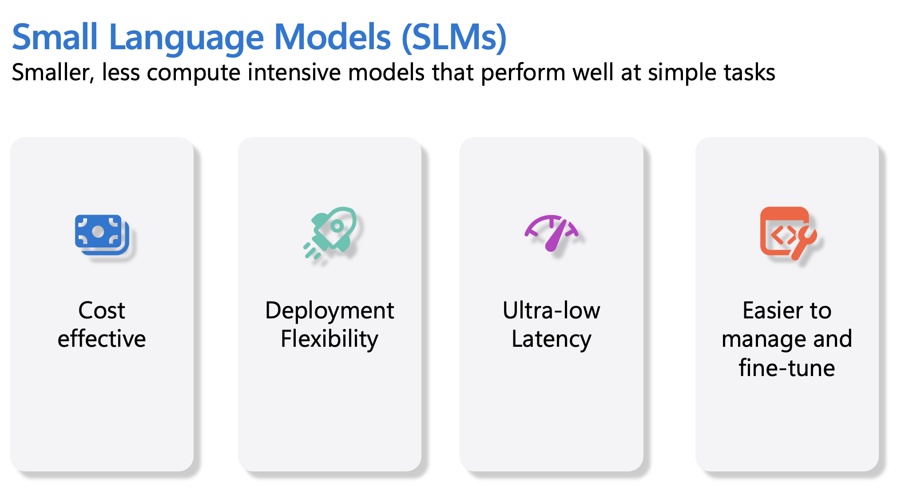

> **Catatan kelas:** praktikum pertemuan ini persis menguji ide bagian ini — kita mem-*benchmark* SLM vs model besar lewat server Ollama kampus (https://ollama.if.unismuh.ac.id): `smollm2:135m` (SLM sangat kecil) vs `llama3.2` (kelas menengah) vs `gemma3:27b` (model besar), membandingkan kecepatan dan kualitas jawabannya.

## Tujuan Belajar

Dalam pelajaran ini, kita akan berkenalan dengan SLM dan memadukannya dengan Microsoft Phi-3 untuk mempelajari berbagai skenario pada konten teks, vision, dan MoE.

Di akhir pelajaran, kamu diharapkan bisa menjawab pertanyaan berikut:

- Apa itu SLM?
- Apa perbedaan SLM dan LLM?
- Apa itu keluarga Microsoft Phi-3/3.5?
- Bagaimana menjalankan inference dengan keluarga Microsoft Phi-3/3.5?

Siap? Mari kita mulai.

## Perbedaan antara Large Language Model (LLM) dan Small Language Model (SLM)

Baik LLM maupun SLM dibangun di atas prinsip dasar probabilistic machine learning, dengan pendekatan serupa dalam desain arsitektur, metodologi training, proses pembuatan data, dan teknik evaluasi model. Namun, ada beberapa faktor kunci yang membedakan keduanya.

## Penerapan Small Language Model

SLM punya jangkauan penerapan luas, antara lain:

- Chatbot: memberi dukungan pelanggan dan berinteraksi dengan pengguna secara percakapan.
- Pembuatan Konten: membantu penulis menghasilkan ide, bahkan menyusun draf artikel utuh.
- Pendidikan: membantu siswa mengerjakan tugas menulis atau mempelajari bahasa baru.
- Aksesibilitas: membangun alat bantu untuk penyandang disabilitas, misalnya sistem text-to-speech.

**Ukuran**

Perbedaan utama LLM dan SLM terletak pada skala modelnya. LLM seperti ChatGPT (GPT-4) diperkirakan punya 1,76 triliun parameter, sementara SLM open-source seperti Mistral 7B dirancang dengan parameter jauh lebih sedikit — sekitar 7 miliar. Perbedaan ini terutama berasal dari arsitektur model dan proses training-nya. Misalnya, ChatGPT memakai mekanisme self-attention dalam kerangka encoder-decoder, sedangkan Mistral 7B memakai sliding window attention yang membuat training lebih efisien pada model decoder-only. Perbedaan arsitektur ini berdampak besar pada kompleksitas dan performa masing-masing model.

**Pemahaman**

SLM biasanya dioptimalkan untuk performa pada domain spesifik — sangat terspesialisasi, tetapi kemampuannya memahami konteks lintas banyak bidang pengetahuan bisa terbatas. Sebaliknya, LLM berupaya menyimulasikan kecerdasan menyerupai manusia pada level lebih menyeluruh. Dilatih pada dataset masif dan beragam, LLM dirancang tampil baik di berbagai domain, dengan fleksibilitas dan adaptabilitas lebih besar. Karena itu LLM lebih cocok untuk rentang tugas hilir (downstream) yang lebih luas, seperti natural language processing dan pemrograman.

**Komputasi**

Training dan deployment LLM sangat rakus sumber daya, kerap membutuhkan infrastruktur komputasi besar termasuk klaster GPU skala besar. Contohnya, melatih model seperti ChatGPT dari nol bisa membutuhkan ribuan GPU dalam waktu lama. SLM, dengan jumlah parameternya yang lebih kecil, jauh lebih terjangkau dari sisi sumber daya komputasi. Model seperti Mistral 7B bisa dilatih dan dijalankan di mesin lokal dengan GPU menengah — meski training-nya tetap butuh beberapa jam pada beberapa GPU.

**Bias**

Bias adalah isu yang dikenal pada LLM, terutama karena sifat data latihnya. Model-model ini umumnya mengandalkan data mentah yang tersedia terbuka di internet, yang bisa kurang atau salah merepresentasikan kelompok tertentu, mengandung label keliru, atau mencerminkan bias linguistik akibat dialek, variasi geografis, dan aturan tata bahasa. Selain itu, kompleksitas arsitektur LLM bisa tanpa sengaja memperparah bias, yang mungkin tak disadari tanpa fine-tuning yang cermat. Di sisi lain, SLM yang dilatih pada dataset lebih terbatas dan spesifik-domain secara alami lebih kecil risikonya terkena bias semacam ini — meski tidak sepenuhnya kebal.

**Inference**

Ukuran SLM yang lebih kecil memberi keunggulan signifikan pada kecepatan inference: ia bisa menghasilkan keluaran secara efisien di perangkat lokal tanpa butuh pemrosesan paralel yang ekstensif. Sebaliknya, LLM — karena ukuran dan kompleksitasnya — sering membutuhkan sumber daya komputasi paralel besar untuk mencapai waktu inference yang layak. Banyaknya pengguna bersamaan makin memperlambat waktu respons LLM, apalagi saat di-deploy dalam skala besar.

Singkatnya, meski LLM dan SLM berbagi fondasi machine learning yang sama, keduanya berbeda signifikan dalam ukuran model, kebutuhan sumber daya, pemahaman kontekstual, kerentanan bias, dan kecepatan inference. Perbedaan ini mencerminkan kecocokan masing-masing untuk kasus penggunaan berbeda: LLM lebih serba bisa tapi berat sumber daya, sedangkan SLM menawarkan efisiensi spesifik-domain dengan tuntutan komputasi lebih rendah.

***Catatan: Dalam pelajaran ini, kita memperkenalkan SLM memakai Microsoft Phi-3 / 3.5 sebagai contoh.***

## Mengenal Keluarga Phi-3 / Phi-3.5

Keluarga Phi-3 / 3.5 utamanya menyasar skenario aplikasi teks, vision, dan Agent (MoE):

### Phi-3 / 3.5 Instruct

Utamanya untuk text generation, chat completion, ekstraksi informasi konten, dsb.

**Phi-3-mini**

Model bahasa 3,8B ini tersedia di Microsoft Foundry, Hugging Face, dan Ollama. Model Phi-3 secara signifikan mengungguli model bahasa berukuran sama maupun lebih besar pada benchmark utama (lihat angka benchmark di bawah, makin tinggi makin baik). Phi-3-mini mengungguli model dua kali ukurannya, sementara Phi-3-small dan Phi-3-medium mengungguli model yang jauh lebih besar, termasuk GPT-3.5.

**Phi-3-small & medium**

Dengan hanya 7B parameter, Phi-3-small mengalahkan GPT-3.5T pada berbagai benchmark bahasa, penalaran, coding, dan matematika.

Phi-3-medium dengan 14B parameter melanjutkan tren ini dan mengungguli Gemini 1.0 Pro.

**Phi-3.5-mini**

Bisa dianggap sebagai upgrade dari Phi-3-mini. Parameternya tetap, tetapi kemampuan mendukung banyak bahasa meningkat (mendukung 20+ bahasa: Arab, Tionghoa, Ceko, Denmark, Belanda, Inggris, Finlandia, Prancis, Jerman, Ibrani, Hungaria, Italia, Jepang, Korea, Norwegia, Polandia, Portugis, Rusia, Spanyol, Swedia, Thai, Turki, Ukraina) dan dukungan konteks panjangnya lebih kuat.

Phi-3.5-mini dengan 3,8B parameter mengungguli model bahasa seukurannya dan setara dengan model dua kali ukurannya.

### Phi-3 / 3.5 Vision

Kita bisa menganggap model Instruct dari Phi-3/3.5 sebagai kemampuan Phi "memahami", dan Vision adalah yang memberi Phi "mata" untuk memahami dunia.

**Phi-3-Vision**

Phi-3-vision, dengan hanya 4,2B parameter, melanjutkan tren ini dan mengungguli model yang lebih besar seperti Claude-3 Haiku dan Gemini 1.0 Pro V pada tugas penalaran visual umum, OCR, serta pemahaman tabel dan diagram.

**Phi-3.5-Vision**

Phi-3.5-Vision juga merupakan upgrade dari Phi-3-Vision, dengan tambahan dukungan banyak gambar sekaligus. Anggap saja peningkatan pada kemampuan visual: tidak hanya bisa melihat gambar, tapi juga video.

Phi-3.5-vision mengungguli model lebih besar seperti Claude-3.5 Sonnet dan Gemini 1.5 Flash pada tugas OCR serta pemahaman tabel dan grafik, dan setara pada tugas penalaran pengetahuan visual umum. Mendukung masukan multi-frame, yaitu melakukan penalaran atas banyak gambar masukan sekaligus.

### Phi-3.5-MoE

***Mixture of Experts (MoE)*** memungkinkan model di-pretrain dengan komputasi jauh lebih hemat — artinya kamu bisa memperbesar ukuran model atau dataset secara dramatis dengan anggaran komputasi yang sama seperti model dense. Secara khusus, model MoE seharusnya mencapai kualitas yang sama dengan padanan dense-nya jauh lebih cepat selama pretraining.

Phi-3.5-MoE terdiri dari 16 modul expert berukuran 3,8B. Dengan hanya 6,6B parameter aktif, Phi-3.5-MoE mencapai level penalaran, pemahaman bahasa, dan matematika yang setara dengan model-model yang jauh lebih besar.

Kita bisa memakai model keluarga Phi-3/3.5 sesuai skenario yang berbeda-beda. Tidak seperti LLM, kamu bisa men-deploy Phi-3/3.5-mini atau Phi-3/3.5-Vision di perangkat edge.

## Cara Menggunakan Model Keluarga Phi-3/3.5

Kita ingin memakai Phi-3/3.5 dalam berbagai skenario. Selanjutnya, kita akan menggunakan Phi-3/3.5 berdasarkan skenario yang berbeda-beda.

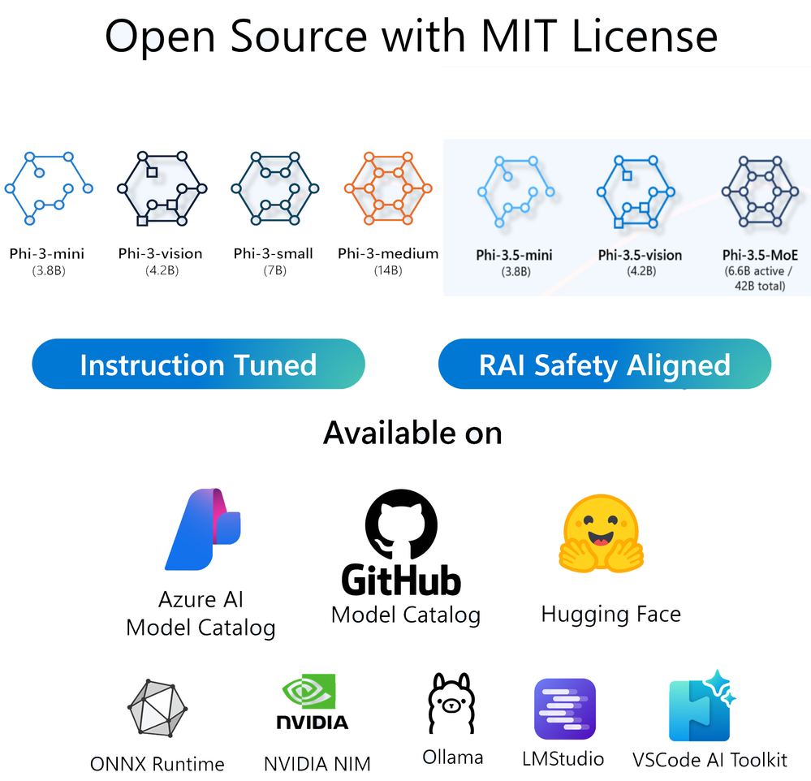

### Inference lewat API Cloud

**Microsoft Foundry Models**

> **Catatan:** GitHub Models pensiun pada akhir Juli 2026. [Microsoft Foundry Models](https://ai.azure.com/catalog/models?WT.mc_id=academic-105485-koreyst) adalah penggantinya secara langsung.

Microsoft Foundry Models adalah jalur paling langsung. Kamu bisa cepat mengakses model Phi-3/3.5-Instruct melalui katalog model Foundry. Dikombinasikan dengan Azure AI Inference SDK / OpenAI SDK, kamu bisa mengakses API lewat kode untuk melakukan pemanggilan Phi-3/3.5-Instruct. Kamu juga bisa menguji berbagai hasil melalui Playground.

- Demo: Perbandingan hasil Phi-3-mini dan Phi-3.5-mini pada skenario bahasa Tionghoa

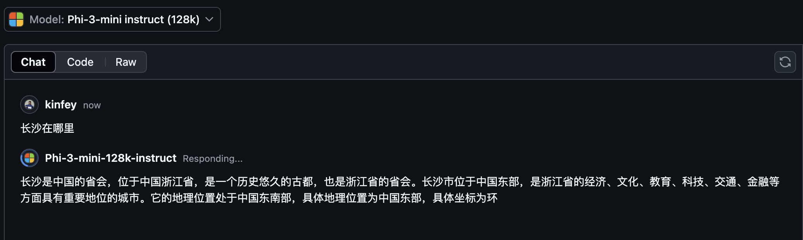

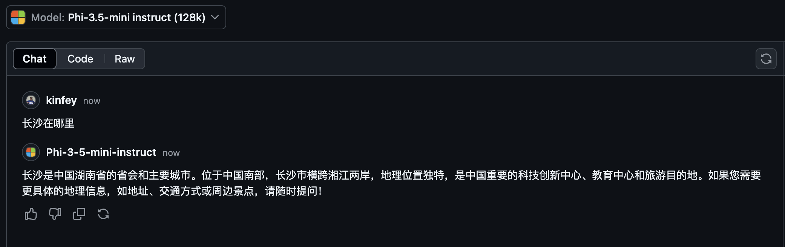

**Microsoft Foundry**

Atau jika ingin memakai model vision dan MoE, kamu bisa menggunakan Microsoft Foundry untuk melakukan pemanggilannya. Jika tertarik, kamu bisa membaca Phi-3 Cookbook untuk mempelajari cara memanggil Phi-3/3.5 Instruct, Vision, MoE melalui Microsoft Foundry [klik tautan ini](https://github.com/microsoft/Phi-3CookBook/blob/main/md/02.QuickStart/AzureAIStudio_QuickStart.md?WT.mc_id=academic-105485-koreyst)

**NVIDIA NIM**

Selain katalog Microsoft Foundry Models berbasis cloud, kamu juga bisa memakai [NVIDIA NIM](https://developer.nvidia.com/nim?WT.mc_id=academic-105485-koreyst) untuk melakukan pemanggilan terkait. Kunjungi NVIDIA NIM untuk melakukan pemanggilan API keluarga Phi-3/3.5. NVIDIA NIM (NVIDIA Inference Microservices) adalah kumpulan microservice inference terakselerasi yang dirancang membantu developer men-deploy model AI secara efisien di berbagai lingkungan — cloud, data center, maupun workstation.

Beberapa fitur kunci NVIDIA NIM:

- **Kemudahan Deployment:** NIM memungkinkan deployment model AI dengan satu perintah, mudah diintegrasikan ke alur kerja yang ada.
- **Performa Teroptimasi:** Memanfaatkan mesin inference NVIDIA yang sudah dioptimalkan, seperti TensorRT dan TensorRT-LLM, demi latensi rendah dan throughput tinggi.
- **Skalabilitas:** Mendukung autoscaling di Kubernetes, sehingga sanggup menangani beban kerja yang berubah-ubah.
- **Keamanan dan Kontrol:** Organisasi bisa tetap mengendalikan data dan aplikasinya dengan self-hosting microservice NIM di infrastruktur kelolaan sendiri.
- **API Standar:** NIM menyediakan API standar industri, memudahkan pembangunan dan integrasi aplikasi AI seperti chatbot, asisten AI, dan lainnya.

NIM adalah bagian dari NVIDIA AI Enterprise, yang bertujuan menyederhanakan deployment dan operasionalisasi model AI, memastikan model berjalan efisien di GPU NVIDIA.

- Demo: Memakai NVIDIA NIM untuk memanggil Phi-3.5-Vision-API  [[Klik tautan ini](./src/19-slm/python/Phi-3-Vision-Nividia-NIM.ipynb)]


### Menjalankan Phi-3/3.5 Secara Lokal
Inference pada Phi-3 — atau model bahasa mana pun seperti GPT-3 — merujuk pada proses menghasilkan respons atau prediksi berdasarkan masukan yang diterimanya. Saat kamu memberi prompt atau pertanyaan ke Phi-3, ia memakai jaringan saraf hasil latihannya untuk menyimpulkan (infer) respons yang paling mungkin dan relevan, dengan menganalisis pola dan hubungan pada data latihnya.

**Hugging Face Transformer**
Hugging Face Transformers adalah pustaka andal untuk natural language processing (NLP) dan tugas machine learning lainnya. Beberapa poin kuncinya:

1. **Model Pre-trained**: Menyediakan ribuan model pre-trained untuk beragam tugas seperti klasifikasi teks, named entity recognition, question answering, summarization, translation, dan text generation.

2. **Interoperabilitas Framework**: Mendukung banyak framework deep learning — PyTorch, TensorFlow, dan JAX. Kamu bisa melatih model di satu framework dan memakainya di framework lain.

3. **Kemampuan Multimodal**: Selain NLP, Hugging Face Transformers juga mendukung tugas computer vision (mis. klasifikasi gambar, deteksi objek) dan pemrosesan audio (mis. pengenalan suara, klasifikasi audio).

4. **Mudah Dipakai**: Menyediakan API dan alat untuk mengunduh serta melakukan fine-tuning model dengan mudah — ramah untuk pemula maupun pakar.

5. **Komunitas dan Sumber Daya**: Hugging Face punya komunitas aktif serta dokumentasi, tutorial, dan panduan yang lengkap untuk membantu pengguna memulai dan memaksimalkan pustakanya.
[Dokumentasi resmi](https://huggingface.co/docs/transformers/index?WT.mc_id=academic-105485-koreyst) atau [repositori GitHub](https://github.com/huggingface/transformers?WT.mc_id=academic-105485-koreyst) mereka.

Ini metode yang paling umum dipakai, tetapi butuh akselerasi GPU. Bagaimanapun, skenario seperti Vision dan MoE menuntut komputasi besar, yang akan sangat lambat di CPU jika modelnya tidak dikuantisasi.

- Demo: Memakai Transformer untuk memanggil Phi-3.5-Instruct [Klik tautan ini](./src/19-slm/python/phi35-instruct-demo.ipynb)

- Demo: Memakai Transformer untuk memanggil Phi-3.5-Vision [Klik tautan ini](./src/19-slm/python/phi35-vision-demo.ipynb)

- Demo: Memakai Transformer untuk memanggil Phi-3.5-MoE [Klik tautan ini](./src/19-slm/python/phi35_moe_demo.ipynb)

**Ollama**
[Ollama](https://ollama.com/?WT.mc_id=academic-105485-koreyst) adalah platform yang memudahkan menjalankan large language model (LLM) secara lokal di mesinmu. Ia mendukung berbagai model seperti Llama 3.1, Phi 3, Mistral, dan Gemma 2, di antaranya. Platform ini menyederhanakan prosesnya dengan membundel bobot model, konfigurasi, dan data ke dalam satu paket, sehingga pengguna lebih mudah mengustomisasi dan membuat model sendiri. Ollama tersedia untuk macOS, Linux, dan Windows. Ini alat yang bagus jika kamu ingin bereksperimen atau men-deploy LLM tanpa bergantung pada layanan cloud. Ollama adalah cara paling langsung — cukup jalankan perintah berikut.


```bash

ollama run phi3.5

```

> **Catatan kelas:** inilah alat yang kita pakai di praktikum — bedanya, Ollama-nya di-hosting di server kampus (https://ollama.if.unismuh.ac.id), dan model yang kita benchmark adalah `smollm2:135m`, `llama3.2`, dan `gemma3:27b` untuk merasakan langsung trade-off SLM vs model besar.

**Foundry Local**

[Foundry Local](https://foundrylocal.ai?WT.mc_id=academic-105485-koreyst) adalah runtime offline on-device dari Microsoft untuk menjalankan model seperti Phi sepenuhnya di perangkatmu sendiri — tanpa langganan Azure, API key, maupun koneksi jaringan. Ia otomatis memilih execution provider terbaik yang tersedia (NPU, GPU, atau CPU) dan mengekspos endpoint yang kompatibel dengan OpenAI, sehingga kode `openai`/Azure AI Inference SDK yang ada bisa diarahkan ke sana dengan perubahan minimal. Lihat [dokumentasi Foundry Local](https://learn.microsoft.com/azure/ai-foundry/foundry-local/get-started?WT.mc_id=academic-105485-koreyst) untuk memulai.

```bash

winget install Microsoft.FoundryLocal
foundry model run phi-3.5-mini

```

Atau pakai SDK-nya langsung di Python:

```bash

pip install foundry-local-sdk

```

```python

from foundry_local import FoundryLocalManager

manager = FoundryLocalManager("phi-3.5-mini")
print(manager.endpoint, manager.api_key)

```

**ONNX Runtime for GenAI**

[ONNX Runtime](https://github.com/microsoft/onnxruntime-genai?WT.mc_id=academic-105485-koreyst) adalah akselerator machine learning lintas platform untuk inference dan training. ONNX Runtime for Generative AI (GenAI) adalah alat andal yang membantumu menjalankan model generative AI secara efisien di berbagai platform.

## Apa Itu ONNX Runtime?
ONNX Runtime adalah proyek open-source yang memungkinkan inference model machine learning berperforma tinggi. Ia mendukung model dalam format Open Neural Network Exchange (ONNX), standar untuk merepresentasikan model machine learning. Inference ONNX Runtime dapat menghadirkan pengalaman pengguna lebih cepat dengan biaya lebih rendah, mendukung model dari framework deep learning seperti PyTorch dan TensorFlow/Keras maupun pustaka machine learning klasik seperti scikit-learn, LightGBM, XGBoost, dsb. ONNX Runtime kompatibel dengan berbagai perangkat keras, driver, dan sistem operasi, serta memberikan performa optimal dengan memanfaatkan akselerator perangkat keras (jika tersedia) bersama optimasi dan transformasi graph.

## Apa Itu Generative AI?
Generative AI merujuk pada sistem AI yang mampu menghasilkan konten baru — teks, gambar, atau musik — berdasarkan data latihnya. Contohnya model bahasa seperti GPT-3 dan model pembuat gambar seperti Stable Diffusion. Pustaka ONNX Runtime for GenAI menyediakan loop generative AI untuk model ONNX, termasuk inference dengan ONNX Runtime, pemrosesan logits, search dan sampling, serta pengelolaan KV cache.

## ONNX Runtime untuk GenAI
ONNX Runtime for GenAI memperluas kemampuan ONNX Runtime agar mendukung model generative AI. Beberapa fitur kuncinya:

- **Dukungan Platform Luas:** Berjalan di berbagai platform: Windows, Linux, macOS, Android, dan iOS.
- **Dukungan Model:** Mendukung banyak model generative AI populer seperti LLaMA, GPT-Neo, BLOOM, dan lainnya.
- **Optimasi Performa:** Menyertakan optimasi untuk berbagai akselerator perangkat keras seperti GPU NVIDIA, GPU AMD, dan lainnya.
- **Mudah Dipakai:** Menyediakan API untuk integrasi mudah ke aplikasi — menghasilkan teks, gambar, dan konten lain dengan kode minimal.
- Pengguna bisa memanggil metode `generate()` tingkat tinggi, atau menjalankan tiap iterasi model dalam loop — menghasilkan satu token per iterasi — dengan opsi memperbarui parameter generasi di dalam loop.
- ONNX Runtime juga mendukung greedy/beam search serta sampling TopP, TopK untuk menghasilkan urutan token, plus pemrosesan logits bawaan seperti repetition penalty. Kamu juga bisa dengan mudah menambahkan scoring kustom.

## Mulai Menggunakan
Untuk memulai dengan ONNX Runtime for GenAI, ikuti langkah-langkah berikut:

### Instal ONNX Runtime:
```Python
pip install onnxruntime
```
### Instal Ekstensi Generative AI:
```Python
pip install onnxruntime-genai
```

### Menjalankan Model: Contoh Sederhana dalam Python:
```Python
import onnxruntime_genai as og

model = og.Model('path_to_your_model.onnx')

tokenizer = og.Tokenizer(model)

input_text = "Hello, how are you?"

input_tokens = tokenizer.encode(input_text)

output_tokens = model.generate(input_tokens)

output_text = tokenizer.decode(output_tokens)

print(output_text) 
```
### Demo: Memanggil Phi-3.5-Vision dengan ONNX Runtime GenAI


```python

import onnxruntime_genai as og

model_path = './Your Phi-3.5-vision-instruct ONNX Path'

img_path = './Your Image Path'

model = og.Model(model_path)

processor = model.create_multimodal_processor()

tokenizer_stream = processor.create_stream()

text = "Your Prompt"

prompt = "<|user|>\n"

prompt += "<|image_1|>\n"

prompt += f"{text}<|end|>\n"

prompt += "<|assistant|>\n"

image = og.Images.open(img_path)

inputs = processor(prompt, images=image)

params = og.GeneratorParams(model)

params.set_inputs(inputs)

params.set_search_options(max_length=3072)

generator = og.Generator(model, params)

while not generator.is_done():

    generator.compute_logits()
    
    generator.generate_next_token()

    new_token = generator.get_next_tokens()[0]
    
    output = tokenizer_stream.decode(new_token)
    
    print(tokenizer_stream.decode(new_token), end='', flush=True)

```


**Lainnya**

Selain metode ONNX Runtime, Ollama, dan Foundry Local, kita juga bisa memanggil model terkuantisasi lewat metode yang disediakan berbagai vendor. Misalnya framework Apple MLX dengan Apple Metal, Qualcomm QNN dengan NPU, Intel OpenVINO dengan CPU/GPU, dsb. Kamu juga bisa mendapat lebih banyak konten dari [Phi-3 Cookbook](https://github.com/microsoft/phi-3cookbook?WT.mc_id=academic-105485-koreyst).


## Lebih Lanjut

Kita sudah mempelajari dasar-dasar keluarga Phi-3/3.5, tetapi untuk mendalami SLM kita butuh pengetahuan lebih. Jawabannya bisa kamu temukan di Phi-3 Cookbook. Jika ingin belajar lebih jauh, kunjungi [Phi-3 Cookbook](https://github.com/microsoft/phi-3cookbook?WT.mc_id=academic-105485-koreyst).


---

<a id="20-mistral"></a>

# Membangun dengan Model Mistral

## Pendahuluan

Pelajaran ini membahas:
- Menjelajahi berbagai model Mistral
- Memahami kasus penggunaan dan skenario tiap model
- Menjelajahi contoh kode yang menunjukkan fitur unik masing-masing model.

## Model-Model Mistral

Dalam pelajaran ini kita menjelajahi 3 model Mistral yang berbeda:
**Mistral Large**, **Mistral Small**, dan **Mistral Nemo**.

Masing-masing tersedia gratis di [Microsoft Foundry Models](https://ai.azure.com/catalog/models?WT.mc_id=academic-105485-koreyst). Kode di notebook ini memakai model-model tersebut.

> **Catatan:** GitHub Models pensiun pada akhir Juli 2026. Berikut detail lebih lanjut tentang memakai [Microsoft Foundry Models](https://learn.microsoft.com/azure/ai-foundry/model-inference/overview?WT.mc_id=academic-105485-koreyst) untuk membuat prototipe dengan model AI.


## Mistral Large 2 (2407)
Mistral Large 2 saat ini adalah model unggulan (flagship) dari Mistral, dirancang untuk penggunaan enterprise.

Model ini adalah upgrade dari Mistral Large orisinal, menawarkan:
- Context window lebih besar — 128k vs 32k
- Performa lebih baik pada tugas matematika dan coding — akurasi rata-rata 76,9% vs 60,4%
- Performa multibahasa meningkat — bahasanya meliputi: Inggris, Prancis, Jerman, Spanyol, Italia, Portugis, Belanda, Rusia, Tionghoa, Jepang, Korea, Arab, dan Hindi.

Dengan fitur-fitur ini, Mistral Large unggul pada:
- *Retrieval Augmented Generation (RAG)* — berkat context window yang lebih besar
- *Function Calling* — model ini punya function calling bawaan, memungkinkan integrasi dengan tool dan API eksternal. Pemanggilan bisa dilakukan paralel maupun berurutan satu per satu.
- *Code Generation* — model ini unggul dalam menghasilkan kode Python, Java, TypeScript, dan C++.

### Contoh RAG dengan Mistral Large 2

Dalam contoh ini, kita memakai Mistral Large 2 untuk menjalankan pola RAG atas sebuah dokumen teks. Pertanyaannya ditulis dalam bahasa Korea, menanyakan aktivitas penulis sebelum kuliah.

Contoh ini memakai Cohere Embeddings Model untuk membuat embeddings dari dokumen teks maupun pertanyaannya. Untuk sampel ini, paket Python faiss dipakai sebagai vector store.

Prompt yang dikirim ke model Mistral mencakup pertanyaan sekaligus potongan (chunk) teks hasil retrieval yang mirip dengan pertanyaan. Model kemudian memberikan respons dalam bahasa alami.

```python 
pip install faiss-cpu
```

```python 
import requests
import numpy as np
import faiss
import os

from azure.ai.inference import ChatCompletionsClient
from azure.ai.inference.models import SystemMessage, UserMessage
from azure.core.credentials import AzureKeyCredential
from azure.ai.inference import EmbeddingsClient

# Get these from your Microsoft Foundry project's "Overview" page
endpoint = os.environ["AZURE_INFERENCE_ENDPOINT"]
model_name = "Mistral-large"
token = os.environ["AZURE_INFERENCE_CREDENTIAL"]

client = ChatCompletionsClient(
    endpoint=endpoint,
    credential=AzureKeyCredential(token),
)

response = requests.get('https://raw.githubusercontent.com/run-llama/llama_index/main/docs/docs/examples/data/paul_graham/paul_graham_essay.txt')
text = response.text

chunk_size = 2048
chunks = [text[i:i + chunk_size] for i in range(0, len(text), chunk_size)]
len(chunks)

embed_model_name = "cohere-embed-v3-multilingual" 

embed_client = EmbeddingsClient(
        endpoint=endpoint,
        credential=AzureKeyCredential(token)
)

embed_response = embed_client.embed(
    input=chunks,
    model=embed_model_name
)


text_embeddings = []
for item in embed_response.data:
    length = len(item.embedding)
    text_embeddings.append(item.embedding)
text_embeddings = np.array(text_embeddings)


d = text_embeddings.shape[1]
index = faiss.IndexFlatL2(d)
index.add(text_embeddings)

question = "저자가 대학에 오기 전에 주로 했던 두 가지 일은 무엇이었나요?"

question_embedding = embed_client.embed(
    input=[question],
    model=embed_model_name
)

question_embeddings = np.array(question_embedding.data[0].embedding)


D, I = index.search(question_embeddings.reshape(1, -1), k=2) # distance, index
retrieved_chunks = [chunks[i] for i in I.tolist()[0]]

prompt = f"""
Context information is below.
---------------------
{retrieved_chunks}
---------------------
Given the context information and not prior knowledge, answer the query.
Query: {question}
Answer:
"""


chat_response = client.complete(
    messages=[
        SystemMessage(content="You are a helpful assistant."),
        UserMessage(content=prompt),
    ],
    temperature=1.0,
    top_p=1.0,
    max_tokens=1000,
    model=model_name
)

print(chat_response.choices[0].message.content)
```

## Mistral Small
Mistral Small adalah model lain dalam keluarga Mistral pada kategori premier/enterprise. Sesuai namanya, model ini adalah Small Language Model (SLM). Keunggulan memakai Mistral Small:
- Hemat biaya dibanding LLM Mistral seperti Mistral Large dan NeMo — penurunan harga 80%
- Latensi rendah — respons lebih cepat dibanding LLM Mistral
- Fleksibel — bisa di-deploy di berbagai lingkungan dengan batasan sumber daya yang lebih longgar.

Mistral Small cocok untuk:
- Tugas berbasis teks seperti summarization, analisis sentimen, dan translation.
- Aplikasi dengan permintaan yang sangat sering, berkat efektivitas biayanya
- Tugas kode berlatensi rendah seperti review dan saran kode

## Membandingkan Mistral Small dan Mistral Large

Untuk melihat perbedaan latensi antara Mistral Small dan Large, jalankan sel-sel di bawah.

Kamu akan melihat perbedaan waktu respons sekitar 3–5 detik. Perhatikan juga panjang dan gaya responsnya atas prompt yang sama.

```python 

import os 
endpoint = os.environ["AZURE_INFERENCE_ENDPOINT"]
model_name = "Mistral-small"
token = os.environ["AZURE_INFERENCE_CREDENTIAL"]

client = ChatCompletionsClient(
    endpoint=endpoint,
    credential=AzureKeyCredential(token),
)

response = client.complete(
    messages=[
        SystemMessage(content="You are a helpful coding assistant."),
        UserMessage(content="Can you write a Python function to the fizz buzz test?"),
    ],
    temperature=1.0,
    top_p=1.0,
    max_tokens=1000,
    model=model_name
)

print(response.choices[0].message.content)

```

```python 

import os
from azure.ai.inference import ChatCompletionsClient
from azure.ai.inference.models import SystemMessage, UserMessage
from azure.core.credentials import AzureKeyCredential

endpoint = os.environ["AZURE_INFERENCE_ENDPOINT"]
model_name = "Mistral-large"
token = os.environ["AZURE_INFERENCE_CREDENTIAL"]

client = ChatCompletionsClient(
    endpoint=endpoint,
    credential=AzureKeyCredential(token),
)

response = client.complete(
    messages=[
        SystemMessage(content="You are a helpful coding assistant."),
        UserMessage(content="Can you write a Python function to the fizz buzz test?"),
    ],
    temperature=1.0,
    top_p=1.0,
    max_tokens=1000,
    model=model_name
)

print(response.choices[0].message.content)

```

## Mistral NeMo

Dibanding dua model lain yang dibahas di pelajaran ini, Mistral NeMo adalah satu-satunya model gratis dengan lisensi Apache2.

Ia dipandang sebagai upgrade dari LLM open source Mistral sebelumnya, Mistral 7B.

Beberapa fitur lain model NeMo:

- *Tokenisasi lebih efisien:* Model ini memakai tokenizer Tekken alih-alih tiktoken yang lebih umum dipakai. Ini memberi performa lebih baik pada lebih banyak bahasa dan kode.

- *Fine-tuning:* Model dasarnya tersedia untuk fine-tuning — fleksibilitas lebih untuk kasus penggunaan yang membutuhkannya.

- *Function Calling Bawaan* — Seperti Mistral Large, model ini dilatih untuk function calling. Ini membuatnya unik sebagai salah satu model open source pertama yang melakukannya.

### Membandingkan Tokenizer

Dalam sampel ini, kita melihat bagaimana Mistral NeMo menangani tokenisasi dibanding Mistral Large.

Kedua sampel memakai prompt yang sama, tetapi kamu akan melihat NeMo mengembalikan token lebih sedikit daripada Mistral Large.

```bash
pip install mistral-common
```

```python 
# Import needed packages:
from mistral_common.protocol.instruct.messages import (
    UserMessage,
)
from mistral_common.protocol.instruct.request import ChatCompletionRequest
from mistral_common.protocol.instruct.tool_calls import (
    Function,
    Tool,
)
from mistral_common.tokens.tokenizers.mistral import MistralTokenizer

# Load Mistral tokenizer

model_name = "open-mistral-nemo"

tokenizer = MistralTokenizer.from_model(model_name)

# Tokenize a list of messages
tokenized = tokenizer.encode_chat_completion(
    ChatCompletionRequest(
        tools=[
            Tool(
                function=Function(
                    name="get_current_weather",
                    description="Get the current weather",
                    parameters={
                        "type": "object",
                        "properties": {
                            "location": {
                                "type": "string",
                                "description": "The city and state, e.g. San Francisco, CA",
                            },
                            "format": {
                                "type": "string",
                                "enum": ["celsius", "fahrenheit"],
                                "description": "The temperature unit to use. Infer this from the user's location.",
                            },
                        },
                        "required": ["location", "format"],
                    },
                )
            )
        ],
        messages=[
            UserMessage(content="What's the weather like today in Paris"),
        ],
        model=model_name,
    )
)
tokens, text = tokenized.tokens, tokenized.text

# Count the number of tokens
print(len(tokens))
```

```python
# Import needed packages:
from mistral_common.protocol.instruct.messages import (
    UserMessage,
)
from mistral_common.protocol.instruct.request import ChatCompletionRequest
from mistral_common.protocol.instruct.tool_calls import (
    Function,
    Tool,
)
from mistral_common.tokens.tokenizers.mistral import MistralTokenizer

# Load Mistral tokenizer

model_name = "mistral-large-latest"

tokenizer = MistralTokenizer.from_model(model_name)

# Tokenize a list of messages
tokenized = tokenizer.encode_chat_completion(
    ChatCompletionRequest(
        tools=[
            Tool(
                function=Function(
                    name="get_current_weather",
                    description="Get the current weather",
                    parameters={
                        "type": "object",
                        "properties": {
                            "location": {
                                "type": "string",
                                "description": "The city and state, e.g. San Francisco, CA",
                            },
                            "format": {
                                "type": "string",
                                "enum": ["celsius", "fahrenheit"],
                                "description": "The temperature unit to use. Infer this from the user's location.",
                            },
                        },
                        "required": ["location", "format"],
                    },
                )
            )
        ],
        messages=[
            UserMessage(content="What's the weather like today in Paris"),
        ],
        model=model_name,
    )
)
tokens, text = tokenized.tokens, tokenized.text

# Count the number of tokens
print(len(tokens))
```

## Belajar Tidak Berhenti di Sini, Lanjutkan Perjalananmu

Setelah menyelesaikan pelajaran ini, kunjungi [koleksi pembelajaran Generative AI](https://aka.ms/genai-collection?WT.mc_id=academic-105485-koreyst) untuk terus menaikkan level pengetahuan Generative AI-mu!


---

<a id="21-meta"></a>

# Membangun dengan Keluarga Model Meta

## Pendahuluan

Pelajaran ini membahas:

- Menjelajahi dua model utama keluarga Meta — Llama 3.1 dan Llama 3.2
- Memahami kasus penggunaan dan skenario tiap model
- Contoh kode yang menunjukkan fitur unik masing-masing model


## Keluarga Model Meta

Dalam pelajaran ini, kita menjelajahi 2 model dari keluarga Meta alias "Llama Herd" (kawanan Llama) — Llama 3.1 dan Llama 3.2.

Model-model ini hadir dalam beberapa varian dan tersedia di [katalog Microsoft Foundry Models](https://ai.azure.com/catalog/models?WT.mc_id=academic-105485-koreyst).

> **Catatan:** GitHub Models pensiun pada akhir Juli 2026. Berikut detail lebih lanjut tentang memakai [Microsoft Foundry Models](https://learn.microsoft.com/azure/ai-foundry/model-inference/overview?WT.mc_id=academic-105485-koreyst) untuk membuat prototipe dengan model AI.

Varian model:
- Llama 3.1 - 70B Instruct
- Llama 3.1 - 405B Instruct
- Llama 3.2 - 11B Vision Instruct
- Llama 3.2 - 90B Vision Instruct

*Catatan: Llama 3 juga tersedia di Microsoft Foundry Models tetapi tidak dibahas di pelajaran ini*

## Llama 3.1

Dengan 405 miliar parameter, Llama 3.1 masuk kategori LLM open source.

Model ini adalah upgrade dari rilis sebelumnya, Llama 3, dengan menawarkan:

- Context window lebih besar — 128k token vs 8k token
- Max output token lebih besar — 4096 vs 2048
- Dukungan multibahasa lebih baik — berkat bertambahnya token pelatihan

Semua ini membuat Llama 3.1 sanggup menangani kasus penggunaan lebih kompleks saat membangun aplikasi GenAI, termasuk:
- Native Function Calling — kemampuan memanggil tool dan fungsi eksternal di luar alur kerja LLM
- Performa RAG lebih baik — berkat context window yang lebih tinggi
- Synthetic Data Generation — kemampuan membuat data yang efektif untuk tugas seperti fine-tuning

### Function Calling Bawaan (Native)

Llama 3.1 telah di-fine-tune agar lebih efektif melakukan pemanggilan fungsi atau tool. Ia juga punya dua tool bawaan yang bisa dikenali model sebagai perlu dipakai berdasarkan prompt pengguna. Tool tersebut adalah:

- **Brave Search** — dipakai untuk mendapatkan informasi terkini, misalnya cuaca, dengan melakukan pencarian web
- **Wolfram Alpha** — dipakai untuk kalkulasi matematika yang lebih kompleks, jadi kamu tidak perlu menulis fungsi sendiri.

Kamu juga bisa membuat tool kustom sendiri yang bisa dipanggil LLM.

Pada contoh kode di bawah:

- Kita mendefinisikan tool yang tersedia (brave_search, wolfram_alpha) di system prompt.
- Mengirim prompt pengguna yang menanyakan cuaca di kota tertentu.
- LLM akan merespons dengan pemanggilan tool ke Brave Search yang tampak seperti ini: `<|python_tag|>brave_search.call(query="Stockholm weather")`

*Catatan: Contoh ini hanya melakukan pemanggilan tool-nya; jika ingin mendapatkan hasilnya, kamu perlu membuat akun gratis di halaman Brave API dan mendefinisikan fungsinya sendiri.

```python 
import os
from azure.ai.inference import ChatCompletionsClient
from azure.ai.inference.models import AssistantMessage, SystemMessage, UserMessage
from azure.core.credentials import AzureKeyCredential

# Get these from your Microsoft Foundry project's "Overview" page
token = os.environ["AZURE_INFERENCE_CREDENTIAL"]
endpoint = os.environ["AZURE_INFERENCE_ENDPOINT"]
model_name = "Meta-Llama-3.1-405B-Instruct"

client = ChatCompletionsClient(
    endpoint=endpoint,
    credential=AzureKeyCredential(token),
)


tool_prompt=f"""
<|begin_of_text|><|start_header_id|>system<|end_header_id|>

Environment: ipython
Tools: brave_search, wolfram_alpha
Cutting Knowledge Date: December 2023
Today Date: 23 July 2024

You are a helpful assistant<|eot_id|>
"""

messages = [
    SystemMessage(content=tool_prompt),
    UserMessage(content="What is the weather in Stockholm?"),

]

response = client.complete(messages=messages, model=model_name)

print(response.choices[0].message.content)
```

## Llama 3.2

Meski tergolong LLM, satu keterbatasan Llama 3.1 adalah multimodalitas — yaitu ketidakmampuan memakai jenis masukan berbeda, seperti gambar, sebagai prompt dan memberikan respons atasnya. Kemampuan ini justru menjadi salah satu fitur utama Llama 3.2. Fitur-fitur tersebut meliputi:

- Multimodalitas — mampu mengevaluasi prompt teks maupun gambar
- Variasi ukuran kecil sampai menengah (11B dan 90B) — memberi opsi deployment yang fleksibel,
- Variasi khusus teks (1B dan 3B) — memungkinkan model di-deploy di perangkat edge/mobile dengan latensi rendah

Dukungan multimodal ini adalah langkah besar di dunia model open source. Contoh kode di bawah memakai gambar sekaligus prompt teks untuk mendapatkan analisis gambar dari Llama 3.2 90B.

### Dukungan Multimodal pada Llama 3.2

```python 
import os
from azure.ai.inference import ChatCompletionsClient
from azure.ai.inference.models import (
    SystemMessage,
    UserMessage,
    TextContentItem,
    ImageContentItem,
    ImageUrl,
    ImageDetailLevel,
)
from azure.core.credentials import AzureKeyCredential

# Get these from your Microsoft Foundry project's "Overview" page
token = os.environ["AZURE_INFERENCE_CREDENTIAL"]
endpoint = os.environ["AZURE_INFERENCE_ENDPOINT"]
model_name = "Llama-3.2-90B-Vision-Instruct"

client = ChatCompletionsClient(
    endpoint=endpoint,
    credential=AzureKeyCredential(token),
)

response = client.complete(
    messages=[
        SystemMessage(
            content="You are a helpful assistant that describes images in details."
        ),
        UserMessage(
            content=[
                TextContentItem(text="What's in this image?"),
                ImageContentItem(
                    image_url=ImageUrl.load(
                        image_file="sample.jpg",
                        image_format="jpg",
                        detail=ImageDetailLevel.LOW)
                ),
            ],
        ),
    ],
    model=model_name,
)

print(response.choices[0].message.content)
```

## Belajar Tidak Berhenti di Sini, Lanjutkan Perjalananmu

Setelah menyelesaikan pelajaran ini, kunjungi [koleksi pembelajaran Generative AI](https://aka.ms/genai-collection?WT.mc_id=academic-105485-koreyst) untuk terus menaikkan level pengetahuan Generative AI-mu!
